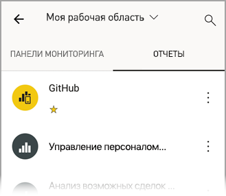
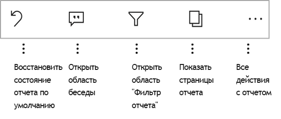

# Просмотр отчетов в мобильных приложениях Power BI
Область применения:

|  |  |  |  |  |
|:--- |:--- |:--- |:--- |:--- |
| iPhone |iPad |Телефоны под управлением Android |Планшеты Android |Устройства под управлением Windows 10 |

Отчет Power BI — это интерактивное представление данных с визуальными элементами, которые отображают различные результаты и сведения, полученные из этих данных. Просмотр отчетов в мобильных приложениях Power BI — это последний шаг трехэтапной процедуры.

1. [Создание отчетов в Power BI Desktop](../../desktop-report-view.md). В Power BI Desktop можно даже [оптимизировать отчет для телефонов](mobile-apps-view-phone-report.md). 
2. Публиковать эти отчеты можно в службе Power BI [(https://powerbi.com)](https://powerbi.com) или на [Сервере отчетов Power BI](../../report-server/get-started.md)).  
3. После этого вы можете работать с отчетами в мобильных приложениях Power BI.

## Открытие отчета Power BI в мобильном приложении
Расположение отчетов Power BI в мобильном приложении зависит от места их получения. Они могут быть в расположении "Приложения", "Мне предоставлен доступ", "Рабочие области" (включая страницу "Моя рабочая область") или на сервере отчетов. Иногда получить отчет можно при помощи связанной панели мониторинга, а иногда они представлены в списке.

В списки и меню вы найдете значок рядом с именем отчета, помогая понять, что этот элемент отображается отчет. 

 

Существует два значка для отчетов в мобильных приложений Power BI.

*  Указывает отчет, который откроется в альбомной ориентации, в приложении и будет выглядеть, как он выглядит в браузере.

*  Указывает отчет, содержащий хотя бы одну страницу phone оптимизированный отчет, который будет предоставляться в книжной ориентации. 

Примечание. Удерживая телефоне в альбомной ориентации, вы всегда получаете альбомную ориентацию документа, даже если страница отчета содержит макет для телефона. 

Чтобы получить отчет из панели мониторинга, коснитесь многоточия (...) в правом верхнем углу плитки > **открыть отчет**.
  
  
  
  Не на всех плитках можно открыть отчет. Например, плитки, созданные после ввода данных в поле вопросов и ответов, не открывают отчеты при касании. 
  
## Взаимодействия с отчетами
Когда отчет открыт в приложении, можно начать работу с ним. Есть много вещей, которые можно выполнить с помощью отчета и его данных. В нижнем колонтитуле отчета можно найти действия, которые можно выполнять в отчете и, нажав и long коснувшись данные, отображаемые в отчете, вы можете также продольные и поперечные срезы данных.

### С помощью коснитесь и долго
Щелкните equals отвода указателя мыши. Поэтому если вы хотите перекрестное выделение отчет, основанный на точку данных, можно коснуться этой точки данных.
Касаться значения среза, делает это значение выбрано и среза оставшаяся часть отчета по это значение. Нажав на ссылку, кнопку или закладки будет активировать его, на основе действия, указанный автором.

Возможно, вы заметили, что при касании визуальный элемент появится рамка. В правом верхнем углу, границы есть кнопку с многоточием (...). Коснувшись он предоставит меню с действиями, которые можно выполнить на нем.

### Действия детализации и подсказки

Когда вы долго нажмите (Коснитесь и удерживайте) точки данных, подсказка будет отображаться представление значений, которые представляет эта точка данных. 

Авторы отчетов можно определить иерархии в данные и связи между страницами отчета. Иерархия позволяет детализации, переход вверх и детализацию другую страницу отчета, визуальный элемент и значение. Таким образом при касании долго на значение, кроме всплывающей подсказки, параметры, соответствующие детализации, отображаются в нижнем колонтитуле. 

*Детализация* позволяет вам коснуться определенной части визуального элемента в Power BI и перейти на другую страницу отчета, отфильтрованную по выбранному значению.  Автор отчета может задавать различные варианты детализации с переходом на разные страницы. В этом случае вы выбираете из них тот, который вам интересен. Кнопки «Назад» можно перейти обратно на предыдущую страницу отчета.

Читайте, как [добавить детализацию в Power BI Desktop](../../desktop-drillthrough.md).
   
   > [!IMPORTANT]
   > В приложении Power BI Mobile детализации в визуальных элементах матрицы и таблицы включен через только значение ячейки, а не заголовки столбцов и строк.
   
   
   
### С помощью действий, в нижнем колонтитуле отчета
Нижнего колонтитула отчета имеет действия, которые можно выполнить на текущую страницу отчета или для всего отчета. Нижний колонтитул имеет быстрый доступ к наиболее полезные действия, и все действия, можно получить кнопку с многоточием (...).

Доступны следующие действия, выполняемые из нижнего колонтитула:
1) Сбросить фильтр отчета и cross выбранных элементов для выделения обратно в исходное состояние.
2) Чтобы откройте панель диалога для просмотра или добавления комментариев в этом отчете.
3) Откройте панель «Фильтр» для просмотра и изменения фильтра, применяемый в текущий момент в отчете.
4) Вывод списка всех страниц в этом отчете. Щелкнув имя страницы загрузит и представить эту страницу.
Переход между страницами отчета может быть выполнен, проводя пальцем от края экрана к центру.
5) Просмотрите все действия с отчетом.

#### Все действия с отчетом
При касании на... параметр области нижнего колонтитула, выведет все действия, которые можно выполнять в отчете. 

Некоторые действия могут быть отключены, так как они в зависимости от возможностей конкретного отчета.
Например:
1) **Фильтр по текущему местоположению** включен, если данные в отчете категоризации автором с помощью географических данных. [Узнайте, как определение географических данных в отчете](https://docs.microsoft.com/power-bi/desktop-mobile-geofiltering).
2) **Сканирование, чтобы отфильтровать отчет по штрихкоду** становится доступен только в том случае, если набор данных в отчете был отмечен как штрихкод. [Как пометить штрих-коды в Power BI Desktop](https://docs.microsoft.com/power-bi/desktop-mobile-barcodes). 
3) **Пригласить** становится доступен только в том случае, если у вас есть разрешения на обмен этот отчет с другими пользователями. Необходимо разрешение только в том случае, если вы являетесь владельцем отчета, или если вы получили разрешение повторное предоставление общего доступа владельцем.
4) **Добавление заметок и совместное использование** может быть отключение, если [политику защиты Intune](https://docs.microsoft.com/intune/app-protection-policies) в вашей организации, который запрещен общий доступ к из мобильного приложения Power BI. 

## Дальнейшие действия
* [Просмотр отчетов Power BI, оптимизированных для телефона, и взаимодействие с ними](mobile-apps-view-phone-report.md)
* [Создание отчетов, оптимизированных для мобильных приложений Power BI](../../desktop-create-phone-report.md)
* У вас появились вопросы? [Попробуйте задать вопрос в сообществе Power BI.](http://community.powerbi.com/)

