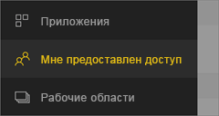
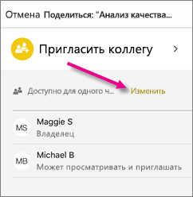
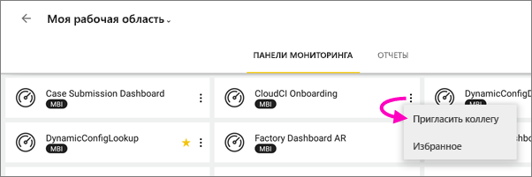
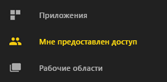
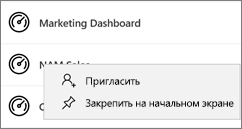
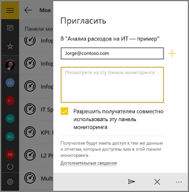

# Общий доступ к панели мониторинга или отчету из мобильных приложений Power BI
Область применения:

|  |  |  |  |  |
|:--- |:--- |:--- |:--- |:--- |
| iPhone |iPad |Телефоны под управлением Android |Планшеты Android |Устройства под управлением Windows 10 |

При наличии [лицензии Power BI Pro](../../service-features-license-type.md) вы можете приглашать других пользователей просматривать панели мониторинга и отчеты, отправляя им ссылки из мобильных приложений Power BI. Вы можете делиться данными с другими пользователями, как в вашей организации, так и за ее пределами, независимо от наличия у них корпоративной учетной записи почты. Им также не требуются лицензии Power BI Pro, а содержимое может не находиться в [емкости Premium](../../service-premium.md).

Из мобильного приложения Power BI для устройств iOS и Android можно также [добавить заметку к моментальному снимку плитки, отчета или визуального элемента и поделиться им](mobile-annotate-and-share-a-tile-from-the-mobile-apps.md). 

## Общий доступ с помощью iPhone
1. На панели действий в нижней части панели мониторинга или отчета коснитесь значка **предоставления общего доступа** .
   
   
2. Введите имена (через запятую) и сообщение, сопровождающее ваше приглашение.
3. Чтобы разрешить получателям повторно предоставлять общий доступ, оставьте параметр **Allow recipients to reshare** (Разрешить получателям предоставлять доступ к этой панели мониторинга) выбранным.
   
   Повторно предоставленный общий доступ позволяет вашим коллегам пересылать приглашение другим пользователям в организации через веб-приложения или мобильные приложения.
5. Нажмите **Отправить** в правом верхнем углу.
   
   Получатели получат приглашение по электронной почте с прямой ссылкой на панель мониторинга или отчет. Срок действия приглашения истекает через один месяц. При открытии в браузере или мобильном приложении Power BI оно добавляется в раздел **Мне предоставлен доступ** учетной записи Power BI.
   
   
   
   См. дополнительные [примечания о предоставлении общего доступа](../../service-share-dashboards.md).

### Отмена общего доступа с помощью iPhone
Вы можете отменить общий доступ, только если являетесь владельцем.

1. На панели действий в нижней части панели мониторинга или отчета коснитесь значка **предоставления общего доступа** .
2. Выберите **Пригласить коллегу**.
   
   Появится список коллег, которым вы предоставили общий доступ к этой панели мониторинга или отчету, с перечисленными ниже вариантами статуса.
   
   * **Может просматривать**: коллеги с этими правами могут просматривать, но не могут предоставлять общий доступ.
   * **Может просматривать и приглашать**: коллеги с этими правами могут просматривать, а также предоставлять общий доступ другим коллегам.
1. Коснитесь элемента **Изменить**.
   
    
4. Чтобы отменить общий доступ, коснитесь красного кружка рядом с именем и выберите **Удалить**.

## Общий доступ с помощью iPad
1. Коснитесь значка **предоставления общего доступа**  в правом верхнем углу панели мониторинга или отчета.
2. Введите адреса электронной почты и текст сопроводительного сообщения к приглашению.
3. Чтобы разрешить получателям повторно предоставлять общий доступ, оставьте параметр **Allow recipients to reshare** (Разрешить получателям предоставлять доступ к этой панели мониторинга) выбранным.
   
   Повторно предоставленный общий доступ позволяет вашим коллегам пересылать приглашение другим пользователям в организации через веб-приложения или мобильные приложения. 

4. Нажмите **Отправить** в правом верхнем углу.
   
   Получатели получат приглашение по электронной почте с прямой ссылкой на панель мониторинга или отчет. Срок действия приглашения истекает через один месяц. При открытии в браузере или мобильном приложении Power BI оно добавляется в раздел **Мне предоставлен доступ** учетной записи Power BI.
   
   
   
   См. дополнительные [примечания о предоставлении общего доступа](../../service-share-dashboards.md).

### Отмена общего доступа с помощью iPad
Вы можете отменить общий доступ, только если являетесь владельцем.

1. Коснитесь значка **предоставления общего доступа**  в правом верхнем углу панели мониторинга или отчета.
   
   Появится список коллег, которым вы предоставили общий доступ к этой панели мониторинга или отчету, с перечисленными ниже вариантами статуса.
   
   * **Может просматривать**: коллеги с этими правами могут просматривать, но не могут предоставлять общий доступ.
   * **Может просматривать и приглашать**: коллеги с этими правами могут просматривать, а также предоставлять общий доступ другим коллегам.
2. Коснитесь элемента **Изменить**.
3. Чтобы отменить общий доступ, коснитесь красного кружка рядом с именем и выберите **Удалить**.

## Предоставление общего доступа с помощью устройства Android
1. На домашней странице панелей мониторинга или отчетов коснитесь значка с многоточием (...), а затем выберите **Invite a colleague** (Пригласить коллегу).
   
   
2. Либо коснитесь значка приглашения на панели мониторинга или в отчете. .

    Если вы являетесь владельцем панели мониторинга, то появится список коллег, с которыми вы совместно используете эту панель мониторинга или отчет, со следующими отметками.

    -   **Может просматривать**: коллеги с этими правами могут просматривать, но не могут предоставлять общий доступ.
    -   **Можно просматривать и повторно публиковать**: коллеги с этими правами могут просматривать, а также предоставлять общий доступ другим коллегам.

1. Введите адреса электронной почты и сообщение, сопровождающее приглашение для панель мониторинга. В противном случае Power BI отправляет сообщение по умолчанию.
2. Чтобы разрешить повторный общий доступ, оставьте параметр **Разрешить получателям предоставлять доступ к этой панели мониторинга** выбранным.
   
   Повторный общий доступ позволяет вашим коллегам пересылать приглашение другим пользователям в организации через веб-приложения или мобильные приложения.
   
1. Чтобы отправить это сообщение, коснитесь значка **отправки**  в правом верхнем углу.
   
   Получатели получат приглашение по электронной почте с прямой ссылкой на панель мониторинга. Срок действия приглашения истекает через один месяц. При открытии в браузере или мобильном приложении Power BI оно добавляется в раздел **Мне предоставлен доступ** учетной записи Power BI.
   
   
   
   См. дополнительные [примечания о предоставлении общего доступа к панелям мониторинга](../../service-share-dashboards.md).

### Отмена общего доступа с помощью устройства Android
Вы можете отменить общий доступ, только если являетесь владельцем.

1. Коснитесь значка приглашения в правом верхнем углу панели мониторинга или отчета . 
   
   Появится список коллег, которым вы предоставили общий доступ к этой панели мониторинга или отчету.
2. Чтобы отменить общий доступ для коллеги, коснитесь значка **X** рядом с нужным именем и выберите \> **Удалить**.

## Предоставление общего доступа с помощью устройства Windows 10
1. На панели мониторинга или в отчете коснитесь значка приглашения .
   
   Можно также на домашней странице панелей мониторинга или отчетов щелкнуть правой кнопкой мыши или нажать и удерживать, а затем выбрать пункт **Пригласить**.
   
   
   
   Если вы являетесь владельцем панели мониторинга, то список коллег, с которыми вы совместно используете эту панель мониторинга, отображается со следующими отметками.
   
   **Может просматривать**: коллеги с этими правами могут просматривать, но не могут предоставлять общий доступ.
   
   **Можно просматривать и повторно публиковать**: коллеги с этими правами могут просматривать, а также предоставлять общий доступ другим коллегам.
2. Введите адреса электронной почты и сообщение, сопровождающее приглашение. В противном случае Power BI отправляет сообщение по умолчанию.
   
   
3. Чтобы разрешить получателям повторно предоставлять общий доступ, оставьте параметр **Allow recipients to reshare** (Разрешить получателям предоставлять доступ к этой панели мониторинга) выбранным.
   
   Повторное предоставление общего доступа позволяет вашим коллегам предоставлять общий доступ другим пользователям в организации через браузер или мобильные приложения.
   
1. Коснитесь значка **отправки** .
   
   Получатели получат приглашение по электронной почте с прямой ссылкой на панель мониторинга или отчет. Срок действия приглашения истекает через один месяц. При открытии в браузере или мобильном приложении Power BI оно добавляется в раздел **Мне предоставлен доступ** учетной записи Power BI.
   
   
   
   См. дополнительные [примечания о предоставлении общего доступа](../../service-share-dashboards.md).

## Дальнейшие действия
* [Добавление заметок к моментальному снимку плитки, отчета и визуального элемента и их совместное использование в мобильных приложениях](mobile-annotate-and-share-a-tile-from-the-mobile-apps.md)
* [Предоставление общего доступа к панели мониторинга или отчету в Power BI](../../service-share-dashboards.md)
* У вас появились вопросы? [Попробуйте задать вопрос в сообществе Power BI.](http://community.powerbi.com/)

