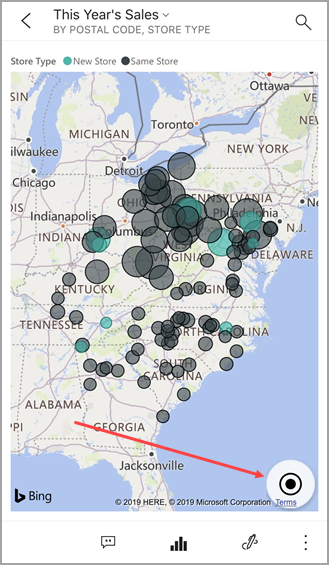

# Просмотр плиток в мобильном приложении Power BI
Применяется к:

|  |  |  |  |  |
|:--- |:--- |:--- |:--- |:--- |
| iPhone |iPad |Телефоны под управлением Android |Планшеты Android |Устройства под управлением Windows 10 |

Плитки представляют собой динамические моментальные снимки данных, закрепленные на информационной панели. Их значения изменяются по мере изменения данных. **Вы [добавляете плитки на информационные панели в службе Power BI](../end-user-tiles.md).** 

Затем в мобильных приложениях Power BI вы открываете эти плитки в режиме фокусировки и работаете с ними. Можно открывать плитки с разнообразными визуальными элементами, включая плитки на основе Bing и R.

## Плитки в приложениях для iOS

1. Откройте [информационную панель в мобильном приложении для iOS](mobile-apps-view-dashboard.md).
2. Коснитесь плитки. Она откроется в режиме фокусировки, в котором проще просматривать и изучать представленные на ней данные. В режиме фокусировки можно выполнять следующие задачи.
   
   Коснитесь графика, линейчатой диаграммы или гистограммы для просмотра значений конкретных фрагментов визуализации.
   
    
   
   *Например, на этом графике выбранные значения соответствуют показателям **продаж за текущий** и **прошлый годы** в **августе**.*  
   
   Коснитесь сегмента круговой диаграммы, чтобы отобразить его значения над диаграммой.  
   
   
3. На карте коснитесь значка **Центрировать карту** , чтобы центрировать карту относительно своего текущего расположения.

   

4. Коснитесь значка карандаша , чтобы [добавить заметку к плитке](mobile-annotate-and-share-a-tile-from-the-mobile-apps.md#annotate-and-share-the-tile-report-or-visual), а затем значка общего доступа , чтобы [предоставить доступ к ней другим пользователям](mobile-annotate-and-share-a-tile-from-the-mobile-apps.md#annotate-and-share-the-tile-report-or-visual).

5. [Добавьте оповещение на плитку](mobile-set-data-alerts-in-the-mobile-apps.md). Если значения выйдут за установленные пределы, Power BI сообщит вам об этом.

6. Иногда создатели панелей мониторинга добавляют ссылки в плитки. В этом случае на плитке в режиме фокусировки отображается значок ссылки  .
   
    
   
    Ссылки могут вести на другие панели мониторинга Power BI или внешние ресурсы. Вы можете [нажать на ссылку](../../create-reports/service-dashboard-edit-tile.md#hyperlink), чтобы открыть ее в приложении Power BI. Если ссылка указывает на внешний сайт, Power BI запросит разрешение на переход к нему.
   
    
   
    Открыв ссылку в приложении Power BI, вы можете скопировать ее и открыть в браузере.
7. [Откройте отчет](mobile-reports-in-the-mobile-apps.md) , на котором основана плитка.
8. Чтобы выйти из режима фокусировки плитки, коснитесь имени плитки, а затем выберите имя панели мониторинга или **Моя рабочая область**.
   
    

## Плитки в мобильных приложениях для телефонов и планшетов с Android
1. Откройте [информационную панель в мобильном приложении Power BI](mobile-apps-view-dashboard.md).
2. Коснитесь плитки, чтобы открыть ее в режиме фокусировки, в котором проще просматривать и изучать представленные на ней данные.
   
   
   
    В режиме фокусировки можно выполнять следующие задачи.
   
   * Коснитесь диаграммы, чтобы переместить линию на графике, линейчатой диаграмме, гистограмме или пузырьковой диаграмме для просмотра значений для определенной точки в визуализации.  
   * Коснитесь значка карандаша , чтобы [добавить заметку к плитке](mobile-annotate-and-share-a-tile-from-the-mobile-apps.md#annotate-and-share-the-tile-report-or-visual), а затем значка "Поделиться снимком" , чтобы [предоставить доступ другим пользователям](mobile-annotate-and-share-a-tile-from-the-mobile-apps.md#annotate-and-share-the-tile-report-or-visual).
   * Коснитесь значка "Открыть отчет" , чтобы [просмотреть отчет](mobile-reports-in-the-mobile-apps.md) в мобильном приложении.
3. Иногда создатели панелей мониторинга добавляют ссылки в плитки. В этом случае при нажатии кнопки с вертикальным многоточием ( **...** ) вы увидите команду **Открыть ссылку** .
   
    
   
    Ссылки могут вести на другие панели мониторинга Power BI или внешние ресурсы. Вы можете [нажать на ссылку](../../create-reports/service-dashboard-edit-tile.md#hyperlink), чтобы открыть ее в приложении Power BI. Если ссылка указывает на внешний сайт, Power BI запросит разрешение на переход к нему.
   
    
   
    Открыв ссылку в приложении Power BI, вы можете скопировать ее и открыть в браузере.
4. Коснитесь стрелки в левом верхнем углу, чтобы закрыть плитку и вернуться на информационную панель.

## Плитки в мобильном приложении с Windows 10

>[!NOTE]
>Поддержка мобильного приложения Power BI для **телефонов под управлением Windows 10 Mobile** будет прекращена 16 марта 2021 г. [Дополнительные сведения](/legal/powerbi/powerbi-mobile/power-bi-mobile-app-end-of-support-for-windows-phones)

1. Откройте [информационную панель в мобильном приложении Power BI](mobile-apps-view-dashboard.md) для Windows 10.
2. Коснуться вертикального многоточия на плитке. Здесь можно выполнять следующие действия. 
   
    
   
    [Совместно использовать моментальный снимок плитки](mobile-windows-10-phone-app-get-started.md).
   
    Коснуться значка **Открыть отчет**  для [просмотра базового отчета](mobile-reports-in-the-mobile-apps.md).
   
    [Открыть ссылку](../../create-reports/service-dashboard-edit-tile.md#hyperlink), если она имеется. Ссылки могут вести на панели мониторинга Power BI или внешние ресурсы.
3. Коснуться значка **Развернуть плитку** . Она откроется в режиме фокусировки, в котором проще просматривать и изучать представленные на ней данные. В этом режиме можно выполнять следующие задачи.
   
   Поверните круговую диаграмму, чтобы отобразить значения фрагмента, расположенного в верхней части диаграммы.  
   
   
   
   Коснитесь диаграммы, чтобы переместить линию на графике, линейчатой диаграмме, гистограмме или пузырьковой диаграмме для просмотра значений для определенной точки в визуализации.  
   
   
   
   *На этой линейчатой диаграмме значения столбца **Decor** (Декор) показаны над диаграммой.*
   
   Коснитесь значка **Во весь экран** , чтобы открыть плитку в полноэкранном режиме без панели навигации и меню.
   
   > [!NOTE]
   > Вы также можете [просматривать панели мониторинга и отчеты в полноэкранном режиме](mobile-windows-10-app-presentation-mode.md) в мобильном приложении Power BI для Windows 10.
   > 
   > 
   
   На карте коснитесь значка **Центрировать карту** , чтобы центрировать карту относительно своего текущего расположения.
   
   
   
   Коснитесь значка "Поделиться снимком" , чтобы [поделиться плиткой](mobile-windows-10-phone-app-get-started.md) с другими пользователями.   
   
   Коснитесь значка "Открыть отчет" , чтобы [просмотреть отчет](mobile-reports-in-the-mobile-apps.md), на котором основана плитка. 
4. Коснитесь черной стрелки или черной кнопки, чтобы закрыть плитку и вернуться на панель мониторинга.

## Дальнейшие действия
* [Что такое Power BI?](../../fundamentals/power-bi-overview.md)
* У вас появились вопросы? [Попробуйте задать вопрос в сообществе Power BI.](https://community.powerbi.com/)