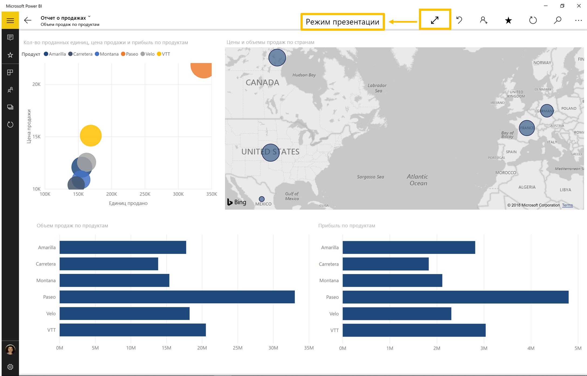
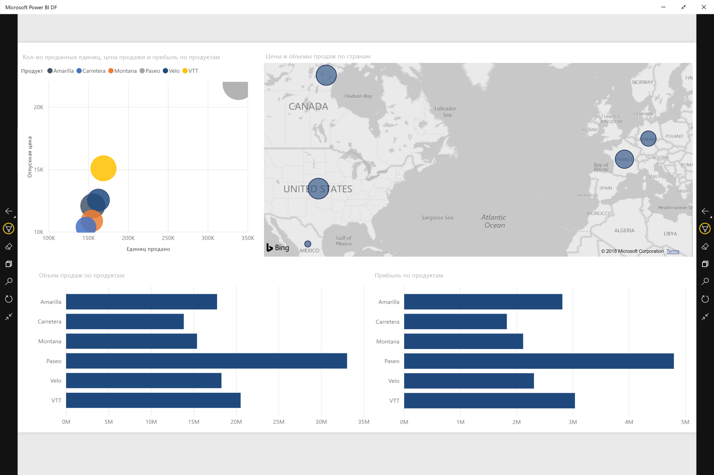
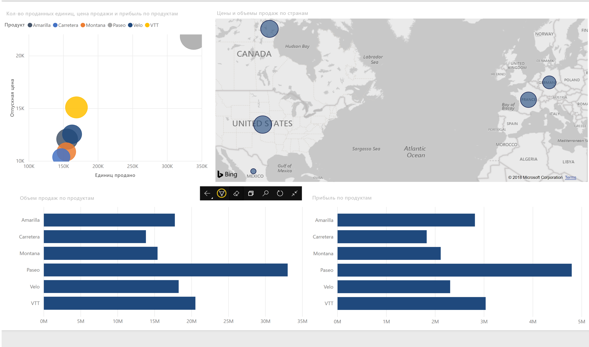

# Просмотр отчетов и панели мониторинга в режиме презентации на устройствах Surface Hub и Windows 10
Можно использовать режим презентации для отображения отчетов и панели мониторинга в полноэкранном режиме на устройствах Windows 10 и Surface Hub. 

Режим презентации удобно использовать для показа Power BI на собраниях или конференциях, показа в офисе через специальный проектор или просто для увеличения места на небольшом экране. 

В режиме презентации в мобильном приложении Power BI для Windows 10 отсутствуют все элементы пользовательского интерфейса, например панели навигации и меню, что позволит вам и участникам вашей команды сосредоточиться на данных в вашем отчете. Панель инструментов с действиями будет доступна для вас и позволит в режиме презентации взаимодействовать и работать с данными.

Кроме того, можно [отображать панели мониторинга и отчеты в полноэкранном режиме из службы Power BI](../end-user-focus.md) в Интернете.

> [!NOTE]
> Режим презентации отличается от [режима фокусировки для плиток](mobile-tiles-in-the-mobile-apps.md).
> 
> 

## Использование режима презентации
Чтобы перейти в полноэкранный режим, в мобильном приложении Power BI нажмите на значок **Во весь экран**.
 Элементы пользовательского интерфейса приложения исчезнут, и панель инструментов будет отображаться внизу экрана или на правой и левой стороне (в зависимости от размера вашего экрана).

С помощью панели инструментов можно выполнять ниже приведенные действия.

1. Коснитесь значка "Назад"  для перехода на предыдущую страницу. Долгое касание к значку извлечет окно навигации, позволив вам перейти к папке в вашем отчете или панели мониторинга.
2. Значок рукописного ввода  позволяет выбрать цвет во время использования ручки Surface для рисования или добавления заметки на странице вашего отчета. 
3. Используйте значок страниц,  чтобы заменить страницу отчета, которую вы представляете в настоящее время.
4. Коснитесь значка поиска  для поиска других артефактов в Power BI.
5. Чтобы выйти из режима презентации, коснитесь значка с двумя стрелками, направленными внутрь  на панели инструментов.

Можно отменить закрепление панели инструментов и перетащить ее куда угодно на экране. Это применимо к большим экранам, когда вы желаете сосредоточиться на определенной области в отчете, имея рядом доступные средства. Просто поместите ваш палец на панель инструментов и проведите им к холсту отчетов.

## Дальнейшие действия
* [Отображение панелей мониторинга и отчетов в полноэкранном режиме (ТВ-режим)](../end-user-focus.md)
* У вас появились вопросы? [Попробуйте задать вопрос в сообществе Power BI.](http://community.powerbi.com/)

