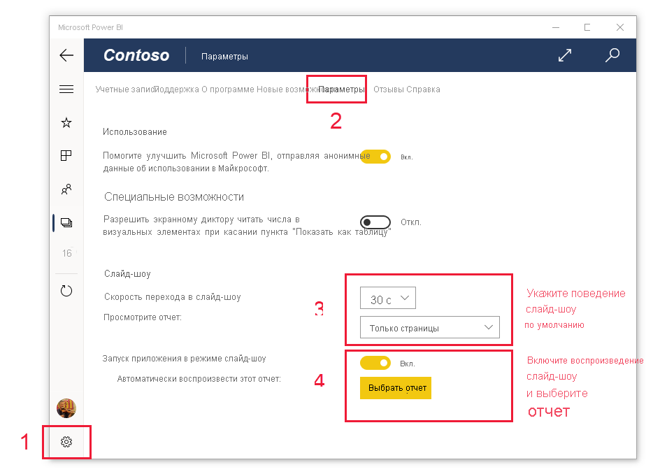

# Просмотр отчетов и панели мониторинга в режиме презентации на устройствах Surface Hub и Windows 10
Можно использовать режим презентации для отображения отчетов и панели мониторинга в полноэкранном режиме на устройствах Windows 10 и Surface Hub. Режим презентации удобно использовать для показа Power BI на собраниях или конференциях, показа в офисе через специальный проектор или просто для увеличения места на небольшом экране.

В режиме презентации:
* Все элементы управления хрома (кнопки навигации и строки меню) исчезнут, что упрощает работу с данными в отчете.
* Будет доступна панель действий, позволяющая взаимодействовать с данными и управлять презентацией.
* Вы сможете воспроизвести слайд-шоу, в котором автоматически и циклически отображаются страницы, закладки или страницы и закладки.

>[!NOTE]
>Поддержка мобильного приложения Power BI для **телефонов под управлением Windows 10 Mobile** будет прекращена 16 марта 2021 г. [Дополнительные сведения](/legal/powerbi/powerbi-mobile/power-bi-mobile-app-end-of-support-for-windows-phones)

## Использование режима презентации
Чтобы перейти в полноэкранный режим, в мобильном приложении Power BI нажмите на значок **Во весь экран**.
. Элементы управления хрома в приложении исчезнут, а в нижней части экрана или справа и слева (в зависимости от размера экрана) отобразится панель действий.

 инструментов

С помощью прикосновений к панели инструментов можно выполнять приведенные ниже действия.

| Значок | Действие |
|------|--------|
||**Вернуться** к предыдущей странице Долгое касание значка приводит к появлению окна навигации, с помощью которого можно перейти к папке, содержащей отчет или панель мониторинга.|
||**Переключение между страницами** в отчете во время презентации.|
||**Закладка** позволяет перейти к определенному представлению данных, на которые ссылается закладка. Вы можете применять личные закладки и закладки отчета.|
||**Выбор цвета пера** во время использования ручки Surface для рисования или добавления заметок на странице вашего отчета.|
||**Стирание рукописных меток**, которые могли быть добавлены при использовании ручки Surface для рисования и добавления заметок на странице отчета.          |
||**Сброс к представлению по умолчанию** и очистка всех фильтров, сегментов или любых других изменений представлений данных, которые могли быть сделаны во время презентации.|
||**Общий доступ** к изображению в презентации для своих коллег. Изображение будет включать в себя все заметки, сделанные с помощью ручки Surface во время презентации.|
||**Обновление** отчета.|
||**Воспроизведение слайд-шоу** — скрытие панели действий и запуск слайд-шоу. С помощью селектора можно выбрать автоматический переход между страницами, закладками или между страницами и закладками. По умолчанию переход между страницами автоматически выполняется каждые 30 секунд. Этот параметр можно изменить в разделе [**Настройки > Параметры**](#slideshow-settings). Дополнительные сведения о слайд-шоу см. [здесь](#slideshows).|
||**Выход** из режима презентации.|
||**Поиск** других артефактов в Power BI.|

Можно отменить закрепление панели инструментов и перетащить ее в любое другое место на экране. Это применимо к большим экранам, когда вы желаете сосредоточиться на определенной области в отчете, имея рядом доступные средства. Просто поместите ваш палец на панель инструментов и проведите им к холсту отчетов.

## Слайд-шоу

Вы можете начать слайд-шоу, чтобы пройти по презентации автоматически. Можно настроить слайд-шоу для просмотра страниц, закладок или одновременно страниц и закладок.

При нажатии кнопки **Воспроизведение** на панели действий запускается слайд-шоу. Появится элемент управления, позволяющий приостановить слайд-шоу или изменить то, что будет воспроизводиться: страницы, закладки или одновременно страницы и закладки.

 Элемент управления отображает имя показанного в данный момент представления (страница или закладка и страница). На рисунке выше показано, что отчет с именем **Продажи** в настоящее время открыт на закладке **Азиатско-Тихоокеанский регион** на странице **Эффективность продаж**.

По умолчанию в слайд-шоу переход производится только между страницами с частотой один раз в 30 секунд. Поведение по умолчанию можно изменить в [параметрах слайд-шоу](#slideshow-settings).

### Автоматическое воспроизведение слайд-шоу при запуске

Вы можете настроить мобильное приложение Power BI для автоматического воспроизведения слайд-шоу при запуске приложения. Этот параметр полезен для создания интерфейса, похожего на режим киоска, который запускает отчет на общедоступных дисплеях без ручного вмешательства. Дополнительные сведения о настройке отчета для автовоспроизведения см. в разделе [Параметры слайд-шоу](#slideshow-settings).

### Параметры слайд-шоу

По умолчанию в слайд-шоу переход производится только между страницами с частотой один раз в 30 секунд. Это поведение по умолчанию можно изменить, перейдя в раздел **Параметры > Параметры**, как показано ниже. Можно также включить автовоспроизведение и выбрать отображаемый отчет.

1. Выберите значок параметров.

1. Откройте вкладку "Параметры".

1. При необходимости измените параметры по умолчанию для объектов, которые будут циклически демонстрироваться при слайд-шоу (страницы, закладки либо и то, и другое), и частоты переключения.

1. Если необходимо, чтобы отчет автоматически воспроизводился при запуске приложения, включите переключатель и выберите **Выбор отчета**. Вы сможете произвести поиск по доступным вам отчетам.

## Дальнейшие действия
* [Отображение панелей мониторинга и отчетов в полноэкранном режиме (ТВ-режим)](../end-user-focus.md)
* Вопросы? [Попробуйте задать вопрос в сообществе Power BI.](https://community.powerbi.com/)