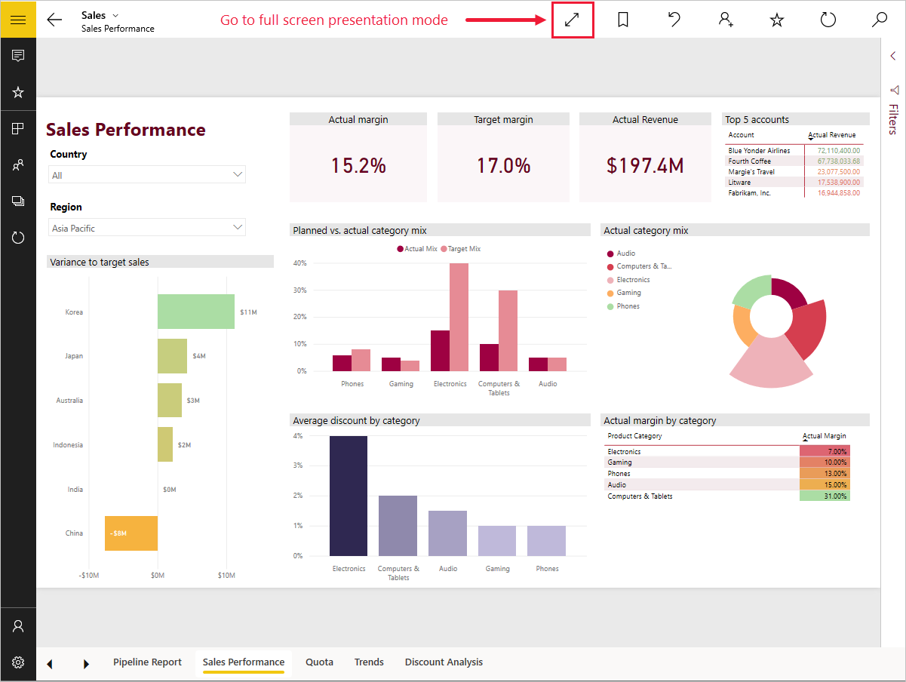

# Просмотр отчетов в режиме презентации в Surface Hub и Windows 10 в Power BI
Можно просматривать отчеты в режиме презентации в Surface Hub, а также информационные панели, отчеты и плитки в полноэкранном режиме на устройствах под управлением Windows 10. 

Режим презентации и полноэкранный режим удобно использовать для показа Power BI на собраниях или конференциях, показа в офисе через специальный проектор или просто для увеличения места на небольшом экране. 

В полноэкранном режиме в мобильном приложении Power BI отсутствуют все элементы пользовательского интерфейса, например панели навигации и меню, и отображаются только вкладки страниц и области фильтров в отчетах.

При просмотре отчета в Surface Hub в режиме презентации на страницах можно использовать рукописный ввод различными цветами и переходить между страницами отчета.

Кроме того, можно [отображать панели мониторинга и отчеты в полноэкранном режиме из службы Power BI](../../service-fullscreen-mode.md) в Интернете.

> [!NOTE]
> Режим презентации отличается от [режима фокусировки для плиток](mobile-tiles-in-the-mobile-apps.md).
> 
> 

## Отображение информационных панелей, отчетов и плиток в полноэкранном режиме
1. В мобильном приложении Power BI на панели мониторинга, на плитке или в отчете коснитесь значка **Во весь экран** , чтобы перейти в полноэкранный режим.
2. В режиме презентации можно отфильтровать отчет или выполнить поиск других панелей мониторинга и отчетов.
   
    Разверните панель "Фильтры", чтобы применить или отменить фильтры.
   
    
   
     Коснитесь значка поиска  для поиска других панелей мониторинга.
   
    
3. Чтобы выйти из полноэкранного режима, коснитесь значка с двумя стрелками, направленными внутрь,  на панели инструментов или проведите пальцем сверху вниз и коснитесь двух направленных внутрь стрелок. .

## Включение режима презентации для Surface Hub
В Surface Hub режим презентации включен по умолчанию, но если он окажется выключен, его можно снова включить.

1. Коснитесь значка "Параметры"  в нижней части панели навигации слева.
2. Нажмите элемент **Параметры** и установите ползунок **Включить режим презентации Microsoft Surface Hub** в положение **Вкл**.
   
    

## Отображение отчетов в Surface Hub и рисование на них
1. В отчете нажмите значок **Во весь экран** , чтобы перейти в режим презентации Surface Hub.
   
    С обеих сторон экрана будет отображаться сворачиваемая панель действий. 
   
   * Чтобы открыть ее, проведите пальцем от края экрана к его центру или коснитесь маркера.
   * Чтобы закрыть, проведите пальцем от центра экрана к его краю или нажмите значок X вверху.
2. На устройствах, поддерживающих ввод с помощью пера, можно сразу же начинать писать. 
3. Чтобы изменить цвет ввода, коснитесь пера на правой или левой панели действий.
   
    
4. Чтобы удалить часть рукописных данных или все, коснитесь резинки или стрелки отмены.
5. Коснитесь круговой стрелки, чтобы обновить содержимое отчета.
6. Коснитесь стрелки влево или вправо, чтобы перейти к другим страницам отчета.
   
    
7. Чтобы выйти из полноэкранного режима, проведите пальцем сверху вниз и коснитесь двух направленных внутрь стрелок .

## Дальнейшие действия
* [Отображение панелей мониторинга и отчетов в полноэкранном режиме (ТВ-режим)](../../service-fullscreen-mode.md)
* У вас появились вопросы? [Попробуйте задать вопрос в сообществе Power BI.](http://community.powerbi.com/)

