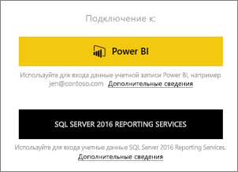
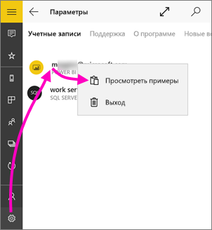
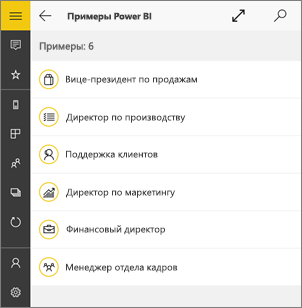
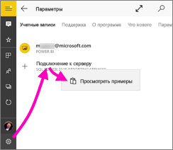
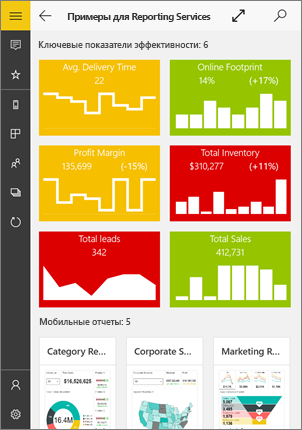
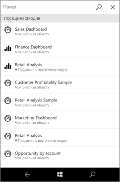
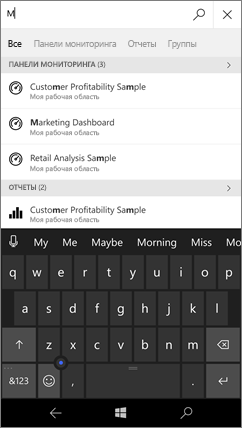
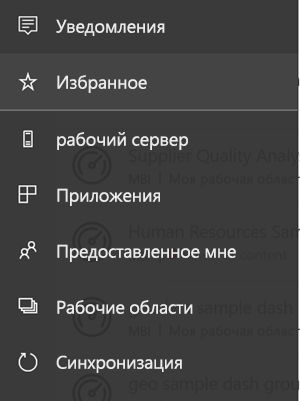
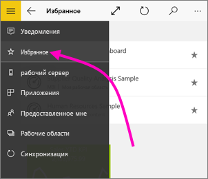
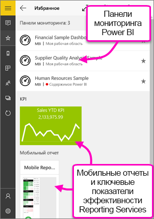

# Начало работы с мобильным приложением Power BI для Windows 10
Мобильное приложение Power BI для Windows 10 позволяет использовать Power BI на планшете или телефоне. Вы получаете доступ к самой актуальной бизнес-информации с сенсорного экрана. Просматривайте информационные панели компании и взаимодействуйте с ними откуда угодно прямо на [начальном экране Windows](mobile-pin-dashboard-start-screen-windows-10-phone-app.md).

[Создавайте панели мониторинга и отчеты в службе Power BI](../../fundamentals/service-get-started.md) на основе собственных данных. 

Взаимодействуйте со своими панелями и отчетами, просматривайте данные и предоставляйте к ним доступ из мобильного приложения Power BI для Windows 10.

## Начните с главного
* [**Скачайте мобильное приложение Power BI для Windows 10**](https://go.microsoft.com/fwlink/?LinkID=526478) из Магазина Windows.
  
  Устройство должно работать под управлением Windows 10. Приложение работает на устройствах, где доступно не менее 3 ГБ ОЗУ и 8 ГБ внутренней памяти.

  >[!NOTE]
  >Поддержка мобильного приложения Power BI для **телефонов под управлением Windows 10 Mobile** будет прекращена 16 марта 2021 г. [Дополнительные сведения](https://go.microsoft.com/fwlink/?linkid=2121400)
   
* Узнайте о [новых возможностях мобильных приложений Power BI](mobile-whats-new-in-the-mobile-apps.md).

## Регистрация в службе Power BI в Интернете
Если вы еще не зарегистрировались, перейдите в [службу Power BI](https://powerbi.com/). Зарегистрируйте учетную запись, чтобы получить возможность создавать и сохранять панели мониторинга и отчеты, а также объединять данные. Затем войдите в Power BI со своего устройства с Windows 10 для просмотра панелей мониторинга откуда угодно.

1. В службе Power BI коснитесь кнопки [Зарегистрироваться](https://go.microsoft.com/fwlink/?LinkID=513879), чтобы создать учетную запись Power BI.
2. Начните [создавать собственные информационные панели и отчеты](../../fundamentals/service-get-started.md).

## Начало работы с приложением Power BI
1. На начальном экране устройства Windows 10 откройте приложение Power BI.
   
   
2. Чтобы просмотреть панели мониторинга и отчеты Power BI, нажмите **Power BI**. Войдите с использованием учетных данных учетной записи Power BI в Интернете. 
   
   Чтобы просмотреть мобильные отчеты и ключевые показатели эффективности Reporting Services, коснитесь **SQL Server 2016 Reporting Services**. Войдите, используя учетные данные SQL Server Reporting Services.
   
   
3. Коснитесь команды **Начать просмотр**, чтобы открыть свои панели мониторинга.

## Примеры для Power BI и Reporting Services
Вы можете работать с примерами Power BI и Reporting Services даже без регистрации. Загрузив приложение, вы можете просматривать образцы или приступить к работе. Возвращайтесь к образцам когда захотите с домашней страницы панели мониторинга.

### Примеры Power BI
Вы можете просматривать примеры панелей мониторинга Power BI и взаимодействовать с ними. Однако некоторые задачи с ними невозможно выполнить. Нельзя открыть отчеты, соответствующие панелям мониторинга, предоставить к примерам общий доступ для других пользователей или добавить их в избранное.

1. Коснитесь кнопки глобальной навигации  в левом верхнем углу.
2. Щелкните значок **Параметры**, выберите свое имя, а затем выберите **Просмотреть примеры**.
   
   
3. Выберите роль и ознакомьтесь с панелью мониторинга для этой роли.  
   
   

### Примеры мобильных отчетов Reporting Services
1. Коснитесь кнопки глобальной навигации  в левом верхнем углу.
2. Коснитесь значка **Параметры**, щелкните правой кнопкой мыши или нажмите и удерживайте элемент **Подключение к серверу**, а затем выберите команду **Просмотреть примеры**.
   
   
3. Откройте папку отчетов по розничным продажам или отчетов по сбыту и изучите ключевые показатели эффективности и мобильные отчеты.
   
   

## Поиск панелей мониторинга, отчетов и приложений
Быстро находите свои панели мониторинга, отчеты и приложения с помощью поля поиска, которое всегда расположено вверху приложения.

1. Нажмите на значок поиска в правом верхнем углу.
   
   
   
   Power BI отобразит последние панели мониторинга, отчеты и приложения, с которыми вы работали.
   
   
2. Как только вы начнете вводить текст, Power BI выдаст соответствующие запросу результаты.
   
   

## Поиск содержимого в мобильных приложениях Power BI
В мобильных приложениях Power BI панели мониторинга и отчеты хранятся в разных расположениях в зависимости от источника данных. Прочтите статью о [поиске содержимого в мобильных приложениях](mobile-apps-quickstart-view-dashboard-report.md). Вы всегда можете найти нужное содержимое в мобильных приложениях Power BI. 

## Просмотр избранных панелей мониторинга, ключевых показателей эффективности и отчетов
Просматривайте избранные панели Power BI, ключевые показатели эффективности и мобильные отчеты Reporting Services в мобильном приложении на странице избранного. Когда в мобильном приложении Power BI вы добавляете панель мониторинга в *избранное*, панель становится доступной на всех ваших устройствах, а также в службе Power BI в браузере. 

* Выберите **Избранное**.
  
   
  
   На странице отобразится избранное Power BI и избранное с веб-портала Reporting Services.
  
   

Дополнительные сведения об избранном в мобильных приложениях Power BI см. [здесь](mobile-apps-favorites.md).

## Дальнейшие действия
Ниже перечислены дополнительные функции и возможности при работе с панелями мониторинга и отчетами в приложении Power BI для Windows 10, а также мобильными отчетами и ключевыми показателями эффективности Reporting Services на веб-портале Reporting Services.

### Панели мониторинга и отчеты Power BI
* Просмотр [приложений](../../collaborate-share/service-create-distribute-apps.md).
* Просмотр своих [информационных панелей](mobile-apps-view-dashboard.md).
* [Закрепление плиток и информационных панелей Power BI](mobile-pin-dashboard-start-screen-windows-10-phone-app.md) на начальном экране устройства в виде живых плиток.
* [Совместное использование плиток](mobile-windows-10-phone-app-get-started.md).
* [Совместное использование информационных панелей](mobile-share-dashboard-from-the-mobile-apps.md).

### Мобильные отчеты и ключевые показатели эффективности Reporting Services
* [Просматривайте ключевые показатели эффективности и мобильные отчеты Reporting Services](mobile-app-windows-10-ssrs-kpis-mobile-reports.md) в приложении Power BI для Windows 10.
* Создавайте [ключевые показатели эффективности на веб-портале Reporting Services](/sql/reporting-services/working-with-kpis-in-reporting-services).
* [Создание собственных мобильных отчетов с помощью приложения SQL Server Mobile Report Publisher](/sql/reporting-services/mobile-reports/create-mobile-reports-with-sql-server-mobile-report-publisher) и их публикация на веб-портале Reporting Services.

## Дальнейшие действия
* [Скачайте приложение Power BI](https://go.microsoft.com/fwlink/?LinkID=526478) из Магазина Windows.  
* [Что такое Power BI?](../../fundamentals/power-bi-overview.md)
* У вас появились вопросы? [Попробуйте задать вопрос в сообществе Power BI.](https://community.powerbi.com/)
