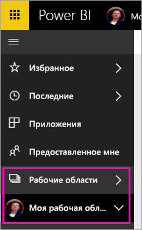
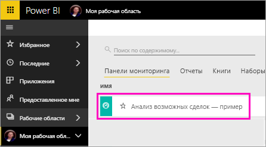
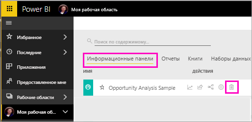

# Руководство. Отправка вопросов о данных с помощью виртуального аналитика "Вопросы и ответы" в приложениях Power BI на платформе iOS

Чтобы получить ответ на вопрос о своих данных, задайте его своими словами. При работе с этим руководством вы будете задавать вопросы и просматривать аналитические сведения о тестовых данных в виртуальном аналитике "Вопросы и ответы", который доступен в мобильном приложении Microsoft Power BI на iPad, iPhone и iPod Touch. 

Область применения:

|  |  |
|:--- |:--- |
| iPhone |iPad |

Виртуальный аналитик "Вопросы и ответы" — это диалоговый интерфейс бизнес-аналитики, который обращается к базовым данным функции "Вопросы и ответы" в службе Power BI [(https://powerbi.com)](https://powerbi.com). Он предлагает аналитические сведения, а также может отвечать на вопросы, которые вы вводите или произносите.

При работе с этим руководством вы сделаете следующее:

> [!div class="checklist"]
> * установите приложение Power BI для iOS;
> * скачаете примеры панели мониторинга и отчетов Power BI;
> * просмотрите аналитические сведения, которые предлагает мобильное приложение.

Если вы не зарегистрированы в Power BI, перед началом работы [пройдите бесплатную регистрацию](https://app.powerbi.com/signupredirect?pbi_source=web).

## Предварительные требования

### Установка приложения Power BI для iOS
[Скачайте приложение для iOS](http://go.microsoft.com/fwlink/?LinkId=522062 "Скачайте приложение для iPhone") из Apple App Store на устройство iPad, iPhone или iPod Touch.

Приложение Power BI для iOS поддерживается в следующих версиях ОС:
- iPad под управлением iOS 10 или более поздней версии;
- iPhone 5 и более поздней версии под управлением iOS 10 или выше; 
- iPod Touch под управлением iOS 10 или более поздней версии.

### Скачивание примера "Анализ возможных сделок"
Для работы с этим руководством прежде всего скачайте пример "Анализ возможных сделок" из службы Power BI.

1. Откройте службу Power BI в браузере (app.powerbi.com) и войдите в нее.

1. Щелкните значок глобальной навигации, чтобы открыть область навигации слева.

    

2. На панели навигации слева выберите **Рабочие области** > **Моя рабочая область**.

    

3. В левом нижнем углу выберите **Получить данные**.
   
    

3. На странице "Получение данных" щелкните значок **Примеры**.
   
   

4. Выберите пример **Анализ возможных сделок**.
 
    
 
8. Нажмите кнопку **Подключиться**.  
  
   
   
5. Power BI импортирует выбранный пример и добавит панель мониторинга, отчет и набор данных из него в текущую рабочую область.
   
   

Теперь все готово для просмотра примера на устройстве iOS.

## Попробуйте использовать рекомендованные данные
1. На устройстве iPhone или iPad откройте приложение Power BI и введите учетные данные учетной записи Power BI, которую вы использовали ранее в браузерном интерфейсе службы Power BI.

1.  Коснитесь кнопки глобальной навигации  > **Рабочие области** > **Моя рабочая область** и откройте панель мониторинга из примера "Анализ возможных сделок".

2. Коснитесь значка виртуального аналитика "Вопросы и ответы"  в меню действий в нижней части страницы (на iPad — в верхней части страницы).

     

     Виртуальный аналитик "Вопросы и ответы" в Power BI предоставляет ряд предложений для начала работы.

     
3. Нажмите кнопку **рекомендованных данных**.

     Виртуальный аналитик "Вопросы и ответы" предлагает некоторые аналитические данные.
4. Прокрутите окно вправо и нажмите кнопку **Insight 2** (Аналитические данные 2).

    

     Отображаются аналитические данные 2.

    
5. Коснитесь диаграммы, чтобы открыть ее в режиме фокусировки.

    
6. Нажмите кнопку со стрелкой в верхнем левом углу, чтобы вернуться к окну виртуального аналитика "Вопросы и ответы".

## Очистка ресурсов

Когда вы завершите работу с руководством, можете удалить пример "Анализ возможных сделок", его панель мониторинга, отчет и набор данных.

1. Откройте службу Power BI (app.powerbi.com) и войдите в нее.

2. На панели навигации слева выберите **Рабочие области** > **Моя рабочая область**.

3. На вкладке **Панели мониторинга** щелкните значок **Удалить** в форме корзины рядом с панелью "Анализ возможных сделок".

    

4. Выберите вкладку **Отчеты** и повторите действия по удалению для отчета "Анализ возможных сделок".

5. Выберите вкладку **Наборы данных** и повторите действия по удалению для набора данных "Анализ возможных сделок".

## Дальнейшие действия

Итак, вы потренировались использовать виртуального помощника "Вопросы и ответы" в мобильных приложениях Power BI для iOS. Теперь изучите компонент "Вопросы и ответы" в службе Power BI.
> [!div class="nextstepaction"]
> [Вопросы и ответы в Power BI](../end-user-q-and-a.md)

