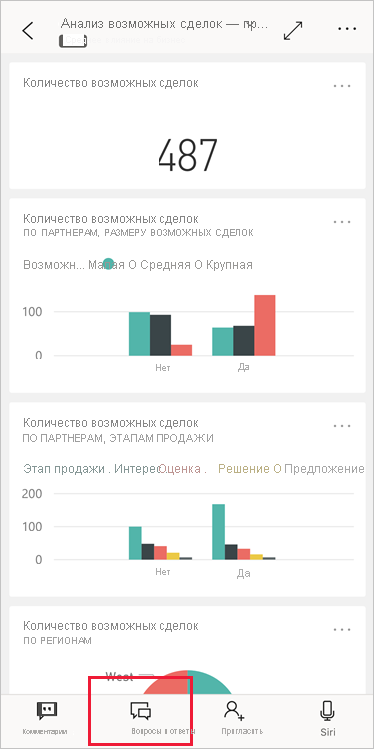
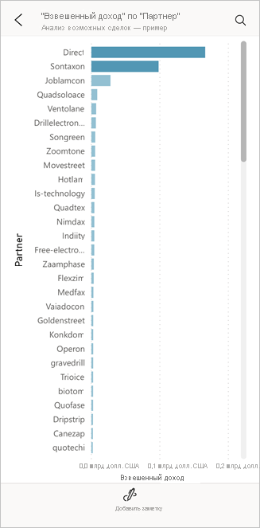

# Руководство. Отправка вопросов о данных с помощью виртуального аналитика "Вопросы и ответы" в приложениях Power BI на платформе iOS

Чтобы получить ответ на вопрос о своих данных, задайте его своими словами. При работе с этим руководством вы будете задавать вопросы и просматривать аналитические сведения о тестовых данных в виртуальном аналитике "Вопросы и ответы", который доступен в мобильном приложении Microsoft Power BI на iPad или iPhone. 

Применяется к:

|  |  |
|:--- |:--- |
| iPhone |iPad |

Виртуальный аналитик "Вопросы и ответы" — это диалоговый интерфейс бизнес-аналитики, который обращается к базовым данным функции "Вопросы и ответы" в [службе Power BI](https://powerbi.com). Он предлагает аналитические сведения, а также может отвечать на вопросы, которые вы вводите или произносите.

При работе с этим руководством вы сделаете следующее:

> [!div class="checklist"]
> * установите приложение Power BI для iOS;
> * скачаете примеры панели мониторинга и отчетов Power BI;
> * просмотрите аналитические сведения, которые предлагает мобильное приложение.

## Предварительные требования

* **Зарегистрируйтесь в Power BI**: Если вы не зарегистрированы в Power BI, перед началом работы [пройдите бесплатную регистрацию](https://app.powerbi.com/signupredirect?pbi_source=web).
* **Установите приложение Power BI для iOS**: [Скачайте приложение для iOS](https://apps.apple.com/app/microsoft-power-bi/id929738808) для iPad, iPhone или iPod Touch в Apple App Store. Приложение Power BI для iOS поддерживается в следующих версиях:
  * iPad с iOS 11 или более поздней версии;
  * iPhone 5 или более поздней версии с iOS 11 или более поздней версии; 
  * iPod Touch с iOS 11 или более поздней версии.
* **Скачайте демонстрационные данные**: прежде всего скачайте **пример "Анализ возможных сделок"** в службу Power BI. Инструкции см. в разделе [Скачивание примеров в раздел "Моя рабочая область" в службе Power BI](./mobile-apps-download-samples.md).

После выполнения предварительных требований и скачивания примера данных все готово для просмотра примеров на устройстве iOS.

## Попробуйте использовать рекомендованные данные
1. На устройстве iPhone или iPad откройте приложение Power BI и введите учетные данные учетной записи Power BI, которую вы использовали ранее в браузерном интерфейсе службы Power BI.

2. На главной странице на панели навигации коснитесь значка **Рабочие области**.

    

3. На открывшейся странице "Рабочие области" коснитесь элемента **Мои рабочие области**, а затем панели мониторинга **Анализ возможных сделок — пример**, чтобы открыть ее.

3. На панели мониторинга "Анализ возможных сделок — пример" в меню действий коснитесь значка виртуального аналитика "Вопросы и ответы".

    

    Виртуальный аналитик "Вопросы и ответы" предоставляет ряд предложений для начала работы.

    

3. Нажмите кнопку **рекомендованных данных**.

4. Виртуальный аналитик "Вопросы и ответы" предлагает некоторые аналитические данные. Прокрутите окно вправо и нажмите кнопку **Insight 2** (Аналитические данные 2).

    

   Отображаются аналитические данные 2.

    

5. Коснитесь диаграммы, чтобы открыть ее в режиме фокусировки.

    

6. Нажмите кнопку со стрелкой в верхнем левом углу, чтобы вернуться к окну виртуального аналитика "Вопросы и ответы".

## Очистка ресурсов

Когда вы завершите работу с руководством, можете удалить пример "Анализ возможных сделок", его панель мониторинга, отчет и набор данных.

1. Откройте службу Power BI ([служба Power BI](https://app.powerbi.com)) и войдите в нее.

2. На панели навигации выберите **Моя рабочая область**.

3. Выберите вкладку панелей мониторинга, а затем в строке "Анализ возможных сделок — пример" щелкните значок корзины.

    

    Теперь откройте вкладку отчетов и сделайте то же самое.

4. Далее выберите вкладку наборов данных, щелкните **Дополнительные параметры** (…) и выберите пункт **Удалить**.

    

## Дальнейшие действия

Итак, вы потренировались использовать виртуального помощника "Вопросы и ответы" в мобильных приложениях Power BI для iOS. Теперь изучите компонент "Вопросы и ответы" в службе Power BI.
> [!div class="nextstepaction"]
> [Вопросы и ответы в Power BI](../end-user-q-and-a.md)