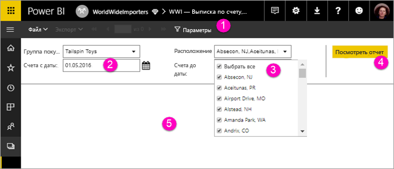

# Просмотр параметров для отчетов с разбивкой на страницы в службе Power BI

Из этой статьи вы узнаете, как работать в службе Power BI с параметрами отчетов с разбивкой на страницы.  Параметр отчета предоставляет возможность фильтровать данные для отчета. Параметры предлагают список доступных значений. Можно выбрать одно или несколько значений или ввести нужное значение в текстовое поле параметра для поиска. Для некоторых параметров настроены значения по умолчанию, а для некоторых выбор значения является обязательным условием для просмотра отчета.  

При просмотре отчета, имеющего параметры, на панели инструментов средства просмотра отчетов отображаются все параметры, что обеспечивает возможность интерактивного задания значений пользователем. На следующем рисунке показана область параметров для отчета с параметрами: **Buying Group** (Покупательская группа), **Location** (Расположение), **From Date** (Дата начала) и **To Date** (Дата завершения).  

## Панель параметров в службе Power BI

  
1.  В **области "Параметры"** на панели инструментов отображаются для каждого параметра значения по умолчанию и (или) подсказки, например Required (Обязательный).    
  
2.  Параметры **начальной и конечной дат** для счетов имеют значения по умолчанию. Чтобы изменить выбранную дату, введите ее в текстовом поле или выберите из календаря.  
  
3.  **Параметр расположения** позволяет выбрать одно, несколько или все поддерживаемые значения. 
  
4.  **** Просмотр отчета**** позволяет открыть представление отчета, когда вы завершите ввод или изменение значений параметров. 

5. **Значения по умолчанию** — если они настроены для всех параметров, то при первом просмотре отчет автоматически запускается с этими значениями. В нашем примере некоторые параметры не имеют значений по умолчанию, а значит вы сможете увидеть его только после выбора этих значений.  

## Дальнейшие действия

[Отчеты с разбивкой на страницы в службе Power BI](end-user-paginated-report.md)
