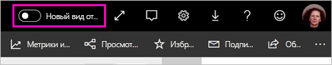
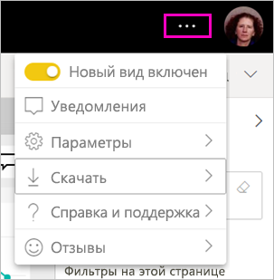
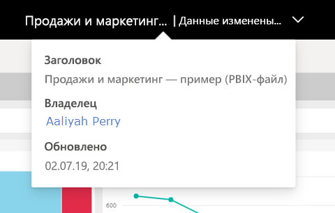
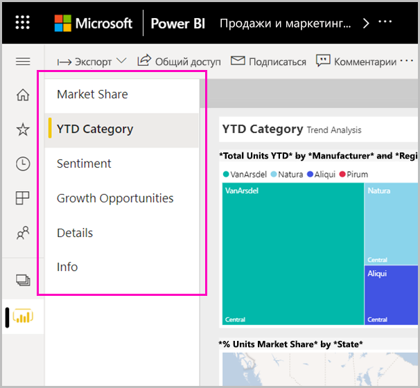
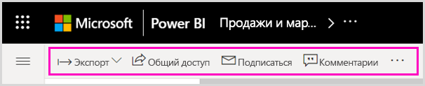
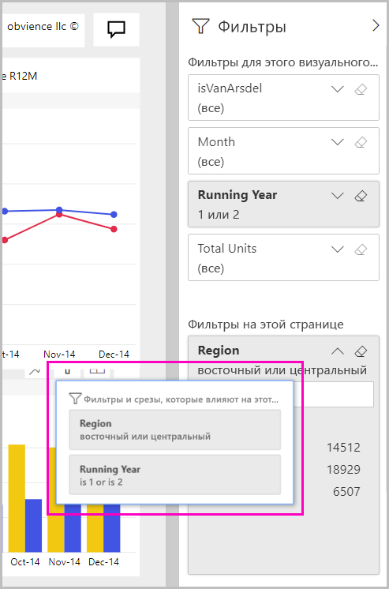

# "Новый внешний вид" службы Power BI

Служба Power BI (app.powerbi.com) имеет новый вид, который упрощает просмотр отчетов и взаимодействие с ними. Новый внешний вид стал проще и базируется на вашем знакомстве с другими продуктами Майкрософт. В рамках всей службы Power BI мы поместили содержимое отчета в центр внимания, переключившись на более светлую тему и обновив значки. 

Ищете сведения о новом интерфейсе в **Power BI Desktop**? См. статью [Использование обновленной ленты в Power BI Desktop](../create-reports/desktop-ribbon.md).

Ниже приведен обзор изменений в новом внешнем виде. Дополнительные сведения см. в нумерованных разделах:

Ищете определенное действие? См. статью [Новый вид: куда переместились действия?](service-new-look-where-actions.md).

## Краткий обзор изменений

Эта анимация демонстрирует изменения в способе отображения отчетов в процессе работы.

## 1. Согласие на новый внешний вид

Любой пользователь службы Power BI может согласиться на использование нового внешнего вида. Просто переключите параметр с **Новый вид отключен** на **Новый вид включен**.

Если вам нужно вернуться к старому виду, просто переведите переключатель  в положение **отключен**. Если вы не видите переключатель, выберите меню с многоточием в правом верхнем углу.

## 2. Просмотр сведений об отчете 

Вы можете быстро ознакомиться со сведениями, такими как дата последнего обновления и контактные данные, прямо в верхнем баннере.  Откройте меню, чтобы просмотреть дополнительные сведения об отчете. Вы даже можете отправить владельцу отчета сообщение электронной почты.

## 3. Вертикальный список страниц 
Имена страниц отчета теперь отображаются в списке на вертикальной панели. Они выделены, их трудно пропустить, а их использование аналогично навигации в Word и PowerPoint. Вы можете увеличить или уменьшить оставшуюся часть области отчета, изменив размер вертикальной панели.

## 4. Упрощенная панель действий 

Расположенная сверху обновленная панель действий содержит наиболее релевантные команды для потребителей отчетов. Стало проще экспортировать, оформлять подписку, сотрудничать с другими пользователями и детализировать данные с помощью фильтров и закладок.

## 5. Где находятся команды отчетов?

Мы не удаляли никакие функциональные возможности из старого внешнего вида. Дополнительные команды, такие как правка, сохранение копии и т. д., можно найти, развернув многоточие (меню "...") на панели действий. Кроме того, вы можете получить доступ к метрикам использования из списка содержимого.

### Где находятся действия меню "Файл"?

Ищете действия меню **Файл**? Действия, которые обычно находились в меню **Файл**, теперь также доступны в меню **Дополнительные параметры** (...). 

## 6. Новые функции фильтров

Последние обновления, такие как просмотр примененных фильтров и новая панель фильтров по умолчанию доступны в новом внешнем виде. Даже если конструкторы отчетов не были обновлены до нового интерфейса фильтров, вы увидите новую панель фильтров.

## Интерфейс панели мониторинга с "новым внешним видом" 

Панели мониторинга также получили упрощенную панель действий, как отчеты и приложения, для согласованной работы, но сохранили при этом свои функциональные отличия. Ниже приведено пошаговое руководство по действиям на панели мониторинга.
 

## Нет изменений в режиме правки 

Мы сохранили возможности разработки в том виде, в котором они доступны в Power BI Desktop. Изменения нового внешнего вида касаются только режима чтения.

## Дальнейшие действия

- [Использование обновленной ленты в Power BI Desktop](../create-reports/desktop-ribbon.md)
- [Согласие на новый интерфейс рабочих областей](../collaborate-share/service-workspaces-new-look.md)
- [Power BI для потребителей](end-user-consumer.md)
