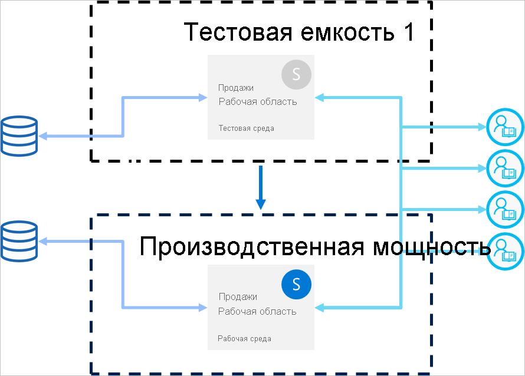

# Рекомендации по конвейерам развертывания

В этой статье приводятся советы и рекомендации для создателей бизнес-аналитики, которые управляют содержимым в течение всего его жизненного цикла. Она посвящена использованию конвейеров развертывания в качестве средства управления жизненным циклом содержимого бизнес-аналитики.

Эта статья состоит из четырех разделов:

* **Подготовка содержимого** — подготовка содержимого к управлению жизненным циклом.

* **Разработка** — лучшие способы создания содержимого на этапе разработки конвейеров развертывания.

* **Тестирование** — как использовать этап тестирования конвейеров развертывания для тестирования среды.

* **Рабочая среда** — использование рабочего этапа конвейеров развертывания, чтобы сделать содержимое доступным для использования.

## Подготовка содержимого

Подготовьте содержимое для непрерывного управления в течение всего жизненного цикла. Прежде чем выполнять действия, описанные ниже, убедитесь, что вы ознакомились со сведениями в этом разделе.

* Освободите содержимое для рабочей среды

* Начните с использования конвейера развертывания для определенной рабочей области

* Опубликуйте свою работу

### Считайте каждую рабочую область полным пакетом средств аналитики

В идеале рабочая область должна содержать полное представление одного аспекта (например, отдела, подразделения, проекта или вертикали) в организации. Это упрощает управление разрешениями для разных пользователей и позволяет управлять выпусками содержимого для всей рабочей области в соответствии с запланированным расписанием.  

Если вы используете [централизованные наборы данных](../connect-data/service-datasets-across-workspaces.md), применяемые по всей организации, рекомендуется создать два типа рабочих областей:

* **Рабочие области моделирования и данных** — эти рабочие области будут содержать все централизованные наборы данных

* **Рабочие области отчетов** — эти рабочие области будут содержать все зависимые отчеты и панели мониторинга

### Планирование модели разрешений

Конвейер развертывания — это объект Power BI с собственными [разрешениями](deployment-pipelines-process.md#permissions). Кроме того, конвейер содержит рабочие области с собственными разрешениями.

Чтобы реализовать безопасный и простой рабочий процесс, определитесь, кто получит доступ к каждой части конвейера. Ниже приведены рекомендации, которые следует учитывать.

* Кто должен иметь доступ к конвейеру?

* Какие операции должны выполнять пользователи с доступом к конвейеру на каждом этапе?

* Кто просматривает содержимое на этапе тестирования?

* Должны ли пользователи этапа тестирования иметь доступ к конвейеру?

* Кто будет следить за развертыванием на рабочем этапе?

* Какую рабочую область вы назначаете?

* На какой этап вы назначаете рабочую область?

* Нужно ли вносить изменения в разрешения назначаемой рабочей области?

### Подключение разных этапов к разным базам данных

Рабочая база данных всегда должна быть стабильной и доступной. Лучше не перегружать ее запросами, которые формируют создатели бизнес-аналитики для своих наборов данных при разработке или тестировании. Для разработки и тестирования создавайте отдельные базы данных. Это помогает защитить рабочие данные и не перегружать базу данных разработки использованием всего объема рабочих данных, что может замедлить работу.

>[!NOTE]
>Если ваша организация использует [общие централизованные наборы данных](../connect-data/service-datasets-share.md), эту рекомендацию можно пропустить.

### Использование параметров в модели

Так как вы не можете редактировать источники данных в службе Power BI, рекомендуется использовать [параметры](/power-query/power-query-query-parameters) для хранения сведений о соединении, таких как имена экземпляров и имена баз данных, вместо использования статической строки подключения. Это позволяет на более поздней стадии управлять подключениями через веб-портал службы Power BI или [с помощью API](/rest/api/power-bi/datasets/updateparametersingroup).

В конвейерах развертывания можно настроить правила параметров, чтобы задать определенные значения для этапов разработки, тестирования и рабочем этапе.

Если для строки подключения параметры не используются, можно определить правила источника данных, чтобы задать строку подключения для данного набора данных. Однако в конвейерах развертывания эта возможность поддерживается не для всех источников данных. Чтобы проверить, можно ли настроить правила для источника данных, см. раздел [ограничения на правила для набора данных](deployment-pipelines-get-started.md#dataset-rule-limitations).

У параметров есть и другие применения, такие как внесение изменений в запросы, фильтры и текст, отображаемый в отчете.

## Разработка

В этом разделе даются рекомендации по работе с этапом разработки конвейеров развертывания.

### Использование Power BI Desktop для изменения отчетов и наборов данных

Power BI Desktop можно использовать в качестве локальной среды разработки. Power BI Desktop позволяет опробовать, исследовать и исправлять обновления для отчетов и наборов данных. Как только это будет сделано, работы новую версию можно отправить на этап разработки. Файлы PBIX рекомендуется изменять на рабочем столе (а не в службе Power BI) по таким причинам:

* Проще совместно работать с авторами в одном и том же PBIX-файле, когда все изменения выполняются в одном и том же инструменте.

 * При внесении изменений через Интернет, после загрузки PBIX-файла и последующей его передаче обратно создаются дубликаты отчетов и наборов данных.

* Вы можете использовать систему управления версиями для обновления PBIX-файлов.

### Управление версиями для PBIX-файлов

Если вы хотите управлять журналом версий отчетов и наборов данных, используйте автоматическую синхронизацию [Power BI с OneDrive](../connect-data/service-connect-to-files-in-app-workspace-onedrive-for-business.md). При этом файлы будут обновлены до последней версии. Такой метод при необходимости также позволит получить более старые версии.

>[!NOTE]
>Используйте автоматическую синхронизацию с OneDrive (или любым другим репозиторием) только для PBIX-файлов на этапе разработки конвейеров развертывания. Не синхронизируйте PBIX-файлы в конвейерах развертывания на тестовых и рабочих этапах. Это приведет к проблемам с развертыванием содержимого в конвейере.

### Отделение разработки моделирования от разработки отчетов и панелей мониторинга

Для развертываний в масштабах предприятия рекомендуется разделять разработку наборов данных и разработку отчетов и панелей мониторинга. Чтобы распространить изменения только на отчет или набор данных, используйте параметр выборочного развертывания конвейеров развертывания.  

Этот метод следует реализовать с помощью Power BI Desktop, создавая отдельные PBIX-файлы для наборов данных и отчетов. Например, можно создать PBIX-файл набора данных и передать его на этап разработки. Позже авторы отчетов могут создать PBIX-файл только для отчета и [подключить его к опубликованному набору данных](../connect-data/service-datasets-discover-across-workspaces.md), используя активное подключение. Эта методика позволяет различным авторам работать с моделированием и визуализациями отдельно, а затем развертывать их в рабочей среде независимо друг от друга.

Для [общих наборов данных](../connect-data/service-datasets-share.md) этот метод можно также использовать в рабочих областях.

### Управление моделями с помощью возможностей чтения и записи XMLA

Разделение разработки моделирования и разработки отчетов и панелей мониторинга позволяет использовать дополнительные возможности, такие как система управления версиями, слияние изменений и автоматизированные процессы. Эти изменения должны выполняться на этапе разработки, чтобы затем окончательное содержимое можно было развернуть на этапе тестирования и рабочем этапе. Это позволяет вносить изменения в единый процесс с другими зависимыми элементами перед их развертыванием на рабочем этапе.

Разработку моделирования можно отделить от разработки визуализаций, управляя [общим набором данных](../connect-data/service-datasets-share.md) во внешней рабочей области используя возможности чтения и записи XMLA. Общий набор данных может подключаться к нескольким отчетам в различных рабочих областях, управляемых в нескольких конвейерах.

## Проверить

В этом разделе даются рекомендации по работе с этапом тестирования конвейеров развертывания.

### Моделирование рабочей среды

Помимо проверки того, хорошо ли выглядят новые отчеты или панели мониторинга, важно понимать, как они выполняются с точки зрения конечного пользователя. Этап тестирования конвейеров развертывания позволяет имитировать реальную рабочую среду для целей тестирования.

Убедитесь, что в тестовой среде следующие три фактора учтены:

* Объем данных:

* Объем использования

* Емкость аналогичная той, что и в рабочей среде

При тестировании можно использовать ту же емкость, что и на рабочем этапе. Однако это может привести к нестабильной работе во время нагрузочного тестирования. Чтобы избежать нестабильной рабочей среды, используйте для тестирования другую емкость, аналогичную емкости ресурсов в рабочей среде. Чтобы избежать дополнительных затрат, можно использовать [емкости Azure класса A](../developer/embedded/azure-pbie-create-capacity.md), чтобы заплатить только за время тестирования.

### Использование правил набора данных с реальным источником данных

Если вы используете этап тестирования для имитации использования данных в реальном времени, рекомендуется отделить источники данных для разработки и тестирования. База данных разработки должна быть относительно небольшой, а тестовая база данных должна быть как можно более похожа на рабочую базу данных. Используйте [правила источника данных](deployment-pipelines-get-started.md#step-4---create-dataset-rules) для переключения источников данных на этапе тестирования.

Управление объемом данных, импортируемых из источника данных, полезно, если вы используете рабочий источник данных на этапе тестирования. Для этого добавьте параметр в запрос к источнику данных в Power BI Desktop. Используйте правила параметров для управления объемом импортируемых данных или изменения значения параметра.
Этот подход также можно использовать, если вы не хотите перегружать емкость.

### Показатель производительности

При моделировании рабочего этапа [проверьте загрузку и взаимодействия отчета](../guidance/monitor-report-performance.md) и выясните, влияют ли на них внесенные изменения.

Кроме того, необходимо [отслеживать нагрузку на емкость](../admin/service-admin-premium-monitor-capacity.md), чтобы можно было перехватывать экстремальные нагрузки до достижения ими рабочей среды.  

>[!NOTE]
>Рекомендуется наблюдать за загрузкой емкости после развертывания обновлений на рабочем этапе.

### Проверка связанных элементов

На связанные элементы могут влиять изменения наборов данных или отчетов. Во время тестирования убедитесь, что изменения не влияют на производительность существующих элементов, которые могут зависеть от обновленных данных.

Связанные элементы можно легко найти с помощью [представления происхождения](../collaborate-share/service-data-lineage.md) рабочей области.

### Тестирование приложения

Если содержимое распространяется для конечных пользователей через приложение, проверьте новую версию приложения, прежде чем оно попадет в рабочую среду. Каждый этап конвейера развертывания имеет собственную рабочую область, поэтому вы можете легко публиковать и обновлять приложения для этапов разработки и тестирования. Это позволит протестировать приложение с точки зрения конечного пользователя.

>[!IMPORTANT]
>Процесс развертывания не включает в себя обновление содержимого или параметров приложения. Чтобы применить изменения к содержимому или параметрам, необходимо вручную обновить приложение на требуемом этапе конвейера.

## Рабочая среда

В этом разделе даются рекомендации по этапам развертывания конвейеров.

### Управление пользователями, которые могут выполнять развертывание в рабочей среде

Поскольку следует быть внимательным при развертывании в рабочей среде, рекомендуется позволять управлять этой конфиденциальной операцией только определенным людям. Однако, возможно, вам нужно, чтобы все создатели бизнес-аналитики для определенной рабочей области имели доступ к конвейеру. Это можно контролировать с помощью [разрешений рабочей области](deployment-pipelines-process.md#permissions).  

Чтобы развернуть содержимое между этапами, пользователям необходимо иметь права участника или администратора для обоих этапов. Убедитесь, что только те пользователи, которые должны выполнять развертывание на рабочем этапе, имеют разрешения для этой рабочей области. Другие пользователи могут иметь роль участника рабочей области или роли зрителя. Они смогут просматривать содержимое в конвейере, но не смогут выполнять развертывание в нем.

Кроме того, необходимо ограничить доступ к конвейеру, только включив разрешения конвейера для пользователей, которые являются частью процесса создания содержимого.

### Настройка правил для обеспечения доступности рабочего этапа

[Правила набора данных](deployment-pipelines-get-started.md#step-4---create-dataset-rules) позволяют обеспечить постоянное подключение и доступность данных в рабочей среде для пользователей. После применения правил набора данных развертывания могут выполняться, когда гарантируется, что конечные пользователи без труда увидят соответствующую информацию.

Убедитесь, что заданы правила рабочего набора данных для источников данных и параметров, определенных в наборе данных.

### Обновление рабочего приложения

При развертывании в конвейере обновляется содержимое рабочей области, но соответствующее приложение не обновляется автоматически. Если вы используете приложение для распространения содержимого, не забудьте обновить приложение после развертывания в рабочей среде, чтобы конечные пользователи сразу же могли использовать последнюю версию.  

### Быстрые исправления для содержимого

Если в рабочей среде есть ошибки, требующие быстрого исправления, не следует выгружать новую версию PBIX-файла непосредственно на рабочий этап или вносить оперативное изменение в службе Power BI. Обратное развертывание в этапы тестирования и разработки невозможно, если эти этапы уже содержат содержимое. Более того, развертывание исправления без предварительного тестирования является неправильным подходом. Таким образом, правильный способ решить эту проблему — реализовать исправление на этапе разработки и отправить его на остальные этапы конвейера развертывания. Это позволяет проверить работу исправления перед развертыванием в рабочей среде. Развертывание в конвейере занимает всего несколько минут.

## Дальнейшие действия

>[!div class="nextstepaction"]
>[Общие сведения о конвейерах развертывания](deployment-pipelines-overview.md)

>[!div class="nextstepaction"]
>[Начало работы с конвейерами развертывания](deployment-pipelines-get-started.md)

>[!div class="nextstepaction"]
>[Общие сведения о процессе конвейеров развертывания](deployment-pipelines-process.md)

>[!div class="nextstepaction"]
>[Устранение неполадок конвейеров развертывания](deployment-pipelines-troubleshooting.md)