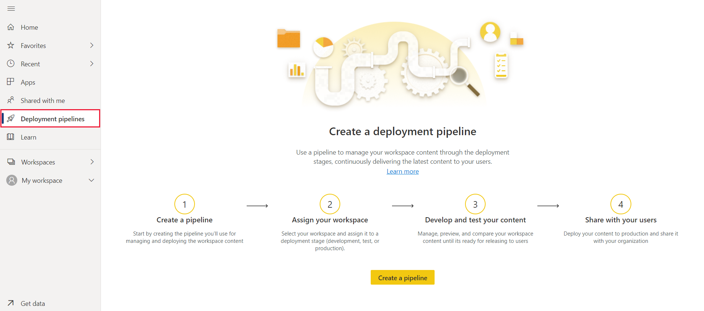
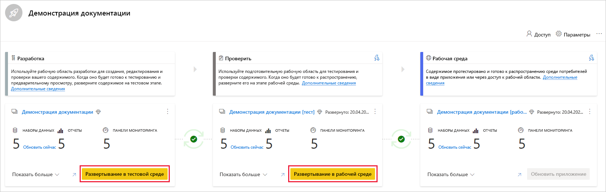
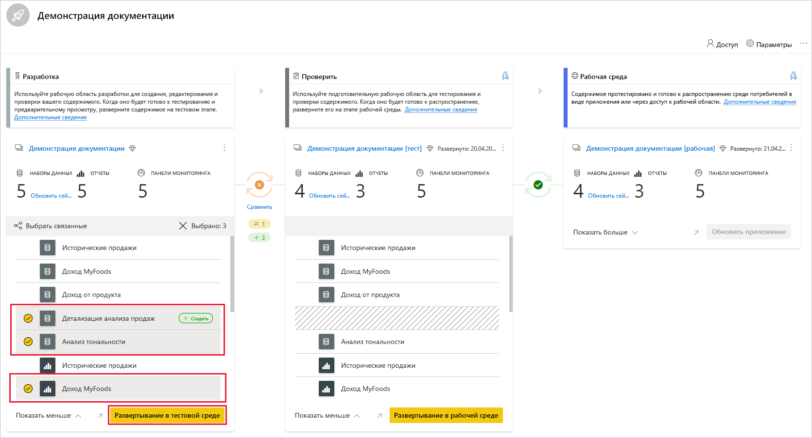
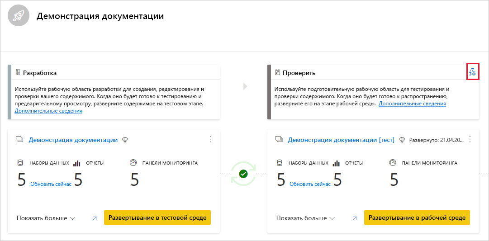
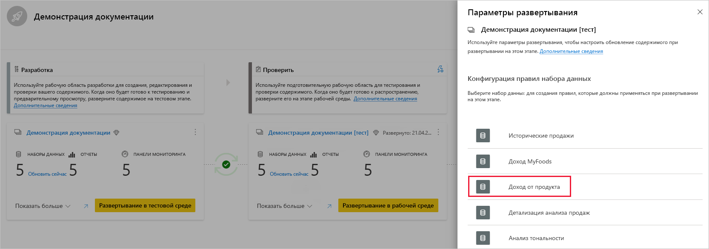

# Начало работы с конвейерами развертывания (предварительная версия)

В этой статье описываются основные параметры, необходимые для использования конвейеров развертывания.

## Доступ к конвейерам развертывания

Вы сможете получить доступ к компоненту конвейеров развертывания, если выполняются условия, перечисленные ниже.

* Вы являетесь пользователем [Power BI Pro](../admin/service-admin-purchasing-power-bi-pro.md).

* Вы принадлежите к организации, использующей емкость Premium.

* Вы являетесь администратором [новых возможностей рабочей области](../collaborate-share/service-create-the-new-workspaces.md).

>[!NOTE]
> Вы также увидите кнопку конвейеров развертывания, если ранее вы создали конвейер или вам предоставили доступ к конвейеру.

## Шаг 1. Создание конвейера развертывания

Чтобы создать конвейер развертывания, выполните следующие действия.

1. В службе Power BI в области навигации выберите **Конвейеры развертывания** и щелкните **Создать конвейер**.

2. В диалоговом окне *Создание конвейера развертывания* введите имя и описание конвейера, а затем щелкните **Создать**.

После создания конвейера можно предоставить другим пользователям общий доступ к нему или удалить его. При совместном использовании конвейера с другими пользователями для предоставления общего доступа к конвейеру будет предоставлен также [доступ к конвейеру](deployment-pipelines-process.md#user-with-pipeline-access). Доступ к конвейеру позволяет пользователям просматривать, совместно использовать, изменять и удалять конвейер.

## Шаг 2. Назначение рабочей области для конвейера развертывания

После создания конвейера необходимо добавить содержимое, которое будет направляться в конвейер. Добавление содержимого в конвейер выполняется путем назначения рабочей области этапу конвейера. Рабочую область можно назначить любому этапу. 

Вы можете назначить одну рабочую область в конвейер развертывания. Конвейеры развертывания создают клоны содержимого рабочей области, которые будут использоваться на разных этапах конвейера.

Чтобы назначить рабочую область в конвейер развертывания, выполните следующие действия.

1. В созданном конвейере развертывания щелкните **Назначение рабочей области**.

2. В раскрывающемся меню *Выбор рабочей области* выберите рабочую область, которую нужно назначить конвейеру.

3. Выберите этап, которому нужно назначить рабочую область.

### Ограничения на назначения рабочей области

* Рабочая область должна быть [новой рабочей областью](../collaborate-share/service-create-the-new-workspaces.md).

* Вы должны быть администратором рабочей области.

* Рабочая область не должна быть назначена ни одному другому конвейеру.

* Рабочая область должна находиться в  [емкости Premium](../admin/service-premium-what-is.md).

* Невозможно назначить рабочую область с [примерами для Power BI](../create-reports/sample-datasets.md) этапу конвейера.

>[!NOTE]
>В списке выбираемых рабочих областей будут показаны только рабочие области, которые можно использовать с конвейерами развертывания.

## Шаг 3. Развертывание на пустом этапе

Любой пользователь [Pro](../admin/service-admin-purchasing-power-bi-pro.md), который является участником или администратором в исходной рабочей области, может развернуть содержимое на пустом этапе (на этапе, в котором нет содержимого). Для завершения развертывания рабочая область должна находиться в емкости.

При развертывании содержимого на пустом этапе связи между элементами сохраняются. Например, отчет, привязанный к набору данных на исходном этапе, будет клонирован вместе с набором данных, и клоны будут точно так же привязаны в целевой рабочей области.

После завершения развертывания обновите набор данных. Дополнительные сведения см. в разделе [Развертывание содержимого на пустом этапе](deployment-pipelines-process.md#deploying-content-to-an-empty-stage).

### Развертывание всего содержимого

Выберите этап для развертывания и нажмите кнопку развертывания. В процессе развертывания создается дубликат рабочей области на целевом этапе. Эта рабочая область содержит все содержимое, существующее на текущем этапе.

### Выборочное развертывание

Чтобы развернуть только определенные элементы, щелкните ссылку **Показать больше** и выберите элементы, которые требуется развернуть. При нажатии кнопки развертывания на следующий этап развертываются только выбранные элементы.

Так как панели мониторинга, отчеты и наборы данных связаны и имеют зависимости, можно нажать кнопку "Выбрать связанные", чтобы выбрать все зависимые элементы. Например, если вы хотите развернуть отчет на следующем этапе, при нажатии кнопки "Выбрать связанные" будет отмечен набор данных, к которому подключен отчет, так что оба они будут развернуты одновременно и отчет не будет прерываться.

>[!NOTE]
> * Вы не можете развернуть отчет или панель мониторинга на следующем этапе, если элементы, от которых он зависит, не существуют на этапе, в который выполняется развертывание.
> * Если вы решили развернуть отчет или панель мониторинга без набора данных, результат может быть непредвиденным. Это может произойти, когда набор данных на целевом этапе изменяется и больше не идентичен исходному набору на этапе, с которого выполняется развертывание.

### Обратное развертывание

Вы также можете выполнить развертывание на предыдущий этап, например в сценарии, когда вы назначаете существующую рабочую область на рабочем этапе, а затем развертываете ее обратно, сначала на этапе тестирования, а затем — на этапе разработки.

Развертывание на предыдущем этапе работает только в том случае, если на предыдущем этапе нет содержимого. При развертывании на предыдущем этапе нельзя выбрать лишь некоторые элементы. Развернуто будет все содержимое на этом этапе.

## Шаг 4. Создание правил набора данных

При работе в конвейере развертывания разные этапы могут иметь разные конфигурации. Например, на каждом этапе могут быть разные базы данных или разные параметры запросов. На этапе разработки может запрашиваться выборка данных из базы данных, а на этапах тестирования и производства — запрашиваться вся база данных.

При развертывании содержимого между стадиями конвейера настройка правил набора данных позволяет разрешить внесение изменений в содержимое, оставляя при этом некоторые параметры неизменными.

Правила набора данных определяются в источниках данных и параметрах в каждом наборе данных. Они определяют значения источников данных или параметров для определенного набора данных. Например, если требуется, чтобы набор данных на рабочем этапе указывал на рабочую базу данных, можно определить правило для этого. Правило определяется на рабочем этапе в соответствующем наборе данных. После определения правила содержимое, развернутое из тестовой в рабочую среду, будет наследовать значение, определенное в правилах набора данных, и будет применяться всегда, пока правило остается неизменным и действительным.

>[!NOTE]
> Правила набора данных работают только в том случае, если исходный и целевой источники данных имеют один и тот же тип.

### Создание набора данных

1. На этапе конвейера, для которого необходимо создать правило набора данных, щелкните **Параметры развертывания**.

    

2. В области "Параметры развертывания" выберите набор данных, для которого нужно создать правило.

    

3. Выберите тип правила, которое необходимо создать, разверните список и щелкните **Создать правило**.

     

### Типы правил наборов данных

Существует два типа создаваемых правил.

* **Правила источника данных**. Список источников данных берется из набора данных на этапе исходного конвейера. В списке источников данных выберите источник данных, который требуется заменить. Используйте один из следующих методов, чтобы выбрать заменяемое на исходном этапе значение:

    1. Выберите из списка.

    2. Щелкните **Еще** и вручную добавьте новый источник данных. Заменить источник данных можно только источником того же типа.

* **Правила параметров**. Выберите параметр из списка параметров — на экране показано текущее значение. Измените значение на значение, которое должно вступать в силу после каждого развертывания.

### Ограничения на правила для наборов данных

* Для создания правила набора данных необходимо быть владельцем набора данных.

* Правила набора данных не могут быть созданы на этапе разработки.

* При удалении элемента его правила также удаляются. Восстановить эти правила невозможно.

* Если источник данных или параметры, определенные в правиле, изменяются или удаляются из исходного набора данных, правило будет недействительным, а развертывание завершится ошибкой.

* Правила параметров нельзя определить для параметров типа *Любой* или *Двоичный*. Дополнительные сведения см. в статье об [ограничениях параметров обновления наборов данных](https://docs.microsoft.com/rest/api/power-bi/datasets/updateparameters).

* Правила источников данных могут быть определены только для следующих источников данных:
    * Azure Analysis Services
    * Службы SQL Server Analysis Services (SSAS)
    * Azure SQL Server;
    * SQL Server
    * Веб-канал OData
    * Oracle;
    * SapHana (поддерживается только в режиме импорта, а не в режиме прямого запроса);
    * SharePoint
    * Teradata

    Для других источников данных рекомендуется [использовать параметры для настройки своего источника данных](deployment-pipelines-best-practices.md#use-parameters-in-your-model).

## Шаг 5. Развертывание содержимого с одного этапа на другой

Когда содержимое находится на стадии конвейера, его можно развернуть на следующем этапе. Развертывание содержимого на другом этапе обычно выполняется после выполнения некоторых действий в конвейере. Например, внесены изменения в разработку содержимого на этапе разработки или тестируется содержимое на этапе тестирования. Типичный рабочий процесс перемещения содержимого с этапа на этап — с этапа разработки на этап тестирования, а затем — с этапа тестирования на рабочий этап. Дополнительные сведения об этом процессе можно узнать в разделе [Развертывание содержимого в существующей рабочей области](deployment-pipelines-process.md#deploy-content-to-an-existing-workspace).

Чтобы развернуть содержимое на следующем этапе конвейера развертывания, нажмите кнопку "Развернуть" в нижней части этапа.

При просмотре карт тестового и рабочего этапа можно увидеть время последнего развертывания. Это время последнего развертывания содержимого на этом этапе.

Время развертывания позволяет узнать момент последнего обновления этапа. Оно также может быть полезно, если необходимо отследить время между тестовой и рабочей средами.

## Сравнение этапов

При наличии у содержимого на двух последовательных этапах содержимое сравнивается на основе метаданных элементов содержимого. В этом сравнении не учитываются данные или время обновления между этапами.

 

Чтобы дать наглядное представление о различиях между двумя последовательными этапами, между ними отображается значок индикатора сравнения. Индикатор сравнения имеет два состояния:

* **зеленый индикатор** — метаданные каждого элемента содержимого на обоих этапах одинаковы.

* **оранжевый индикатор** — появляется при выполнении одного из следующих условий:
    * некоторые элементы содержимого на каждом этапе были изменены или обновлены (имеют разные метаданные);
    * количество элементов между этапами различается.

Если два последовательных этапа не совпадают, под оранжевым значком сравнения отображается ссылка **Сравнить**. Щелкнув ссылку, вы откроете список элементов содержимого на обоих этапах в представлении сравнения. Представление сравнения помогает отслеживать изменения или различия между элементами на каждом этапе конвейера. Измененные элементы получают одну из следующих меток:

* **Новый** — новый элемент на исходном этапе. Это элемент, которого не существует на целевом этапе. После развертывания этот элемент будет клонирован на целевой этап.

* **Отличается** — элемент, который существует как на исходном, так и на целевом этапе, а одна из версий была изменена после последнего развертывания. После развертывания элемент на исходном этапе будет перезаписывать элемент на целевом этапе независимо от того, где было внесено изменение.

* **Отсутствует в** — эта метка указывает, что элемент отображается на целевом этапе, а на исходном этапе — нет.

    >[!NOTE]
    >Развертывание не повлияет на элементы с меткой *Отсутствует в*.

 

## Переопределение содержимого

При развертывании после внесения изменений в содержимое на исходном этапе, содержимое, измененное на целевом этапе, будет перезаписано. После нажатия кнопки *Развернуть* вы получите предупреждение с перечнем элементов, которые будут перезаписаны.

Узнать больше о том, [какие элементы копируются на следующий этап](deployment-pipelines-process.md#deployed-items), а [какие элементы не копируются](deployment-pipelines-process.md#unsupported-items), можно в разделе [Ознакомление с процессом развертывания](deployment-pipelines-process.md).

## Дальнейшие действия

>[!div class="nextstepaction"]
>[Общие сведения о конвейерах развертывания](deployment-pipelines-overview.md)

>[!div class="nextstepaction"]
>[Общие сведения о процессе конвейеров развертывания](deployment-pipelines-process.md)

>[!div class="nextstepaction"]
>[Устранение неполадок конвейеров развертывания](deployment-pipelines-troubleshooting.md)

>[!div class="nextstepaction"]
>[Советы и рекомендации по конвейерам развертывания](deployment-pipelines-best-practices.md)