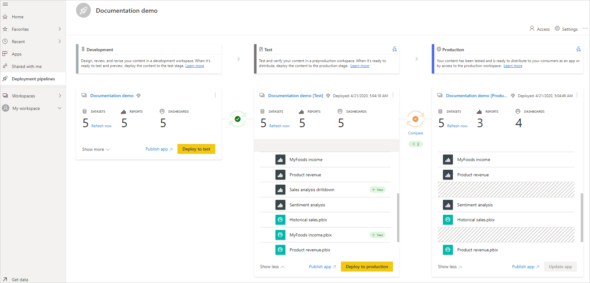

# Общие сведения о конвейерах развертывания

В современном мире аналитика является важной частью принятия решений практически во всех организациях. Возрастающее использование Power BI в качестве аналитического инструмента требует от него использования большего количества данных, привлекательного вида и удобства в использовании. Кроме того, служба Power BI должна быть всегда доступной и надежной. Для удовлетворения этих требований создатели бизнес-аналитики должны эффективно выполнять совместную работу.

С помощью конвейеров развертывания авторы бизнес-аналитики могут управлять жизненным циклом содержимого организации. Средство является эффективным и может использоваться для авторов на предприятии с емкостью Premium. Это средство позволяет авторам разрабатывать и тестировать содержимое Power BI до того, как оно будет использовано пользователями. К типам содержимого относятся отчеты, панели мониторинга и наборы данных.

Этот инструмент разработан как конвейер с тремя этапами:

* **Разработка**
    
    Этот этап используется для проектирования, сборки и передачи нового содержимого вместе с коллегами-разработчиками. Это первый этап в конвейерах развертывания.

* **Проверка**

    После внесения всех изменений в содержимое вы сможете войти в этап тестирования. Вы отправляете измененное содержимое, чтобы его можно было переместить на этот этап тестирования. Ниже приведены три примера того, что можно сделать в тестовой среде.

    * Совместное использование содержимого с испытателями и рецензентами

    * Загрузка и выполнение тестов с большими объемами данных

    * Тестирование приложения, чтобы увидеть, как оно будет выглядеть для пользователей

* **Рабочий этап**

    После тестирования содержимого используйте рабочий этап для совместного использования окончательной версии содержимого с бизнес-пользователями в организации.

## Дальнейшие действия

>[!div class="nextstepaction"]
>[Начало работы с конвейерами развертывания](deployment-pipelines-get-started.md)

>[!div class="nextstepaction"]
>[Общие сведения о процессе конвейеров развертывания](deployment-pipelines-process.md)

>[!div class="nextstepaction"]
>[Устранение неполадок конвейеров развертывания](deployment-pipelines-troubleshooting.md)

>[!div class="nextstepaction"]
>[Советы и рекомендации по конвейерам развертывания](deployment-pipelines-best-practices.md)
