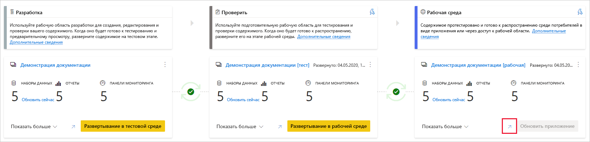
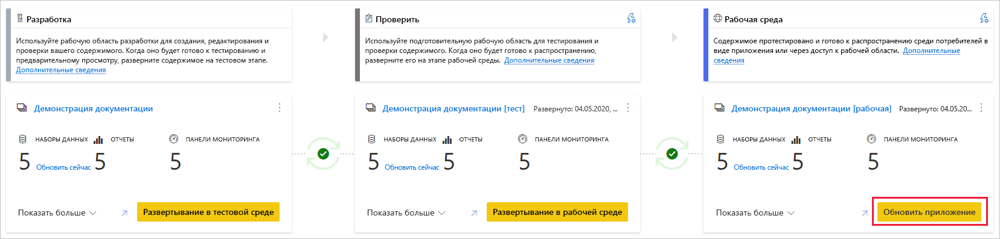

# Общие сведения о процессе развертывания (предварительная версия)

Процесс развертывания позволяет клонировать содержимое из одного этапа в конвейере в другой, обычно из разработки в тестирование и из тестирования в рабочий этап.

Во время развертывания Power BI копирует содержимое из текущего этапа в целевой. Соединения между копируемыми элементами сохраняются во время процесса копирования. Power BI также применяет настроенные правила набора данных к обновленному содержимому на целевом этапе. Развертывание содержимого может занять некоторое время в зависимости от числа развертываемых элементов. В течение этого времени можно переходить к другим страницам на портале Power BI, но нельзя использовать содержимое на целевом этапе.

## Развертывание содержимого на пустом этапе

Когда вы выполняете развертывание содержимого на пустом этапе, метаданные отчетов, панелей мониторинга и наборов данных в рабочей области, из которой выполняется развертывание, копируются на этап, в который выполняется развертывание. Новая рабочая область для этапа в который вы выполнили развертывание создается в емкости Premium.

Существует два способа развертывания содержимого с одного этапа на следующий. Вы можете развернуть все содержимое или [выбрать элементы содержимого для развертывания](deployment-pipelines-get-started.md#selective-deployment).

Содержимое также можно развернуть в обратном направлении с более поздней стадии конвейера развертывания на более раннюю.

После завершения развертывания обновите наборы данных, чтобы можно было использовать только что скопированное содержимое. Обновление набора данных является обязательным, так как данные не копируются из одного этапа в другой. Чтобы понять, какие свойства элементов копируются в процессе развертывания, а какие нет, ознакомьтесь с разделом [Свойства элемента, скопированные во время развертывания](#item-properties-copied-during-deployment).

### Создание рабочей области в емкости Premium

При первом развертывании конвейеры развертывания проверяют, есть ли у вас разрешения на емкость Premium.  

Если у вас есть разрешения на емкость, содержимое рабочей области копируется на этап, на который выполняется развертывание, и в емкости Premium создается новая рабочая область для этого этапа.

Если у вас нет разрешений на емкость, рабочая область будет создана, но содержимое не будет скопировано. Вы можете попросить администратора емкости добавить рабочую область в емкость или запросить разрешения на назначение емкости. Позже, когда рабочая область будет назначена емкости, вы сможете развернуть содержимое в этой рабочей области.

### Рабочая область и владение содержимым

Пользователь, выполняющий развертывание, автоматически становится владельцем клонированных наборов данных и единственным администратором новой рабочей области.

## Развертывание содержимого в существующей рабочей области

Развертывание содержимого в рабочем конвейере в рабочей области, которая имеет существующую рабочую область, включает в себя следующее:

* Развертывание нового содержимого в дополнение к этапу, который уже содержит содержимое.

* Новое содержимое, развернутое для замены старого содержимого на текущем рабочем этапе.

### Процесс развертывания

Содержимое с текущего этапа копируется на целевой этап. Power BI определяет существующее содержимое на целевом этапе и перезаписывает его. Чтобы указать, какой элемент содержимого необходимо перезаписать, конвейеры развертывания используют соединение между родительским элементом и его клонами. Это подключение сохраняется при создании нового содержимого. Операция перезаписи перезаписывает только содержимое элемента. Идентификатор и URL-адрес элемента, а также разрешения остаются без изменений.

На целевом этапе [свойства элемента, которые не копируются](deployment-pipelines-process.md#item-properties-that-are-not-copied), остаются в том виде, в котором они были до развертывания. Новое содержимое и новые элементы копируются с текущего этапа на целевой.

### Обновление набора данных

Данные в целевом наборе данных сохраняются по возможности. Если набор данных не содержит изменений, данные сохраняются в том виде, в котором они были до развертывания.

При небольших изменениях, например при добавлении таблицы или мер, Power BI сохраняет исходные данные, а обновление оптимизировано для обновления только необходимых данных. Для критических изменений схемы или изменения соединения с источником данных требуется полное обновление.

### Требования к развертыванию в этапе с существующей рабочей областью

Если развернутое содержимое находится в [емкости premium](../admin/service-premium-what-is.md), пользователь, выполнивший следующие условия, может развернуть его в этапе с существующей рабочей областью:

* [Пользователь Pro](../admin/service-admin-purchasing-power-bi-pro.md), который является членом обеих рабочих областей на исходном и целевом этапах развертывания.

* Владелец всех наборов данных в целевой рабочей области, которые будут развернуты.

Дополнительные сведения см. в разделе [Разрешения](#permissions).

## Развернутые элементы

При развертывании содержимого из одного этапа конвейера в другое, скопированное содержимое включает следующие элементы Power BI:

* Наборы данных

* Отчеты

* Панели мониторинга

### Неподдерживаемые элементы

Конвейеры развертывания не поддерживают следующие элементы:

* Данные, которые не являются производными от .pbix

* Отчеты, основанные на неподдерживаемых наборах данных

* В рабочей области нельзя использовать шаблонное приложение

* Отчеты с разбиением на страницы

* Потоки данных

* наборы данных рush-уведомлений

* Workbooks

## Свойства элемента, скопированные во время развертывания

Во время развертывания следующие свойства элемента копируются и перезаписывают свойства элемента на целевом этапе.

* Источники данных (поддерживаются [правила набора данных](deployment-pipelines-get-started.md#step-4---create-dataset-rules))

* Параметры (поддерживаются [правила набора данных](deployment-pipelines-get-started.md#step-4---create-dataset-rules))

* Визуальные элементы отчетов

* Страницы отчета

* Плитки панели мониторинга

* Метаданные модели

* Связи между элементами

### Свойства элементов, которые не копируются

Следующие свойства элемента не копируются во время развертывания:

* данные — данные не копируются, копируются только метаданные;

* URL-адрес

* ID

* разрешения — для рабочей области или определенного элемента;

* параметры рабочей области — у каждого этапа есть собственная рабочая область;

* Содержимое и параметры приложения — сведения о развертывании приложений см. в разделе [Развертывание приложений Power BI](#deploying-power-bi-apps)

Следующие свойства набора данных также не копируются во время развертывания:

* Назначение роли
    
* Расписание обновления
    
* учетные данные источника данных;
    
* Параметры кэширования запросов (могут унаследоваться от емкости)
    
* Параметры подтверждения

## Развертывание приложений Power BI

[Приложения Power BI](../consumer/end-user-apps.md) являются рекомендуемым способом распространения содержимого среди пользователей бесплатной версии Power BI. Используя конвейеры развертывания, вы сможете управлять приложениями Power BI в конвейере развертывания, чтобы обеспечить более широкие возможности управления и гибкости, когда дело доходит до жизненного цикла приложения.

Создайте приложение для каждого этапа конвейера развертывания, чтобы можно было протестировать каждое обновление приложения с точки зрения пользователя. Конвейер развертывания позволяет легко управлять этим процессом. Используйте кнопку "Опубликовать" или "Просмотреть" на карте рабочей области, чтобы опубликовать или просмотреть приложение на определенном этапе конвейера.

На рабочем этапе главная кнопка действия в нижнем левом углу открывает страницу обновления приложения в Power BI, чтобы обновления содержимого стали доступны пользователям приложений.

>[!IMPORTANT]
>Процесс развертывания не включает в себя обновление содержимого или параметров приложения. Чтобы применить изменения к содержимому или параметрам, необходимо вручную обновить приложение на требуемом этапе конвейера.

## Разрешения

Разрешения конвейера и разрешения рабочей области предоставляются и управляются отдельно. Например, пользователь с доступом к конвейеру, у которого нет разрешений рабочей области, сможет просматривать конвейер и предоставлять к нему общий доступ другим пользователям. Однако этот пользователь не сможет просматривать содержимое рабочей области в конвейере или на странице рабочей области и не сможет выполнять развертывания.

### Пользователь с доступом к конвейеру

Пользователи с доступом к конвейеру имеют следующие разрешения:

* Просмотр конвейера
    
* Совместное использование конвейера с другими пользователями
    
* Изменение и удаление конвейера

>[!NOTE]
>Доступ к конвейеру не предоставляет разрешения на просмотр содержимого рабочей области или на выполнение действий с ним.

### Средство просмотра рабочей области

Средства просмотра рабочей области, которые имеют *доступ к конвейеру*, также могут выполнять приведенные ниже действия.

* Использование содержимого

>[!NOTE]
>Средства просмотра рабочей области не могут получить доступ к набору данных или изменять содержимое рабочей области.

### Участник рабочей области

Участники рабочей области, которые имеют *доступ к конвейеру*, также могут выполнять приведенные ниже действия.

* Использование содержимого

* Сравнение этапов

* Просмотреть наборы данных

### Участник рабочей области

Участники рабочей области, которые имеют *доступ к конвейеру*, также могут выполнять приведенные ниже действия.

* Просмотр содержимого рабочей области
    
* Сравнение этапов
    
* Развертывание отчетов и панелей мониторинга

* Удаление рабочих областей

### Администратор рабочей области

Администраторы рабочей области, у которых есть *доступ к конвейеру*, могут выполнять действия *участников рабочей области*, а также выполнять приведенные ниже действия.

* Назначить рабочие области

* Удаление рабочих областей

### Владелец набора данных

Владельцы наборов данных, являющиеся членами рабочей области или администраторами, а также могут выполнять приведенные ниже действия.

* Обновление наборов данных
    
* Настройка правил

>[!NOTE]
>В этом разделе описываются разрешения пользователей в конвейерах развертывания. Разрешения, перечисленные в этом разделе, могут иметь разные применения в других компонентах Power BI.

## Ограничения

В этом разделе перечислены большинство ограничений в конвейерах развертывания.

* Рабочая область должна находиться в  [емкости Premium](../admin/service-premium-what-is.md).

* Элементы Power BI, такие как [метки чувствительности](../admin/service-security-data-protection-overview.md#sensitivity-labels-in-power-bi) отчетов и панели мониторинга Power BI, не могут быть развернуты.

* Максимальное число элементов Power BI в одном развертывании равно 300.

* Список ограничений рабочей области см. в разделе [Ограничения для назначений рабочей области](deployment-pipelines-get-started.md#workspace-assignment-limitations).

* Список неподдерживаемых элементов см. в разделе [Неподдерживаемые элементы](#unsupported-items).

### Ограничения наборов данных

* Невозможно развернуть наборы данных, настроенные с помощью [добавочного обновления](../admin/service-premium-incremental-refresh.md).

* Невозможно развернуть наборы данных, использующие подключение к данным в режиме реального времени.

* Если во время развертывания целевой набор данных использует [активное подключение](../connect-data/desktop-report-lifecycle-datasets.md), исходный набор данных также должен использовать этот режим подключения.

* После развертывания скачивание набора данных (из этапа, в котором он был развернут) не поддерживается.

* Список ограничений правил для наборов данных см. в [этом разделе](deployment-pipelines-get-started.md#dataset-rule-limitations).

## Дальнейшие действия

>[!div class="nextstepaction"]
>[Общие сведения о конвейерах развертывания](deployment-pipelines-overview.md)

>[!div class="nextstepaction"]
>[Советы и рекомендации по конвейерам развертывания](deployment-pipelines-best-practices.md)

>[!div class="nextstepaction"]
>[Начало работы с конвейерами развертывания](deployment-pipelines-get-started.md)

>[!div class="nextstepaction"]
>[Устранение неполадок конвейеров развертывания](deployment-pipelines-troubleshooting.md)