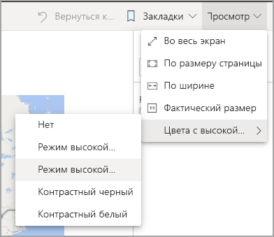
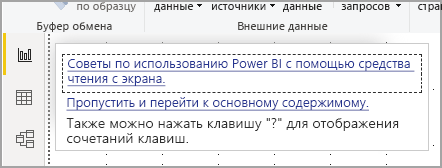
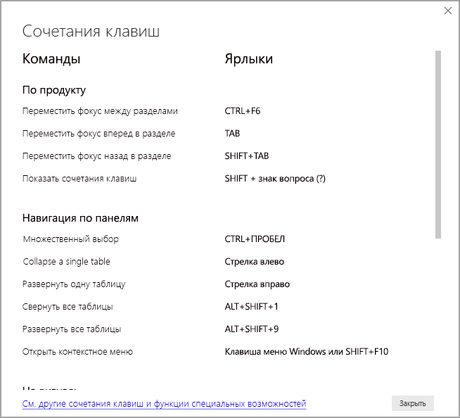
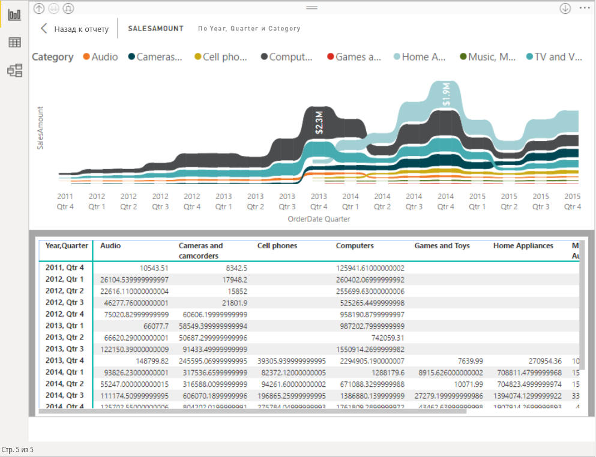

# Использование отчетов Power BI с помощью средств специальных возможностей
В Power BI предусмотрено множество встроенных функций, упрощающих использование отчетов Power BI и работу с ними для людей с ограниченными возможностями. Благодаря этим средствам пользователи смогут получать из отчетов тот же объем информации, что и без применения специальных возможностей.

Для изучения этой статьи вам могут понадобиться некоторые термины:

* **Фокус** — элемент страницы, в котором установлен указатель мыши. Как правило, такой объект выделяется рамкой синего цвета.
* **Холст** — область страницы отчета.

В следующих разделах описываются специальные возможности, доступные для работы с отчетами Power BI.

## Навигация с помощью клавиатуры

Если при запуске Power BI Desktop или службы Power BI нажать клавишу **TAB**, в верхнем правом углу появится подсказка. По приведенной ссылке **Советы по использованию Power BI с помощью средства чтения с экрана** вы сможете перейти к этой статье и ознакомиться с информацией о специальных возможностях для работы с отчетами. Щелкните ссылку **Пропустить и перейти к основному содержимому**, чтобы перейти к холсту отчетов.

Если нажать клавишу **?** , откроется диалоговое окно с описанием основных сочетаний клавиш в Power BI. Чтобы просмотреть полный список сочетаний клавиш, доступных в Power BI, воспользуйтесь ссылкой в нижней части диалогового окна, по которой можно перейти в [соответствующий раздел](desktop-accessibility-keyboard-shortcuts.md) документации по Power BI.

Вы можете переключать фокус между вкладками страницы отчета или объектами на открытой странице отчета с помощью клавиш **CTRL+F6**. Когда фокус находится на загруженной странице отчета, используйте клавишу **TAB**, чтобы смещать фокус на объекты на странице, в частности на текстовые поля, изображения, фигуры и диаграммы. 

Чаще всего в Power BI используются клавиши **ВВОД** (выбор или ввод) и **ESC** (выход).

### Навигация по визуальным элементам с помощью клавиатуры

Разработчики в Power BI часто работают с отчетами, содержащими большие объемы данных. При работе с визуальным элементом поочередно переходить между всеми его элементами с помощью клавиши TAB может быть неудобно. Навигация по визуальным элементам с помощью клавиатуры реализуется на основе трехуровневой иерархии. Ее описание приводится далее.

На первом уровне можно нажать клавиши **CTRL + СТРЕЛКА ВПРАВО**, чтобы зайти в выбранный визуальный элемент. После захода в визуальный элемент можно последовательно переходить между его основным областями с помощью клавиши **TAB**. К доступным для перехода областям относятся область построения данных, категории осей (в соответствующих случаях) и условные обозначения (если визуальный элемент содержит их).

На приведенной ниже анимации показан циклический переход между элементами на первом уровне визуального элемента:

Второй уровень иерархии становится доступен после захода в одну из основных областей (область построения данных, категории оси x или условные обозначения) визуального элемента. При работе с отчетом вы можете зайти в одну из этих основных областей визуального элемента и затем циклически переходить между представленными в ней точками данных или категориями. Выбрав нужную область, нажимайте клавишу **ВВОД** для циклического перехода между содержащимися в ней элементами.

Чтобы выбрать все точки данных в ряду, перейдите к условным обозначениям и нажмите клавишу **ВВОД**. После захода в область условных обозначений вы можете переходить между представленными в ней категориями с помощью клавиши **TAB**. Чтобы выбрать ряд, нажмите клавишу **ВВОД**.

Чтобы выбрать отдельные точки данных в ряде, перейдите в область построения данных и нажмите клавишу **ВВОД**. После захода в эту область вы можете переходить между точками данных с помощью клавиши **TAB**. Если визуальный элемент содержит несколько рядов, для перехода между точками данных в разных рядах можно использовать клавиши со **СТРЕЛКОЙ ВВЕРХ** или **СТРЕЛКОЙ ВНИЗ**.

Чтобы выбрать все точки данных на оси категорий, перейдите в область меток оси и нажмите клавишу **ВВОД**. После захода в эту область вы можете переходить между метками с помощью клавиши **TAB**. Чтобы выбрать метку, нажмите клавишу **ВВОД**.

Чтобы выйти из слоя после перехода в него, нажмите клавишу **ESC**. На приведенной ниже анимации показаны действия входа и выхода для различных уровней визуального элемента с последующим выбором точек данных, меток категорий оси x, переходом к другим рядам, а также выбором всех точек данных в ряду.

Если вам не удается перейти к объекту или визуальному элементу с помощью клавиатуры, возможно, автор отчета исключил его из последовательности перехода. Как правило, это делается для объектов, выполняющих декоративную функцию. Если вы полагаете, что последовательность перехода между элементами отчета реализована нелогично, обратитесь к его разработчику. Авторы отчетов могут определять последовательность перехода между содержащимися в нем объектами и визуальными элементами.

### Навигация по срезам с помощью клавиатуры

Для срезов также реализованы встроенные специальные возможности. При выборе среза, чтобы отрегулировать его значение, пользуйтесь сочетанием клавиш **CTRL+СТРЕЛКА ВПРАВО** для перемещения между различными элементами управления внутри среза. Например, если изначально нажать клавиши **CTRL+СТРЕЛКА ВПРАВО**, фокус окажется на ластике. После этого нажатие клавиши **ПРОБЕЛ** будет равнозначно нажатию кнопки с ластиком, которая стирает все значения в срезе.

Перемещаться между элементами управления в срезе можно с помощью клавиши **TAB**. Если нажать клавишу **TAB** во время работы с ластиком, фокус переместится на кнопку раскрывающегося списка. Следующее нажатие клавиши **TAB** переместит фокус на первое значение среза (при наличии в срезе нескольких значений, например диапазона).

### Переключение страниц

Когда фокус находится на вкладках страницы отчета, используйте клавишу **TAB** или клавиши **со стрелками** для перемещения фокуса с одной страницы отчета на другую. Средство чтения с экрана читает вслух заголовок страницы отчета и сообщает, выбран ли он. Чтобы загрузить страницу отчета, находящуюся в фокусе, используйте клавишу **ВВОД** или **ПРОБЕЛ**.

### Доступ к заголовку визуального элемента
При навигации по визуальным элементам нажмите клавиши **ALT+SHIFT+F10**, чтобы переместить фокус на заголовок визуального элемента. Этот заголовок содержит разные функции, включая сортировку, экспорт данных за пределы диаграммы и режим фокусировки. Набор значков в заголовке визуального элемента зависит от параметров, заданных автором отчета.

## Средство чтения с экрана

При просмотре отчета рекомендуется отключить режим сканирования. Power BI является в большей степени приложением, а не документом, в связи с чем для удобства работы с ним часто настраивается пользовательская структура навигации. Если вы используете средство чтения с экрана для работы с Power BI Desktop, прежде чем открыть Power BI Desktop также следует запустить это средство чтения.

При переходе между объектами средство чтения с экрана озвучивает тип объекта и его название (если оно есть). Кроме того, оно произносит альтернативное описание этого объекта (если автор отчета добавил его).

### Показать данные
Вы можете нажать клавиши **ALT+SHIFT+F11** для вывода доступной версии окна **Отображение данных**. Это окно позволяет просматривать данные в визуальном элементе таблицы HTML с помощью тех же клавиш, которые обычно используются в средстве чтения с экрана.

Функция **Показать данные** представляет собой таблицу HTML и доступна в средстве чтения с экрана только при нажатии этих клавиш. Если открыть функцию **Показать данные** из параметра в заголовке визуального элемента, будет выведена таблица, *не совместимая* со средством чтения с экрана.  Если вы работаете с функцией **Показать данные** с помощью клавиатуры, включите режим сканирования, чтобы использовать все сочетания клавиш вашего средства чтения с экрана.

Чтобы выйти из функции **Показать данные** и вернуться к отчету, нажмите клавишу **ESC**.

## Режимы высокой контрастности

Служба Power BI пытается определить параметры высокой контрастности, выбранные в Windows. Однако эффективность и точность их определения зависит от браузера, в котором используется служба Power BI. Чтобы настроить тему в службе Power BI вручную, можно выбрать **Вид > Цвета с высокой контрастностью**, а затем тему, которую нужно применить к отчету.

## Дальнейшие действия

Ниже перечислены статьи, посвященные специальным возможностям в Power BI:

* [Обзор специальных возможностей в Power BI](desktop-accessibility-overview.md) 
* [Создание отчетов Power BI со специальными возможностями](desktop-accessibility-creating-reports.md) 
* [Специальные возможности для создания отчетов Power BI](desktop-accessibility-creating-tools.md)
* [Сочетания клавиш для специальных возможностей в отчетах Power BI](desktop-accessibility-keyboard-shortcuts.md)
* [Контрольный список специальных возможностей для работы с отчетами](desktop-accessibility-creating-reports.md#report-accessibility-checklist)
