# Специальные возможности для создания отчетов в Power BI

В Power BI имеется множество встроенных средств для тех, кто создает отчеты с помощью специальных возможностей.

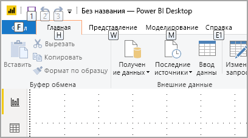

В этой статье описываются различные специальные возможности, доступные создателям отчетов в Power BI Desktop.

## Навигация на уровне приложения
При навигации по Power BI Desktop можно перемещать фокус в основные области приложения, нажимая клавиши **CTRL+F6**. Фокус в Power BI Desktop перемещается в следующем порядке:

1. объекты на холсте;
2. вкладки страниц;
3. открытые области (поочередно слева направо);
4. навигатор по представлению;
5. нижний колонтитул;
6. Войти
7. желтая строка с предупреждениями, ошибками или обновлениями.

Как правило, для выбора области в Power BI используется клавиша **ВВОД**, а для выхода из нее — клавиша **ESC**.

## Навигация по ленте

Нажмите клавишу **ALT**, чтобы увидеть небольшие поля, которые называются *подсказками клавиш*, для каждой команды, доступной в текущем представлении ленты. Затем можно нажать букву, указанную в *подсказке клавиши* над нужной командой. 

Например, на приведенном ниже снимке экрана после нажатия клавиши **ALT** отобразились подсказки клавиш с буквами, соответствующими доступным командам. После нажатия клавиши **M** на ленте откроется вкладка **Моделирование**.

В зависимости от нажатой буквы могут появиться дополнительные подсказки клавиш. Например, если активна вкладка **Главная страница** и вы нажмете букву **W**, отобразится вкладка **Просмотр** с подсказками клавиш для выбора групп на ней. Вы можете продолжать нажимать буквы, указанные в подсказках клавиш, пока не выберете нужную команду. Чтобы вернуться к предыдущему набору подсказок, нажмите клавишу **ESC**. Чтобы отменить выполняемое действие и скрыть подсказки клавиш, нажмите клавишу **ALT**.

## Навигация по области визуализаций

Для перехода по области **Визуализации** сначала нужно перевести фокус на нее, нажимая клавиши **CTRL+F6**. Когда пользователь переходит по области визуализаций, фокус сначала находится на заголовке. На рисунке ниже показана последовательность табуляции начиная с заголовка:

1. заголовок;
2. стрелка свертывания и развертывания;
3. значок первого визуального элемента.

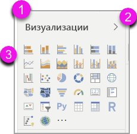

Перейдя к коллекции визуальных элементов, можно перейти к определенному визуальному элементу с помощью клавиш со стрелками и выбрать его, нажав клавишу **ВВОД**. Если вы используете средство чтения с экрана, оно сообщает о том, что вы создали диаграмму, и называет ее тип. Оно также сообщает о том, что вы изменили тип диаграммы. 

После раздела визуальных элементов фокус перемещается к сводным областям, как показано на рисунке ниже.

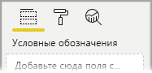

С помощью клавиши TAB можно переместить фокус только на значок выбранной сводной области. Чтобы переключиться на другие области, используйте клавиши со стрелками.

## Контейнер полей

Когда фокус находится на сводной области, еще одно нажатие клавиши TAB перемещает фокус на **контейнер полей**. 

В **контейнере полей** фокус перемещается в следующей очередности:

* заголовок контейнера (сначала);
* поле в данном контейнере (следующее нажатие);
* кнопка раскрывающегося меню поля (следующее нажатие);
* кнопка удаления (последний элемент).

Эта последовательность смены фокуса представлена на рисунке ниже.

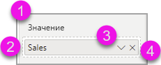

Средство чтения с экрана будет произносить имя контейнера и его подсказку. Для каждого поля в контейнере средство чтения с экрана произносит имя поля и его подсказку. Если контейнер пуст, фокус должен переместиться на весь пустой контейнер. Средство чтения с экрана должно произнести имя контейнера и его подсказку, а также сообщить, что он пуст.

По открытому меню поля можно перемещаться с помощью клавиш **TAB**, **SHIFT+TAB** или клавиш со стрелками **вверх** / **вниз**. Средство чтения с экрана будет произносить имена пунктов.

Чтобы переместить поле из одной группы в другую, можно с помощью клавиатуры выбрать в меню контейнера полей команду **Переместить в**, как показано на рисунке ниже.

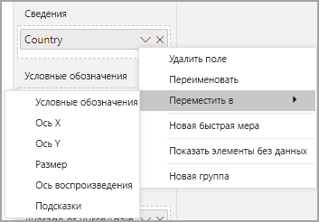

## Панель форматирования

В области **Формат** фокус перемещается по карточкам сверху вниз. Сначала он устанавливается на имя карточки, а затем на ее переключатель **Вкл./Откл.** , если он имеется. Когда фокус находится на имени карточки, средство чтения с экрана произносит его и сообщает, развернута ли карточка или свернута. Чтобы развернуть или свернуть карточку, можно нажать клавишу **ВВОД**. С помощью клавиши **ВВОД** можно также переводить переключатель в положение **Вкл.** или **Откл**.

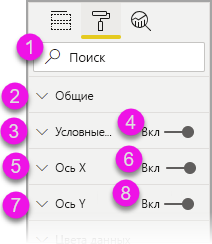

Если карточка открыта, нажимая клавишу **TAB**, вы перемещаетесь по элементам управления в ней перед переходом к следующей карточке. Для элементов управления в карточке средство чтения с экрана произносит название, текущее значение и тип элемента управления.  

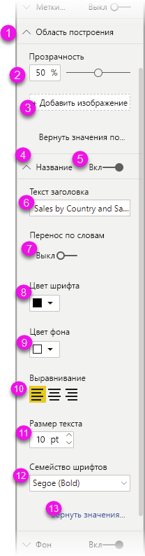

## Навигация по списку полей

Нажимая клавишу **TAB**, можно переходить по списку **полей**. Так же как и в области "Формат", если таблицы свернуты, фокус перемещается циклически в следующей очередности:

1. заголовок списка **Поля**;
2. строка поиска;
3. имя каждой таблицы.

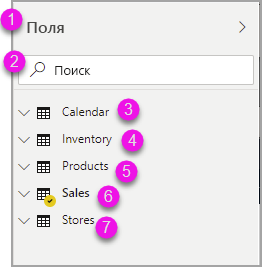

Чтобы развернуть все таблицы в контейнере **Поля**, нажмите клавиши **ALT+SHIFT+9**. Чтобы свернуть все таблицы, нажмите клавиши **ALT+SHIFT+1**. Чтобы развернуть одну таблицу, нажмите клавишу со **стрелкой вправо**. Чтобы свернуть одну таблицу, нажмите клавишу со **стрелкой влево**. Как и в случае с областью "Формат", если таблица развернута, то при навигации по списку полей перемещение происходит только по отображаемым полям. Средство чтения с экрана сообщает, развернута ли таблица или свернута.

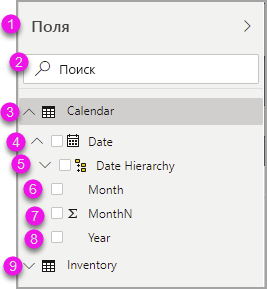

Чтобы отметить поле флажком, перейдя к нему и нажмите клавишу **ВВОД**.   Средство чтения с экрана произносит имя поля, на котором находится фокус, и сообщает, отмечено ли оно флажком или нет.

Пользователи, предпочитающие работать мышью, обычно перетаскивают поля на холст или в нужные группы фильтров. Если вы хотите использовать клавиатуру, то можете добавить поле в группу фильтра, открыв контекстное меню поля с помощью клавиш **SHIFT+F10**, перейдя к команде **Добавить к фильтрам** с помощью клавиш со стрелками, а затем нажав клавишу **ВВОД** для типа фильтра, в который нужно добавить поле.

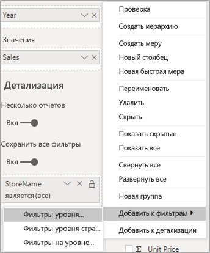

## Навигация по области "Выбор"
В области **Выбор** фокус перемещается в следующей очередности:

1. заголовок;
2. кнопка выхода;
3. переключатель вкладок "Порядок слоев" и "Последовательность табуляции";
4. кнопка перемещения вверх по слою;
5. кнопка перемещения вниз по слою;
6. кнопка отображения;
7. кнопка скрытия;
8. объекты.

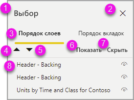

Вы можете перемещать фокус по элементам с помощью клавиши TAB и выбрать нужный элемент, нажав клавишу **ВВОД**.  

Когда фокус находится на переключателе вкладок "Порядок слоев" и "Последовательность табуляции", используйте клавиши со стрелками влево и вправо для выбора вкладки.

Когда фокус находится на списке объектов в области **Выбор**, нажмите клавишу **F6**, чтобы активировать область **Выбор**. После активации области **Выбор** можно использовать клавиши со стрелками вверх и вниз для перехода к различным объектам в области **Выбор**.
После перехода к нужному объекту можно выполнить ряд действий.

* Нажмите клавиши **CTRL+SHIFT+S**, чтобы скрыть или отобразить объект.
* Нажмите клавиши **CTRL+SHIFT+F**, чтобы переместить объект вверх в последовательности слоев.
* Нажмите клавиши **CTRL+SHIFT+B**, чтобы переместить объект вниз в последовательности слоев.
* Нажмите клавиши **CTRL+ПРОБЕЛ**, чтобы выбрать несколько объектов.

## Диалоговые окна Power BI Desktop

Все диалоговые окна в Power BI Desktop доступны с клавиатуры и поддерживают средства чтения с экрана.

В Power BI Desktop имеются следующие диалоговые окна:

* "Быстрые меры";
* "Условное форматирование" и "Гистограммы";
* диалоговое окно вопросов и ответов в Explorer;
* диалоговое окно начала работы;
* меню "Файл" и диалоговое окно сведений;
* панель предупреждений;
* диалоговое окно восстановления файлов;
* диалоговое окно нахмуренных смайликов.

## Поддержка высокой контрастности

При использовании режимов высокой контрастности в Windows эти параметры и выбранная палитра также применяются к отчетам в Power BI Desktop.

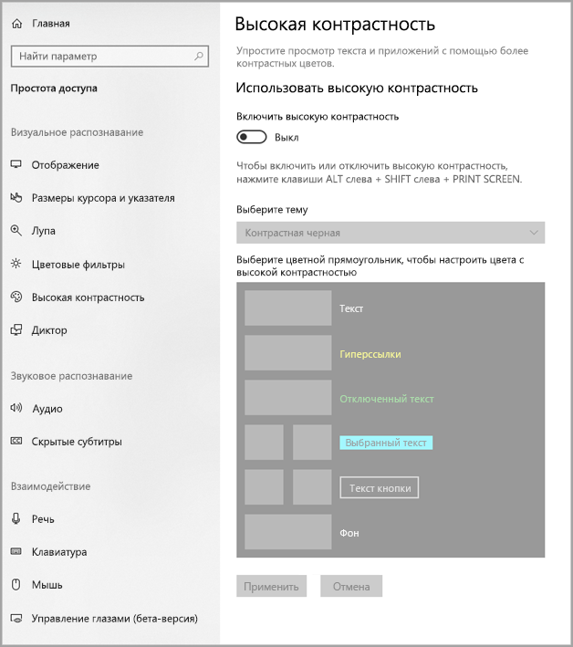

Power BI Desktop автоматически определяет используемую в Windows высококонтрастную тему и применяет соответствующие параметры к отчетам. Контрастные цвета сохраняются в отчете при его публикации в службе Power BI или другом месте.

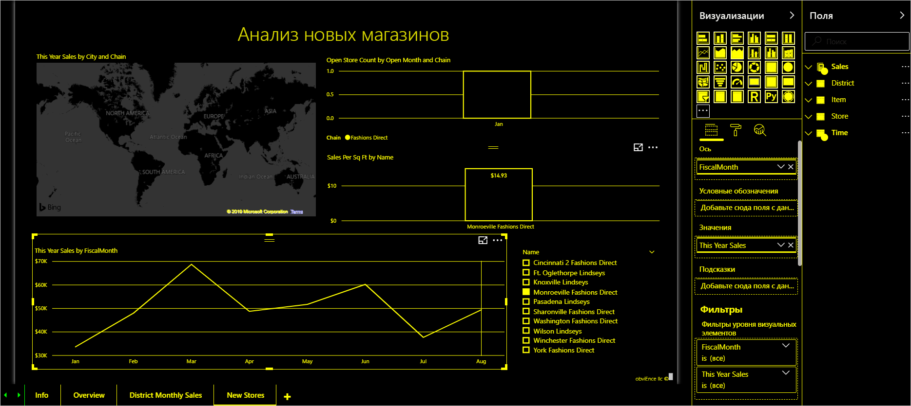

## Дальнейшие действия

Ниже перечислены статьи, посвященные специальным возможностям в Power BI:

* [Обзор специальных возможностей в Power BI](desktop-accessibility-overview.md) 
* [Создание отчетов Power BI со специальными возможностями](desktop-accessibility-creating-reports.md) 
* [Специальные возможности для работы с отчетами Power BI](desktop-accessibility-consuming-tools.md)
* [Сочетания клавиш для специальных возможностей в отчетах Power BI](desktop-accessibility-keyboard-shortcuts.md)
* [Контрольный список специальных возможностей для работы с отчетами](desktop-accessibility-creating-reports.md#report-accessibility-checklist)

