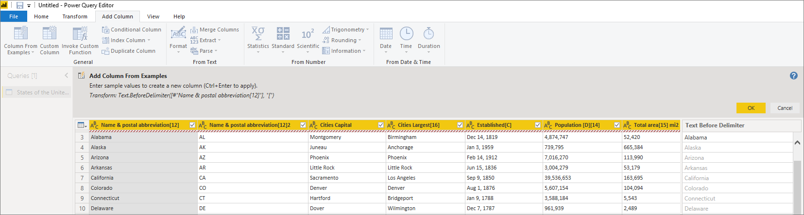

# Добавление столбца из примеров в Power BI Desktop
С помощью функции *добавления столбца из примеров* в редакторе Power Query можно добавить новые столбцы в модель данных, просто указав один или несколько примеров значений для новых столбцов. Можно создать новые примеры столбцов из выделенного фрагмента или ввести входные данные на основе всех существующих столбцов в таблице.

Функция *добавления столбца из примера* позволяет быстро и просто создавать столбцы. Это удобно в следующих ситуациях.

- Вам известно, какими должны быть данные в новом столбце, но вы не уверены, какое преобразование или набор преобразований необходимо применить.
- Вам известно, какие преобразования нужно применить, но вы не знаете, какой элемент пользовательского интерфейса выбрать, чтобы сделать это.
- Вы знаете все о необходимых преобразованиях благодаря выражению *Custom Column* в языке *M*, но одно или несколько таких выражений недоступны в пользовательском интерфейсе.

Добавить столбец из примера очень просто. В следующих разделах показано, насколько это легко.

## Добавить столбец из примеров

Чтобы получить демонстрационные данные из Википедии, выберите **Получить данные** > **Интернет** на вкладке **Главная** ленты Power BI Desktop. 

Вставьте следующий URL-адрес в открывшемся диалоговом окне и нажмите **ОК**: 

*https:\//wikipedia.org/wiki/List_of_states_and_territories_of_the_United_States*

В диалоговом окне **Навигатор** выберите таблицу **Штаты США**, а затем выберите **Преобразовать данные**. Таблица откроется в Редакторе Power Query.

Или, чтобы открыть уже загруженные данные из Power BI Desktop, выберите **Изменить запросы** на вкладке ленты **Главная**. Данные откроются в Редакторе Power Query. 

Когда образец данных откроется в редакторе Power Query, выберите вкладку **Добавить столбец** на ленте и выберите **Столбец из примеров**. Нажмите на значок **Столбец из примеров**, чтобы создать столбец из всех существующих столбцов, или щелкните стрелку раскрывающегося списка, чтобы выбрать один из вариантов: **Из всех столбцов** или **Из выделенного фрагмента**. В этом пошаговом руководстве используйте вариант **Из всех столбцов**.

## Область "Добавить столбец из примеров"
Когда вы выбираете **Добавить столбец** > **Из примеров**, в верхней части таблицы откроется область **Добавить столбец из примеров**. Справа от существующих столбцов появится новый **Столбец 1** (прокрутите страницу, если его не видно). Когда вы вводите примеры значений в пустые ячейки **Столбца 1**, Power BI создает правила и преобразования для сопоставления ваших примеров и использует их для заполнения остальной части столбца.

Обратите внимание, что **Столбец из примеров** также отображается как **Примененный шаг** в области **Параметры запроса**. Редактор Power Query, как всегда, запишет ваш набор преобразований и применит их к запросу в той же последовательности.

По мере того как вы вводите пример в новом столбце, Power BI отображает предварительный просмотр того, как будет выглядеть остальная часть столбца на основе преобразований. Например, если ввести *Алабама* в первой строке, это соответствует значению **Алабама** в первом столбце таблицы. После нажатия клавиши ВВОД Power BI заполнит оставшуюся часть нового столбца на основе первого значения столбца и присвоит столбцу имя **Название и почтовая аббревиатура [12] — копирование**.

Теперь перейдите в строку **Массачусетс [E]** нового столбца и удалите **[E]** . Служба Power BI обнаруживает изменение и использует этот пример для создания преобразования. Power BI описывает преобразования в области **Добавить столбец из примеров** и переименовывает столбец в **Текст перед разделителем.** 

По мере того как вы продолжаете вводить примеры, редактор Power Query добавляет преобразования. Если результат вас устраивает, нажмите кнопку **ОК**, чтобы зафиксировать изменения. 

Можно присвоить новому столбцу любое имя, дважды щелкнув заголовок столбца или щелкнув его правой кнопкой мыши и выбрав **Переименовать**. 

Просмотрите это видео, чтобы увидеть функцию **Добавить столбец из примеров** в действии, используя образец источника данных: 

[Power BI Desktop: добавить столбец из примеров](https://www.youtube.com/watch?v=-ykbVW9wQfw). 

## Список поддерживаемых преобразований
При использовании функции **Добавить столбец из примеров** доступны многие, но не все преобразования. В следующем списке перечислены поддерживаемые преобразования.

**Общие**

- Условный столбец

**Ссылка**
  
- Ссылка на определенный столбец, включая преобразования, предусматривающие усечение, очистку и изменение регистра

**Преобразования текста**

- Объединить (поддерживает сочетание строковых литералов и значений всего столбца)
- Заменить
- Длина
- Извлечение   
  - Первые символы
  - Последние символы
  - Диапазон
  - Текст перед разделителем
  - Текст после разделителя
  - Текст между разделителями
  - Длина
  - Удалить символы
  - Сохранить символы

> [!NOTE]
> Во всех преобразованиях *текста* учтена потенциальная необходимость усечения значения столбца, очистки или изменения регистра.

**Преобразования даты**

- День
- День недели
- Название дня недели
- День года
- Месяц
- Название месяца
- Квартал года
- Неделя месяца
- Неделя года
- Год
- Возраст
- Начало года
- Конец года
- Начало месяца
- Конец месяца
- Начало квартала
- Дней в месяце
- Конец квартала
- Начало недели
- Конец недели
- День месяца
- Начало дня
- Конец дня

**Преобразования времени**

- Hour
- Минута
- Second  
- На местное время

> [!NOTE]
> Все преобразования *даты* и *времени* учитывают потенциальную необходимость преобразования значений столбцов в значения *Date*, *Time* или *DateTime*.

**Преобразования чисел** 

- Абсолютное значение
- Арккосинус
- Арксинус
- Арктангенс
- Преобразовать в число
- Косинус
- Куб
- Разделить
- Показатель степени
- Факториал
- Целочисленное деление
- Четное
- Нечетное
- Натуральный логарифм
- Десятичный логарифм
- Остаток от деления
- Умножить
- Округление с уменьшением
- Округление с увеличением
- Знак
- Синус
- Квадратный корень
- Квадрат
- Вычитание
- Сумма
- Тангенс
- Создание контейнеров и диапазоны

