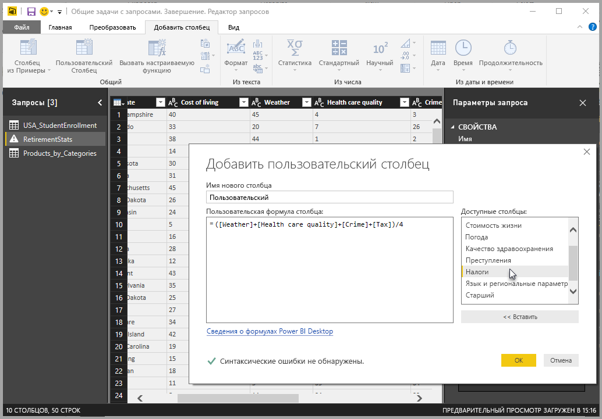
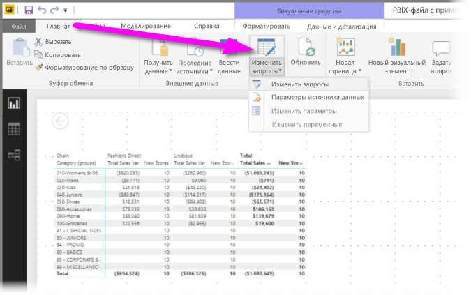
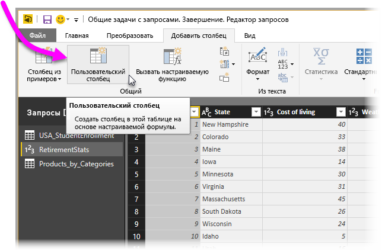
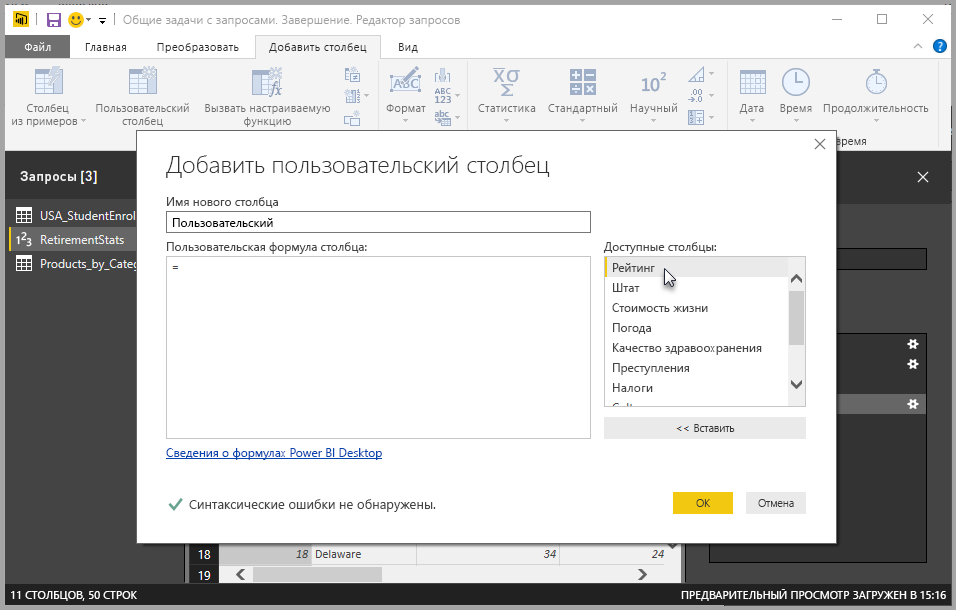
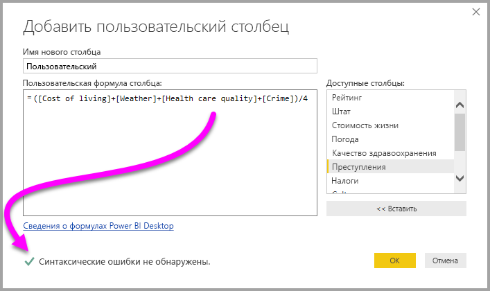
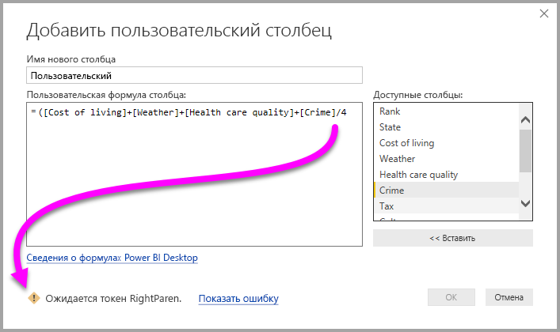
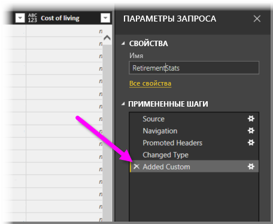
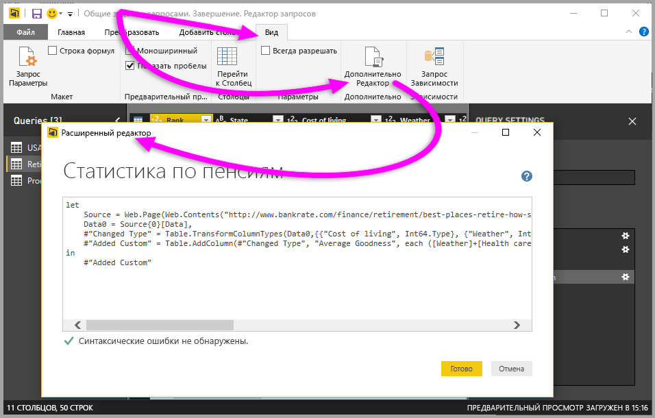

# Добавление пользовательского столбца в Power BI Desktop

Вы можете легко добавить новый пользовательский столбец данных в модель с помощью редактора запросов в Power BI Desktop. С помощью редактора запросов вы создаете и переименовываете свой столбец, создавая [запросы формул PowerQuery M](/powerquery-m/quick-tour-of-the-power-query-m-formula-language) для определения столбца. Для запросов формул PowerQuery M доступен [полный набор справочных материалов по функциям](/powerquery-m/power-query-m-function-reference). 

При создании пользовательского столбца в редакторе запросов Power BI Desktop добавляет его в качестве **примененного действия** в **Параметры запроса**. Его можно поменять, переместить или изменить в любое время.

## Добавление пользовательского столбца с помощью редактора запросов

Чтобы приступить к созданию пользовательского столбца, выполните следующие действия.

1. Запустите Power BI Desktop и загрузите какие-нибудь данные.

2. На вкладке ленты **Главная** выберите **Изменить запросы**, а затем **Изменить запросы** в меню.

   

   Появится окно **редактора запросов**. 

2. Выберите **Настраиваемый столбец** на вкладке ленты **Добавление столбца**.

   

   Появится окно **Добавить пользовательский столбец**.

## Окно "Добавить пользовательский столбец"

Окно **Добавить настраиваемый столбец** имеет следующие возможности. 
- Список доступных столбцов в списке **Доступные столбцы** справа.

- Начальное имя пользовательского столбца в поле **Имя нового столбца**. Столбец можно переименовать.

- [Запросы формул PowerQuery M](/powerquery-m/power-query-m-function-reference) в поле **Настраиваемая формула столбца**. Эти запросы создаются путем создания формулы, которой определяется новый столбец. 

   

## Создание формул для пользовательского столбца

1. Вы можете выбрать столбец в списке **Доступные столбцы** справа, а затем выбрать команду **Вставить**, чтобы добавить их в формулу пользовательского столбца. Можно также добавить столбец, дважды щелкнув его в списке.

2. При вводе формулы и создании столбца обратите внимание на индикатор в нижней части окна **Добавить настраиваемый столбец**. 

   Если ошибок нет, появятся зеленый флажок и сообщение *Синтаксические ошибки не обнаружены*.

   

   При наличии синтаксической ошибки вы увидите желтый значок предупреждения со ссылкой на место возникновения ошибки в формуле.

   

3. Нажмите кнопку **ОК**. 

   Power BI Desktop добавляет настраиваемый столбец в модель и добавляет действие **Добавлен пользовательский объект** в список **Примененные действия** в разделе **Параметры запроса**.

   

4. Чтобы изменить настраиваемый столбец, дважды щелкните действие **Добавлен пользовательский объект** в списке **Примененные действия**. 

   Откроется окно **Добавить пользовательский столбец** с созданной формулой пользовательского столбца.

## Использование расширенного редактора для настраиваемых столбцов

После создания запроса можно также использовать **расширенный редактор**, чтобы изменить любой шаг запроса. Для этого выполните указанные ниже действия.

1. В окне **редактора запросов** выберите вкладку **Вид** на ленте. 

2. Щелкните **Расширенный редактор**.

   Появившаяся страница **Расширенный редактор** предоставляет возможность полного контроля над запросом. 

   

   
## Дальнейшие действия

- Существуют другие способы создания пользовательских столбцов, например на основе примеров, предоставленных редактору запросов. Дополнительные сведения см. в разделе [Добавление столбца из примера в Power BI Desktop](desktop-add-column-from-example.md).

- Справочные сведения о Power Query M см. в разделе [Справочник по функциям Power Query M](/powerquery-m/power-query-m-function-reference).