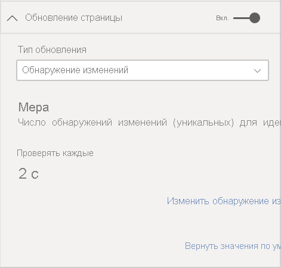
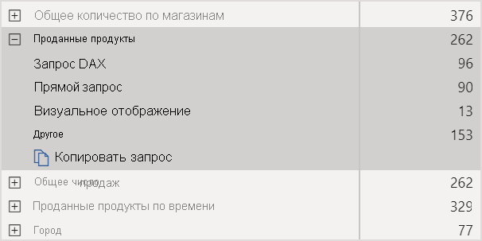
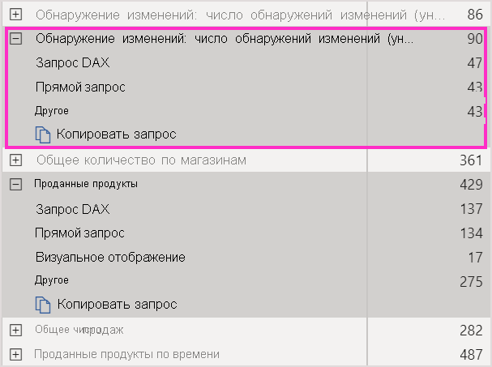
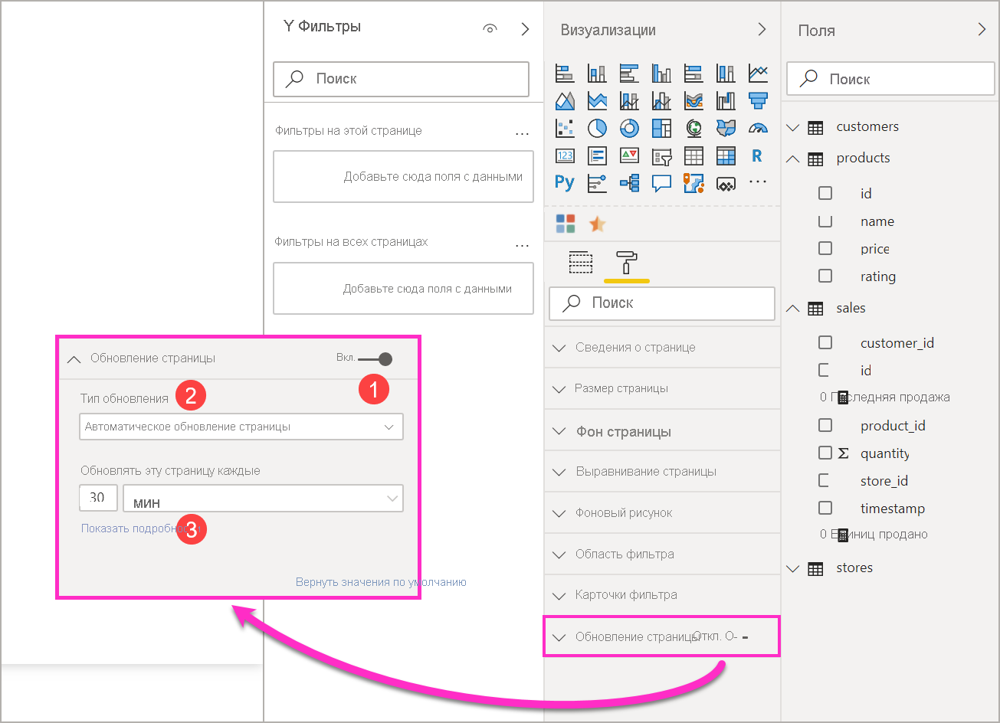
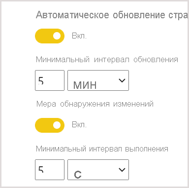

# Автоматическое обновление страниц в Power BI

При мониторинге критических событий важно обновлять данные сразу после обновления исходных данных. Например, в промышленности важно знать, когда оборудование работает со сбоями или в близком к этому состоянии. Если вы отслеживаете такие сигналы, как тональность в социальных сетях, вам требуется узнавать о внезапных изменениях сразу после их возникновения.

Автоматическое обновление страниц в Power BI позволяет с заранее определенной периодичностью запрашивать на странице активного отчета новые данные для [источников DirectQuery](../connect-data/desktop-directquery-about.md).

## Типы обновления

При использовании автоматического обновления страниц доступны два типа обновления: с фиксированным интервалом и обнаружением изменений.

### Фиксированный интервал

Этот тип обновления позволяет обновлять все визуальные элементы на странице отчета, используя постоянный интервал, например одну секунду или пять минут. При достижении указанного интервала все визуальные элементы на этой странице отправляют запрос на обновление в источник данных и соответствующим образом обновляются.

### Обнаружение изменений

Этот тип обновления позволяет обновлять визуальные элементы на странице на основе обнаружения изменений в данных, а не определенного интервала. В частности, эта мера выполняет опрос на наличие изменений в [источнике DirectQuery](../connect-data/desktop-directquery-about.md). Кроме определения меры, необходимо также выбрать частоту, с которой Power BI Desktop будет проверять наличие изменений. При публикации в службе этот тип обновления поддерживается только в рабочих областях, которые являются частью емкости Premium.

## Создание отчетов с автоматическим обновлением страниц в Power BI Desktop

Автоматическое обновление страниц используется только для [источников DirectQuery](../connect-data/desktop-directquery-about.md), поэтому оно будет доступно только при подключении к источнику данных DirectQuery. Это ограничение распространяется на оба типа автоматического обновления страниц.

Чтобы использовать автоматическое обновление страниц в Power BI Desktop, выберите страницу отчета, для которой необходимо включить автоматическое обновление страниц. На панели **Визуализации** нажмите кнопку **Форматирование** (значок с изображением валика) и найдите параметр **Обновление страницы** в нижней части панели.

1. Включение или отключение обновления страницы.
2. Тип обновления.
3. Входные данные и информация (в зависимости от типа обновления)

Карточка **Обновление страницы** будет доступна только при подключении к [источнику DirectQuery](../connect-data/desktop-directquery-about.md). Чтобы включить автоматическое обновление страниц, необходимо установить переключатель в положение "Вкл". Необходимые входные данные и предоставленные сведения будут зависеть от выбранного типа обновления.

### Настройка фиксированного интервала

При выборе типа обновления **Автоматическое обновление страницы** необходимо указать требуемый интервал обновления. Значение по умолчанию составляет 30 минут. (Минимальный интервал периода обновления — одна секунда.) Отчет начнет обновляться с заданным интервалом.

При выборе пункта "Подробно" Power BI предоставит дополнительные сведения:

- Включена ли эта функция администратором (только при входе в систему с использованием учетной записи Power BI)
- Минимальный интервал, разрешенный администратором (только при входе в систему с использованием учетной записи Power BI)
- Фактическая частота обновления (обычно дольше выбранного интервала)
- Время последнего обновления

### Настройка обнаружения изменений

При выборе типа обновления **Обнаружение изменений** отображается ссылка **Добавить обнаружение изменений**. Вы также можете открыть окно **обнаружения изменений** с вкладки "Моделирование" на ленте. Затем щелкните значок **Обнаружение изменений**  в разделе **Обновление страницы**. Наконец, можно щелкнуть правой кнопкой мыши или выбрать стрелку раскрывающегося списка рядом с любым значением в поле "Значения" и выбрать в меню пункт **Обнаружение изменений**.

После открытия окна появится параметр **Тип меры**, позволяющий выбрать существующую меру или создать новую. При выборе существующего варианта просто выберите нужную меру в списке полей или перетащите ее в раздел **Choose existing measure** (Выбор существующей меры). При создании меры можно использовать параметр **Choose a calculation**, чтобы выбрать вычисление для меры — количество, число уникальных значений, минимум, максимум или сумма. Например, можно использовать число уникальных значений для подсчета идентификаторов клиентов и выполнения обновления только при добавлении нового клиента в список. После выбора меры необходимо с помощью параметра **Проверять на изменения** определить, как часто Power BI будет проверять наличие изменений. Это интервал времени, с которым Power BI будет рассчитывать меру и производить опрос на наличие изменений. После нажатия кнопки "Применить" в списке полей появится новая мера со значком обнаружения изменений.

Затем, вернувшись в раздел обновления страницы, вы увидите сведения о том, какая мера используется для обнаружения изменений, и заданный интервал.

> [!NOTE]
> В каждой модели допускается только одна мера обнаружения изменений.

## Определение интервала обновления

Если автоматическое обновление страницы включено, Power BI Desktop постоянно отправляет запросы в источник DirectQuery. Между отправкой запроса и получением возвращенных данных существует задержка. Поэтому для коротких интервалов обновления следует убедиться, что запросы успешно возвращают запрашиваемые данные в течение заданного интервала. Если данные не возвращаются в течение этого интервала, визуальные элементы будут обновляться реже, чем настроено.

Эти рекомендации относятся к обоим типам обновления: фиксированному интервалу и обнаружению изменений. Основное различие заключается в том, что при обнаружении изменений будет выполнен только один запрос к источнику с фиксированным интервалом, а обновление визуальных элементов осуществляется только при изменении значения для меры обнаружения изменений.

Рекомендуется, чтобы интервал обновления соответствовал как минимум ожидаемой частоте поступления новых данных:

* если новые данные поступают в источник каждые 20 минут, то интервал обновления не может быть меньше 20 минут;
* если новые данные поступают каждую секунду, установите длительность интервала в одну секунду.

Для небольших интервалов обновления, таких как одна секунда, следует учитывать следующие факторы:

- тип источника данных DirectQuery;
- загрузку от запросов;
- расстояние от средства просмотра отчетов до центра обработки данных емкости.

Вы можете оценить время возврата с помощью [Анализатора производительности](desktop-performance-analyzer.md) в Power BI Desktop и меню "Подробнее" в разделе обновления страницы для типа обновления с фиксированным интервалом. Анализатор производительности позволяет проверить, достаточно ли времени у каждого визуального запроса, чтобы вернуться с результатом из источника, и на что это время потрачено. Учитывая результаты Анализатора производительности, можно настраивать источник данных, а также экспериментировать с другими визуальными элементами и мерами в отчете.

На этом изображении показаны результаты для источника DirectQuery в Анализаторе производительности:

Рассмотрим некоторые другие характеристики этого источника данных:

- Данные поступают с частотой в две секунды.
- Анализатор производительности показывает максимальное общее время запроса и отображения — примерно 4,9 с (4688 мс).
- Источник данных настроен для обработки приблизительно 1000 одновременных запросов в секунду.
- Предполагается, что примерно 10 пользователей будут одновременно просматривать отчет.

Таким образом, в результате будет использоваться следующее уравнение:

- **5 визуальных элементов x 10 пользователей = приблизительно 50 запросов**

Этот показатель приводит к значительно большей загрузке, чем может поддерживать источник данных. Данные поступают с частотой в две секунды, поэтому это должна быть ваша частота обновления. Однако, так как выполнение запроса занимает около пяти секунд, следует установить частоту обновления длительностью более пяти секунд.

Также обратите внимание, что этот результат может отличаться при публикации отчета в службе. Данное различие возникает из-за того, что в отчете будет использоваться экземпляр Azure Analysis Services, размещенный в облаке. Вы можете настроить частоту обновления соответственно.

Для учета запросов и времени обновления Power BI будет выполнять следующий запрос на обновление только после завершения всех оставшихся запросов на обновление. Таким образом, даже если интервал обновления короче времени обработки ваших запросов, Power BI будет выполнять следующее обновление только по завершении оставшихся запросов.

Эти рекомендации также применимы для типа обновления с обнаружением изменений. Кроме того, [Анализатор производительности](desktop-performance-analyzer.md) отобразит результаты для запроса меры обнаружения изменений, даже если он не соответствует ни одному визуальному элементу в отчете. Мы предоставили такую возможность, чтобы вы могли осуществлять устранение неполадок для этого конкретного типа меры, следуя тем же рекомендациям, которые мы упоминали ранее. Основное отличие этого типа обновления заключается в том, что к источнику данных направляется только один запрос, а не все запросы из всех визуальных элементов. Это также справедливо, если отчет просматривают несколько пользователей.

Для того же сценария, который мы рассмотрели ранее:

- **1 запрос меры обнаружения изменений для 5 визуальных элементов создает только один запрос для любого числа просматривающих пользователей.**

- **Когда мера обнаружения изменений запускает обновление с учетом того же сценария, что и раньше: 5 визуальных элементов x 10 пользователей = около 50 запросов.**

В итоге, при использовании обнаружения изменений в источник данных отправляется только один запрос, пока не будет обнаружено изменение. При этом применяется та же логика, которая используется для типа обновления с фиксированным интервалом, обновляя все визуальные элементы для всех пользователей, что приводит к выполнению аналогичного количества запросов. Такой подход должен быть более эффективным в долгосрочной перспективе.

Теперь рассмотрим, как можно обнаружить и диагностировать проблемы с производительностью в качестве администратора емкости. Вы также можете ознакомиться с разделом [часто задаваемых вопросов по автоматическому обновлению страницы](#frequently-asked-questions) далее в этой статье, чтобы рассмотреть дополнительные вопросы и ответы о производительности и устранении неполадок.

## Автоматическое обновление страницы в службе Power BI

Вы также можете задать автоматическое обновление страниц для отчетов, опубликованных в службе Power BI, пока источником данных является [DirectQuery](../connect-data/desktop-directquery-about.md).

Чтобы настроить автоматическое обновление страниц для отчетов в службе Power BI, используйте те же шаги, что и для Power BI Desktop. При настройке в службе Power BI автоматическое обновление страницы также поддерживает содержимое [Embedded Power BI](../developer/embedded/embedding.md). На этом изображении показана конфигурация **обновления страниц** для службы Power BI:

1. Включение или отключение обновления страницы.
2. Тип обновления.
3. Входные данные и информация (в зависимости от типа обновления)

> [!NOTE]
> При публикации отчета с включенным автоматическим обновлением страницы из Power BI Desktop в службу необходимо предоставить учетные данные для источника данных DirectQuery в меню параметров набора данных. Учетные данные можно настроить таким образом, чтобы средства просмотра отчетов могли обращаться к этому источнику данных с использованием собственных удостоверений, учитывая все настройки безопасности в источнике. В случае с мерой обнаружения изменений она всегда будет оцениваться с использованием учетных данных автора.

### Интервалы обновления страницы

Интервалы и типы обновления страниц, разрешенные в службе Power BI, зависят от типа рабочей области отчета. Это относится к следующим сценариям:

* Публикация отчета в рабочей области, для которой включено автоматическое обновление страниц.
* Изменение интервала обновления страницы уже в рабочей области.
* Создание отчета непосредственно в службе.

Power BI Desktop не имеет ограничений для интервалов обновления, можно задать даже обновление раз в секунду. Однако при публикации отчетов в службе Power BI применяются некоторые ограничения, описанные в следующих разделах.

### Ограничения для интервалов обновления

В службе Power BI ограничения на автоматическое обновление страниц применяются на основе рабочей области, в которой опубликован отчет, факта использования служб уровня "Премиум", а также на основе параметров администратора емкостей Premium.

Чтобы понять, как работают эти ограничения, давайте сначала рассмотрим общие сведения о емкостях и рабочих областях.

*Емкости* — важная концепция Power BI. Они представляют собой набор ресурсов (хранилище, процессор и память), используемые для размещения и доставки содержимого Power BI. Емкости могут быть общими или выделенными. *Общая емкость* используется всеми пользователями Майкрософт. *Выделенная емкость* предназначена только для одного клиента. Сведения о выделенных емкостях см. в статье [Управление емкостями Premium](../admin/service-premium-capacity-manage.md).

В общей емкости рабочие нагрузки выполняются на вычислительных ресурсах, совместно используемых другими пользователями. Так как емкость должна предоставлять общий доступ к ресурсам, для обеспечения *честной игры* установлены определенные ограничения, например максимальный размер модели (1 ГБ) и максимальная частота ежедневного обновления (восемь раз в день).

Рабочие области *Power BI* находятся в пределах емкости и представляют собой контейнеры безопасности, совместной работы и развертывания. У каждого пользователя Power BI есть личная рабочая область, так называемая **Моя рабочая область**. Для обеспечения совместной работы и выполнения развертывания можно создавать дополнительные рабочие области. Они называются *рабочими областями*. По умолчанию рабочие области, включая личные рабочие области, создаются в общей емкости.

Ниже приведены некоторые сведения о двух сценариях использования рабочей области.

**Общие рабочие области**. Для обычных рабочих областей (которые не являются частью емкости Premium) автоматическое обновление страницы имеет минимальный интервал в 30 минут (минимально допустимый интервал). Тип обновления с обнаружением изменений недоступен в общих емкостях.

**Рабочие области Premium**. Доступность автоматического обновления страниц в рабочих областях Premium (как для фиксированного интервала, так и для обнаружения изменений) зависит от параметров рабочей нагрузки, настроенных администратором для емкости Power BI Premium. Существует две переменные, которые могут повлиять на возможность настройки автоматического обновления страницы:

 - **Включение и выключение функций**. Если администратор емкости отключил эту функцию, вы не сможете настроить какой-либо тип обновления страницы в опубликованном отчете. Фиксированный интервал и обнаружение изменений можно включать и отключать отдельно.

 - **Минимальный интервал обновления**. При включении автоматического обновления страниц с фиксированным интервалом администратору емкости необходимо настроить минимальный интервал обновления (значение по умолчанию — пять минут). Если интервал меньше минимального значения, служба Power BI переопределяет интервал в соответствии с минимальным интервалом, установленным администратором емкости.

 - **Минимальный интервал выполнения**. При включении обнаружения изменений администратору емкости необходимо настроить минимальный интервал выполнения (значение по умолчанию — пять секунд). Если интервал меньше минимального значения, служба Power BI переопределяет интервал в соответствии с минимальным интервалом, установленным администратором емкости.

В этой таблице подробно описано, где доступна эта функция, а также указаны ограничения для каждого типа емкости и [режима хранения](../connect-data/service-dataset-modes-understand.md).

| Режим хранения | Выделенное место | Общая емкость |
| --- | --- | --- |
| DirectQuery | **Поддерживается ФИ**: Да  **Поддерживается ОИ**: Да  **Минимум**: 1 секунда  **Переопределение администратором** : Да | **Поддерживается ФИ**: Да  **Поддерживается ОИ**: Нет  **Минимум**: 30 мин  **Переопределение администратором** : Нет |
| Импорт | **Поддерживается ФИ**: Нет  **Поддерживается ОИ**: Нет  **Минимум**: Н/Д  **Переопределение администратором** : Н/Д | **Поддерживается ФИ**: Нет  **Поддерживается ОИ**: Нет  **Минимум**: Н/Д  **Переопределение администратором** : Н/Д |
| Смешанный режим (DirectQuery + другие источники данных) | **Поддерживается ФИ**: Да  **Поддерживается ОИ**: Да  **Минимум**: 1 секунда  **Переопределение администратором** : Да | **Поддерживается ФИ**: Да  **Поддерживается ОИ**: Нет  **Минимум**: 30 мин  **Переопределение администратором** : Нет |
| Live Connect AS | **Поддерживается ФИ**: Нет  **Поддерживается ОИ**: Нет  **Минимум**: Н/Д  **Переопределение администратором** : Н/Д | **Поддерживается ФИ**: Нет  **Поддерживается ОИ**: Нет  **Минимум**: Н/Д  **Переопределение администратором** : Н/Д |
| Live Connect PBI | **Поддерживается ФИ**: Нет  **Поддерживается ОИ**: Нет  **Минимум**: Н/Д  **Переопределение администратором** : Н/Д | **Поддерживается ФИ**: Нет  **Поддерживается ОИ**: Нет  **Минимум**: Н/Д  **Переопределение администратором** : Н/Д |

*Условные обозначения:*
1. *ФИ: фиксированный интервал*
2. *ОИ: обнаружение изменений*

## Рекомендации и ограничения

При использовании автоматического обновления страницы в Power BI Desktop или в службе Power BI необходимо учитывать несколько моментов:

* Режимы хранения Import, LiveConnect и Push не поддерживаются для автоматического обновления страниц.  
* Поддерживаются составные модели, имеющие по крайней мере один источник данных DirectQuery.
* Power BI Desktop не имеет ограничений для интервалов обновления. Для типов обнаружения как с фиксированным интервалом, так и с обнаружением изменений интервал может составлять всего одну секунду. При публикации отчетов в службе Power BI применяются определенные ограничения, описанные [выше](#restrictions-on-refresh-intervals) в этой статье.
* На набор данных можно использовать только одну мера обнаружения изменений.
* В клиенте Power BI может быть не более 10 моделей с мерами обнаружения изменений.

### Диагностика производительности

Автоматическое обновление страницы полезно для задач мониторинга и изучения быстро меняющихся данных. Но иногда это может привести к чрезмерной загрузке емкости или источника данных.

Для предотвращения чрезмерной загрузки источников данных в Power BI предусмотрены следующие меры защиты:

- Все автоматические запросы на обновление страниц выполняются с более низким приоритетом, чтобы интерактивные запросы (например, загрузка страниц и перекрестная фильтрация визуальных элементов) были приоритетными.
- Если запрос не был завершен до следующего цикла обновления, Power BI не выдает новые запросы на обновление до тех пор, пока не завершится предыдущий запрос. Например, если установлен интервал обновления в одну секунду и запросы в среднем занимают четыре секунды, Power BI фактически выдает запрос каждые четыре секунды.

Существует две области, в которых можно по-прежнему столкнуться со снижением производительности:

1. **Емкость**. Сначала запрос достигает емкости Premium, которая вычисляет и оценивает запрос DAX, сгенерированный из визуализаций отчета, преобразовывая его в запросы источника.
2. **Источник данных DirectQuery**. Преобразованные запросы на предыдущем шаге выполняются в источнике, в частности в экземплярах SQL Server, SAP Hana и т. д.

С помощью [приложения метрик Premium](../admin/service-admin-premium-monitor-capacity.md), доступного для администраторов, можно визуализировать, какая часть емкости используется низкоприоритетными запросами.

Низкоприоритетные запросы состоят из автоматических запросов обновления страниц и запросов обновления модели. В настоящее время нет способа отличить загрузку от запросов автоматического обновления страниц и запросов обновления модели.

Если вы заметили, что емкость перегружается низкоприоритетными запросами, можно выполнить несколько действий:

- Запросите больший SKU Premium.
- Обратитесь к владельцу отчета и попросите уменьшить интервал обновления.
- На портале администрирования емкости можно выполнить следующее.
   - Отключить автоматическое обновление страниц для этой емкости.
   - Увеличить минимальный интервал обновления, который будет влиять на все отчеты в этой емкости.

### Часто задаваемые вопросы

**Я автор отчета. Для интервала обновления отчета установлено значение одна секунда в Power BI Desktop, но после публикации отчет не обновляется в службе.**

* Убедитесь, что для страницы включено автоматическое обновление. Так как этот параметр задается для каждой страницы, необходимо убедиться, что он включен для каждой страницы в отчете, которую вы хотите обновить.
* Убедитесь, что вы отправили данные в рабочую область с подключенной емкостью Premium. Если это не так, то интервал обновления будет равен 30 минутам для фиксированного интервала и будет недоступен для обнаружения изменений.
* Если отчет находится в рабочей области Premium, обратитесь к администратору, чтобы включить эту функцию для подключенной емкости. Кроме того, убедитесь, что минимальный интервал обновления для емкости меньше или равен интервалу, установленному для отчета. Это применимо отдельно для фиксированного интервала и обнаружения изменений.

**Я являюсь администратором емкости. Параметры автоматического обновления страницы были изменены, но они не отражаются. Иными словами, отчеты по-прежнему обновляются с неправильной частотой или не обновляются, хотя эта функция была включена.**

* Изменения параметров автоматического обновления страницы, сделанные в пользовательском интерфейсе администратора емкости, распространяются на отчеты в течение 5 минут.
* Автоматическое обновление страниц нужно включить не только для емкости, но и для необходимых страниц отчета.
* Оба типа обновления управляются отдельно, поэтому убедитесь, что активируемый тип обновления включен.

**Мой отчет работает в смешанном режиме. (Это означает, что в отчете есть подключение DirectQuery и импорт источника данных.) Некоторые визуальные элементы не обновляются.**

- Это ожидаемое поведение, если визуальные элементы ссылаются на таблицы Import. Автоматическое обновление страницы не поддерживается для режима Import.
- Ознакомьтесь с первым вопросом в этом разделе.

**Отчет успешно обновлялся в службе, а затем внезапно перестал.**

* Попробуйте обновить страницу, чтобы увидеть, устраняется ли проблема самостоятельно.
* Обратитесь к администратору емкости. Возможно, он отключил эту функцию или увеличил минимальный интервал обновления. (Ознакомьтесь со вторым вопросом в этом разделе.)

**Я автор отчета. Мои визуальные элементы не обновляются с заданной периодичностью. Они обновляются с более низкой частотой.**

* Если выполнение запросов длится дольше, интервал обновления будет отложен. Автоматическое обновление страницы ожидает завершения всех запросов перед выполнением новых.
* Администратор емкости может установить минимальный интервал обновления, превышающий заданный в отчете. Обратитесь к администратору емкости и попросите его снизить минимальный интервал обновления.

**Запросы автоматического обновления страниц выполняются из кэша?**

* Нет. Все запросы автоматического обновления страницы обходят любые кэшированные данные.

**Мера обнаружения изменений не запускает никакие обновления**

* Убедитесь, что для страницы включено обнаружение изменений. Так как этот параметр задается для каждой страницы, необходимо убедиться, что он включен для каждой страницы в отчете, которую вы хотите обновить.
* Убедитесь, что вы отправили данные в рабочую область с подключенной емкостью Premium. Если это не так, обнаружение изменений не будет работать.
* Если отчет находится в рабочей области Premium, обратитесь к администратору, чтобы включить эту функцию для подключенной емкости. Кроме того, убедитесь, что минимальный интервал выполнения для емкости меньше или равен интервалу, установленному для отчета.
* Если вы проверили выполнение всех описанных выше условий, проверьте, изменяется ли мера, в Power BI Desktop или режиме редактирования. Для этого перетащите ее на холст и проверьте, изменяется ли значение. Если значение не меняется, возможно, эта мера не подходит для опроса на наличие изменений в источнике данных.

## Дальнейшие действия

Дополнительные сведения вы найдете в следующих статьях:

* [Использование DirectQuery в Power BI](../connect-data/desktop-directquery-about.md)
* [Использование составных моделей в Power BI Desktop](../transform-model/desktop-composite-models.md)
* [Use Performance Analyzer to examine report element performance](desktop-performance-analyzer.md) (Проверка производительности элементов отчета с помощью Анализатора производительности)
* [Развертывание емкостей Power BI Premium и управление ими](../guidance/whitepaper-powerbi-premium-deployment.md)
* [Data sources in Power BI Desktop](../connect-data/desktop-data-sources.md) (Источники данных в Power BI Desktop)
* [Формирование и объединение данных в Power BI Desktop](../connect-data/desktop-shape-and-combine-data.md)
* [Подключение к данным Excel в Power BI Desktop](../connect-data/desktop-connect-excel.md)   
* [Ввод данных непосредственно в Power BI Desktop](../connect-data/desktop-enter-data-directly-into-desktop.md)   
