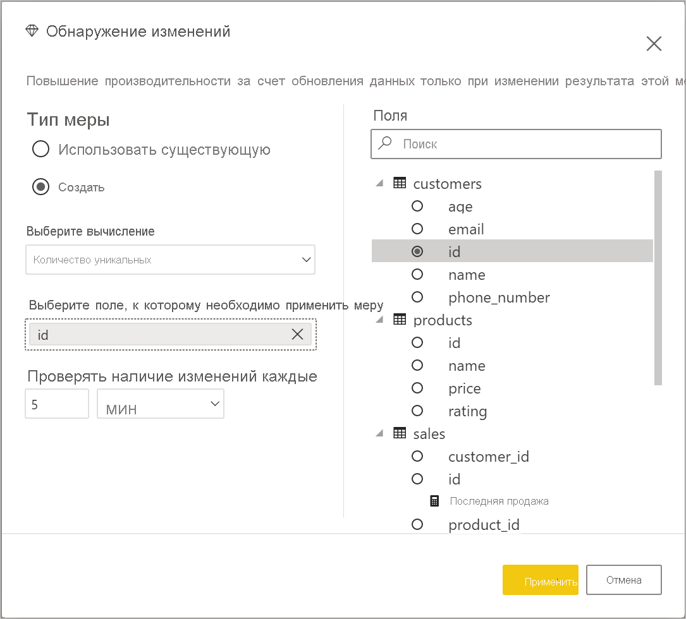

# Автоматическое обновление страниц в Power BI Desktop 

При мониторинге критических событий важно обновлять данные сразу после обновления исходных данных. Например, в промышленности важно знать, когда оборудование работает со сбоями или в близком к этому состоянии.

Функция автоматического обновления страниц в Power BI позволяет с заранее определенной периодичностью запрашивать на странице активного отчета новые данные для [источников DirectQuery](https://docs.microsoft.com/power-bi/desktop-directquery-about).

## Использование автоматического обновления страниц

Автоматическое обновление страницы доступно только для источников данных DirectQuery.

Чтобы использовать автоматическое обновление страницы, выберите страницу отчета, для которой необходимо включить обновление. На панели **Визуализации** нажмите кнопку **Форматирование** (значок с изображением валика) и найдите параметр **Обновление страницы** в нижней части панели. 

На следующем рисунке показана карта **Обновление страницы**. Нумерованные элементы описаны после изображения.

1.    Включение или отключение обновления страницы.
2.    Числовое значение, установленное для интервала обновления страницы.
3.    Единица для интервала обновления страницы.

На этой карте можно включить обновление страницы и выбрать его длительность. Значение по умолчанию составляет 30 минут. (Минимальный интервал периода обновления — одна секунда.) Отчет начнет обновляться с заданным интервалом. 

## Определение интервала обновления страницы

Если автоматическое обновление страницы включено, Power BI Desktop постоянно отправляет запросы в источник DirectQuery. Между отправкой запроса и получением возвращенных данных существует задержка. Поэтому для коротких интервалов обновления следует убедиться, что запросы успешно возвращают запрашиваемые данные в течение заданного интервала. Если данные не возвращаются в течение этого интервала, визуальные элементы будут обновляться реже, чем настроено.

Рекомендуется, чтобы интервал обновления соответствовал как минимум ожидаемой частоте поступления новых данных:

* если новые данные поступают в источник каждые 20 минут, то интервал обновления не может быть меньше 20 минут; 

* если новые данные поступают каждую секунду, установите длительность интервала в одну секунду. 

Для небольших интервалов обновления, таких как одна секунда, следует учитывать следующие факторы:
- тип источника данных DirectQuery;
- загрузку от запросов;
- расстояние от средства просмотра отчетов до центра обработки данных емкости. 

Вы можете оценить время возврата с помощью Анализатора производительности в Power BI Desktop. Анализатор производительности позволяет проверить, достаточно ли времени у каждого визуального запроса, чтобы вернуться с результатом из источника, и на что это время потрачено. Учитывая результаты Анализатора производительности, можно настраивать источник данных, а также экспериментировать с другими визуальными элементами и мерами в отчете.

На этом изображении показаны результаты DirectQuery в Анализаторе производительности:

Рассмотрим некоторые другие характеристики этого источника данных: 

-    Данные поступают с частотой в две секунды. 
-    Анализатор производительности показывает максимальное общее время запроса и отображения — примерно 4,9 с (4,688 мс). 
-    Источник данных настроен для обработки приблизительно 1000 одновременных запросов в секунду. 
-    Предполагается, что примерно 10 пользователей будут одновременно просматривать отчет.

Таким образом, в результате будет использоваться следующее уравнение:

**5 визуальных элементов x 10 пользователей = приблизительно 50 запросов**

Этот показатель приводит к значительно большей загрузке, чем может поддерживать источник данных. Данные поступают с частотой в две секунды, поэтому это должна быть ваша частота обновления. Однако, так как выполнение запроса занимает около пяти секунд, следует установить частоту обновления длительностью более пяти секунд. 

Также обратите внимание, что этот результат может отличаться при публикации отчета в службе. Данное различие возникает из-за того, что в отчете будет использоваться экземпляр Azure Analysis Services, размещенный в облаке. Вы можете настроить частоту обновления соответственно. 

Для учета запросов и времени обновления Power BI будет выполнять следующий запрос на обновление только после завершения всех оставшихся запросов на обновление. Таким образом, даже если интервал обновления короче времени обработки ваших запросов, Power BI будет выполнять следующее обновление только по завершении оставшихся запросов. 

Теперь рассмотрим, как можно обнаружить и диагностировать проблемы с производительностью в качестве администратора емкости. Вы также можете ознакомиться с разделом [часто задаваемых вопросов по автоматическому обновлению страницы](#frequently-asked-questions) далее в этой статье, чтобы рассмотреть дополнительные вопросы и ответы о производительности и устранении неполадок.

## Автоматическое обновление страницы в службе Power BI

Вы также можете задать интервалы автоматического обновления страниц для отчетов, созданных в Power BI Desktop и опубликованных в службе Power BI. 

Чтобы настроить автоматическое обновление страниц для отчетов в службе Power BI, используйте те же шаги, что и для Power BI Desktop. При настройке в службе Power BI автоматическое обновление страницы также поддерживает содержимое [Embedded Power BI](../developer/embedded/embedding.md). На этом изображении показана конфигурация **обновления страниц** для службы Power BI:

Эти описания соответствуют пронумерованным элементам: 

1.    Включение или отключение обновления страницы.
2.    Числовое значение для интервала обновления страницы. (Должно быть целым числом.)
3.    Единица интервала для обновления страницы.

### Интервалы обновления страницы

Интервалы обновления страницы, разрешенные в службе Power BI, зависят от типа рабочей области отчета. Это относится к следующим отчетам:

* Публикация отчета в рабочей области, для которой включено автоматическое обновление страниц.
* Изменение интервала обновления страницы уже в рабочей области.
* Создание отчета непосредственно в службе.

Power BI Desktop не имеет ограничений для интервалов обновления. Вы можете задать обновление раз в секунду. При публикации отчетов в службе Power BI применяются определенные ограничения. Эти ограничения описаны в следующих разделах.

### Ограничения для интервалов обновления

В службе Power BI ограничения автоматического обновления страниц применяются в зависимости от таких факторов, как рабочая область, и от того, используются ли службы уровня "Премиум".

Чтобы понять, как работают эти ограничения, давайте сначала рассмотрим общие сведения о емкостях и рабочих областях.

*Емкости* — важная концепция Power BI. Они представляют собой набор ресурсов (хранилище, процессор и память), используемые для размещения и доставки содержимого Power BI. Емкости могут быть общими или выделенными. *Общая емкость* используется всеми пользователями Майкрософт. *Выделенная емкость* предназначена только для одного клиента. Сведения о выделенных емкостях см. в статье [Управление емкостями Premium](../admin/service-premium-capacity-manage.md).

В общей емкости рабочие нагрузки выполняются на вычислительных ресурсах, совместно используемых другими пользователями. Так как емкость должна предоставлять общий доступ к ресурсам, для обеспечения *честной игры* установлены определенные ограничения, например максимальный размер модели (1 ГБ) и максимальная частота ежедневного обновления (восемь раз в день).

Рабочие области *Power BI* находятся в пределах емкости и представляют собой контейнеры безопасности, совместной работы и развертывания. У каждого пользователя Power BI есть личная рабочая область, так называемая **Моя рабочая область**. Для обеспечения совместной работы и выполнения развертывания можно создавать дополнительные рабочие области. Они называются *рабочими областями*. По умолчанию рабочие области, включая личные рабочие области, создаются в общей емкости.

Ниже приведены некоторые сведения о двух сценариях использования рабочей области.

**Общие рабочие области**. Для обычных рабочих областей (которые не являются частью емкости Premium) автоматическое обновление страницы имеет минимальный интервал в 30 минут (минимально допустимый интервал).

**Рабочие области Premium**. Доступность автоматического обновления страниц в рабочих областях Premium будет зависеть от параметров рабочей нагрузки, настроенных администратором для емкости Power BI Premium. Существует две переменные, которые могут повлиять на возможность настройки автоматического обновления страницы:

 - **Включение и выключение функций**. Если администратор емкости отключил эту функцию, вы не сможете настроить какой-либо тип обновления страницы в опубликованном отчете.

 - **Минимальный интервал обновления**. При включении функции администратору емкости необходимо настроить минимальный интервал обновления. Если интервал меньше минимального значения, служба Power BI переопределяет интервал в соответствии с минимальным интервалом, установленным администратором емкости. Это переопределение указано в таблице ниже как "Администратор емкости переопределяет". 

В этой таблице подробно описано, где доступна эта функция, а также указаны ограничения для каждого типа емкости и [режима хранения](../connect-data/service-dataset-modes-understand.md).

| Режим хранения | Выделенное место | Общая емкость |
| --- | --- | --- |
| DirectQuery | **Поддерживается**: Да  **Минимальный интервал обновления**: 1 с  **Переопределение администратором емкости** : Да | **Поддерживается**: Да  **Минимальный интервал обновления**: 30 минут  **Переопределение администратором емкости** : Нет |
| Импорт | **Поддерживается**: Нет  **Минимальный интервал обновления**: Недоступно  **Переопределение администратором емкости** : Недоступно | **Поддерживается**: Нет  **Минимальный интервал обновления**: Недоступно  **Переопределение администратором емкости** : Недоступно |
| Смешанный режим (DirectQuery + другие источники данных) | **Поддерживается**: Да  **Минимальный интервал обновления**: 1 с  **Переопределение администратором емкости** : Да | **Поддерживается**: Да  **Минимальный интервал обновления**: 30 минут  **Переопределение администратором емкости** : Нет |
| Live Connect AS | **Поддерживается**: Нет  **Минимальный интервал обновления**: Недоступно  **Переопределение администратором емкости** : Недоступно | **Поддерживается**: Нет  **Минимальный интервал обновления**: Недоступно  **Переопределение администратором емкости** : Недоступно |
| Live Connect PBI | **Поддерживается**: Нет  **Минимальный интервал обновления**: Недоступно  **Переопределение администратором емкости** : Недоступно | **Поддерживается**: Нет  **Минимальный интервал обновления**: Недоступно  **Переопределение администратором емкости** : Недоступно |

> [!NOTE]
> При публикации отчета с включенным автоматическим обновлением страницы из Power BI Desktop в службу необходимо предоставить учетные данные для источника данных DirectQuery в меню параметров набора данных.

## Рекомендации и ограничения

При использовании автоматического обновления страницы в Power BI Desktop или в службе Power BI необходимо учитывать несколько моментов:

* Режимы хранения Import, LiveConnect и Push не поддерживаются для автоматического обновления страниц.  
* Поддерживаются составные модели, имеющие по крайней мере один источник данных DirectQuery.
* Power BI Desktop не имеет ограничений для интервалов обновления. Вы можете даже задать обновление раз в секунду. При публикации отчетов в службе Power BI применяются определенные ограничения, описанные [выше](#restrictions-on-refresh-intervals) в этой статье.

### Диагностика производительности

Автоматическое обновление страницы полезно для задач мониторинга и изучения быстро меняющихся данных. Но иногда это может привести к чрезмерной загрузке емкости или источника данных.

Для предотвращения чрезмерной загрузки источников данных в Power BI предусмотрены следующие меры защиты:

- Все автоматические запросы на обновление страниц выполняются с более низким приоритетом, чтобы интерактивные запросы (например, загрузка страниц и перекрестная фильтрация визуальных элементов) были приоритетными.
- Если запрос не был завершен до следующего цикла обновления, Power BI не выдает новые запросы на обновление до тех пор, пока не завершится предыдущий запрос. Например, если установлен интервал обновления в одну секунду и запросы в среднем занимают четыре секунды, Power BI фактически выдает запрос каждые четыре секунды.

Существует две области, в которых можно по-прежнему столкнуться со снижением производительности:

1. **Емкость**. Сначала запрос достигает емкости Premium, которая вычисляет и оценивает запрос DAX, сгенерированный из визуализаций отчета, преобразовывая его в запросы источника.
2. **Источник данных DirectQuery**. Преобразованные запросы на предыдущем шаге выполняются в источнике, в частности в экземплярах SQL Server, SAP Hana и т. д.

С помощью [приложения метрик Premium](../admin/service-admin-premium-monitor-capacity.md), доступного для администраторов, можно визуализировать, какая часть емкости используется низкоприоритетными запросами.

Низкоприоритетные запросы состоят из автоматических запросов обновления страниц и запросов обновления модели. В настоящее время нет способа отличить загрузку от запросов автоматического обновления страниц и запросов обновления модели.

Если вы заметили, что емкость перегружается низкоприоритетными запросами, можно выполнить несколько действий:

- Запросите больший SKU Premium.
- Обратитесь к владельцу отчета и попросите уменьшить интервал обновления.
- На портале администрирования емкости можно выполнить следующее.
   - Отключить автоматическое обновление страниц для этой емкости.
   - Увеличить минимальный интервал обновления, который будет влиять на все отчеты в этой емкости.

### Часто задаваемые вопросы

**Я автор отчета. Для интервала обновления отчета установлено значение одна секунда в Power BI Desktop, но после публикации отчет не обновляется в службе.**

* Убедитесь, что для страницы включено автоматическое обновление. Так как этот параметр задается для каждой страницы, необходимо убедиться, что он включен для каждой страницы в отчете, которую вы хотите обновить.
* Убедитесь, что вы отправили данные в рабочую область с подключенной емкостью Premium. Если нет, то интервал обновления будет соответствовать 30 минутам.
* Если отчет находится в рабочей области Premium, обратитесь к администратору, чтобы включить эту функцию для подключенной емкости. Кроме того, убедитесь, что минимальный интервал обновления для емкости меньше или совпадает с интервалом, установленным для отчета.

**Я являюсь администратором емкости. Параметры автоматического обновления страницы были изменены, но они не отражаются. Иными словами, отчеты по-прежнему обновляются с неправильной частотой или не обновляются, хотя эта функция была включена.**

* Изменения параметров автоматического обновления страницы, сделанные в пользовательском интерфейсе администратора емкости, распространяются на отчеты в течение 5 минут.
* Автоматическое обновление страниц нужно включить не только для емкости, но и для необходимых страниц отчета.

**Мой отчет работает в смешанном режиме. (Это означает, что в отчете есть подключение DirectQuery и импорт источника данных.) Некоторые визуальные элементы не обновляются.**

- Это ожидаемое поведение, если визуальные элементы ссылаются на таблицы Import. Автоматическое обновление страницы не поддерживается для режима Import.
- Ознакомьтесь с первым вопросом в этом разделе.

**Отчет успешно обновлялся в службе, а затем внезапно перестал.**

* Попробуйте обновить страницу, чтобы увидеть, устраняется ли проблема самостоятельно.
* Обратитесь к администратору емкости. Возможно, он отключил эту функцию или увеличил минимальный интервал обновления. (Ознакомьтесь со вторым вопросом в этом разделе.)

**Я автор отчета. Мои визуальные элементы не обновляются с заданной периодичностью. Они обновляются с более низкой частотой.**

* Если выполнение запросов длится дольше, интервал обновления будет отложен. Автоматическое обновление страницы ожидает завершения всех запросов перед выполнением новых.
* Администратор емкости может установить минимальный интервал обновления, превышающий заданный в отчете. Обратитесь к администратору емкости и попросите его снизить минимальный интервал обновления.

**Запросы автоматического обновления страниц выполняются из кэша?**

* Нет. Все запросы автоматического обновления страницы обходят любые кэшированные данные.

## Дальнейшие действия

Дополнительные сведения вы найдете в следующих статьях:

* [Использование DirectQuery в Power BI](../connect-data/desktop-directquery-about.md)
* [Использование составных моделей в Power BI Desktop](../transform-model/desktop-composite-models.md)
* [Use Performance Analyzer to examine report element performance](desktop-performance-analyzer.md) (Проверка производительности элементов отчета с помощью Анализатора производительности)
* [Развертывание емкостей Power BI Premium и управление ими](../guidance/whitepaper-powerbi-premium-deployment.md)
* [Data sources in Power BI Desktop](../connect-data/desktop-data-sources.md) (Источники данных в Power BI Desktop)
* [Формирование и объединение данных в Power BI Desktop](../connect-data/desktop-shape-and-combine-data.md)
* [Подключение к данным Excel в Power BI Desktop](../connect-data/desktop-connect-excel.md)   
* [Ввод данных непосредственно в Power BI Desktop](../connect-data/desktop-enter-data-directly-into-desktop.md)   
