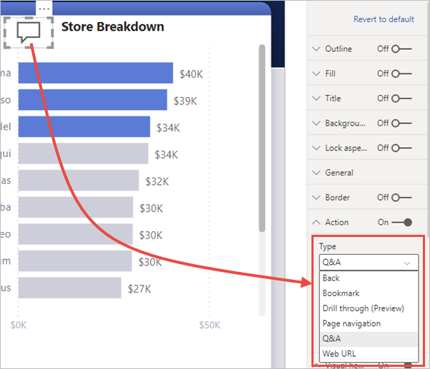

# Использование кнопок в Power BI
С помощью **кнопок** в Power BI можно создавать отчеты, которые работают как приложения. С их помощью вы можете создать удобную среду, где пользователи могут эффективно взаимодействовать мышью с элементами Power BI. В **Power BI Desktop** и в **службе Power BI** можно добавлять кнопки в отчеты. При совместном использовании отчетов в службе Power BI они позволяют работать с отчетами, как с приложениями.

## Создание кнопок в отчетах

### Создание кнопки в Power BI Desktop

Чтобы создать кнопку в **Power BI Desktop**, на ленте **Вставка** выберите элемент **Кнопки**. Появится раскрывающееся меню, где вы сможете выбрать нужные кнопки из доступных вариантов, как показано на следующем рисунке. 

### Создание кнопки в службе Power BI

Чтобы создать кнопку в **службе Power BI**, откройте отчет в режиме правки. В меню сверху выберите элемент **Кнопки**. Появится раскрывающееся меню, где вы сможете выбрать нужные кнопки из доступных вариантов, как показано на следующем рисунке. 

## Настройка кнопки

Независимо от того, создается ли кнопка в Power BI Desktop или в службе Power BI, остальная часть процесса будет одинаковой. Когда вы выбираете кнопку на холсте отчета, в панели **Визуализации** отображаются разнообразные варианты настройки кнопки под ваши нужды. Например, вы можете добавить **Текст кнопки**, переместив ползунок соответствующей карточки в панели **Визуализации**. Вы также можете изменить значок кнопки, ее заливку, заголовок и действие, выполняемое при нажатии кнопки в отчете, а также другие параметры.

## Задание свойств кнопки при бездействии, наведении и выборе

У кнопок в Power BI есть три состояния: по умолчанию (кнопка не выбрана, и на нее не наведен указатель мыши), при наведении указателя мыши и при выборе (при *щелчке* по кнопке мышью). Многие карточки в панели **Визуализации** можно изменять на основе этих трех состояний. Таким образом, вы получаете значительную гибкость для индивидуальной настройки кнопок.

Следующие карточки в панели **Визуализации** позволяют изменять формат и поведение кнопки в зависимости от трех ее состояний.

* Текст кнопки
* Значок
* Контур
* Заполнить

Чтобы настроить отображение кнопки для каждого состояния, разверните любую из этих карточек и откройте раскрывающийся список в ее верхней части. На следующем рисунке показана развернутая карточка **Значок** с раскрывающимся списком, содержащим три состояния кнопки.

## Выбор действия для кнопки

Вы можете выбрать действие, которое будет выполнено, когда пользователь нажмет кнопку в Power BI. Возможные действия для кнопки находятся в карточке **Действие** в панели **Визуализации**.

Для кнопок доступны следующие действия.

- **Назад** — возвращает пользователя на предыдущую страницу отчета. Это полезно для детализации страниц.
- **Закладка** — открывает страницу по закладке, заданной для текущего отчета. См. [дополнительные сведения о закладках в Power BI](desktop-bookmarks.md). 
- **Детализация (Предварительная версия)**  — открывает страницу детализации, отфильтрованной по выбранному содержимому, без использования закладок. См. [дополнительные сведения о кнопках детализации в отчетах](desktop-drill-through-buttons.md).
- **Перемещение по страницам** — переход на другую страницу в отчете без использования закладок. Дополнительные сведения см. в разделе [Создание перемещения по страницам](#create-page-navigation) данной статьи.
- **Вопросы и ответы** — открывает окно **обозревателя вопросов и ответов**. 

Для определенных кнопок действие по умолчанию выбирается автоматически. Например, для кнопки типа **Вопросы и ответы** как действие по умолчанию автоматически выбирается **Вопросы и ответы**. Дополнительные сведения об **Обозревателе вопросов и ответов** см. в [этой записи блога](https://powerbi.microsoft.com/blog/power-bi-desktop-april-2018-feature-summary/#Q&AExplorer).

Чтобы опробовать созданные для отчета кнопки, нажимайте их, удерживая клавишу *CTRL*. 

### Перемещение по страницам

С помощью **действия** типа **Перемещение по страницам** можно быстро создать всю навигацию без использования закладок.

Чтобы настроить кнопку перемещения по страницам, создайте кнопку с типом действия **Перемещение по страницам** и выберите страницу **назначения**.

Можно быстро создать настраиваемую область навигации. Вам не нужно изменять закладки и управлять ими, если потребуется изменить отображаемые страницы в области навигации.

Кроме того, можно применить условное форматирование к подсказке — так же, как в случае с другими типами кнопок.

## Дальнейшие действия
Дополнительные сведения о похожих функциях и о взаимодействии с кнопками см. в следующих статьях.

* [Использование детализации в отчетах Power BI](desktop-drillthrough.md)
* [Использование закладок для обмена аналитическими сведениями и создания историй в Power BI](desktop-bookmarks.md)

