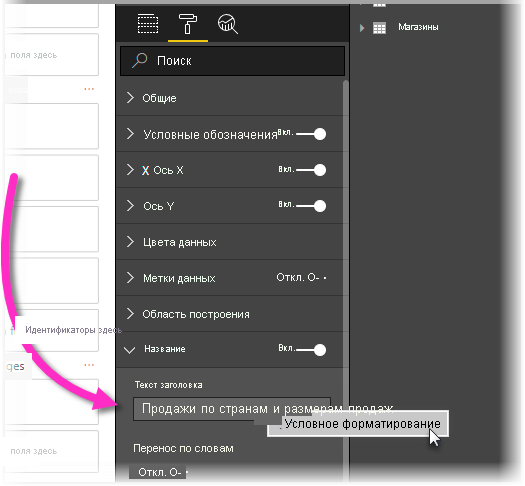
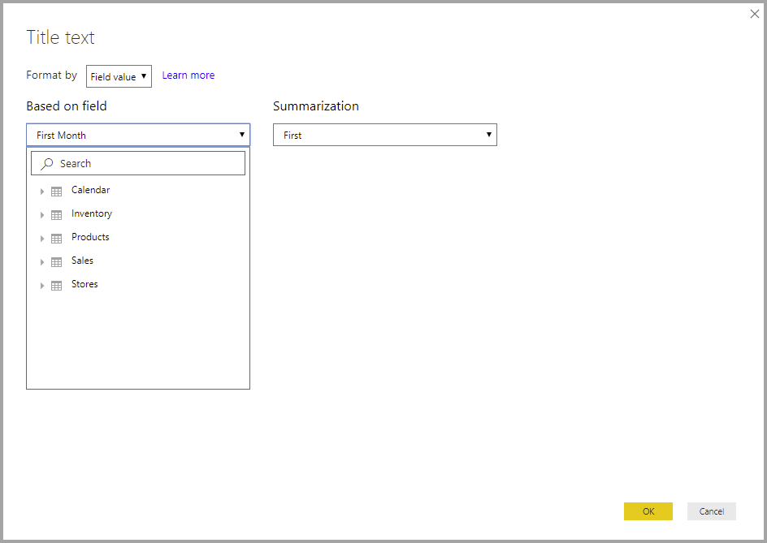

# <a name="expression-based-titles-in-power-bi-desktop"></a>Заголовки на основе выражений в Power BI Desktop

Вы можете создавать динамические настраиваемые заголовки для визуальных элементов Power BI. Создавая выражения анализа данных (DAX), основанные на полях, переменных или других программных элементах, можно обеспечить автоматическую настройку заголовков визуальных элементов по мере необходимости. Эти изменения основаны на фильтрах, выделении выбранных фрагментах, а также других действиях и конфигурациях пользователя.



Создание динамических заголовков, *иногда называемых заголовками на основе выражений*, является достаточно простым. 

## <a name="create-a-field-for-your-title"></a>Создание поля для заголовка

Первым шагом при создании заголовка на основе выражений является создание поля в модели для использования для заголовка. 

Существует множество творческих способов добиться того, чтобы заголовок визуального элемента отражал ваши мысли или намерения. Давайте рассмотрим пару примеров.

Вы можете создать выражение, которое изменяется в зависимости от контекста фильтра, который визуальный элемент получает для фирменного названия продукта. На следующем рисунке показана формула DAX для такого поля.


Другой пример — использование динамического заголовка, который изменяется в зависимости от языка пользователя или языка и региональных параметров. Вы можете создавать заголовки для конкретного языка в мере DAX с помощью функции `USERCULTURE()`. Эта функция возвращает код языка и региональных параметров для пользователя на основе его параметров браузера или операционной системы. Для выбора правильного переведенного значения можно использовать следующую инструкцию switch DAX. 

```
SWITCH (
  USERCULTURE(),
  "de-DE", “Umsatz nach Produkt”,
  "fr-FR", “Ventes par produit”,
  “Sales by product”
)
```

Либо можно извлечь строку из таблицы подстановки, содержащей все переводы. Вы сами помещаете эту таблицу в модель. 

Это всего лишь несколько примеров, которые можно использовать для создания динамических заголовков на основе выражений для визуальных элементов в Power BI Desktop. Использование заголовков ограничено только вашим воображением и моделью.


## <a name="select-your-field-for-your-title"></a>Выбор поля для заголовка

После создания выражения DAX для поля, созданного в модели, его нужно применить к заголовку визуального элемента.

Чтобы выбрать поле и применить его, перейдите в область **Визуализации**. В области **Формат** выберите **Заголовок**, чтобы отобразить параметры заголовка для визуального элемента. 

Если щелкнуть **Текст заголовка** правой кнопкой мыши, появляется контекстное меню, позволяющее выбрать **<em>fx</em>Условное форматирование**. При выборе этого пункта меню отображается диалоговое окно **Текст заголовка**. 



В этом окне можно выбрать поле, которое вы создали для заголовка.

## <a name="limitations-and-considerations"></a>Рекомендации и ограничения

У текущей реализации заголовков на основе выражений для визуальных элементов существует несколько ограничений:

* Форматирование на основе выражений сейчас не поддерживается в визуальных элементах Python, визуальных элементах R и визуальном элементе ключевых факторов влияния.
* Создаваемое для заголовка поле должно иметь строковый тип данных. Меры, возвращающие числа или дату и время (или любой другой типы данных), сейчас не поддерживаются.
* Заголовки на основе выражений не переносятся при закреплении визуального элемента на панели мониторинга.

## <a name="next-steps"></a>Дальнейшие действия

В этой статье описано создание выражений DAX, превращающих заголовки визуальных элементов в динамические поля, которые могут изменяться по мере взаимодействия пользователей с отчетами. Рекомендуем также ознакомиться со следующими статьями:

* [Условное форматирование в таблицах](desktop-conditional-table-formatting.md)
* [Использование детализации между отчетами в Power BI Desktop](desktop-cross-report-drill-through.md)
* [Использование детализации в Power BI Desktop](desktop-drillthrough.md)
