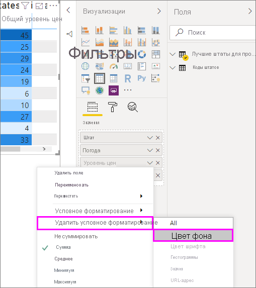
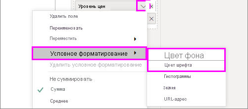
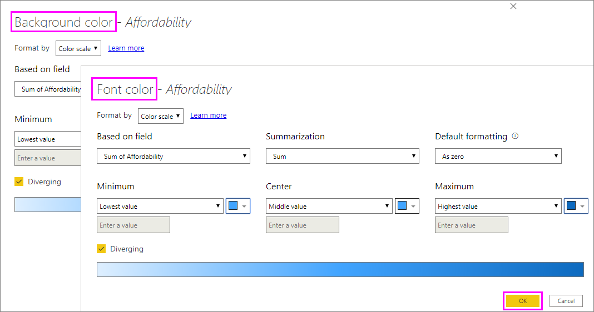
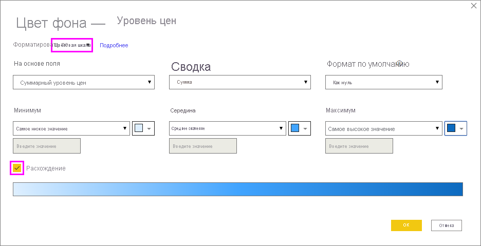
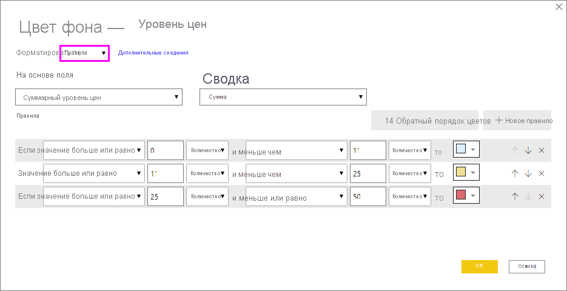
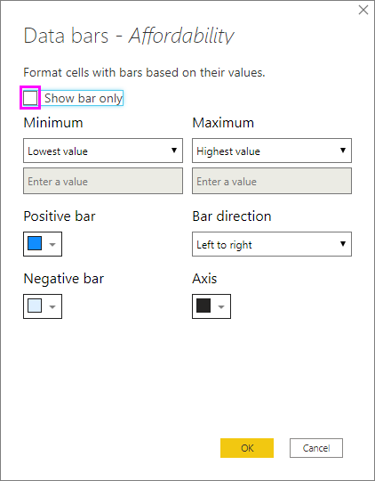
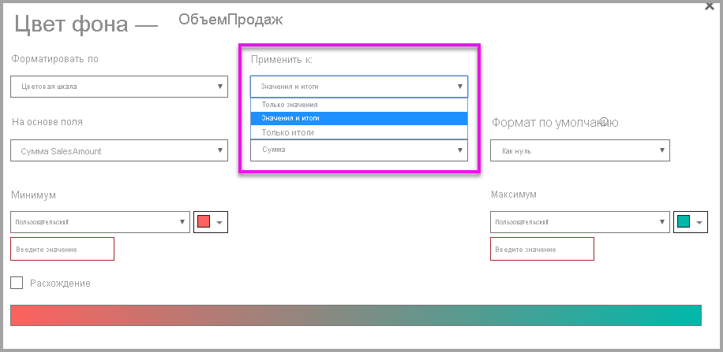

# Использование условного форматирования в таблицах 

С помощью условного форматирования в таблицах Power BI Desktop можно задать настраиваемые цвета ячеек на основе значений ячеек, в том числе градиент цветов. Значения ячеек также можно представить с помощью гистограмм или значков ключевых показателей эффективности или в виде активных веб-ссылок. Можно применить условное форматирование к любому тексту или полю данных при условии, что форматирование основано на поле, которое имеет числовой формат, имя цвета или шестнадцатеричный код или URL-адрес в Интернете. 

Чтобы применить условное форматирование, выберите визуализацию **таблицы** или **матрицы** в Power BI Desktop. В разделе **Поля** панели **Визуализации** щелкните правой кнопкой мыши или щелкните стрелку вниз рядом с полем **Значения**, которое нужно отформатировать. Выберите **Условное форматирование**, а затем выберите тип форматирования, который нужно применить.

> [!NOTE]
> Условное форматирование переопределяет любой пользовательский фон или цвет шрифта, который применяется к ячейке с условным форматированием.

Чтобы удалить условное форматирование из визуализации, повторно щелкните правой кнопкой мыши поле, выберите пункт **Удалить условное форматирование**, а затем выберите тип удаляемого форматирования.

В следующих разделах описывается каждый из этих параметров условного форматирования. В одном столбце таблицы можно объединить более одного параметра.

## Форматирование фона или цвета шрифта

Чтобы форматировать фон ячейки или цвет шрифта, выберите **Условное форматирование** для поля, а затем выберите **Цвет фона** или **Цвет шрифта** в раскрывающемся меню. 

Откроется диалоговое окно **Цвет фона**  или **Цвет шрифта** с именем поля, для которого выполняется форматирование в заголовке. После выбора параметров условного форматирования выберите **ОК**. 

Параметры **Цвет фона** и **Цвет шрифта** совпадают, но влияют на цвет фона ячейки и цвет шрифта соответственно. К цвету шрифта и цвету фона поля можно применить одно то же или разное условное форматирование. Если вы задаете один и тот же цвет для шрифта и фона поля, то шрифт смешивается с фоном, поэтому в столбце таблицы отображаются только цвет.

## Цвет по цветовой шкале

Чтобы отформатировать фон ячейки или цвет шрифта по цветовой шкале, в поле **Форматировать по** в диалоговом окне **Цвет фона** или **Цвет шрифта** выберите **Цветовая шкала**. В разделе **На основе поля** выберите поле, на основе которого будет выполнено форматирование. Форматирование можно выполнить на основе текущего поля или любого поля модели, имеющего числовые или цветовые данные. 

В разделе **Формирование сводных данных** укажите тип агрегирования, который будет использоваться для выбранного поля. В разделе **Формат по умолчанию** выберите форматирование, которое нужно применить к пустым значениям. 

В разделе **Минимум** и **Максимум** выберите, следует ли применять цветовую схему на основе наименьших или максимальных значений полей, или на введенных вами значениях. Раскройте и выберите образцы цветов, которые необходимо применить к минимальному и максимальному значениям. Установите флажок **Расхождение**, чтобы также указать значение и цвет **Центра**. 

Пример таблицы, в которой форматирование фона по цветовой шкале выполнено на основе столбца **Доступность**, выглядит следующим образом.

Пример таблицы, в которой форматирование шрифта по цветовой шкале выполнено на основе столбца **Доступность**, выглядит следующим образом.

## Цвет в зависимости от правил

Чтобы отформатировать фон ячейки или цвет шрифта по правилам, в поле **Форматировать по** в диалоговом окне **Цвет фона** или **Цвет шрифта** выберите **Правила**. Опять же, **На основе поля** отображает поле, на котором будет основано форматирование, а **Сводные данные** показывают тип агрегирования для поля. 

В разделе **Правила** введите один или несколько диапазонов значений и задайте цвет для каждого из них. Каждый диапазон значений содержит условие *Если значение*, условие значения *и* и цвет. Фоны или шрифты ячейки в каждом диапазоне значений окрашены в заданный цвет. В следующем примере есть три правила.

Пример таблицы, в которой форматирование фона по правилам выполнено на основе столбца **Доступность**, выглядит следующим образом.

## Цвет по значениям цветов

Если существует поле или мера с названием цвета или шестнадцатеричным значением, можно использовать условное форматирование для автоматического применения этих цветов к фону или цвету шрифта столбца. Можно также использовать настраиваемую логику для применения цветов к шрифту или фону.

Поле может использовать любые значения цвета, перечисленные в спецификации цвета CSS, в [https://www.w3.org/TR/css-color-3/](https://www.w3.org/TR/css-color-3/). Эти цвета могут включать следующее.
- 3, 6 или 8-значные шестнадцатеричные коды, например #3E4AFF. В начале кода должен стоять символ #. 
- Значения RGB или RGBA, например RGBA(234, 234, 234, 0.5).
- Значения HSL или HSLA, например HSLA(123, 75%, 75%, 0.5).
- Имена цветов, такие как Green, SkyBlue или PeachPuff. 

Следующая таблица содержит имя цвета, связанное с каждым состоянием. 

Чтобы форматировать **цвет** столбца на основе значений полей, выберите **Условное форматирование** для поля **Цвет**, а затем выберите **Цвет фона** или **Цвет шрифта**. 

В диалоговом окне **Цвет фона** или **Цвет шрифта** выберите **Значение поля** в раскрывающемся поле **Форматировать по**.

Пример таблицы, в которой форматирование **цвета фона** по цвету поля выполнено на основе поля **Цвет**, выглядит следующим образом.

Если вы также используете **Значение поля** для форматирования **цвета шрифта** столбца, результатом будет сплошной цвет в столбце **Цвет**.

## Цвет на основе вычисления

Кроме того, вы можете создать вычисление, которое будет выводить шестнадцатеричные коды на основе бизнес-логики в зависимости от выбранных условий. Обычно создать формулу проще, чем создать нескольких правил в диалоговом окне условного форматирования. 

Например, следующая формула применяет шестнадцатеричные значения цвета к новому столбцу **Ранг доступности**, основанному на существующих значениях столбца **Доступность**.

Чтобы применить эти цвета, выберите условное форматирование на основе **цвета фона** или **цвета шрифта** в столбце **Доступность**, а также выберите форматирование на основе **Значения поля** в колонке **Ранг доступности**. 

Пример таблицы с цветом фона столбца **Доступность**, вычисленном на основе **Ранга доступности**, выглядит следующим образом.

Вы можете создать множество разновидностей, используя лишь ваше воображение и некоторые вычисления.

## Добавление гистограмм

Чтобы отобразить гистограммы на основе значений ячеек, выберите **Условное форматирование** в поле **Доступность**, а затем в раскрывающемся меню выберите **Гистограммы данных**. 

В диалоговом окне **Гистограммы данных** по умолчанию флажок **Показывать только гистограммы** снят, поэтому в ячейке таблицы отображаются как гистограммы, так и фактические значения. Чтобы отображались только гистограммы данных, установите флажок **Показывать только гистограмму**.

Можно указать значения **Минимум** и **Максимум**, цвета и направление гистограммы, а также цвет оси. 

Так как гистограммы применимы к столбцу **Доступность**, пример таблицы выглядит следующим образом.

## Добавление значков

Чтобы отобразить значки на основе значений ячеек, выберите **Условное форматирование** в поле, а затем в раскрывающемся меню выберите **Значки**. 

В диалоговом окне **Значки** в разделе **Форматировать по** выберите либо **Правила** либо **Значение поля**. 

Чтобы выполнить форматирование по правилам, выберите **На основе поля**, метод **Суммирование**, **Макет значка**, **Выравнивание значка**, **Стиль** значка и одно или несколько **Правил**. В разделе **Правила** введите одно или несколько правил с условием *Если значение*, а также условием значения *и* и выберите значок, который будет применяться к каждому правилу. 

Чтобы выполнить форматирование по значениям полей, выберите **На основе поля**, метод **Суммирование**, **Макет значка** и **Выравнивание значка**.

В следующем примере добавляются значки на основе трех правил.

Выберите **ОК**. При применении значков к столбцу **Доступность** с использованием правил пример таблицы выглядит следующим образом.

## Форматирование активных ссылок

Если у вас есть столбец или мера, содержащие URL-адреса веб-сайтов, вы можете применить условное форматирование, чтобы отображать эти URL-адреса как активные ссылки. Например, в следующей таблице содержится столбец **Веб-сайт** с URL-адресами для каждого состояния.

Чтобы отобразить имя каждого состояния в виде действующей ссылки на веб-сайт, выберите **Условное форматирование** для поля **Состояние**, а затем выберите **URL-адрес в Интернете**. В диалоговом окне **URL-адрес в Интернете** в разделе **На основе поля** выберите **Веб-сайт**, а затем выберите **ОК**. 

При использовании **URL-адреса в Интернете**, применяемого к полю **Состояние**, каждое имя состояния является активной ссылкой на его веб-сайт. В следующем примере таблица применяет форматирование поля **URL-адрес в Интернете** к столбцу **Состояние**, а также условные **Гистограммы** и **Форматирование фона** к столбцу **Доступность**. 

## Итоги и подытоги

Начиная с выпуска апрельского релиза 2020 года можно применять правила условного форматирования к итогам и промежуточным итогам для визуальных элементов таблицы и матрицы. 

Правила условного форматирования применяются с помощью раскрывающегося списка **Применить к** в условном форматировании, как показано на следующем рисунке.

Необходимо вручную задать пороговые значения и диапазоны для правил условного форматирования. Для матриц **Значения** будут ссылаться на самый нижний видимый уровень иерархии матрицы.

## Рекомендации и ограничения
При работе с условным форматированием таблиц следует помнить о ряде моментов:

- Условное форматирование применяется только к значениям визуальных элементов "Таблица" или "Матрица" и не применяется к промежуточным или общим итогам или полю **Итого**. 
- Любая таблица без группировки отображается в виде одной строки, которая не поддерживает условное форматирование.
- Вы не можете применить формат градиента с автоматическим вычислением максимального или минимального значения или форматирование на основе правил с использованием процента, если данные содержат значения *NaN*. NaN означает "не является числом" и чаще всего вызывается ошибкой деления на ноль. Чтобы избежать таких ошибок, можно использовать функцию [DIVIDE () DAX](https://docs.microsoft.com/dax/divide-function-dax).
- Для условного форматирования необходимо, чтобы к значению применялась агрегирование или мера. Вот почему вы видите "Первый" или "Последний" в примере **Цвет по значению**. Если отчет строится в многомерном кубе служб Analysis Service, вы не сможете использовать атрибут для условного форматирования, если владелец куба не создал меру, которая предоставляет это значение.

## Дальнейшие действия

Дополнительные сведения о форматировании цвета см. в следующей статье: [Советы и рекомендации по форматированию цветом в Power BI](../visuals/service-tips-and-tricks-for-color-formatting.md).  
