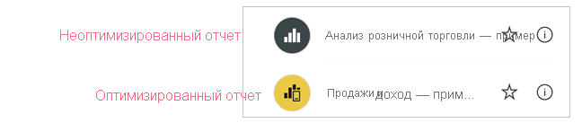
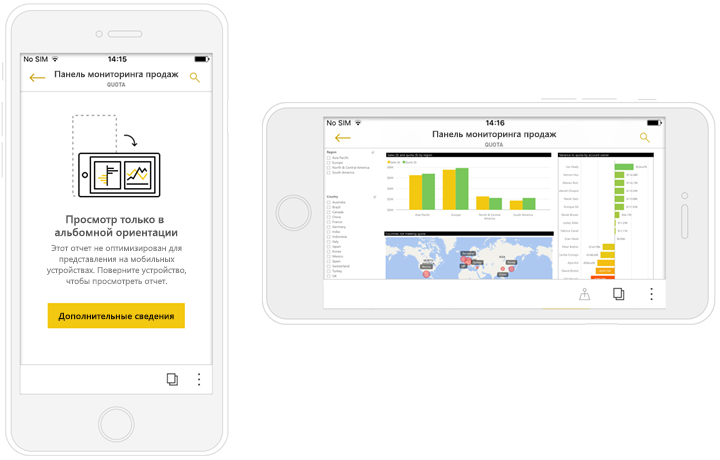

# Оптимизация отчетов Power BI для мобильных приложений
Пользователи мобильных устройств могут просматривать любую страницу отчета Power BI в альбомной ориентации. Однако авторы отчетов могут создать дополнительное представление, оптимизированное для мобильных устройств и дисплеев с книжной ориентацией. Этот вариант дизайна доступен как в службе Power BI Desktop, так и в службе Power BI. Он позволяет авторам выбирать и переупорядочивать только те визуальные элементы, которые необходимы для пользователей мобильных устройств, работающих вне офиса.

.

Power BI предоставляет ряд функций, помогающих создавать оптимизированные для мобильных устройств версии отчетов:
* макет для мобильных устройств, в котором можно создать отчет, оптимизированный для мобильных устройств, путем перетаскивания визуальных элементов на холст эмулятора телефона;
* визуальные элементы и срезы, которые можно оптимизировать для использования на небольших мобильных экранах.

Эти возможности позволяют проектировать и создавать привлекательные интерактивные отчеты, оптимизированные для мобильных устройств.

## Создание оптимизированной для мобильных устройств книжной версии страницы отчета

Первым шагом является проектирование и создание отчета в обычном веб-представлении. Создав отчет, вы можете оптимизировать его для использования на телефонах и планшетах.

Чтобы создать представление, оптимизированное для мобильных устройств, откройте представление макета для мобильных устройств:
   * В Power BI Desktop выберите ленту **Представление**,а затем **Макет для мобильных приложений**.
   * В службе Power BI выберите **Дополнительные параметры (...) > Изменить отчет > Макет для мобильных приложений**.

   Отобразится холст в форме телефона с возможностью прокрутки и панель **Визуализации**, в которой содержатся все визуальные элементы из исходной страницы отчета.

   .

* Каждый визуальный элемент в области **Визуализации** отображается с именем для простоты идентификации.
* Каждый визуальный элемент также имеет индикатор видимости. Индикатор видимости визуальных элементов изменяется в зависимости от состояния их видимости в текущем состоянии представления веб-отчетов. Индикатор видимости полезен при работе с закладками.

## Добавление визуальных элементов на холст макета для мобильных приложений
Чтобы добавить визуальный элемент в макет для мобильных приложений, перетащите его с панели **Визуализации** на холст телефона. При перетаскивании визуального элемента на холст он прикрепляется к сетке. Кроме того, можно дважды щелкнуть визуальный элемент в области визуализации, и он будет добавлен на холст.

Вы можете добавить некоторые или все визуальные элементы страницы веб-отчета на страницу отчета, оптимизированного для мобильных устройств. Каждый визуальный элемент можно добавить только один раз, и вам не нужно включать все визуальные элементы.

>[!NOTE]
> Вы можете перетаскивать на холст скрытые визуальные элементы. Они будут размещены, но не будут отображаться, если их состояние видимости не изменится в текущем представлении веб-отчета.

Визуальные элементы можно накладывать друг на друга для создания интерактивных отчетов с помощью закладок, а также привлекательных отчетов путем накладывания визуальных элементов на образы.

После размещения визуального элемента на холсте его размер можно изменить, перетащив маркеры, отображаемые вокруг края визуального элемента при его выборе. Чтобы сохранить пропорции визуального элемента при изменении размера, перетаскивая маркеры изменения размера, нажмите клавишу **SHIFT**.

На рисунке ниже показано, как перетащить визуальные элементы из панели **Визуализации** на холст, изменить их размер и наложить друг на друга.

   

Сетка отчета для мобильного телефона масштабируется на телефонах разных размеров. Отчет выглядит одинаково хорошо на телефонах и с маленькими, и с большими экранами.

## Удаление визуальных элементов с холста макета для мобильных приложений
Чтобы удалить визуальный элемент с макета для мобильных приложений, щелкните **X** в правом верхнем углу визуального элемента на холсте телефона или выберите визуальный элемент и нажмите кнопку **Удалить**.

Вы можете удалить все визуализации с холста, щелкнув значок ластика на панели **Визуализации**.

Визуальные элементы удаляются только с холста макета для мобильных приложений. Визуальные элементы по-прежнему отображаются в области визуализации. Исходный отчет остается без изменений.

## Настройка визуальных элементов и срезов для использования в отчетах, оптимизированных для мобильных устройств

### Визуальные элементы

По умолчанию многие визуальные элементы, в частности визуальные элементы типа диаграммы, являются адаптивными.  Это означает, что они динамически изменяются для отображения максимального объема данных и анализа, независимо от размера экрана.

При изменении размера визуального элемента служба Power BI определяет приоритеты в представлении данных. Например, она может автоматически удалять отступы и перемещать условные обозначения наверх, чтобы даже при уменьшении визуальный элемент оставался информативным.

 
Если по какой-то причине вы хотите отключить адаптивность, это можно сделать в разделе параметров формата визуального элемента **Общие**.

### срезы

Срезы помогают фильтровать данные отчета на холсте. При создании срезов в обычном режиме создания отчетов можно изменить некоторые параметры среза, чтобы сделать его более удобным для использования в отчетах, оптимизированных для мобильных устройств.
* Вы можете определить, следует ли разрешить читателям отчетов выбирать только один элемент или несколько элементов.
* Вы можете сделать срез вертикальным, горизонтальным или адаптивным (адаптивные срезы должны быть горизонтальными).

Если вы сделали срез адаптивным, в зависимости от его размеров и фигуры отображается разное количество параметров. Он может быть высоким, коротким, широким или узким. Если сделать его очень маленьким, он станет просто значком фильтра на странице отчета.

 
Дополнительные сведения о [создании адаптивных срезов](power-bi-slicer-filter-responsive.md).

## Публикация оптимизированного для мобильных устройств отчета
Чтобы опубликовать версию отчета, оптимизированного для мобильных устройств, [опубликуйте основной отчет из Power BI Desktop в службу Power BI](desktop-upload-desktop-files.md). В этом случае версия, оптимизированная для мобильных устройств, будет опубликована одновременно.

## Просмотр оптимизированных и неоптимизированных отчетов на телефоне или планшете

В мобильных приложениях Power BI отчеты, оптимизированные для мобильных устройств, обозначаются специальным значком.

На телефонах приложение автоматически определяет, является ли отчет оптимизированным для мобильных устройств.
* При наличии отчета, оптимизированного для мобильных устройств, приложение автоматически открывает его в режиме, оптимизированном для мобильных устройств.
* Если найденный отчет не оптимизирован для мобильных устройств, он открывается в неоптимизированном альбомном представлении.

В режиме альбомной ориентации телефона отчет открывается в неоптимизированном представлении с исходным макетом отчета независимо от того, оптимизирован ли отчет.

Если вы оптимизируете только некоторые страницы, то когда читатели перейдут на неоптимизированную страницу, им будет предложено перейти в альбомное представление. Если они повернут телефон или планшет вбок, то увидят страницу в альбомном режиме. Прочитайте дополнительные сведения о взаимодействии с отчетами Power BI, оптимизированными для просмотра в книжной ориентации [здесь](../consumer/mobile/mobile-apps-view-phone-report.md).

## Рекомендации по созданию макетов, оптимизированных для мобильных устройств
* Если нужно оптимизировать отчет на нескольких страницах, вы можете оптимизировать все страницы или только некоторые из них.
* Если вы определили цвет фона для страницы отчета, то оптимизированный для мобильных устройств отчет будет иметь такой же цвет фона.
* Вы не можете изменить параметры формата только для отчета, оптимизированного для мобильных устройств. Для главного макета и макета для мобильных устройств предусмотрено одинаковое форматирование. Например, размеры шрифта будут одинаковыми.
* Чтобы изменить визуальный элемент, например его форматирование, набор данных, фильтры и другие атрибуты, вернитесь в режим создания веб-отчетов.

## Дальнейшие действия
* [Создание представления панели мониторинга для телефонов в Power BI](service-create-dashboard-mobile-phone-view.md).
* [Просмотр отчетов Power BI, оптимизированных для телефона](../consumer/mobile/mobile-apps-view-phone-report.md).
* [Создание отчетов и панелей мониторинга в Power BI — документация](https://docs.microsoft.com/power-bi/create-reports/).
* Остались вопросы? [Попробуйте задать вопрос в Сообществе Power BI](https://community.powerbi.com/).