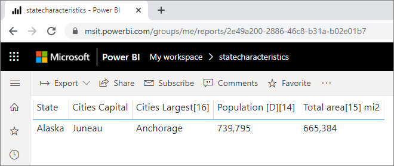

# Использование детализации между отчетами в Power BI

Функция *детализации между отчетами* в Power BI позволяет контекстно переходить от одного отчета к другому в одной рабочей области службы Power BI или в одном приложении. С помощью детализации между отчетами можно соединить два или более отчетов, имеющих связанное содержимое, и передать контекст фильтра вместе с этим соединением. 

Чтобы инициировать детализацию между отчетами, выберите точку данных в *исходном визуальном элементе* в *отчете-источнике*, а затем выберите целевой объект **детализации** между отчетами в контекстном меню. 

При выборе действия детализации открывается *целевая страница* в *целевом отчете*. 

В этой статье показано, как настроить и использовать детализацию между отчетами в Power BI.

> [!NOTE]
> Детализацию между отчетами нельзя использовать для отдельных отчетов, к которым предоставлен общий доступ в разделе [Мне предоставлен доступ](../collaborate-share/service-share-dashboards.md#share-a-dashboard-or-report). Для использования детализации между отчетами необходимо перейти к отчету в рабочей области, участником которой вы являетесь.

## Включение детализации между отчетами

Первым шагом при включении детализации между отчетами является проверка моделей данных для исходных и целевых отчетов. Хотя схемы в каждом отчете не обязательно должны совпадать, поля, которые необходимо передать, должны существовать в обеих моделях данных. Имена полей и таблиц, к которым они относятся, должны быть идентичны. Строки должны совпадать, в том числе по регистру.

Например, если вы хотите передать фильтр по полю **Регион** в таблице **Регионы России**, то обе модели должны содержать таблицу **Регионы России** с полем **Регион**. В противном случае необходимо обновить имя поля или имя таблицы в базовой модели. Простое обновление отображаемых имен полей не будет корректно работать с детализацией между отчетами.

После проверки моделей включите в исходном отчете детализацию между отчетами. 

1. В Power BI Desktop последовательно выберите **Файл** > **Параметры и настройки** > **Параметры**. 
1. В окне **Параметры** на левой панели навигации внизу раздела **Текущий файл** выберите пункт **Параметры отчета**. 
1. Внизу правой области в разделе **Детализация между отчетами** установите флажок **Разрешите визуальным элементам в этом отчете использовать целевые объекты детализации из других отчетов**. 
1. Выберите **ОК**. 
   
   

Включить детализацию между отчетами можно также в службе Power BI.
1. В службе Power BI выберите рабочую область, в которой находятся целевой и исходный отчеты.
1. Рядом с именем исходного отчета в списке щелкните значок **Дополнительные параметры** и выберите пункт **Параметры**. 
1. Внизу области **Параметры** в разделе **Детализация между отчетами** установите флажок **Разрешите визуальным элементам в этом отчете использовать целевые объекты детализации из других отчетов** и нажмите кнопку **Сохранить**.
   
   

## Настройка целевого объекта детализации между отчетами

Настройка целевой страницы для детализации между отчетами аналогична настройке детализации в отчете. Включение детализации на целевой странице позволяет другим визуальным элементам использовать эту страницу для детализации. Инструкции по созданию детализации в рамках одного отчета см. в статье [Использование детализации в Power BI Desktop](desktop-drillthrough.md).

Целевой объект для детализации между отчетами можно настроить как в Power BI Desktop, так и в службе Power BI. 
1. Откройте целевой файл для редактирования, а затем на целевой странице целевого отчета в области **Визуализации** выберите раздел **Поля**. 
1. В разделе **Детализация** установите переключатель **Несколько отчетов** в положение **Вкл**. 
1. Перетащите поля, которые нужно использовать в качестве целевых объектов детализации, в поле **Добавьте сюда поля детализации**. Для каждого поля выберите, следует ли разрешить детализацию, когда поле используется в качестве категории или когда оно суммируется как мера. 
1. Выберите, следует ли **сохранить все фильтры** для визуального элемента. Если вы не хотите передавать фильтры, примененные к исходному визуальному элементу, в целевой элемент, выберите **Выкл**.
   
   
   
1. Если страница используется только для детализации между отчетами, удалите кнопку **Назад**, которая добавляется на холст автоматически. Кнопка **Назад** работает только для навигации внутри отчета. 
1. После настройки целевой страницы сохраните отчет, если вы используете службу Power BI. Если вы используете Power BI Desktop, сохраните и опубликуйте отчет.

Вот и все. Отчеты готовы к использованию для детализации между отчетами. 

## Использование детализации между отчетами

Чтобы использовать детализацию между отчетами, выберите исходный отчет в службе Power BI, а затем выберите визуальный элемент, который использует поле детализации способом, указанным при настройке целевой страницы. Щелкните точку данных правой кнопкой мыши, чтобы открыть контекстное меню визуального элемента, выберите пункт **Детализация**, а затем выберите целевой объект детализации. Целевые объекты детализации между отчетами имеют формат **Имя страницы [Имя отчета]** .

Результаты отображаются на целевой странице детализации между отчетами точно так же, как вы настроили их при создании целевого объекта. Результаты фильтруются в соответствии с параметрами детализации.

> [!IMPORTANT]
> Power BI кэширует целевые объекты детализации между отчетами. Если вы вносите изменения, не забудьте обновить окно браузера, иначе целевые объекты детализации могут отображаться не так, как вы ожидаете. 

Если при настройке целевой страницы вы перевели ползунок **Сохранить все фильтры** в положение **Вкл**, контекст фильтра из исходного визуального элемента может включать следующее: 

- фильтры уровня отчета, страницы и визуального элемента, затрагивающие исходный визуальный элемент; 
- перекрестные фильтрацию и выделение, влияющие на исходный визуальный элемент; 
- срезы на странице и их синхронизацию;
- Параметры URL-адреса

При переходе к целевому отчету для детализации Power BI применяет фильтры только для тех полей, для которых имеются точные совпадения строк имени поля и имени таблицы. 

Power BI не применяет прикрепленные фильтры из целевого отчета. Однако применяется личная закладка по умолчанию, если она существует. Например, если личная закладка по умолчанию содержит фильтр уровня отчета *Страна = Россия*, Power BI сначала применяет этот фильтр, а уже потом контекст фильтра из исходного визуального элемента. 

Для детализации между отчетами Power BI передает контекст фильтра стандартным страницам в целевом отчете. Power BI не передает контекст фильтра для страниц с подсказками, так как эти страницы фильтруются на основе исходного визуального элемента, вызывающего подсказку.

Если вы хотите вернуться к исходному отчету после выполнения действия детализации между отчетами, нажмите кнопку **Назад** в браузере. 

## Дальнейшие действия

Рекомендуем также ознакомиться со следующими материалами:

- [Срезы в Power BI](../visuals/power-bi-visualization-slicers.md)
- [Использование детализации в Power BI Desktop](desktop-drillthrough.md)
