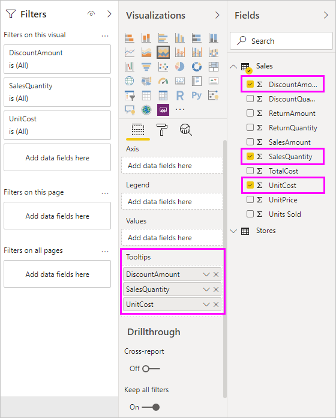
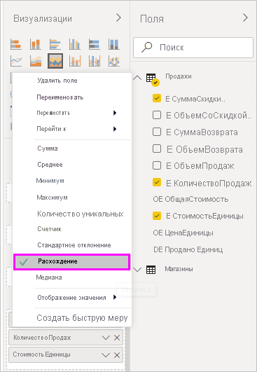

# Настраивайте подсказки в Power BI Desktop

Подсказки позволяют изящно показать дополнительную контекстную информацию и сведения о точках данных на визуальном элементе. На следующем рисунке показана подсказка на диаграмме в Power BI Desktop.

При создании визуализации подсказка по умолчанию отображает значение и категорию точки данных. Существует много случаев, в которых полезна настройка сведений в подсказках. Благодаря настройке подсказок пользователи получают дополнительный контекст и сведения при просмотре визуального элемента. С помощью настраиваемых подсказок можно указать дополнительные точки данных, отображаемые в подсказке.

## Как настроить подсказки

Чтобы создать настраиваемую подсказку, в разделе **Поля** области **Визуализации** перетащите поле в контейнер **Подсказки**, как показано на приведенном ниже изображении. На приведенном ниже рисунке три поля были помещены в контейнер **Подсказки**.

Если после добавления подсказок в область **Подсказки** навести указатель мыши на точку данных на визуализации, отобразятся значения для этих полей.

## Настройка подсказок со статистической функцией или быстрыми мерами

Вы можете дополнительно настроить подсказку, выбрав статистическую функцию или *быструю меру*. Щелкните стрелку рядом с полем в контейнере **Подсказки**. Затем выберите нужный из доступных параметров.

Есть много способов настроить подсказки с помощью любого поля, доступного в наборе данных, чтобы передать краткую информацию и аналитические сведения пользователям, просматривающим панели мониторинга и отчеты.
