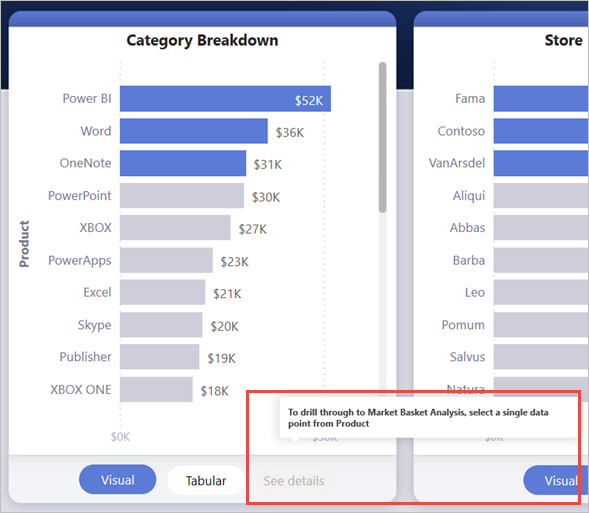
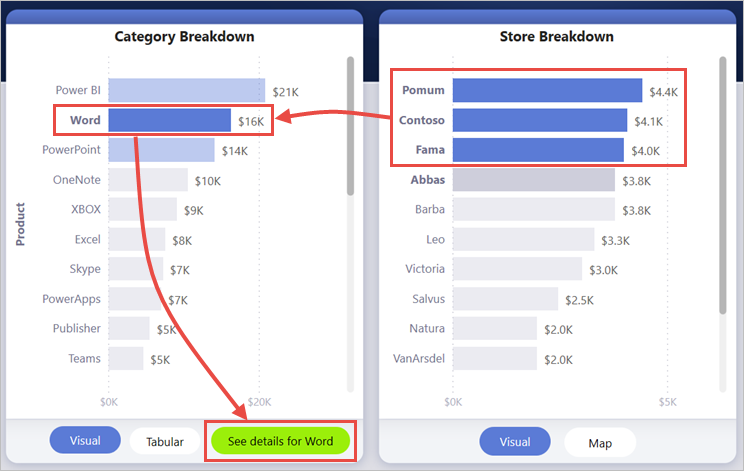
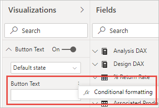

# <a name="create-a-drill-through-button-in-power-bi"></a>Создание кнопки детализации в Power BI

В Power BI можно создать кнопку *детализации*, которая осуществляет детализацию до страницы с подробными сведениями, отфильтрованными по определенному контексту.

Один из способов детализации в отчете — щелкнуть правой кнопкой мыши в визуальном элементе. Чтобы действие детализации было более очевидным, можно вместо этого создать кнопку детализации. Она может повысить вероятность обнаружения важных сценариев детализации в отчетах. Внешний вид и работа кнопки во многом может определяться условно. Например, при выполнении определенных условий на кнопке может отображаться другой текст. Чтобы получить дополнительные сведения, продолжите чтение. 

В этом примере после выбора строки Word на диаграмме активируется кнопка **Подробнее**.


При нажатии кнопки **Подробнее** открывается страница "Анализ покупательского поведения" с подробными сведениями. Как видно из визуального элемента слева, страница детализации теперь отфильтрована для Word.


## <a name="set-up-a-drill-through-button"></a>Настройка кнопки детализации

Чтобы настроить кнопку детализации, сначала необходимо [настроить соответствующую страницу детализации](desktop-drillthrough.md) в отчете. Затем необходимо создать кнопку с типом действия **Детализация** и выбрать страницу детализации в качестве**назначения**.

Так как кнопка детализации имеет два состояния (активна и неактивна), отображается два варианта подсказок.


Если оставить поля подсказок пустыми, Power BI сгенерирует подсказки автоматически. Эти подсказки основаны на полях назначения и детализации.

Ниже приведен пример автоматически сгенерированной подсказки для неактивной кнопки.

"Чтобы детализировать сведения на странице «Анализ покупательского поведения» (страница назначения), выберите одну точку данных в поле «Продукт» (поле детализации)".



Ниже приведен пример автоматически сгенерированной подсказки для активной кнопки.

"Щелкните для детализации сведений на странице «Анализ покупательского поведения» (страница назначения)".


Однако если необходимо указать собственные подсказки, то всегда можно ввести статическую строку. Вы также можете применять [условное форматирование к подсказкам](#set-formatting-for-tooltips-conditionally).

## <a name="pass-filter-context"></a>Передача контекста фильтра

Кнопка работает как обычная детализация. Вы можете передавать фильтры по дополнительным полям путем перекрестной фильтрации визуальных элементов, содержащих поле детализации. Например, используя **щелчок** + **нажатая клавиша CTRL** и перекрестную фильтрацию, можно передать на страницу детализации несколько фильтров по магазину, поскольку выполняется перекрестная фильтрация по визуальному элементу, содержащему продукт (поле детализации):



После выбора кнопки детализации вы увидите, как на целевую страницу передаются фильтры по магазину и продукту:


### <a name="ambiguous-filter-context"></a>Неоднозначный контекст фильтра

Поскольку кнопка детализации не привязана к одному визуальному элементу, если выбор неоднозначен, кнопка будет неактивна.

В этом примере кнопка неактивна, так как два визуальных элемента содержат один вариант выбора продукта. Существует неоднозначность относительно того, к какой точке данных следует привязать тот или иной визуальный элементу с помощью действия детализации:


## <a name="customize-formatting-for-disabled-buttons"></a>Настройка форматирования для неактивных кнопок
Вы можете настроить параметры форматирования для неактивного состояния кнопок детализации.


:::image type="content" source="media/desktop-drill-through-buttons/drill-through-customize-disabled-button.png" alt-text="Настройка форматирования для неактивных кнопок":::
 
Доступны следующие параметры форматирования:
- **Элементы управления текстом кнопки**: текст, цвет, отбивка, выравнивание, размер и семейство шрифтов.

    :::image type="content" source="media/desktop-drill-through-buttons/drill-through-disabled-button-text.png" alt-text="Форматирование текста неактивной кнопки":::

- **Элементы управления заливкой кнопки**: цвет, прозрачность и *новая* функция заполнения изображением (подробнее об этом см. в следующем разделе).

    :::image type="content" source="media/desktop-drill-through-buttons/drill-through-disabled-button-fill.png" alt-text="Заливка неактивной кнопки":::

- **Элементы управления значком**: форма, отбивка, выравнивание, цвет линии, прозрачность и вес.

    :::image type="content" source="media/desktop-drill-through-buttons/drill-through-disabled-button-icon.png" alt-text="Значок неактивной кнопки":::

- **Элементы управления контуром**: цвет, прозрачность, вес, скругленные края.

     :::image type="content" source="media/desktop-drill-through-buttons/drill-through-disabled-button-outline.png" alt-text="Контур неактивной кнопки":::

## <a name="set-formatting-for-button-text-conditionally"></a>Настройка условного форматирования для текста кнопки
Условное форматирование можно использовать для изменения текста кнопки на основе выбранного значения поля. Для этого необходимо создать меру, которая выводит нужную строку на основе функции DAX SELECTEDVALUE.

Ниже приведен пример меры, которая выводит текст "Подробнее о продукте", если НЕ выбрано значение продукта; в противном случае выводится "Подробнее о [выбранный продукт]":

```dax
String_for_button = If(SELECTEDVALUE('Product'[Product], 0) == 0, "See product details", "See details for " & SELECTEDVALUE('Product'[Product]))
```

После создания меры выберите параметр **Условное форматирование** для текста кнопки:



Затем выберите меру, созданную для текста кнопки:


При выборе одного продукта кнопка выглядит следующим образом:

"Подробнее о Word"


Если выбрано более одного продукта или если продукты не выбраны, кнопка отключена. Текст кнопки следующий:

"Подробнее о продукте"


## <a name="set-formatting-for-tooltips-conditionally"></a>Настройка условного форматирования для подсказок

Подсказку для кнопки детализации в активном и неактивном состоянии можно форматировать условно. Если вы использовали условное форматирование для динамического указания целевой страницы детализацией, может потребоваться сделать подсказку для состояния кнопки более информативной в зависимости от выбора пользователя. Ниже приведено несколько примеров.

- С помощью пользовательской меры можно сделать так, чтобы подсказка для неактивного состояния содержала различные инструкции в зависимости от конкретного случая. Например, если пользователь должен выбрать один товар *и* один магазин, прежде переходить на страницу "Анализ рынка" с подробными сведениями, можно создать меру с описанной ниже логикой.

    Если пользователь не выбрал один товар или один магазин, мера возвращает следующий текст: "Выберите один товар и щелкните мышью, удерживая нажатой клавишу CTRL, чтобы выбрать один магазин".

    Если пользователь выбрал один товар, но не выбрал один магазин, мера возвращает следующий текст: "Щелкните мышью, удерживая нажатой клавишу CTRL, чтобы выбрать один магазин".

- Аналогичным образом можно задавать подсказку для активного состояния в зависимости от выбора пользователя. Например, если вы хотите, чтобы пользователь знал, по какому товару и какому магазину будут отфильтрованы данные на странице детализации, можно создать меру, которая возвращает следующий текст:

    "Щелкните, чтобы перейти на страницу [имя страницы детализации] и просмотреть подробные сведения о продажах товара [название товара] в магазине [название магазина]".


## <a name="set-the-drill-through-destination-conditionally"></a>Условное задание целевой страницы детализации

Условное форматирование можно использовать для задания целевой страницы детализации на основе результата меры.

Ниже приведены некоторые сценарии, в которых может потребоваться условное назначение целевой страницы детализации.

- Необходимо разрешить детализацию **при выполнении нескольких условий**. В противном случае кнопка должна быть неактивна.

    Например, пользователь должен выбрать один товар *и* один магазин, чтобы получить возможность перейти на страницу с подробными сведениями о продажах. В противном случае кнопка должна быть неактивна.

    :::image type="content" source="media/desktop-drill-through-buttons/drill-through-select-product-store.png" alt-text="Выбор товара и магазина":::
 
- Кнопка должна **поддерживать несколько целевых страниц детализации** в зависимости от выбора пользователя.

    Например, предположим, что у вас есть несколько целевых страниц (со сведениями о рынке и сведениями о магазине), на которые пользователи могут переходить. Можно сделать так, чтобы пользователь должен был выбрать определенную целевую страницу, чтобы для нее стала доступна кнопка детализации.

    :::image type="content" source="media/desktop-drill-through-buttons/drill-through-select-product-destination.png" alt-text="Выбор товара и целевой страницы":::
 
- Кроме того, могут быть интересные **гибридные сценарии**, когда должно быть несколько целевых страниц детализации и при этом кнопка должна быть неактивной при выполнении определенных условий. Дополнительные сведения об этих трех вариантах см. далее в статье.

### <a name="disable-the-button-until-multiple-conditions-are-met"></a>Активация кнопки при выполнении нескольких условий

Рассмотрим первый случай, когда кнопка должна оставаться неактивной до выполнения дополнительных условий. Необходимо создать простую меру DAX, которая выводит пустую строку (""), если условие не выполняется. Когда оно выполняется, выводится имя целевой страницы детализации.

Вот пример меры DAX, которая требует выбора магазина, прежде чем пользователь сможет перейти от сведений о товаре к подробным сведениям о магазине:

```dax
Destination logic = If(SELECTEDVALUE(Store[Store], “”)==””, “”, “Store details”)
```

После создания меры выберите кнопку условного форматирования (fx) рядом с полем **Назначение** для кнопки:

:::image type="content" source="media/desktop-drill-through-buttons/drill-through-select-formula.png" alt-text="Выбор кнопки условного форматирования":::
 
Наконец, выберите созданную меру DAX в качестве значения поля назначения:

:::image type="content" source="media/desktop-drill-through-buttons/drill-through-based-formula.png" alt-text="Назначение на основе поля"::: 

Теперь кнопка неактивна, даже если выбран один товар, так как мера также требует выбора одного магазина:

:::image type="content" source="media/desktop-drill-through-buttons/drill-through-button-disabled.png" alt-text="Неактивная кнопка детализации":::

### <a name="support-multiple-destinations"></a>Поддержка нескольких назначений
 
В другом распространенном случае, когда требуется поддержка нескольких целевых страниц, начните с создания таблицы с одним столбцом с именами целевых страниц детализации:

:::image type="content" source="media/desktop-drill-through-buttons/drill-through-create-table.png" alt-text="Создание таблицы":::

Power BI использует точное совпадение строк для задания целевой страницы детализации, поэтому следует тщательно проверить, точно ли указанные значения соответствуют именам страниц детализации.

После создания таблицы добавьте ее на страницу в качестве среза с одиночным выбором:

:::image type="content" source="media/desktop-drill-through-buttons/drill-through-slicer.png" alt-text="Срез детализации":::
 
Если требуется больше места по вертикали, преобразуйте срез в раскрывающийся список. Удалите заголовок среза и добавьте текстовое поле с названием рядом с ним:

:::image type="content" source="media/desktop-drill-through-buttons/drill-through-drop-down-slicer.png" alt-text="Срез детализации без заголовка":::
 
Кроме того, можно изменить ориентацию среза списка с вертикальной на горизонтальную:

:::image type="content" source="media/desktop-drill-through-buttons/drill-through-horizontal-slicer.png" alt-text="Горизонтальный срез":::

Чтобы указать целевую страницу для действия детализации, выберите кнопку условного форматирования (fx) рядом с полем **Назначение** для кнопки:

:::image type="content" source="media/desktop-drill-through-buttons/drill-through-select-formula.png" alt-text="Выбор кнопки условного форматирования":::
 
Выберите имя созданного столбца, в данном случае **Выбрать назначение**:

:::image type="content" source="media/desktop-drill-through-buttons/drill-through-select-destination.png" alt-text="Выбор назначения":::
 
Теперь кнопка детализации активируется только в том случае, если выбраны товар *и* целевая страница:

:::image type="content" source="media/desktop-drill-through-buttons/drill-through-select-product-destination.png" alt-text="Выбор товара и целевой страницы":::
 
### <a name="hybrid-of-the-two-scenarios"></a>Гибридный сценарий

Если требуется сочетание двух сценариев, можно создать меру DAX и сослаться на нее, чтобы добавить дополнительную логику выбора целевой страницы.

Вот пример меры DAX, которая требует выбора магазина, прежде чем пользователь сможет перейти от сведений о товаре на любую из страниц детализации:

```dax
Destination logic = If(SELECTEDVALUE(Store[Store], “”)==””, “”, SELECTEDVALUE(‘Table'[Select a destination]))
```

Затем выберите созданную меру DAX в качестве значения поля назначения.
В этом примере пользователю потребуется выбрать товар, магазин *и* страницу назначения, прежде чем кнопка детализации станет активна:

:::image type="content" source="media/desktop-drill-through-buttons/drill-through-product-store-destination.png" alt-text="Выбор товара, магазина и целевой страницы":::

## <a name="limitations"></a>Ограничения

- Эта кнопка не позволяет использовать несколько назначений для одной кнопки.
- Эта кнопка поддерживает только детализацию в пределах одного отчета; иными словами, детализация между отчетами не поддерживается.
- Формат неактивного состояния кнопки связан с классами цветов в теме отчета. Подробнее о [классах цветов](desktop-report-themes.md#setting-structural-colors).
- Действие детализации поддерживается всеми встроенными визуальными элементами и *некоторыми* визуальными элементами, импортированными из AppSource. Однако поддержка *всех* визуальных элементов, импортированных из AppSource, не гарантируется.

## <a name="next-steps"></a>Дальнейшие действия
Дополнительные сведения о похожих функциях и о взаимодействии с кнопками см. в следующих статьях.

* [Создание кнопок](desktop-buttons.md)
* [Использование детализации в отчетах Power BI](desktop-drillthrough.md)
* [Использование закладок для обмена аналитическими сведениями и создания историй в Power BI](desktop-bookmarks.md)

