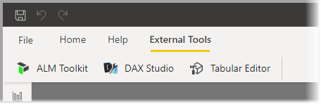
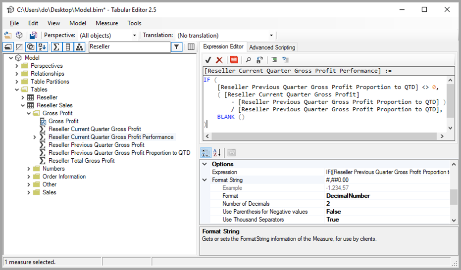
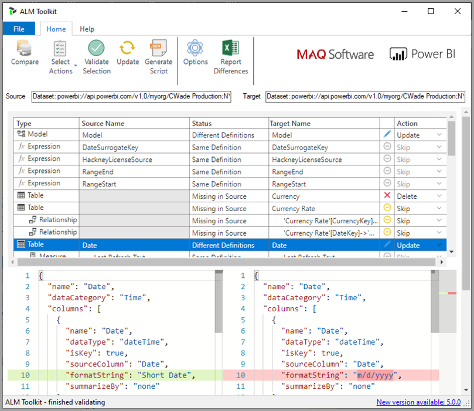

# <a name="using-external-tools-in-power-bi-desktop-preview"></a>Использование внешних инструментов в Power BI Desktop (предварительная версия)

Начиная с выпуска за июль 2020 г. в Power BI Desktop можно использовать внешние инструменты, чтобы обеспечить дополнительные функции и преимущества. Поддержка внешних инструментов позволяет использовать множество средств сообщества для Analysis Services для специалистов по бизнес-аналитике, таких как средства оптимизации и разработки запросов и выражений DAX, а также управления жизненным циклом приложений (ALM).

Лента **External Tools** (Внешние инструменты) в Power BI Desktop содержит кнопки для внешних инструментов, установленных на компьютере и зарегистрированных в Power BI Desktop. Внешние инструменты, запускаемые из Power BI Desktop, автоматически подключаются к подсистеме Analysis Services, работающей в составе Power BI Desktop. Это обеспечивает удобство работы пользователей.



В число этих внешних инструментов входят следующие (со ссылками на расположение установки). Поддержка всех внешних инструментов осуществляется их соответствующими авторами:

* [Tabular Editor](https://tabulareditor.com/)
* [DAX Studio](https://daxstudio.org)
* [Набор средств ALM](http://alm-toolkit.com)


В следующих разделах описаны операции, поддерживаемые внешними инструментами, а также приведен список избранных инструментов, которые входят в состав Power BI Desktop, и инструкции по регистрации дополнительных инструментов.

## <a name="supported-write-operations"></a>Поддерживаемые операции записи

Внешние инструменты могут подключаться к набору данных Power BI Desktop (модель Analysis Services) для редактирования указанных ниже объектов. Редактирование файла шаблона Power BI Desktop (PBIT) не поддерживается.

* [Меры](/analysis-services/tabular-models/measures-ssas-tabular) для вычислений.
* [Группы вычислений](/analysis-services/tabular-models/calculation-groups), обеспечивающие повторное использование вычислений в сложных моделях.
* [Перспективы](/analysis-services/tabular-models/perspectives-ssas-tabular) для определения специализированных представлений метаданных набора данных для конкретных областей бизнеса.

Управление переводами метаданных с помощью внешних инструментов возможно, но эта предварительная версия пока не поддерживает такую функцию. Если языковой стандарт текущего пользователя задан для перевода, редактирование объектов в списке полей с помощью текущей версии Power BI Desktop не будет работать правильно. 

Все метаданные набора данных [табличной модели объектов](/analysis-services/tom/introduction-to-the-tabular-object-model-tom-in-analysis-services-amo) доступны только для чтения. Экземпляре Power BI Desktop Analysis Services по ка не поддерживает редактирование объектов, не включенных в список, который приведен в статье [Табличная модель объектов (TOM)](/analysis-services/tom/introduction-to-the-tabular-object-model-tom-in-analysis-services-amo).


## <a name="featured-external-tools"></a>Избранные внешние инструменты

С Power BI Desktop работают указанные ниже инструменты с открытым кодом, разработанные сообществом. Их поддержка осуществляется соответствующими авторами инструментов. Установщик каждого инструмента регистрирует его в Power BI Desktop после установки.

* Tabular Editor.
* DAX Studio.
* ALM Toolkit.

Давайте поочередно рассмотрим каждый из этих инструментов.

### <a name="tabular-editor"></a>Tabular Editor

[Tabular Editor](https://tabulareditor.com/) можно установить по следующей ссылке: [веб-сайт Tabular Editor](https://tabulareditor.com/).

Tabular Editor позволяет специалистам по бизнес-аналитике без труда создавать и поддерживать табличные модели, а также управлять ими с помощью интуитивно понятного упрощенного редактора. В иерархическом представлении отображаются все объекты табличной модели, упорядоченные по папкам отображения. Поддерживается изменение свойств с множественным выбором и выделение синтаксиса DAX.



Исходный код Tabular Editor можно найти в следующем репозитории GitHub: [Tabular Editor на GitHub](https://github.com/otykier/TabularEditor).

Основной разработчик инструмента Tabular Editor — [Даниэль Отикер](https://www.linkedin.com/in/daniel-otykier-2231876) (Daniel Otykier).


### <a name="dax-studio"></a>DAX Studio

[DAX Studio](https://daxstudio.org) можно установить по следующей ссылке: [веб-сайт DAX Studio](https://daxstudio.org).

DAX Studio — известное комплексное средство для разработки, диагностики, настройки производительности и анализа DAX. Оно предоставляет такие возможности, как просмотр объектов, интегрированная трассировка, разбивка выполнения запросов с подробной статистикой, выделение синтаксиса DAX и форматирование. На приведенном ниже изображении показан экран DAX Studio. 


Исходный код DAX Studio можно найти в следующем репозитории GitHub: [DAX Studio на GitHub](https://github.com/DaxStudio/DaxStudio).

Основной разработчик инструмента DAX Studio — [Даррен Госбелл](https://www.linkedin.com/in/darrengosbell) (Darren Gosbell).

### <a name="alm-toolkit"></a>Набор средств ALM

[ALM Toolkit](http://alm-toolkit.com) можно установить по следующей ссылке: [веб-сайт ALM Toolkit](http://alm-toolkit.com).

ALM Toolkit — это инструмент сравнения схем с открытым кодом для наборов данных Power BI, используемых для сценариев управления жизненным циклом приложений (ALM). Он позволяет без труда выполнять развертывание в различных средах и хранить данные о предыдущих добавочных обновлениях. С помощью ALM Toolkit можно выявлять различия в файлах, ветвях и репозиториях метаданных, а также объединять их в единое целое. Кроме того, можно повторно использовать общие определения для наборов данных.



Исходный код ALM Toolkit можно найти в следующем репозитории GitHub: [ALM Toolkit на GitHub](https://github.com/microsoft/analysis-services).

Основной разработчик инструмента ALM Toolkit — [Кристиан Уэйд](https://www.linkedin.com/in/christianwade1) (Christian Wade).


## <a name="how-to-register-external-tools"></a>Регистрация внешних инструментов

Чтобы зарегистрировать в Power BI Desktop другие внешние инструменты, создайте JSON-файл со следующим содержимым:

```json
{
    "name": "<tool name>",
    "description": "<tool description>",
    "path": "<tool executable path>",
    "arguments": "<optional command line arguments>",
    "iconData": "image/png;base64,<encoded png icon data>"
}
```

В следующем списке описаны элементы этого JSON-файла:
 
* **name.** Укажите имя инструмента, которое будет отображаться в качестве подписи кнопки на ленте External Tools (Внешние инструменты) в Power BI Desktop.
* **description** (необязательно). Введите описание, которое будет отображаться в виде подсказки на ленте External Tools (Внешние инструменты) в Power BI Desktop.
* **path.** Укажите полный путь к исполняемому файлу инструмента.
* **arguments** (необязательно). Укажите строку аргументов командной строки, с которыми должен запускаться исполняемый файл инструмента. Можно использовать любой из следующих заполнителей:
    * **%server%.** Заменяется именем сервера и номером порта локального экземпляра табличной модели Analysis Services для импортированных моделей данных и моделей данных DirectQuery.
    * **%database%.** Заменяется именем базы данных модели, размещенной в локальном экземпляре табличной модели Analysis Services для импортированных моделей данных и моделей данных DirectQuery.
* **iconData.** Укажите данные изображения, которое будет отображаться в виде значка кнопки на ленте External Tools (Внешние инструменты) в Power BI Desktop. Строку нужно отформатировать в соответствии с синтаксисом кодов URI данных без префикса "data:".
 
Присвойте файлу `"<tool name>.pbitool.json"` имя и поместите его в следующую папку:

* `%commonprogramfiles%\Microsoft Shared\Power BI Desktop\External Tools`

В 64-разрядных средах файлы следует поместить в такую папку:

* **Program Files (x86)\Common Files\Microsoft Shared\Power BI Desktop\External Tools**.

Файлы с расширением **.pbitool.json** в указанном расположении загружаются при запуске Power BI Desktop.

## <a name="disabling-external-tools-using-the-registry"></a>Отключение внешних инструментов с помощью реестра

Внешние инструменты можно отключить с помощью **групповых политик** или путем редактирования реестра, что аналогично процессу отключения **настраиваемых визуальных элементов**.

* Раздел реестра: *Software\Policies\Microsoft\Power BI Desktop\\*

* Значение реестра: *EnableExternalTools*

Значение 1 (десятичное) позволяет использовать внешние инструменты в Power BI, что является значением по умолчанию.

Значение 0 (десятичное) запрещает использовать внешние инструменты в Power BI.


## <a name="next-steps"></a>Дальнейшие действия

Рекомендуем также ознакомиться со следующими материалами:

* [Использование детализации между отчетами в отчетах Power BI](desktop-cross-report-drill-through.md)
* [Использование срезов в Power BI Desktop](../visuals/power-bi-visualization-slicers.md)