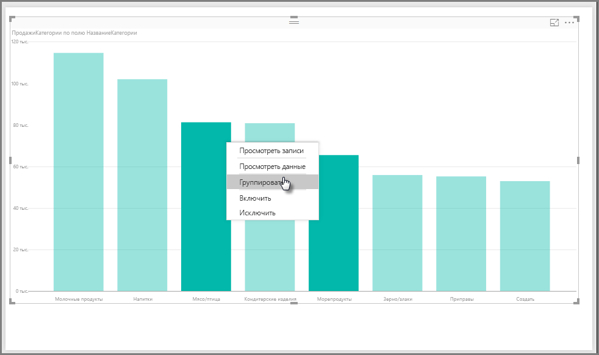
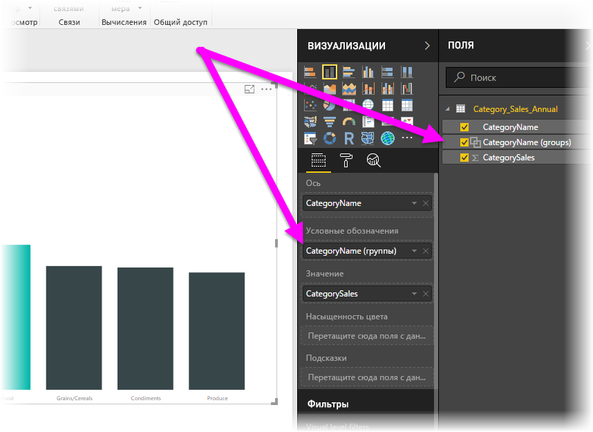
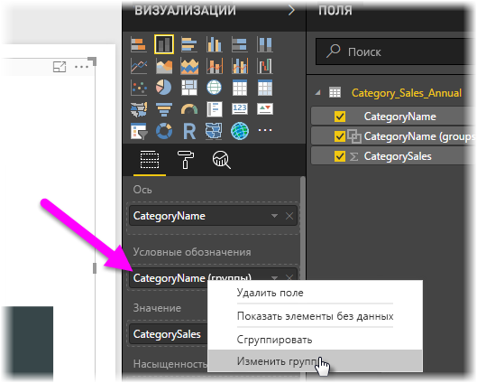
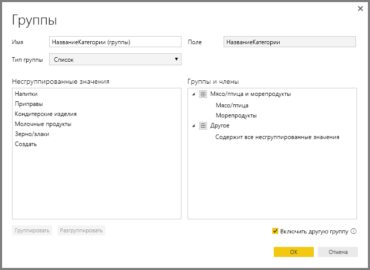
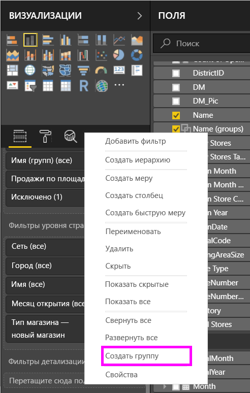
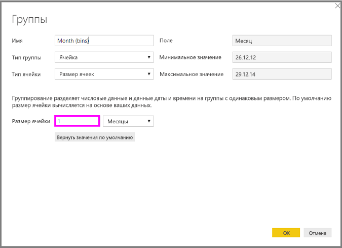
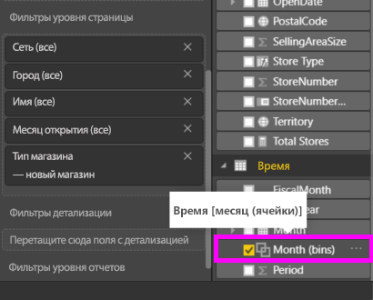

# Группирование данных и разделение их на ячейки в Power BI Desktop
При создании визуальных элементов в Power BI Desktop данные объединяются в блоки (или группы) на основе значений базовых данных. Часто это устраивает пользователя. Но бывают случаи, когда требуется уточнить представление этих блоков. Например, может потребоваться объединить три категории продуктов в одну более крупную категорию (одну *группу*). Или же можно отобразить показатели продаж в ячейках по 1 000 000 долларов, а не разделять их по частям размером 923 983 доллара.

Power BI Desktop позволяет *группировать* точки данных для более удобного просмотра, анализа и изучения данных и тенденций в визуальных элементах. Вы также можете определить *размер ячейки* (что также называется разделением на ячейки), чтобы поместить значения в группы одинакового размера для более эффективной и понятной визуализации данных. Это действие часто называется *группирование*.

## Группирование
Для группирования щелкните несколько объектов в визуальном элементе, удерживая клавишу CTRL. Затем щелкните правой кнопкой мыши один из нескольких выбранных элементов и выберите в контекстном меню **Группа**.

Созданная группа будет добавлена в сегмент **Условные обозначения** этого визуального элемента. Группа также появится в списке **Поля**.

После создания группы можно легко изменить ее элементы. Щелкните правой кнопкой мыши поле из **Условных обозначений** или из списка **Поля**, а затем выберите **Редактировать группы**.

В диалоговом окне **Группы** можно создать новые группы или изменить существующие. Любую группу также можно *переименовать*. Просто дважды щелкните заголовок группы в поле **Группы и члены** и введите новое имя.

Применение групп имеет много преимуществ. Можно добавить элементы из списка **Несгруппированные значения** в новую группу или одну из существующих. Чтобы создать группу, выберите несколько элементов (щелкайте элементы, удерживая нажатой клавишу CTRL) в поле **Несгруппированные значения**, а затем выберите кнопку **Сгруппировать** под этим полем.

Можно добавить несгруппированное значение в существующую группу. Просто выберите одно из **Несгруппированных значений**, а затем выберите существующую группу, в которую нужно добавить это значение, и нажмите кнопку **Сгруппировать**. Чтобы удалить элемент из группы, выберите его в поле **Группы и члены** и нажмите кнопку **Разгруппировать**. Можно также переместить несгруппированные категории в **другую**  группу или оставить их несгруппированными.

> [!NOTE]
> Вы можете создавать группы для любого поля в области **Поля**, не выполняя множественный выбор в существующем визуальном элементе. Для этого щелкните поле правой кнопкой мыши и выберите в меню элемент **Группа**.

## Разделение на ячейки
В **Power BI Desktop** можно задать размер ячейки для числовых полей и полей времени. Разделение на ячейки можно использовать для объединения отображаемых в Power BI Desktop данных в группы необходимого размера.

Чтобы применить определенный размер ячейки, щелкните правой кнопкой мыши нужное **поле** и выберите элемент **Создать группу**.

В диалоговом окне **Группы** установите необходимое значение для параметра **Размер ячейки**.

Нажмите кнопку **ОК**. В области **Поля** появится новое поле с добавлением **(ячеек)** . Это поле можно перетащить на холст и использовать размер ячейки в визуальном элементе.

В *этом видео* показано, как выполняется [разделение на ячейки](https://www.youtube.com/watch?v=BRvdZSfO0DY).

Вот и все, что нужно знать о *группировании* и *разделении на ячейки* для того, чтобы визуальные элементы в отчетах отображали данные необходимым образом.
