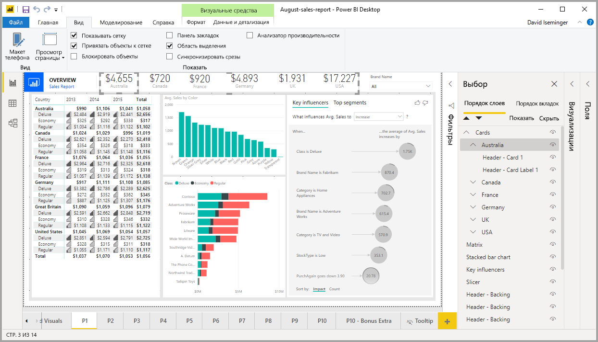
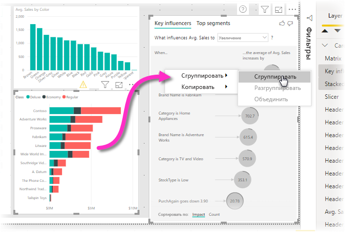
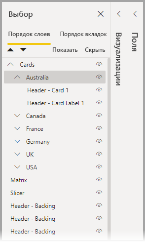
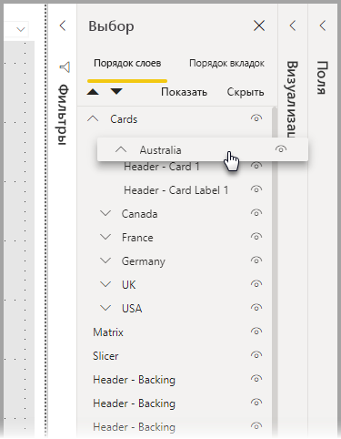
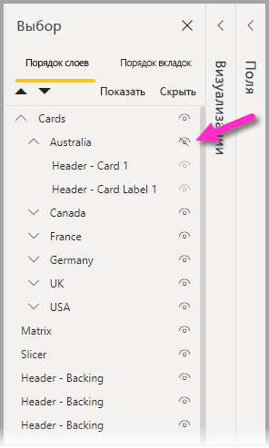
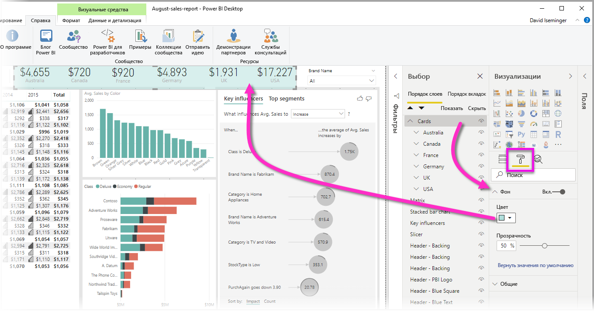

# Группирование визуальных элементов в отчетах в Power BI Desktop
**Группирование** в **Power BI Desktop** позволяет группировать визуальные элементы в отчете, например кнопки, текстовые поля, фигуры и любые создаваемые визуальные элементы, так же, как элементы группируются в PowerPoint. Со сгруппированными визуальными элементами в отчете можно работать как с одним объектом, благодаря чему перемещение, изменение размеров и работа со слоями в отчете становятся проще, быстрее и интуитивно понятнее.

## Создание групп

Чтобы создать группу визуальных элементов в Power BI Desktop, выберите первый визуальный элемент на холсте, нажмите клавишу CTRL и, удерживая ее, щелкните один или несколько дополнительных визуальных элементов, которые необходимо сгруппировать. Затем щелкните набор визуальных элементов правой кнопкой мыши и выберите в появившемся меню пункт **Группировать**.

Группы отображаются в области **выделения**. В отчете может быть столько групп визуальных элементов, сколько требуется. Кроме того, группы визуальных элементов можно вкладывать в другие группы. На рисунке ниже группа *Австралия* вложена в группу *Карточки*. Группу можно развернуть, выбрав курсор рядом с ее именем, и свернуть, выбрав курсор еще раз. 

В области **выделения** можно также перетащить отдельные визуальные элементы, чтобы включить их в группу, удалить их из группы, вложить группу или удалить вложенную группу или отдельный визуальный элемент. Просто перетащите нужный визуальный элемент в соответствующее место. При наложении визуальных элементов порядок слоев определяется их очередностью в списке *Порядок слоев*.

Чтобы отменить группирование, просто выделите группу, щелкните ее правой кнопкой мыши и выберите в появившемся меню пункт **Разгруппировать**.

## Скрытие и отображение визуальных элементов и групп

Вы можете легко скрывать или отображать группы с помощью области **выделения**. Чтобы отобразить или скрыть визуальный элемент или группу, нажмите кнопку с изображением глаза рядом с именем группы или любым отдельным визуальным элементом. На рисунке ниже группа *Австралия* скрыта, а остальные группы, вложенные в группу *Карточки*, отображаются.

При скрытии группы все визуальные элементы в ней скрываются и кнопка с изображением глаза для них становится неактивной (недоступной для выбора, так как вся группа скрыта). Чтобы скрыть только некоторые визуальные элементы в группе, просто нажмите кнопку с изображением глаза рядом с ними.

## Выбор визуальных элементов в группе

Существует несколько способов навигации по визуальным элементам в группе и их выбора. Они описываются в таблице ниже.

* Если щелкнуть пустое пространство внутри группы (например, промежуток между визуальными элементами), ничего не выберется.
* Если щелкнуть визуальный элемент в группе, выделится вся группа, а если щелкнуть его еще раз, выделится только он.
* Если выделить группу, а затем еще один объект на холсте отчета, после чего выбрать в контекстном меню пункт **Группировать**, будет создана вложенная группа.
* Если выделить две группы, а затем щелкнуть их правой кнопкой мыши, отобразится параметр для слияния выбранных групп, а не их вложения.

## Применение цвета фона

К группе можно также применить цвет фона с помощью раздела **Форматирование** области **Визуализации**, как показано на рисунке ниже. 

Если после применения цвета фона щелкнуть промежуток между визуальными элементами в группе, группа выделится (в отличие от ситуации, когда цвет фона отсутствует). 

## Дальнейшие действия
Дополнительные сведения о группировании можно получить, просмотрев следующее видео:

* [Группирование в Power BI Desktop — видео](https://youtu.be/sf4n7VXoQHY?t=10)

Рекомендуем также ознакомиться со следующими материалами:

* [Использование детализации между отчетами в Power BI Desktop](desktop-cross-report-drill-through.md)
* [Использование срезов в Power BI Desktop](../visuals/power-bi-visualization-slicers.md)
