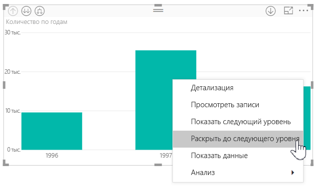
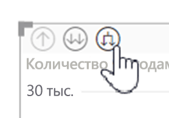
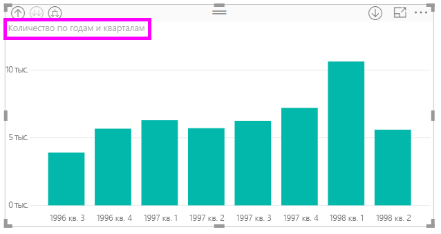
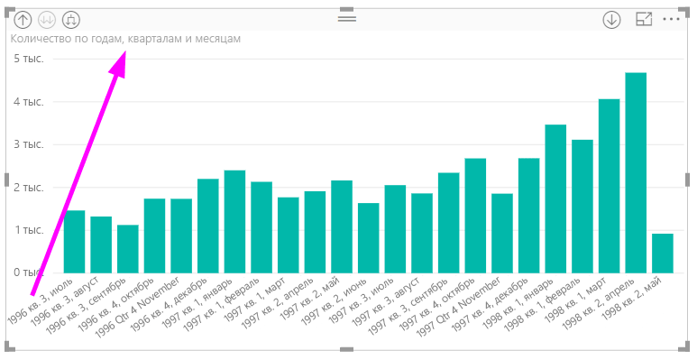
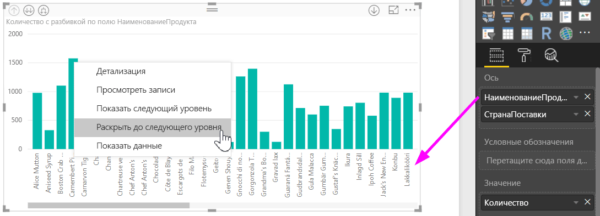
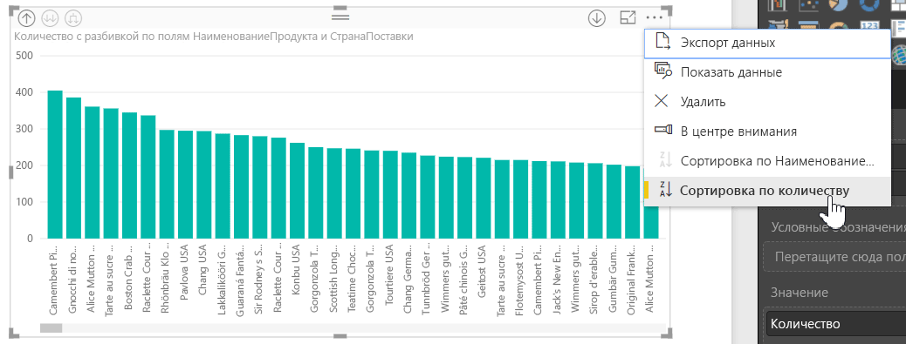
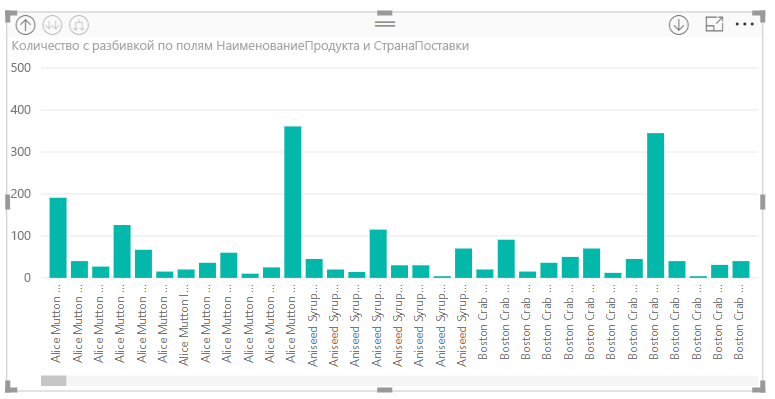

# Использование встроенных меток иерархии в Power BI Desktop
**Power BI Desktop** поддерживает использование **встроенных меток иерархии** — первую из двух функций, которые предназначены для повышения эффективности детализации иерархии. Второй функцией, которая сейчас находится в разработке, является возможность использования меток вложенной иерархии (следите за новостями, мы часто публикуем обновления).   

## Как работают встроенные метки иерархии
При использовании встроенных меток иерархии вы видите метки иерархии при развертывании визуальных элементов с помощью функции **Развернуть все**. Одним большим преимуществом отображения таких меток иерархии является то, что вы также можете выполнять **сортировку** по различным меткам иерархии по мере развертывания иерархических данных.

### Использование встроенной функции "Развернуть" (без сортировки по меткам иерархии)
Прежде чем мы ознакомимся со встроенными метками иерархии в действии, рассмотрим стандартный режим работы функции **Раскрыть до следующего уровня**. Это поможет нам понять (и оценить), насколько полезными могут быть встроенные метки иерархии.

На следующем рисунке вы видите линейчатую диаграмму для годовых продаж. Щелкнув панель правой кнопкой мыши, можно выбрать **Раскрыть до следующего уровня**.

> [!NOTE]
> Вместо щелчка панели правой кнопкой мыши можно нажать кнопку *Развернуть* в верхней левой части визуализации.

  

После выбора элемента **Раскрыть до следующего уровня** иерархия дат в визуальном элементе развертывается: вместо данных по *годам* отображаются данные по *кварталам*, как показано на рисунке ниже.

Обратите внимание, что метки *Year* (Год) и *Quarter* (Квартал) отображаются объединенными — эта схема назначения меток продолжает применяться по мере применения функции **Развернуть все** до последнего уровня иерархии.

Таким образом работает встроенная иерархия *дат*, связанная с полями с типом данных *дата и время*. Давайте перейдем к следующему разделу и посмотрим, чем отличаются новые встроенные метки иерархии.

### Использование встроенных меток иерархии
Теперь давайте рассмотрим другую диаграмму, в которой используются данные, имеющие неформальные иерархии. В следующем визуальном элементе мы видим линейчатую диаграмму **количества**, в которой в качестве оси используется *ProductName*. В этих данных *ProductName* и *ShipCountry* образуют неформальную иерархию. Здесь снова можно выбрать *Раскрыть до следующего уровня* для детализации иерархии.

При выборе элемента **Раскрыть до следующего уровня** отображается следующий уровень со встроенным отображением меток иерархии. По умолчанию встроенные иерархии сортируются по значению меры — в этом случае **количество**. Если включены встроенные метки иерархии, сортировку данных можно выполнять и по иерархии. Для этого нажмите кнопку с многоточием в правом верхнем углу ( **…** ) и выберите **Сортировать по ProductName ShipCountry**, как показано на рисунке ниже.

После выбора **ShipCountry** данные сортируются на основе выбранной неформальной иерархии, как показано на рисунке ниже.

> [!NOTE]
> Функция встроенных меток иерархии пока не допускает сортировку встроенной иерархии времени по значению; данные сортируются только по порядку иерархии.
> 
> 

## Устранение неполадок
Бывает, что визуальные элементы "застревают" в состоянии развернутого уровня встроенной иерархии. В некоторых случаях может оказаться, что некоторые визуальные элементы "застревают" в состоянии, до которого они были развернуты, и переход на верхние уровни не работает. Это может происходить, если вы выполнили следующие действия (способ устранения этой проблемы приводится *под* этими действиями).

Действия, которые могут приводить к "застреванию" визуальных элементов в развернутом состоянии:

1. вы включили функцию **встроенные метки иерархии**;
2. создали некоторые визуальные элементы с иерархиями;
3. применили функцию **Развернуть все** и сохранили файл;
4. затем вы *отключили* функцию **встроенные метки иерархии** и перезапустили Power BI Desktop;
5. затем вы снова открыли файл.

Если вы выполнили эти действия, и визуальные элементы "застряли" в развернутом режиме, можно выполнить следующие действия для разрешения этой проблемы.

1. Снова включите функцию **встроенные метки иерархии**, а затем перезапустите Power BI Desktop.
2. Повторно откройте файл и выполните переход на верхний уровень затронутого визуального элемента.
3. Сохраните файл.
4. Отключите функцию **встроенные метки иерархии**, а затем перезапустите Power BI Desktop.
5. Снова откройте файл.

Кроме того, можно просто удалить визуальный элемент и создать его повторно.

