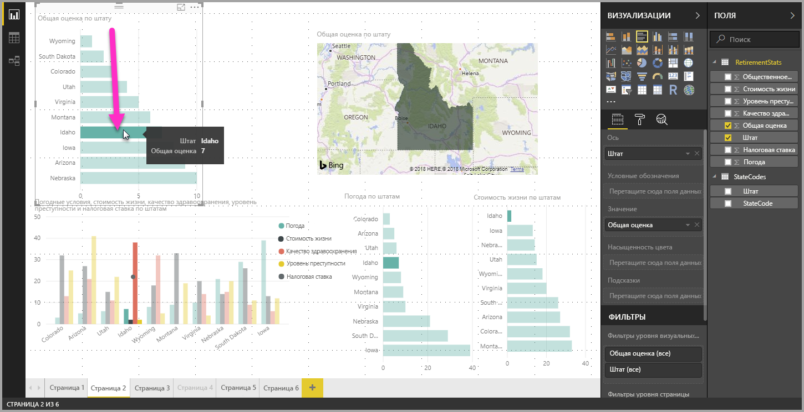
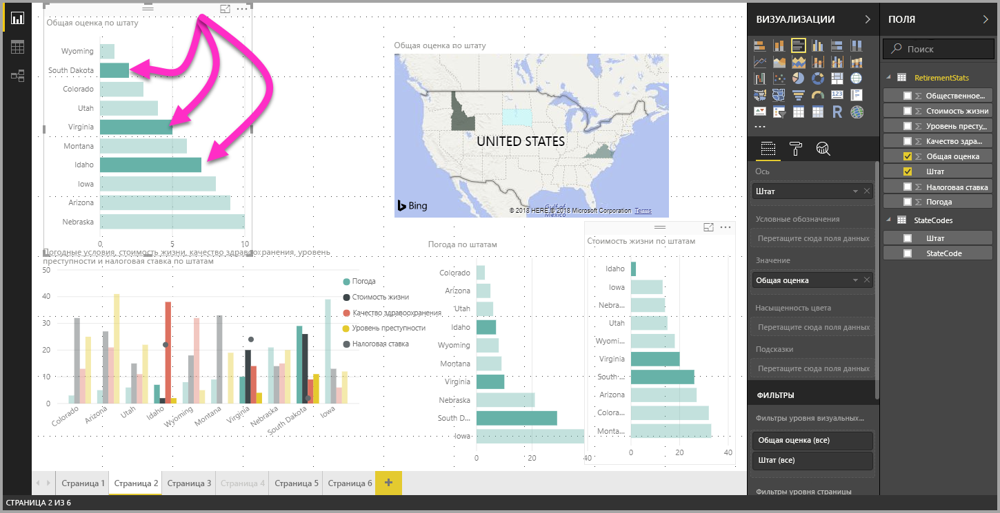

# Множественный выбор элементов данных, точек данных и визуальных элементов в Power BI Desktop

С помощью Power BI Desktop можно выбрать несколько элементов или точек данных в одном визуальном элементе либо несколько визуальных элементов. В следующих разделах описан каждый из этих вариантов по очереди.

## Выбор нескольких точек данных

Чтобы выделить точку данных в определенном визуальном элементе в Power BI Desktop, просто щелкните ее в визуальном элементе. Предположим, что в отчете есть важная строка или элемент диаграммы и в других визуальных элементах на странице отчета данные должны быть выделены на основе вашего выбора. В таком случае щелкните элемент данных в одном визуальном элементе, и результаты отразятся в других визуальных элементах на странице. Это простой (или одиночный) выбор. На следующем рисунке показан простой выбор. 

Благодаря множественному выбору теперь вы можете выбрать несколько точек данных на странице отчета **Power BI Desktop** и выделить результаты в визуальных элементах на странице. Это эквивалентно использованию инструкции или функции **and** , например "highlight results for Idaho **and** Virginia" (выделить результаты для штатов Айдахо и Виргиния). Чтобы выбрать несколько точек данных в визуальных элементах, используйте сочетание **CTRL+щелчок** . На следующем рисунке выбрано **несколько точек данных** (множественный выбор).

Эта возможность может показаться простой, но при создании и совместном использовании отчетов, а также взаимодействии с ними открываются широкие возможности. 

## Выбор нескольких элементов с помощью прямоугольника выделения (предварительная версия)

С помощью прямоугольника выделения, часто называемого *произвольным выделением* можно выбрать несколько элементов данных в визуальном элементе или несколько визуальных элементов в отчете. 

### Выбор нескольких визуальных элементов на холсте

Выберите несколько визуальных элементов и других элементов отчета, щелкнув мышью и перетащив указатель по холсту, чтобы создать прямоугольное выделение. Выбираются все визуальные элементы, которые полностью заключены в прямоугольник выделения. При нажатии клавиши *CTRL* или *SHIFT* (как при множественном выборе с помощью клавиши CTRL щелчков по отдельным визуальным элементам) выделение распространяется на дополнительно выбранные визуальные элементы, добавляя их к уже выбранным объектам. 

Если визуальный элемент уже выбран и включен в выделение, его можно исключить из набора выделенных, щелкнув его при нажатой клавише *CTRL* или *SHIFT* . Функция выделения не позволяет выбирать отдельные визуальные элементы в группах, однако с ее помощью можно включить в набор выделенных объектов все группы полностью.

Холст не прокручивается автоматически при прямоугольном произвольном выделении. 

### Выбор нескольких точек данных в визуальном элементе

Выполнив аналогичные действия для прямоугольного выделения, вы можете выбрать в визуальном элементе несколько точек данных. Удерживая нажатой клавишу *CTRL* , щелкните и перетащите указатель в пределах визуального элемента, чтобы выбрать несколько точек данных. Когда вы отпустите кнопку мыши, все точки, перекрывающиеся с прямоугольником выделения, и все объекты, выделенные с помощью этой функции ранее, останутся выделенными. Если произвольное выделение охватывает область, которая включает точки, выбранные ранее при нажатой клавише *CTRL* , выбор этих точек данных отменяется (переключение выделения). Результат использования функции выделения будет таким же, как при щелчке каждой точки по отдельности при нажатой клавише *CTRL* . 

При использовании клавиши *SHIFT* в процессе произвольного выделения предыдущий выбор сохраняется, а уже выбранные точки данных остаются выбранными. Поэтому при произвольном выделении с нажатой клавишей *SHIFT* точки данных только добавляются к набору выбранных объектов, а переключение выделения точек данных в выбранной области не происходит.

Чтобы очистить текущий выбор, щелкните пустое место в области построения, не нажимая клавишу на клавиатуре.

Дополнительные сведения об этой функции см. в [записи блога о выпуске этой функции](https://powerbi.microsoft.com/blog/power-bi-desktop-august-2020-feature-summary/#_Data_point).

Существует несколько ограничений и рекомендаций по множественному выбору точек данных в визуальном элементе:

* произвольное выделение поддерживают линии, области, точечные диаграммы и диаграммы "дерево";
* максимальное количество точек данных, которые можно выбрать одновременно, равно 300;
* при просмотре отчета в службе Power BI прямоугольник выделения включается, только если при сохранении и публикации отчета была включена функция произвольного выделения.

## Дальнейшие действия

Рекомендуем также ознакомиться со следующими материалами:

* [Использование линий сетки и привязки к сетке в отчетах Power BI Desktop](desktop-gridlines-snap-to-grid.md)
* [О фильтрах и выделении в отчетах Power BI](power-bi-reports-filters-and-highlighting.md)

