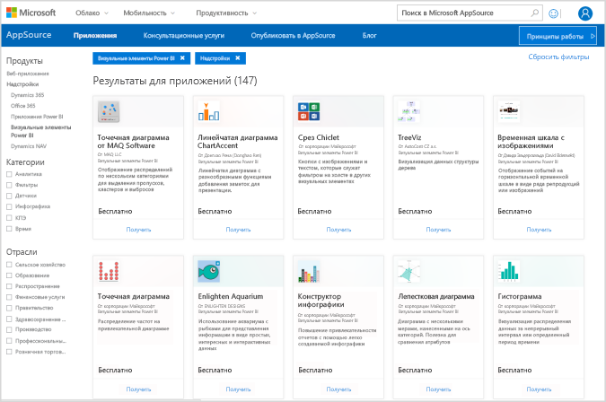
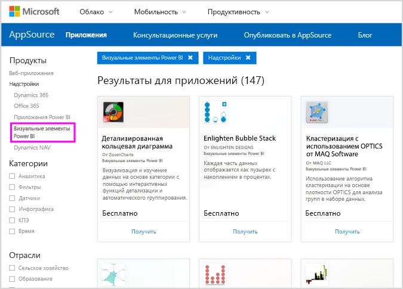
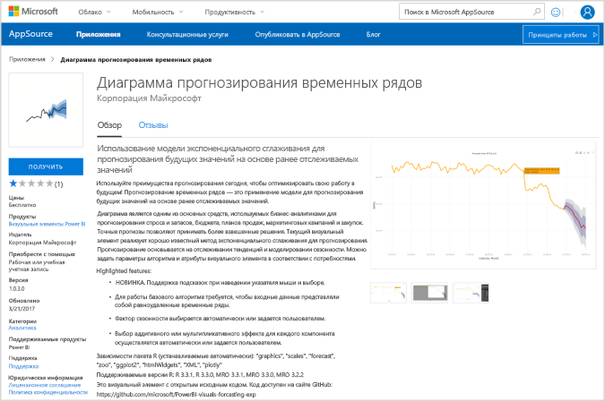
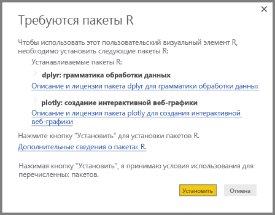
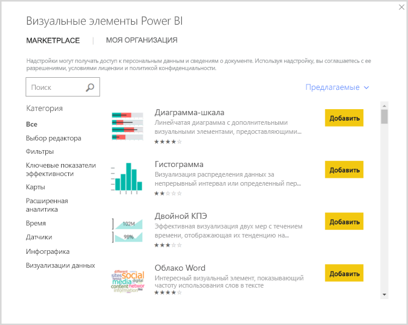

# Использование визуализаций Power BI на основе R в Power BI

В **Power BI Desktop** и **службе Power BI** можно использовать визуальные элементы Power BI на основе R. Для этого не нужно знать язык R или писать на нем какие-либо сценарии. Это позволяет использовать аналитические и графические возможности визуализаций и сценариев R без изучения языка R и самостоятельного программирования на нем.

Чтобы использовать визуальные элементы Power BI на основе R, сначала выберите и скачайте нужный элемент из коллекции **визуальных элементов Power BI**[**AppSource**](https://appsource.microsoft.com/marketplace/apps?product=power-bi-visuals&page=1).

В следующих разделах объясняется, как выбрать, скачать и использовать R-визуализации в **Power BI Desktop**.

## Использование визуальных элементов Power BI на основе R

Чтобы использовать визуальные элементы Power BI на основе R, скачайте нужные объекты из библиотеки **визуальных элементов Power BI**. После этого вы сможете использовать их, как любой другой визуальный элемент в **Power BI Desktop**. Существует два способа получить визуальные элементы Power BI: их можно скачать с веб-сайта **AppSource** или получить в **Power BI Desktop**. 

### Получение визуальных элементов Power BI из AppSource

Ниже приведены инструкции по просмотру и выбору визуальных элементов на веб-сайте **AppSource**.

1. Перейдите к библиотеке визуальных элементов Power BI по адресу [https://appsource.microsoft.com](https://appsource.microsoft.com/). Установите флажок *Power BI apps* (Приложения Power BI) в меню *Уточнить по продукту* и перейдите по ссылке **See all** (Просмотреть все).

   

2. На странице библиотеки [визуальных элементов Power BI](https://appsource.microsoft.com/marketplace/apps?product=power-bi-visuals&page=1) в списке надстроек в левой области выберите **Визуальные элементы Power BI**.

   

3. Выберите в коллекции нужный **визуальный элемент**, после чего вы будете перенаправлены на страницу с его описанием. Нажмите кнопку **Get it now** (Получить) для скачивания.

   > [!NOTE]
    > Для разработки в **Power BI Desktop** необходимо установить R на локальном компьютере. Если пользователь будет просматривать R-визуализации в **службе Power BI**, устанавливать R локально не нужно.

   

   Чтобы использовать визуальные элементы Power BI на основе R в **службе Power BI**, вам не нужно устанавливать R. Но если вы хотите использовать их в **Power BI Desktop**, то вам *необходимо* установить R на локальный компьютер. Вы можете загрузить R из таких расположений:

   * [CRAN](https://cran.r-project.org/)
   * [MRO](https://mran.microsoft.com/)

4. Скачав визуализацию (как любой другой файл в браузере), откройте **Power BI Desktop**, на панели **Визуализации** щелкните **Дополнительные параметры** (...) и выберите команду **Импортировать из файла**.

   
5. Появится предупреждение об импорте пользовательских визуальных элементов, как показано на рисунке ниже.

   
6. Перейдите в папку, в которой сохранен файл визуального элемента, и выберите этот файл. Пользовательские визуализации **Power BI Desktop** имеют расширение .pbiviz.

   
7. Вернувшись в Power BI Desktop, вы увидите на панели **Визуализации** новый тип визуального элемента.

   
8. После того как вы импортировали новую визуализацию или открыли отчет, который содержит настраиваемую R-визуализацию, служба **Power BI Desktop** начнет устанавливать требуемые пакеты R.

   

9. На этом этапе вы можете добавить данные в визуальный элемент так же, как в любой другой визуальный элемент **Power BI Desktop**. По завершении вы увидите готовый визуальный элемент на холсте. В следующем примере R-визуализация **Forecasting** (Прогнозирование) используется с прогнозами ООН относительно рождаемости (визуализация слева).

    

    Как и в случае с любым другим визуальным элементом **Power BI Desktop**, вы можете опубликовать отчет с R-визуализациями в **службе Power BI** и предоставить к нему доступ другим пользователям.

    Регулярно посещайте библиотеку, так как она постоянно пополняется новыми визуальными элементами.

### Получение визуальных элементов Power BI в **Power BI Desktop**

1. Вы также можете получить визуальные элементы Power BI в **Power BI Desktop**. В **Power BI Desktop** нажмите правой кнопкой мыши кнопку с многоточием (...) в области **Визуализации** и выберите **Импорт из магазина**.

   

2. После этого откроется диалоговое окно **Визуальные элементы Power BI**, где можно просмотреть доступные визуальные элементы Power BI и выбрать нужный. Можно выполнить поиск по имени, выбрать категорию или просто прокрутить список доступных визуальных элементов. Когда все будет готово, просто нажмите **Добавить**, чтобы добавить настраиваемый визуальный элемент в **Power BI Desktop**.

   

## Публикация визуализаций Power BI на основе R в Power BI

Если вы создаете собственные визуальные элементы R для использования в отчетах, вы можете делиться ими со всем миром, публикуя их в **коллекции визуальных элементов Power BI**. Публикация выполняется через GitHub. Процесс описан по ссылке ниже.

* [Публикация в коллекции визуальных элементов Power BI](https://github.com/Microsoft/PowerBI-visuals#building-r-powered-custom-visual-corrplot)

## Устранение неполадок визуальных элементов Power BI на основе R в Power BI

Чтобы визуальные элементы Power BI на основе R работали правильно, необходимо соблюдать определенные зависимости. Если визуальные элементы Power BI на основе R выполняются или загружаются неправильно, это свидетельствует о какой-то из описанных ниже проблем:

* отсутствие модуля R;
* ошибки в скрипте R, на котором основывается визуальный элемент;
* пакеты R отсутствуют или устарели.

В следующем разделе описаны действия по устранению возникших неполадок.

### Пакеты R отсутствуют или устарели

При попытке установить пользовательский визуальный элемент на основе R могут возникнуть ошибки, связанные с отсутствием или устареванием пакетов R. Это вызвано одной из следующих причин:

* установленный экземпляр R несовместим с пакетом R;
* настройки брандмауэра, антивирусных программ или прокси-сервера препятствуют подключению R к Интернету;
* медленное подключение к Интернету или проблема с подключением к нему.

Команда Power BI работает над устранением этих проблем, прежде чем они повлияют на вашу работу. Следующий выпуск Power BI Desktop будет включать обновления для решения этих проблем. До появления следующего выпуска можно выполнить предложенные ниже действия по устранению проблем.

1. Удалите пользовательский визуальный элемент и установите его снова. Это вызовет переустановку пакетов R.
2. Если у вас установлена не последняя версия R, обновите ее. Затем удалите или переустановите пользовательский визуальный элемент, как описано выше.

   Поддерживаемые версии R указаны в описании каждого пользовательского визуального элемента на основе R (см. рисунок ниже).

     
    > [!NOTE]
    > Вы можете не удалять исходный установленный экземпляр R и связать Power BI Desktop только с устанавливаемой текущей версией. Выберите **Файл > Параметры и настройки > Параметры > Создание R-скриптов**.

3. Установите пакеты R вручную с помощью любой консоли R. Ниже описано, как это сделать.

   а.  Загрузите сценарий установки визуальных элементов на основе R и сохраните этот файл на локальный жесткий диск.

   б.  Из консоли R выполните следующую команду:

       source("C:/Users/david/Downloads/ScriptInstallPackagesForForecastWithWorkarounds.R")

   Обычные расположения установки по умолчанию:

       c:\Program Files\R\R-3.3.x\bin\x64\Rterm.exe (for CRAN-R)
       c:\Program Files\R\R-3.3.x\bin\x64\Rgui.exe (for CRAN-R)
       c:\Program Files\R\R-3.3.x\bin\R.exe (for CRAN-R)
       c:\Program Files\Microsoft\MRO-3.3.x\bin\R.exe (for MRO)
       c:\Program Files\Microsoft\MRO-3.3.x\bin\x64\Rgui.exe (for MRO)
       c:\Program Files\RStudio\bin\rstudio.exe (for RStudio)
4. Если предыдущие действия неэффективны, сделайте следующее:

   а. В **R Studio** выполните действия, описанные в разделе 3б выше (выполните строку скрипта из консоли R).

   б. Если это не поможет, в **R Studio** откройте **Tools (Сервис) > Global Options (Глобальные параметры) > Packages (Пакеты)** и установите флажок **Use Internet Explorer library/proxy for HTTP** (Использовать библиотеку/прокси-сервер Internet Explorer для HTTP), а затем повторите действия из раздела 3б выше.

## Дальнейшие действия

Ознакомьтесь с дополнительными материалами по R в Power BI.

* [Коллекция визуальных элементов Power BI](https://app.powerbi.com/visuals/)
* [Выполнение сценариев R в Power BI Desktop](../connect-data/desktop-r-scripts.md)
* [Создание визуальных элементов Power BI с помощью R](desktop-r-visuals.md)
* [Использование внешней среды R IDE с Power BI](../connect-data/desktop-r-ide.md)
