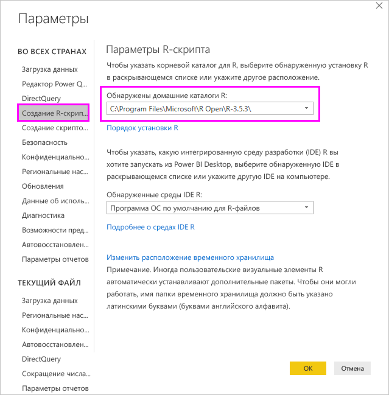
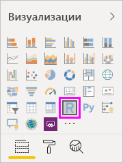
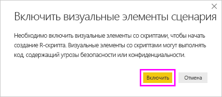
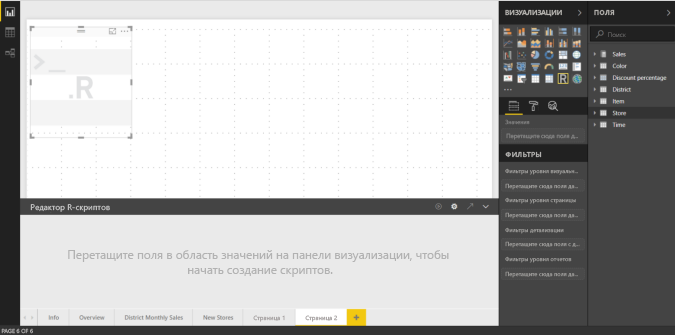
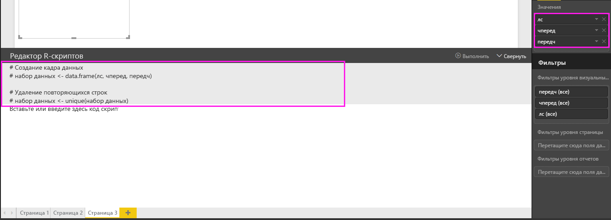
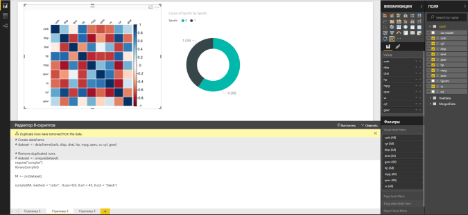
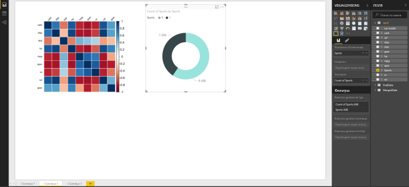
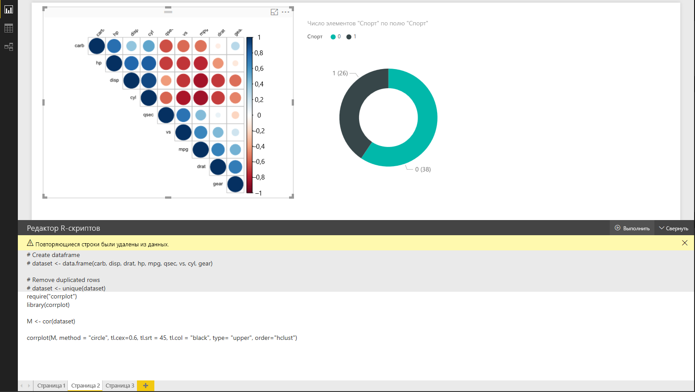
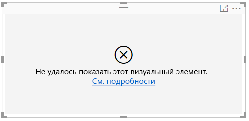

# <a name="create-power-bi-visuals-using-r"></a>Создание визуальных элементов Power BI с помощью R
В Power BI Desktop для наглядного представления данных можно использовать *R* . [R](https://mran.revolutionanalytics.com/documents/what-is-r) — это язык и среда для статистических вычислений и графики.

## <a name="install-r"></a>Установка скрипта R
Модуль R не входит в состав приложения Power BI Desktop, не развертывается и не устанавливается вместе с ним. Для выполнения сценариев R в Power BI Desktop необходимо отдельно установить R на локальном компьютере. Вы можете скачать и установить R бесплатно из различных расположений, включая [страницу скачивания Revolution Open](https://mran.revolutionanalytics.com/download/) и [репозиторий CRAN](https://cran.r-project.org/bin/windows/base/). В текущем выпуске R-скриптов в Power BI Desktop в пути установки поддерживаются символы Юникода, а также пробелы (пустые символы).

## <a name="enable-r-visuals-in-power-bi-desktop"></a>Включение визуальных элементов R в Power BI Desktop
После установки R приложение Power BI Desktop включает его автоматически. Чтобы убедиться, что приложение Power BI Desktop включило R в правильном расположении, сделайте следующее. 

1. В меню Power BI Desktop последовательно выберите **Файл** > **Параметры и настройки** > **Параметры** . 

2. В левой части страницы **Параметры** в разделе **Глобальные** выберите **Создание R-скриптов** . 

3. В разделе **Параметры R-скрипта** убедитесь, что в поле **Обнаружены домашние каталоги R** указана локальная установка R и она соответствует локальной установке R, которую нужно использовать в Power BI Desktop. На следующем рисунке показан путь к локальной установленной версии R: **C:\Program Files\R Open\R-3.5.3\\** .
   
   

После проверки установки R вы можете приступать к созданию визуальных элементов R.

## <a name="create-r-visuals-in-power-bi-desktop"></a>Создание визуальных элементов R в приложении Power BI Desktop
1. Выберите значок **R Visual** (Визуальный элемент R) в области **Визуализация** , чтобы добавить визуальный элемент R.
   
   

2. В появляющемся окне **Включить визуальные элементы сценария** выберите **Включить** .

   

   При добавлении визуального элемента R в отчет приложение Power BI Desktop вносит следующие изменения.
   
   - На холсте отчета появляется изображение заполнителя для визуального элемента R.
   
   - В нижней части центральной области открывается **редактор R-скриптов** .
   
   

3. В разделе **Значения** области **Визуализация** перетащите из области **Поля** поля, которые требуется использовать в сценарии R, как и для любого другого визуального элемента Power BI Desktop. Кроме того, можно выбрать эти поля непосредственно в области **Поля** .
    
    Сценарию R доступны только поля, добавленные в раздел **Значения** . При работе в **редакторе сценариев R** вы можете добавлять в область **Значения** новые поля и удалять ненужные. Power BI Desktop автоматически определяет, какие поля были добавлены или удалены.
   
   > [!NOTE]
   > По умолчанию для визуальных элементов R используется тип агрегирования *Не подводить итоги* .
   > 
   > 
   
4. Теперь выбранные данные можно использовать для создания визуализации. 

    - При выборе полей **редактор сценариев R** создает для них связующий код сценария в серой области вверху области редактора.
    - Если удалить поле, **редактор сценариев R** автоматически удаляет вспомогательный код для этого поля.
   
   В примере, показанном на изображении ниже, выбраны три поля: hp, gear и drat. В результате редактор создает связующий код следующего характера.
   
   * Создается кадр данных **dataset** , который состоит из различных полей, выбранных пользователем.
   * По умолчанию используется тип агрегирования *Не суммировать* .
   * Аналогично визуальным элементам таблиц поля сгруппированы, а одинаковые строки отображаются только один раз.
   
   
   
   > [!TIP]
   > В определенных случаях автоматическая группировка не нужна либо нужно, чтобы отображались все строки, в том числе одинаковые. В такой ситуации добавьте индексное поле в набор данных, в результате чего все строки будут считаться уникальными и не будут объединяться в группы.
   > 
   > 
   
   Созданный кадр данных называется **dataset** , и к выбранным столбцам можно обращаться по соответствующим именам. Например, чтобы обратиться к полю gear, добавьте *dataset$gear* в сценарий R. Имена полей, содержащие пробелы или специальные символы, следует заключать в одинарные кавычки.

5. После автоматического создания кадра данных с выбранными полями можно написать сценарий R, по которому Power BI Desktop строит визуализацию на устройстве R по умолчанию. Завершив выполнение сценария, выберите **Запуск скрипта** в правой части строки заголовка **редактора сценариев R** .
   
    При выборе элемента **Запуск скрипта** Power BI Desktop определяет визуализацию и наносит ее на холст. Так как эта процедура выполняется в локальной среде R, нужно установить все необходимые пакеты R.
   
   Power BI Desktop выполняет повторное построение визуального элемента каждый раз, когда:
   
   * вы выбираете элемент **Запуск скрипта** в строке заголовка **редактора сценариев R** ;
   * происходит изменение данных в результате обновления, применения фильтра или выделения.

     На изображении ниже показан пример кода корреляционной диаграммы: на визуализации представлены связи между атрибутами различных типов автомобилей.

     

6. Чтобы увеличить область визуализации, можно свернуть **редактор сценариев R** . Как и при работе с другими визуальными элементами в Power BI Desktop, на корреляционной диаграмме можно выполнять перекрестную фильтрацию, выбрав конкретный раздел (например, спортивные автомобили) в визуальном элементе в форме кольца (круглый элемент справа).

    

7. В сценарий R также можно внести изменения для настройки визуального элемента, в том числе путем добавления параметров R в команду построения диаграммы.

    В исходном виде команда построения диаграммы выглядит так.

    ```
    corrplot(M, method = "color",  tl.cex=0.6, tl.srt = 45, tl.col = "black")
    ```

    Измените сценарий R так, чтобы команда построения диаграммы имела следующий вид.

    ```
    corrplot(M, method = "circle", tl.cex=0.6, tl.srt = 45, tl.col = "black", type= "upper", order="hclust")
    ```

    В результате визуальные элементы R на диаграмме выглядят как круги, при этом учитывается только верхняя половина значений, а порядок элементов в матрице изменен таким образом, чтобы сгруппировать связанные атрибуты.

    

    Если при выполнении сценария R возникает ошибка, на холсте вместо создаваемого визуального элемента R появляется сообщение об ошибке. Чтобы просмотреть подробные сведения об этой ошибке, выберите команду **См. подробности** в данном сообщении.

    

## <a name="r-scripts-security"></a>Безопасность R-скриптов 
Визуальные элементы R создаются на основе сценариев R, которые могут содержать код, не обеспечивающий достаточный уровень безопасности или конфиденциальности. При первой попытке просмотра визуальных элементов R или взаимодействия с ними пользователь видит предупреждение системы безопасности. Включайте визуальные элементы R, только если доверяете автору и источнику либо после проверки и ознакомления со сценариями R.


## <a name="known-limitations"></a>Известные ограничения
У визуальных элементов R в Power BI Desktop есть следующие ограничения.

* Размер данных: для нанесения на холст визуальный элемент R может использовать до 150 000 строк. Если выбрано больше строк, используются только первые 150 000 из них; при этом на изображении появляется соответствующее сообщение.

* Размер выходных данных. Максимальный размер выходных данных визуального элемента R — 2 МБ.

* Разрешение: Все визуальные элементы R отображаются с разрешением 72 DPI.

* Устройство построения: построение поддерживается только на устройстве по умолчанию. 

* Время вычисления: если вычисление визуального элемента R занимает более пяти минут, возникает ошибка времени ожидания.

* Связи: как и при работе с другими визуальными элементами Power BI Desktop, при выборе полей данных из разных таблиц, между которыми не определены связи, возникает ошибка.

* Обновления: Визуальные элементы R обновляются при обновлении данных, применении фильтрации и выделения. Однако само изображение не является интерактивным и не может служить источником для перекрестной фильтрации.

* Основные особенности: визуальные элементы R реагируют на выделение других визуальных элементов, однако выполнять перекрестную фильтрацию, выбирая объекты на визуальном элементе R, невозможно.

* Устройства для отображения: На холсте правильно отображаются только визуализации, построение которых выполняется на устройстве отображения R по умолчанию. Не рекомендуется указывать явным образом другое устройство отображения R.

* Переименование столбцов Визуальные элементы R не поддерживают переименование столбцов входных данных. Во время выполнения скрипта обращение к столбцам происходит по их исходным именам.

* Установки RRO: в этом выпуске 32-разрядная версия Power BI Desktop не определяет установленные экземпляры RRO автоматически; нужно вручную указать путь к каталогу установки R в разделе **Параметры и настройки** > **Параметры** > **Создание R-скриптов** .

## <a name="next-steps"></a>Дальнейшие действия
Дополнительные сведения о R в Power BI см. в следующих статьях.

* [Выполнение сценариев R в Power BI Desktop](../connect-data/desktop-r-scripts.md)
* [Использование внешней среды R IDE с Power BI](../connect-data/desktop-r-ide.md)
