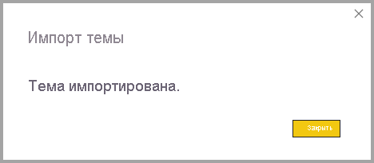
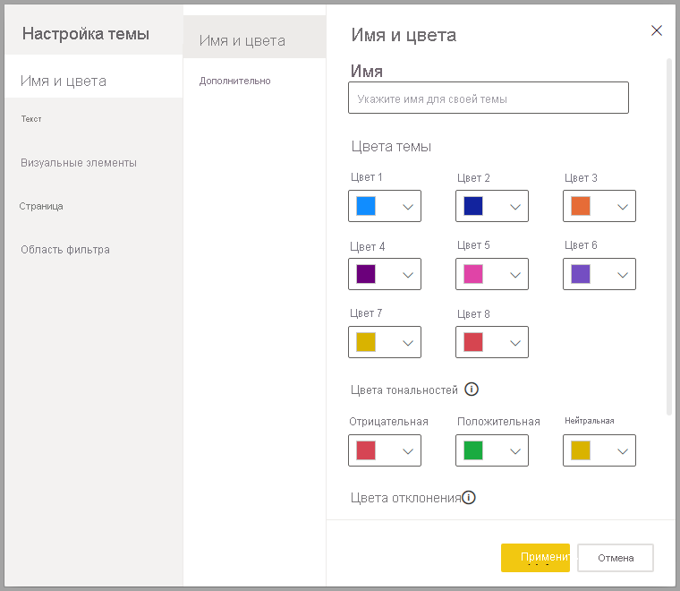
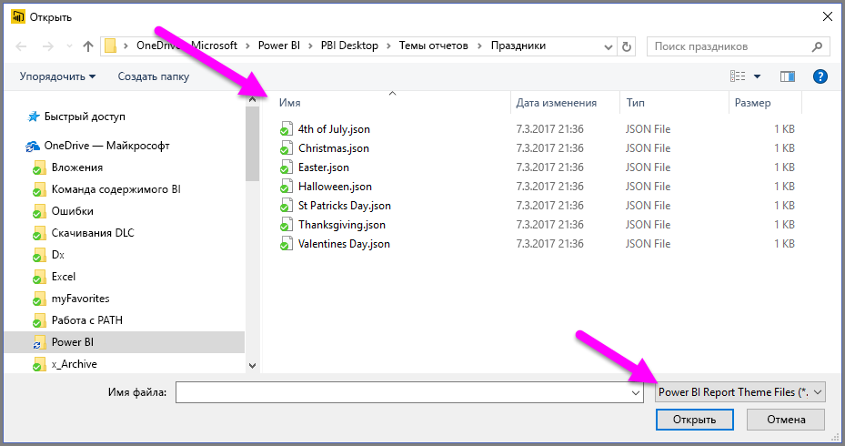
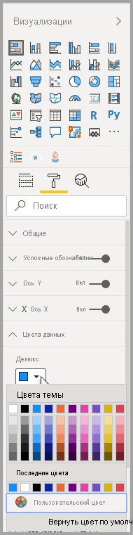
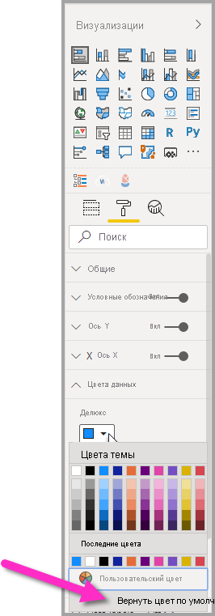
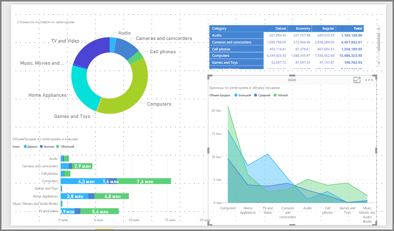
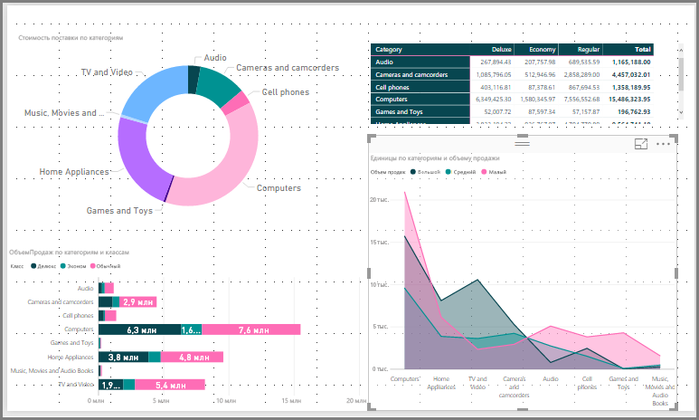
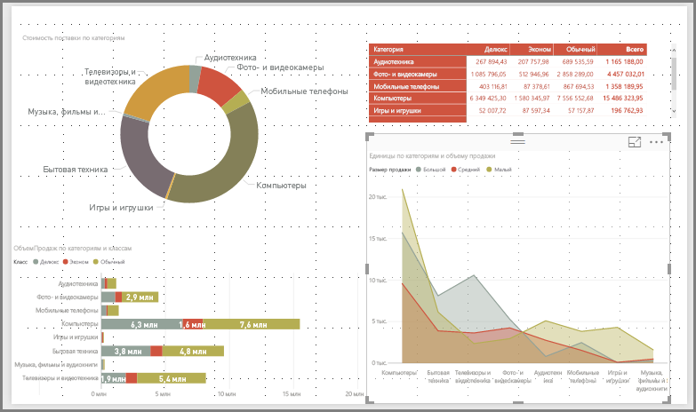
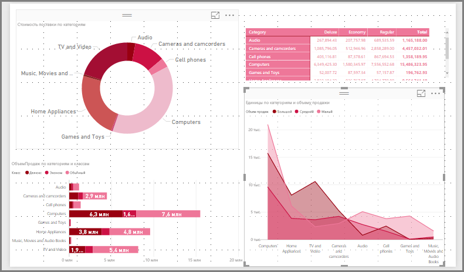

# <a name="use-report-themes-in-power-bi-desktop"></a>Использование тем отчетов в Power BI Desktop

С помощью *тем отчетов* Power BI Desktop можно применить изменения макета ко всему отчету, например использовать корпоративные цвета, изменить наборы значков или применить новое визуальное форматирование по умолчанию. При применении темы отчета для всех визуальных элементов в отчете используются цвета и форматирование из выбранной темы в качестве значений по умолчанию. Для цветовых схем есть несколько исключений, которые описаны далее в этой статье.

Чтобы выбрать темы отчета, в ленте **Представление** откройте раскрывающийся список **Темы** и выберите нужную тему. Вам будут доступны такие же темы, как в других продуктах Майкрософт, такие как Microsoft PowerPoint.


Темы отчетов делятся на два типа: встроенные и пользовательские.

- **Встроенные** темы отчетов предоставляют различные типы стандартных цветовых схем, которые устанавливаются вместе с Power BI Desktop. Вы можете выбрать встроенные темы отчетов непосредственно в меню Power BI Desktop.

- **Пользовательские** темы отчетов создаются путем редактирования текущей темы и сохранения ее как пользовательской либо путем создания собственной настраиваемой темы из JSON-файла. JSON-файл позволяет точно управлять многими аспектами темы отчета, как описано далее в этой статье. 

Рассмотрим, как работают темы отчетов, а затем перейдем к созданию пользовательских тем отчетов.


## <a name="how-report-themes-work"></a>Как работают темы отчета

Применить тему отчета к отчету Power BI Desktop можно одним из следующих способов.

* Выбрать тему из [доступных тем отчетов](#built-in-report-themes), встроенных в Power BI Desktop.
* Настроить тему в диалоговом окне **Настройка темы**.
* [Импортировать JSON-файл пользовательской темы](#import-custom-report-theme-files).

Рассмотрим каждый из этих вариантов по очереди.

> [!NOTE]
> Темы можно применять только при использовании Power BI Desktop. К существующим отчетам в службе Power BI нельзя применять темы. 

### <a name="built-in-report-themes"></a>Встроенные темы отчетов

Для выбора доступной встроенной темы отчета сделайте следующее:

1. Откройте раскрывающееся меню **Темы**, нажав кнопку **Переключить тему** на ленте **Представление**.

   

2. Выберите одну из включенных тем в открывшемся раскрывающемся меню.

   

   Теперь эта тема отчета будет применена к отчету.

    В приведенной ниже таблице указаны доступные встроенные темы отчетов.
    
    | Встроенная тема отчета | Стандартная последовательность цветов |
    |------ |---------- |
    | По умолчанию | |
    | Highrise | |
    | Руководитель | |
    | Граница| |
    | Инновации | |
    | Цветение | |
    | Прилив| |
    | Температура | |
    | Солнечная| |
    | Дивергент | |
    | Буря | |
    | Классическая | |
    | Городской парк | |
    | Аудитория | |
    | Различимая для людей с цветовой слепотой | |
    | Электрическая | |
    | Высокая контрастность | |
    | Закат | |
    | Сумерки | |
    
3. Вы также можете просмотреть коллекцию тем, созданную членами Сообщества Power BI, выбрав пункт **Коллекция тем** в раскрывающемся меню "Темы".

   

    Вы можете выбрать желаемую тему из коллекции и загрузить соответствующий JSON-файл. 

    Чтобы установить скачанный файл, выберите **Поиск тем** из раскрывающегося списка **Темы**, откройте папку, в которую вы сохранили JSON-файл, и выберите этот файл, чтобы импортировать тему в Power BI Desktop как новую.

    При успешном выполнении Power BI откроет диалоговое окно с подтверждением импорта.

   

## <a name="customize-report-themes"></a>Настройка тем отчетов

Вы можете настроить и стандартизировать почти все элементы, перечисленные в разделе **Формат** области **Визуализации**, либо непосредственно в Power BI Desktop, либо с помощью JSON-файла темы отчета. Цель — дать пользователю полный контроль над внешним видом отчета по умолчанию вплоть до мелочей.

Темы отчетов можно настраивать двумя способами.

- [Создание и настройка темы в Power BI Desktop](#create-and-customize-a-theme-in-power-bi-desktop)
- [создание и настройка JSON-файла пользовательской темы отчета](#introduction-to-report-theme-json-files).

Рассмотрим каждый из этих способов в следующих разделах.

### <a name="create-and-customize-a-theme-in-power-bi-desktop"></a>Создание и настройка темы в Power BI Desktop

Чтобы настроить тему непосредственно в Power BI Desktop, можно выбрать тему, близкую к нужной, и внести в нее несколько исправлений. Сначала выберите близкую тему (или начните просто с любой темы и настройте ее) и выполните следующие действия.

1. В ленте **Представление** откройте раскрывающийся список **Темы** и выберите пункт **Настроить текущую тему**.

   

2. Откроется диалоговое окно, в котором можно внести в текущую тему любые необходимые изменения, а затем сохранить эти параметры как новую тему.

   

Настраиваемые параметры темы разделены в окне **Настройка темы** на следующие категории:

- **Имя и цвета.** К параметрам имени и цвета темы относятся [цвета темы](#how-report-theme-colors-stick-with-your-reports), цвета тональностей, цвета отклонения и [структурные цвета (расширенные настройки)](#setting-structural-colors).
- **Text**: Параметры текста включают семейство, размер и цвет шрифтов и настраивают [основные значения по умолчанию для класса текста](#setting-formatted-text-defaults) для меток, заголовков, карточек и КПЭ, а также заголовков вкладок.
- **Визуальные элементы.** К параметрам визуальных элементов относится фон, граница, заголовок и подсказки.
- **Страницу.** К параметрам страницы относятся обои и фон.
- **Область фильтра.** К параметрам области фильтра относится цвет фона, прозрачность, цвет шрифта и значка, размер, карточки фильтров.

После внесения изменений выберите **Применить и сохранить**, чтобы сохранить тему. Теперь ваша тема готова для использования в текущем отчете и для экспорта.

Таким образом можно легко и быстро настраивать текущую тему. Тем не менее вы можете внести более точные корректировки в темы, требующие изменения [JSON-файла](#report-theme-json-file-format) темы.

> [!TIP]
> Наиболее распространенные параметры темы отчета можно настроить с помощью элементов управления в диалоговом окне **Настройка темы**. Для еще большего контроля вы можете экспортировать JSON-файл и вручную выполнить точную настройку, изменив параметры в файле. Этот настроенный JSON-файл можно переименовать, а затем импортировать.

### <a name="import-custom-report-theme-files"></a>Импорт файлов пользовательских тем отчетов

Чтобы импортировать пользовательский файл темы отчета, выполните следующие действия.

1. В ленте **Представление** откройте раскрывающийся список **Темы** и выберите **Поиск тем**.

   

   Откроется окно, позволяющее перейти к расположению JSON-файла темы.

2. На следующем изображении показано несколько доступных файлов праздничных тем. Мы выберем праздничную тему для марта (файл *St Patricks Day.json*).

   

   Power BI Desktop сообщит об успешной загрузке файла темы, отобразив соответствующее сообщение.

   

## <a name="introduction-to-report-theme-json-files"></a>Общие сведения о JSON-файлах тем отчетов

 Открытый основной JSON-файл (St Patricks Day.json), упомянутый в предыдущем разделе, выглядит следующим образом:

 ```json
    {
        "name": "St Patrick's Day",
        "dataColors": ["#568410", "#3A6108", "#70A322", "#915203", "#D79A12", "#bb7711", "#114400", "#aacc66"],
        "background":"#FFFFFF",
        "foreground": "#3A6108",
        "tableAccent": "#568410"
    }
```

JSON-файл темы отчета содержит следующие строки:

- **name** — имя темы отчета. Это единственное обязательное поле.
- **dataColors** — список шестнадцатеричных цветовых кодов для данных в визуальных элементах Power BI Desktop. Этот список может содержать любое необходимое количество цветов.
- **background**, **firstLevelElements**, **tableAccent** (и т. д.): классы цветов. Классы цветов позволяют устанавливать в отчете несколько структурных цветов одновременно.

На основе этого JSON-файла вы можете создать собственный файл темы отчета для импорта. Если вы хотите настроить только основные цвета отчета, измените имя и шестнадцатеричные коды в файле.

В JSON-файле темы отчета определяется лишь форматирование, которое необходимо изменить. Для всех неуказанных в JSON-файле компонентов будут применимы параметры Power BI Desktop по умолчанию.

Создание JSON-файла дает много преимуществ. Например, вы можете указать, что во всех диаграммах следует использовать шрифт 12, в некоторых визуальных элементах нужно использовать определенное семейство шрифтов, либо для диаграмм конкретного типа следует отключить метки данных. Используя JSON-файл, вы можете создать файл темы отчета, который позволит стандартизировать диаграммы и отчеты, а также обеспечит согласованность отчетов организации.

Дополнительные сведения о формате JSON-файла см. в [этом разделе](#report-theme-json-file-format).

> [!NOTE]
> Изменение пользовательской темы отчета в формате JSON с помощью [диалогового окна **Настройка темы**](#create-and-customize-a-theme-in-power-bi-desktop) является безопасной операцией.  В диалоговом окне не будут изменены параметры темы, которые нельзя в нем установить, и будут обновлены изменения, внесенные в тему отчета на месте.

## <a name="how-report-theme-colors-stick-with-your-reports"></a>Применение цветов темы к отчету

При публикации отчета в службу Power BI цвета темы отчета соответствуют выбранным. Кроме того, в разделе **Цвета данных** области **Формат** отображается тема отчета.

Чтобы просмотреть доступные цвета в теме отчета, сделайте следующее:

1. Выберите визуальный элемент.

2. В разделе **Формат** области **Визуализация** выберите **Цвета данных**.

3. Выберите раскрывающийся список элемента, чтобы просмотреть сведения о **цветах темы** отчета.

   

Например, просмотрите цвета темы, применив несколько оттенков зеленого и коричневого цветов из темы отчета St. Patrick's Day. Видите все оттенки зеленого? Они появились, потому что были частью импортированной и примененной темы отчета.

Цвета в цветовой палитре связаны с текущей темой. Например, предположим, что для точки данных вы выбрали третий цвет верхней строки. Позже, если вы переключитесь на другую тему, цвет этой точки данных автоматически изменится на третий цвет верхней строки в новой теме, как это было при смене темы в Microsoft Office.

Настроив темы отчета, можно изменить цвета по умолчанию, используемые в визуальных элементах отчета. В Power BI предлагается на выбор сотни цветов, чтобы обеспечить цветовое разнообразие визуальных элементов в отчете. Когда Power BI назначает цвета для ряда визуальных элементов, цвета выбираются в том порядке, в котором назначаются цвета рядов. При импорте темы выполняется сброс сопоставления цветов для ряда данных. 

Power BI отслеживает цвет динамического ряда и использует тот же цвет для значения в других визуальных элементах. В *динамических рядах* количество рядов, представленных в визуальных элементах, может изменяться в зависимости от мер, значений или других аспектов. Например, если в отчете отображается *Прибыль по регионам*, то количество регионов продаж может быть пять или девять. Число регионов является динамическим, поэтому оно считается динамическим рядом. 

И наоборот, для *статических рядов* число рядов известно. Например, *Прибыль* и *Доход* — статические ряды. В статическом ряду Power BI назначает цвета по индексу в палитрах темы. Можно переопределить назначение цвета по умолчанию, выбрав цвет в области форматирования в разделе **Цвета данных**. Возможно, потребуется изменить срез, чтобы просмотреть все возможные значения рядов, а также задать их цвета. Если явно задать цвет для одного визуального элемента с помощью панели **Свойства**, импортированная тема не будет применяться к любым из этих явно определенных цветов. 

Чтобы разрешить этой теме применять явно выбранные цвета, используйте параметр **Вернуть значения по умолчанию** в разделе **Цвета данных** визуального элемента, для которого явно задан цвет, чтобы отменить явное применение цвета и разрешить применение темы.


### <a name="situations-when-report-theme-colors-wont-stick-to-your-reports"></a>Ситуации, в которых цветовые схемы отчета не будут применяться к отчетам

Предположим, вы применили пользовательский набор цветов (или отдельный цвет) к определенной точке данных визуального элемента, используя функцию **Пользовательский цвет** в средстве выбора цветов. Когда вы примените тему отчета, она *не* переопределит цвет такой точки данных.

Кроме того, если установить цвет точки данных в разделе **Цвета темы** палитры цветов вручную, этот цвет *не* обновится, когда будет применена тема отчета. Чтобы цвета восстанавливались по умолчанию, т. е. обновлялись при применении новой темы отчета, выберите параметр **Вернуть значения по умолчанию** или выберите цвет из палитры **Цвета темы** в средстве выбора цветов.



В темах отчета не поддерживаются многие визуальные элементы Power BI.

## <a name="custom-report-theme-files-you-can-use-right-now"></a>Файлы пользовательских тем отчета, которые можно использовать прямо сейчас

Хотите начать работать с темами отчета? Ознакомьтесь с пользовательскими темами отчетов в [коллекции тем](https://community.powerbi.com/t5/Themes-Gallery/bd-p/ThemesGallery) или попробуйте использовать приведенные ниже готовые JSON-файлы пользовательских тем отчетов, скачав и импортировав их в отчет Power BI Desktop:

- [Тема Waveform (Волны)](https://community.powerbi.com/t5/Themes-Gallery/Waveform/m-p/140536). Эта тема отчета была представлена в [записи блога](https://powerbi.microsoft.com/blog/power-bi-desktop-march-feature-summary/), содержащей объявление о первом выпуске тем отчетов. [Скачать Waveform.json](https://go.microsoft.com/fwlink/?linkid=843924).

  

- [Тема, адаптированная для людей с цветовой слепотой](https://community.powerbi.com/t5/Themes-Gallery/Color-Blind-Friendly/m-p/140597).
Эта тема отчета подходит для пользователей с ослабленным зрением. [Скачать ColorblindSafe-Longer.json](https://go.microsoft.com/fwlink/?linkid=843923).

  .

- Файл Apothecary.json с темами Power View. [Скачать ZIP-файл с темами Power View](https://go.microsoft.com/fwlink/?linkid=843925).

  

- Тема Valentine's Day (День святого Валентина).

  

  Ниже приведен код цветов темы Valentine's Day (День святого Валентина) в JSON-файле:

   ```json
       {
           "name": "Valentine's Day",
           "dataColors": ["#990011", "#cc1144", "#ee7799", "#eebbcc", "#cc4477", "#cc5555", "#882222", "#A30E33"],
           "background":"#FFFFFF",
           "foreground": "#ee7799",
           "tableAccent": "#990011"
       }
   ```

Вот еще несколько тем отчетов, которые можно использовать на начальном этапе:

- [Sunflower-twilight](https://community.powerbi.com/t5/Themes-Gallery/Sunflower-Twilight/m-p/140749) (Подсолнух в сумерках);
- [Plum](https://community.powerbi.com/t5/Themes-Gallery/Plum/m-p/140711) (Сливовая);
- [Autumn](https://community.powerbi.com/t5/Themes-Gallery/Autumn/m-p/140746) (Осень);
- [High contrast](https://community.powerbi.com/t5/Themes-Gallery/Color-Blind-Friendly/m-p/140597) (Высокая контрастность).

Благодаря темам отчетов отчеты Power BI Desktop могут отражать ваше настроение, корпоративный стиль организации, текущее время года или праздник.

## <a name="export-report-themes"></a>Экспорт тем отчетов

Вы можете экспортировать применяемую в данный момент тему отчета из Power BI Desktop непосредственно в JSON-файл. После экспорта тему отчета можно повторно использовать в других отчетах. Эта опция позволяет экспортировать JSON-файл для большинства встроенных тем. Единственными исключениями являются базовые темы, "Классическая" и "По умолчанию", которые при импорте могут основываться на других темах.

Чтобы экспортировать текущую примененную тему из Power BI Desktop, сделайте следующее:

1. Выберите **Файл** > **Параметры и настройки** > **Параметры**.

2. В разделе **Функции предварительной версии** выберите **Настроить текущую тему**, а затем нажмите кнопку **OK**.

   Чтобы включить предварительную версию функции, вам может быть предложено перезапустить Power BI Desktop. После перезапуска вы сможете приступить к экспорту текущей примененной темы.

3. На ленте **Главная** выберите **Переключить тему** > **Экспорт текущей темы**.

4. В диалоговом окне **Сохранить как** перейдите в каталог, содержащий JSON-файл, а затем выберите **Сохранить**.

## <a name="report-theme-json-file-format"></a>Формат JSON-файла для темы отчета

На самом базовом уровне JSON-файл темы содержит только одну обязательную строку: **name**.

```json
{
    "name": "Custom Theme"
}
```

Все другие строки, кроме **name**, являются необязательными, а это означает, что вы можете добавлять в файл темы только те свойства, которые хотите отформатировать. Для остальных же свойств будут применены параметры Power BI по умолчанию.

### <a name="setting-theme-colors"></a>Настройка цветов темы

Под строкой **name** можно добавить следующие базовые свойства, связанные с цветом данных:

- **dataColors** — список шестнадцатеричных цветовых кодов для использования в цветовых формах, которые представляют данные в визуальных элементах Power BI Desktop. Этот список может содержать любое необходимое количество цветов. Если все цвета из этого списка использованы, а визуальный элемент по-прежнему нуждается в большем количестве цветов, он возвращается к использованию палитры цветов Power BI по умолчанию.
- **good**, **neutral**, **bad** — свойства, которые устанавливают цвета состояния, используемые каскадной диаграммой и визуальным элементом КПЭ.
- **maximum**, **center**, **minimum**, **null**: цвета, задающие различные цвета градиента в диалоговом окне "Условное форматирование".

Базовая тема, определяющая эти цвета, может выглядеть следующим образом:

```json
{
    "name": "Custom Theme",
    "dataColors": [
        "#118DFF",
        "#12239E",
        "#E66C37",
        "#6B007B",
        "#E044A7",
        "#744EC2",
        "#D9B300",
        "#D64550",
        "#197278",
        "#1AAB40"
    ],
    "good": "#1AAB40",
    "neutral": "#D9B300",
    "bad": "#D64554",
    "maximum": "#118DFF",
    "center": "#D9B300",
    "minimum": "#DEEFFF",
    "null": "#FF7F48"
}
```

### <a name="setting-structural-colors"></a>Настройка структурных цветов

Далее можно добавить различные классы цветов, такие как **background** и **firstLevelElements**. Эти классы цветов устанавливают структурные цвета для элементов отчета, например линии сетки осей, цвета выделения и цвета фона для визуальных элементов.

В приведенной ниже таблице можно указаны шесть классов цветов, которые можно форматировать.  Имена **классов Color** соответствуют именам на вкладке "Дополнительно" подраздела "Дополнительные параметры" раздела "Имена и цвета" в [диалоговом окне **Настройка темы**](#create-and-customize-a-theme-in-power-bi-desktop).

|Класс цвета  |Что он форматирует  |
|---------|---------|
| **firstLevelElements** <br> **foreground**    (не рекомендуется) | Цвет фона меток (в точке за пределами данных) <br> Цвет линии тренда <br>  Цвет текстового поля по умолчанию <br> Цвет значений таблицы и матрицы, а также цвет шрифтов итогов и оси гистограммы <br> Метки данных карты <br> Цвет датчика "Значение выноски" <br> Цвет цели КПЭ <br>  Цвет текста КПЭ <br> Цвет элемента среза (в режиме фокусировки)  <br> Цвет шрифта элемента в раскрывающемся списке среза <br> Цвет шрифта цифрового ввода среза <br> Цвет шрифта верхнего колонтитула среза <br> Цвет линии отношения точечной диаграммы <br> Цвет линии прогноза графика <br> Цвет линии лидера в карте <br> Цвет панели фильтра и цвет текста карточки|
| **secondLevelElements** <br> **foregroundNeutralSecondary** (не рекомендуется) | "light" [дополнительные классы текста](#setting-formatted-text-defaults) <br> Цвета метки  <br> Цвет метки условных обозначений <br> Цвет метки оси <br> Цвет шрифта заголовка матрицы и таблицы <br> Цвет целевого датчика и строки целевого лидера <br>  Цвет оси тренда КПЭ <br> Цвет ползунка среза <br> Цвет шрифта элемента среза <br> Цвет контура среза <br> Цвет при наведении указателя мыши на график <br> Цвет заголовка многострочной карточки <br> Цвет начертания ленточной диаграммы <br> Цвет границы для сопоставителя фигур <br> Цвет шрифта текста кнопки <br> Цвет линии значка кнопки <br> Цвет контура кнопки |
| **thirdLevelElements** <br >**backgroundLight** (не рекомендуется) | Цвет линий сетки оси <br> Цвет сетки таблицы и матрицы <br> Цвет фона верхнего колонтитула среза (в режиме фокусировки)  <br> Цвет контура многострочной карточки  <br> Цвет заливки фигуры <br> Цвет фона шкалы "arc" <br> Цвет фона примененной карты фильтра <br> Когда цвет фона = FFFFFF <br> Цвет заливки неактивной кнопки <br> Цвет контура неактивной кнопки <br> |
| **fourthLevelElements** <br> **foregroundNeutralTertiary** (не рекомендуется) | цвет затенения условных обозначений <br> Цвет метки категории карточки <br> Цвет меток категории многострочной карточки <br> Цвет панели многострочной карточки <br> Цвет начертания коэффициента конверсии воронкообразной диаграммы <br> Цвет шрифта текста неактивной кнопки <br> Цвет линии значка неактивной кнопки <br> |
| **background** | Цвет фона меток (в точке в пределах данных) <br> Цвет фона элемента раскрывающегося меню среза  <br> Цвет начертания кольцевого графика <br> Цвет обводки диаграммы-дерева <br> Цвет фона комбинированной диаграммы <br> Цвет заливки кнопки <br> Цвет панели фильтров и доступный цвет фона карточки фильтра |
| **secondaryBackground** <br> **backgroundNeutral** (не рекомендуется) | Цвет контура сетки таблицы и матрицы <br> Цвет карты фигур по умолчанию <br> Цвет заливки ленты на ленточной диаграмме (при отключенном параметре "Подобрать цвет в соответствии с последовательностью") <br> Когда цвет фона != FFFFFF <br> Цвет заливки неактивной кнопки <br> Цвет контура неактивной кнопки <br> |
| **tableAccent** | Переопределяет цвет контура сетки таблицы и матрицы при его наличии |

Ниже приведен пример темы, которая задает класс цветов:

```json
{
    "name": "Custom Theme",
    "firstLevelElements": "#252423",
    "secondLevelElements": "#605E5C",
    "thirdLevelElements": "#F3F2F1",
    "fourthLevelElements": "#B3B0AD",
    "background": "#FFFFFF",
    "secondaryBackground": "#C8C6C4",
    "tableAccent": "#118DFF"
}
```

> [!TIP]
> Если вы создаете "темную тему" или другую цветовую тему, которая отличается от типичного стиля "черные" **FirstLevelElements** на "белом" фоне **background**, обязательно задайте значения для других структурных цветов и [основные цвета класса текста](#setting-formatted-text-defaults).  Благодаря этому, например, метки данных на диаграммах с фоном метки будут соответствовать ожидаемому стилю и будут читаемыми, а линии сетки осей будут заметны.

### <a name="setting-formatted-text-defaults"></a>Задание значений по умолчанию для форматированного текста

Далее вы можете добавить в JSON-файл текстовые классы. Эти классы аналогичны цветовым, но предназначены для обновления размера, цвета и семейства шрифта для групп текста по всему отчету.

Существует 12 текстовых классов, но для изменения всего форматирования текста в отчете необходимо установить лишь четыре, называемые *первичными классами*.  Эти четыре основных класса можно задать в [диалоговом окне **Настройка темы**](#create-and-customize-a-theme-in-power-bi-desktop) в разделе "Текст": "Общие" соответствует классу **label**, "Заголовок" — **title**, "Карточки и КПЭ" — **callout**, а "Заголовки вкладок" — **header**.

Другие текстовые классы, которые считаются *вторичными классами*, автоматически получают свои свойства от связанных с ними первичных классов. Часто вторичный класс выбирает более светлый оттенок цвета текста либо больший или меньший размер текста по сравнению с первичным классом.

Рассмотрим класс **меток** в качестве примера. Форматирование по умолчанию для класса **меток**: Segoe UI, #252423 (темно-серый цвет) и 12 точек. Этот класс используется для форматирования значений в таблице и матрице. Обычно итоговые значения в таблице или матрице имеют схожее форматирование, но так как они выделены жирным шрифтом и используют класс **меток с жирным шрифтом**, то выделяются больше. Однако вам не нужно указывать этот класс в JSON-файле темы; Power BI делает это автоматически. Позже, если вы решите указать в теме метки с 14-точечным шрифтом, вам не нужно будет обновлять класс **меток с жирным шрифтом**, потому что он наследует форматирование текста класса **меток**.

В приведенной ниже таблице представлены следующие сведения:

- Четыре основных класса текста, что они форматируют и параметры по умолчанию.
- Каждый вторичный класс, что он форматирует и его параметры по умолчанию, которые уникальны по сравнению с первичным классом.

|Первичный класс  |Вторичный класс  |Имя класса JSON-файла  | Параметры по умолчанию  |Связанные визуальные объекты  |
|---------|---------|---------|---------|---------|
| Выноска | Н/Д | выноска | DIN <br> #252423 <br> 45pt |Метки данных карты <br> Индикаторы КПЭ|
|Заголовок|Н/Д|заголовок|Segoe UI Semibold <br> #252423 <br> 12pt |Верхние колонтитулы ключевых факторов влияния |
| Название || заголовок |DIN <br> #252423 <br> 12pt |Заголовок оси категорий <br> Заголовок оси значений <br> Заголовок многострочной карточки * <br> Заголовок среза|
|-| Крупный заголовок | largeTitle |14pt |Заголовок визуального элемента |
|Метка ||метка |Segoe UI<br>#252423<br>10pt |Заголовки столбцов таблицы и матрицы <br> Заголовки строк матрицы<br>Сетка таблицы и матрицы<br>Значения таблицы и матрицы |
|-|Полужирный |semiboldLabel| Segoe UI Semibold | Текст профиля ключевых факторов влияния
|-|Большой |largeLabel |12pt | Метки данных для многострочной карточки |
|-|Малый |smallLabel |9pt |Метки строки ссылки * <br>Метки диапазона дат среза<br> Стиль цифрового входного текста среза<br>Поле поиска среза<br>Текст фактора влияния ключевого фактора влияния|
|-|Светлая |lightLabel |#605E5C |Текст условных обозначений<br>Текст кнопки<br>Метки оси категорий<br>Метки данных воронкообразной диаграммы<br>Метки коэффициента конверсии воронкообразной диаграммы<br>Целевой объект датчика<br>Метка категории точечной диаграммы<br>Элементы среза|
|-|Жирный |boldLabel |Segoe UI Bold |Промежуточные итоги матрицы<br>Общие итоги матрицы<br>Общие итоги таблицы |
|-|Большой и светлый |largeLightLabel |#605E5C<br>12pt |Метки категорий карточки<br>Метки датчика<br>Метки категории многострочной карточки |
|-|Малый и светлый |smallLightLabel |#605E5C<br>9pt |Метки данных<br>Метки оси значения|

*\* Отмеченные звездочками элементы также окрашены на основе первого цвета данных темы отчета.*

> [!TIP]
> *Светлые* вариации текстовых классов получают свой светлый цвет из [структурных цветов](#setting-structural-colors), определенных выше.  При создании "темной темы" необходимо также задать цвета firstLevelElements (соответствующие основному цвету текста), secondLevelElements (соответствующие ожидаемому "светлому" цвету текста) и background (с достаточным контрастом по отношению к элементам цвета первого и второго уровня).

Ниже приведен пример темы, которая задает лишь первичные классы текста:

```json
{
    "name": "Custom Theme",
    "textClasses": {
        "callout": {
            "fontSize": 45,
            "fontFace": "DIN",
            "color": "#252423"
        },
        "title": {
            "fontSize": 12,
            "fontFace": "DIN",
            "color": "#252423"
        },
        "header": {
            "fontSize": 12,
            "fontFace": "Segoe UI Semibold",
            "color": "#252423"
        },
        "label": {
            "fontSize": 10,
            "fontFace": "Segoe UI",
            "color": "#252423"
        }
    }
}
```

Вам не нужно указывать вторичные классы в своем файле темы, так как они наследуются от первичных классов. Однако если вам не нравятся правила наследования (например, если вы не хотите, чтобы ваши итоговые значения были версией значений в таблице в жирном выделении), то вы можете явно форматировать вторичные классы в файле темы таким же образом, как и первичные.

### <a name="setting-visual-property-defaults-visualstyles"></a>Задание значений по умолчанию для свойств визуального элемента (`visualStyles`)

Наконец, чтобы создать JSON-файл расширенного формата с большими возможностями форматирования всех визуальных элементов в отчете, в JSON-файл необходимо также добавить раздел **visualStyles**, указав в нем характеристики форматирования. Ниже приведен пример шаблона раздела **visualStyles**:

```json
    "visualStyles": {
        "<visualName>": {
            "<styleName>": {
                "<cardName>": [{
                    "<propertyName>": <propertyValue>
                }]
            }
        }
    }
```

В разделах **visualName** и **cardName** задайте соответствующие имена визуального элемента и карточки. В настоящее время **styleName** всегда является звездочкой (*), но в будущем выпуске вы сможете создавать различные стили для ваших визуальных элементов и давать им имена (похожие на функцию "Стили таблиц и матриц"). **propertyName** — это имя параметра форматирования, а **propertyValue** — значение параметра форматирования.

Если требуется применить параметр ко всем визуальным элементам или ко всем карточкам, содержащим свойство, используйте знак звездочки в кавычках для **visualName** и **cardName**. Использовав звездочку как для имени визуального элемента, так и для имени карточки, вы сможете эффективно применять глобальные настройки, такие как размер шрифта или определенное семейство шрифтов, в отчете для всего текста во всех визуальных элементах.

Ниже приведен пример установки нескольких свойств с помощью стилей визуальных элементов:

```json
{
   "name":"Custom Theme",
   "visualStyles":{
      "*": {
         "*": {
            "*": [{
                "wordWrap": true
            }],
            "categoryAxis": [{
                "gridlineStyle": "dotted"
            }],
            "filterCard": [
              {
                "$id": "Applied",
                "foregroundColor": {"solid": {"color": "#252423" } }
              },
              {
                "$id":"Available",
                "border": true
              }
            ]
         }
      },
      "scatterChart": {
         "*": {
            "bubbles": [{
                  "bubbleSize": -10
            }]
         }
      }
   }
}
```

В данном примере настраиваются следующие параметры:

- Включение переноса по словам по всему файлу.
- Установка пунктирного стиля линии сетки для всех визуальных элементов с осью категорий.
- Установка некоторых форматов для доступных и применяемых карточек фильтра (обратите внимание на форматирование с помощью "$id" для установки различных версий карточек фильтра)
- Установка размера пузырьков для точечных диаграмм до -10.

> [!NOTE]
> Вам потребуется лишь указать элементы форматирования, которые нужно изменить. Для всех элементов форматирования, не указанных в JSON-файле, восстанавливаются параметры и значения по умолчанию.

### <a name="visualstyles-definition-list"></a>Список определений `visualStyles`

Таблицы в этом разделе содержат параметры визуальных элементов (**visualName**), карточек (**cardName**), имен свойств (**propertyName**), а также перечисления, необходимые для создания JSON-файла.

| Значения visualName |
| --- |
| areaChart |
| barChart |
| basicShape |
| карточка |
| clusteredBarChart |
| clusteredColumnChart |
| columnChart |
| comboChart |
| donutChart |
| filledMap |
| воронкообразная диаграмма |
| индикаторная диаграмма |
| hundredPercentStackedBarChart |
| hundredPercentStackedColumnChart |
| изображение |
| КПЭ |
| lineChart |
| lineClusteredColumnComboChart |
| lineStackedColumnComboChart |
| карта |
| multiRowCard |
| pieChart |
| pivotTable |
| ribbonChart |
| scatterChart |
| shapeMap |
| срез |
| stackedAreaChart |
| tableEx |
| диаграмма-дерево |
| waterfallChart |

Следующая таблица содержит определения для значений элемента **cardName**. Первое значение в каждой ячейке представляет собой термин JSON-файла. Второе значение — это имя карточки, которое отображается в пользовательском интерфейсе Power BI Desktop.

| Значения cardName |
| --- |
| axis: Ось шкалы |
| breakdown: Распределение |
| bubbles: "Пузырьки" |
| calloutValue: Значение выноски |
| card: Карточка |
| cardTitle: "Заголовок карты" |
| categoryAxis: Ось X |
| categoryLabels: "Метки категорий" |
| columnFormatting: Форматирование поля |
| columnHeaders: Заголовки столбцов |
| dataLabels: Метки данных |
| fill: Заливка |
| fillPoint: "Точка заполнения" |
| forecast: Прогноз |
| general: Общие |
| goals: "Цели" |
| grid: Сетка |
| header: Заголовок |
| imageScaling: Масштабирование |
| indicator: Индикатор |
| items: Элементы |
| labels: Метки данных |
| legend: Условные обозначения |
| lineStyles: Фигуры |
| mapControls: Элементы управления картой |
| mapStyles: Стили карт |
| numericInputStyle: "Числовой ввод" |
| percentBarLabel: "Метка скорости преобразования" |
| plotArea: Область построения |
| plotAreaShading: Симметричное затенение |
| ratioLine: Линия отношения |
| referenceLine: Линия константы |
| ribbonChart: Ленты |
| rotation: Поворот |
| rowHeaders: Заголовки строк |
| selection: Элементы управления выбором |
| sentimentColors: Цвета тональностей |
| shape: Фигура |
| slider: "Ползунок" |
| status: "Цветовое выделение синтаксиса" |
| subTotals: Подытоги |
| target: Цель |
| total: Общий итог |
| trend: Линия тренда |
| trendline: Ось тренда |
| valueAxis: Ось Y |
| values: Значения |
| wordWrap: Перенос по словам |
| xAxisReferenceLine: "Линия константы оси X" |
| y1AxisReferenceLine: Линия константы |
| zoom: Масштаб |

### <a name="properties-within-each-card"></a>Свойства в каждой карточке

В следующем разделе определяются свойства в каждой карточке. За именем карточки следует имя каждого свойства. Для каждого свойства отображается имя (если отображается панель форматирования), описание функций и тип параметра форматирования. Такой подход позволяет узнать, какой тип значений можно использовать в файле темы.

Если вы используете элемент **dateTime**, дату нужно указать в формате ISO, заключить в одинарные кавычки и указать в ее начале слово datetime. См. следующий пример.

  "datetime'2011-10-05T14:48:00.000Z'"

Логические параметры могут иметь значение true или false. Строки нужно заключать в двойные кавычки: "this is a string". Числа — это только само значение, а не в кавычках.

Цвета используют следующий формат, в котором пользовательский шестнадцатеричный код заменяет "FFFFFF" в следующем примере:

```json
{ "solid": { "color": "#FFFFFF" } }
```

Перечисление, чаще всего используемое для вариантов форматирования в раскрывающемся списке, означает, что его можно задать любому из параметров, отображаемых на панели, например "RightCenter" для позиции условных обозначений или "Значение даты, процент от общего числа" для метки данных в круговой диаграмме. Параметры перечисления отображаются под списком свойств.

```json
{
      "general":{
        "responsive": {
          "type": [
            "bool"
          ],
          "displayName": [
            "(Preview) Responsive"
          ],
          "description": [
            "The visual will adapt to size changes"
          ]
        },
        "legend": {
        "show": {
          "type": [
            "bool"
          ],
          "displayName": [
            "Show"
          ]
        },
        "position": {
          "type": [
            "enumeration"
          ],
          "displayName": [
            "Position"
          ],
          "description": [
            "Select the location for the legend"
          ]
        },
        "showTitle": {
          "type": [
            "bool"
          ],
          "displayName": [
            "Title"
          ],
          "description": [
            "Display a title for legend symbols"
          ]
        },
        "labelColor": {
          "type": [
            "fill"
          ],
          "displayName": [
            "Color"
          ]
        },
        "fontFamily": {
          "type": [
            "formatting"
          ],
          "displayName": [
            "Font family"
          ]
        },
        "fontSize": {
          "type": [
            "formatting"
          ],
          "displayName": [
            "Text Size"
          ]
        }
      },
      "categoryAxis": {
        "show": {
          "type": [
            "bool"
          ],
          "displayName": [
            "Show"
          ]
        },
        "axisScale": {
          "type": [
            "enumeration"
          ],
          "displayName": [
            "Scale type"
          ]
        },
        "start": {
          "type": [
            "numeric",
            "dateTime"
          ],
          "displayName": [
            "Start"
          ],
          "description": [
            "Enter a starting value (optional)"
          ]
        },
        "end": {
          "type": [
            "numeric",
            "dateTime"
          ],
          "displayName": [
            "End"
          ],
          "description": [
            "Enter an ending value (optional)"
          ]
        },
        "axisType": {
          "type": [
            "enumeration"
          ],
          "displayName": [
            "Type"
          ]
        },
        "showAxisTitle": {
          "type": [
            "bool"
          ],
          "displayName": [
            "Title"
          ],
          "description": [
            "Title for the X-axis",
            "Title for the Y-axis"
          ]
        },
        "axisStyle": {
          "type": [
            "enumeration"
          ],
          "displayName": [
            "Style"
          ]
        },
        "labelColor": {
          "type": [
            "fill"
          ],
          "displayName": [
            "Color"
          ]
        },
        "fontFamily": {
          "type": [
            "formatting"
          ],
          "displayName": [
            "Font family"
          ]
        },
        "fontSize": {
          "type": [
            "formatting"
          ],
          "displayName": [
            "Text Size"
          ]
        },
        "labelDisplayUnits": {
          "type": [
            "formatting"
          ],
          "displayName": [
            "Display units"
          ],
          "description": [
            "Select the units (millions, billions, etc.)"
          ]
        },
        "labelPrecision": {
          "type": [
            "numeric"
          ],
          "displayName": [
            "Value decimal places"
          ],
          "description": [
            "Select the number of decimal places to display for the values"
          ]
        },
        "concatenateLabels": {
          "type": [
            "bool"
          ],
          "displayName": [
            "Concatenate labels"
          ],
          "description": [
            "Always concatenate levels of the hierarchy instead of drawing the hierarchy."
          ]
        },
        "preferredCategoryWidth": {
          "type": [
            "numeric"
          ],
          "displayName": [
            "Minimum category width"
          ]
        },
        "titleColor": {
          "type": [
            "fill"
          ],
          "displayName": [
            "Title color"
          ]
        },
        "titleFontFamily": {
          "type": [
            "formatting"
          ],
          "displayName": [
            "Font family"
          ]
        },
        "titleFontSize": {
          "type": [
            "formatting"
          ],
          "displayName": [
            "Title text size"
          ]
        },
        "position": {
          "type": [
            "enumeration"
          ],
          "displayName": [
            "Position"
          ],
          "description": [
            "Select left or right"
          ]
        },
        "color": {
          "type": [
            "fill"
          ],
          "displayName": [
            "Color"
          ],
          "description": [
            "Select color for data labels"
          ]
        },
        "duration": {
          "type": [
            "numeric"
          ]
        }
      },
      "valueAxis": {
        "show": {
          "type": [
            "bool"
          ],
          "displayName": [
            "Show"
          ]
        },
        "position": {
          "type": [
            "enumeration"
          ],
          "displayName": [
            "Position"
          ],
          "description": [
            "Select left or right"
          ]
        },
        "axisScale": {
          "type": [
            "enumeration"
          ],
          "displayName": [
            "Scale type"
          ]
        },
        "start": {
          "type": [
            "numeric",
            "dateTime"
          ],
          "displayName": [
            "Start"
          ],
          "description": [
            "Enter a starting value (optional)"
          ]
        },
        "end": {
          "type": [
            "numeric",
            "dateTime"
          ],
          "displayName": [
            "End"
          ],
          "description": [
            "Enter an ending value (optional)"
          ]
        },
        "showAxisTitle": {
          "type": [
            "bool"
          ],
          "displayName": [
            "Title"
          ],
          "description": [
            "Title for the Y-axis",
            "Title for the X-axis"
          ]
        },
        "axisStyle": {
          "type": [
            "enumeration"
          ],
          "displayName": [
            "Style"
          ]
        },
        "labelColor": {
          "type": [
            "fill"
          ],
          "displayName": [
            "Color"
          ]
        },
        "fontFamily": {
          "type": [
            "formatting"
          ],
          "displayName": [
            "Font family"
          ]
        },
        "fontSize": {
          "type": [
            "formatting"
          ],
          "displayName": [
            "Text Size"
          ]
        },
        "labelDisplayUnits": {
          "type": [
            "formatting"
          ],
          "displayName": [
            "Display units"
          ],
          "description": [
            "Select the units (millions, billions, etc.)"
          ]
        },
        "labelPrecision": {
          "type": [
            "numeric"
          ],
          "displayName": [
            "Value decimal places"
          ],
          "description": [
            "Select the number of decimal places to display for the values"
          ]
        },
        "titleColor": {
          "type": [
            "fill"
          ],
          "displayName": [
            "Title color"
          ]
        },
        "titleFontFamily": {
          "type": [
            "formatting"
          ],
          "displayName": [
            "Font family"
          ]
        },
        "titleFontSize": {
          "type": [
            "formatting"
          ],
          "displayName": [
            "Title text size"
          ]
        },
        "axisLabel": {
          "type": [
            "none"
          ],
          "displayName": [
            "Y-Axis (Column)"
          ]
        },
        "secShow": {
          "type": [
            "bool"
          ],
          "displayName": [
            "Show secondary"
          ]
        },
        "alignZeros": {
          "type": [
            "bool"
          ],
          "displayName": [
            "Align zeros"
          ],
          "description": [
            "Align the zero tick marks for both value axes"
          ]
        },
        "secAxisLabel": {
          "type": [
            "none"
          ],
          "displayName": [
            "Y-Axis (Line)"
          ]
        },
        "secPosition": {
          "type": [
            "enumeration"
          ],
          "displayName": [
            "Position"
          ],
          "description": [
            "Select left or right"
          ]
        },
        "secAxisScale": {
          "type": [
            "enumeration"
          ],
          "displayName": [
            "Scale type"
          ]
        },
        "secStart": {
          "type": [
            "numeric"
          ],
          "displayName": [
            "Start"
          ],
          "description": [
            "Enter a starting value (optional)"
          ]
        },
        "secEnd": {
          "type": [
            "numeric"
          ],
          "displayName": [
            "End"
          ],
          "description": [
            "Enter an ending value (optional)"
          ]
        },
        "secShowAxisTitle": {
          "type": [
            "bool"
          ],
          "displayName": [
            "Title"
          ],
          "description": [
            "Title for the Y-axis"
          ]
        },
        "secAxisStyle": {
          "type": [
            "enumeration"
          ],
          "displayName": [
            "Style"
          ]
        },
        "secLabelColor": {
          "type": [
            "fill"
          ],
          "displayName": [
            "Color"
          ]
        },
        "secFontFamily": {
          "type": [
            "formatting"
          ],
          "displayName": [
            "Font family"
          ]
        },
        "secFontSize": {
          "type": [
            "formatting"
          ],
          "displayName": [
            "Text Size"
          ]
        },
        "secLabelDisplayUnits": {
          "type": [
            "formatting"
          ],
          "displayName": [
            "Display units"
          ],
          "description": [
            "Select the units (millions, billions, etc.)"
          ]
        },
        "secLabelPrecision": {
          "type": [
            "numeric"
          ],
          "displayName": [
            "Value decimal places"
          ],
          "description": [
            "Select the number of decimal places to display for the values"
          ]
        },
        "secTitleColor": {
          "type": [
            "fill"
          ],
          "displayName": [
            "Title color"
          ]
        },
        "secTitleFontFamily": {
          "type": [
            "formatting"
          ],
          "displayName": [
            "Font family"
          ]
        },
        "secTitleFontSize": {
          "type": [
            "formatting"
          ],
          "displayName": [
            "Title text size"
          ]
        }
      },
      "dataPoint": {
        "defaultColor": {
          "type": [
            "fill"
          ],
          "displayName": [
            "Default color",
            "Default Column Color"
          ]
        },
        "fill": {
          "type": [
            "fill"
          ],
          "displayName": [
            "Fill"
          ]
        },
        "defaultCategoryColor": {
          "type": [
            "fill"
          ],
          "displayName": [
            "Default color",
            "Default Column Color"
          ]
        },
        "showAllDataPoints": {
          "type": [
            "bool"
          ],
          "displayName": [
            "Show all"
          ]
        }
      },
      "labels": {
        "show": {
          "type": [
            "bool"
          ],
          "displayName": [
            "Show"
          ]
        },
        "showSeries": {
          "type": [
            "bool"
          ],
          "displayName": [
            "Show"
          ]
        },
        "color": {
          "type": [
            "fill"
          ],
          "displayName": [
            "Color"
          ],
          "description": [
            "Select color for data labels"
          ]
        },
        "labelDisplayUnits": {
          "type": [
            "formatting"
          ],
          "displayName": [
            "Display units"
          ],
          "description": [
            "Select the units (millions, billions, etc.)"
          ]
        },
        "labelPrecision": {
          "type": [
            "numeric"
          ],
          "displayName": [
            "Value decimal places"
          ],
          "description": [
            "Select the number of decimal places to display for the values"
          ]
        },
        "showAll": {
          "type": [
            "bool"
          ],
          "displayName": [
            "Customize series"
          ]
        },
        "fontSize": {
          "type": [
            "formatting"
          ],
          "displayName": [
            "Text Size"
          ]
        },
        "fontFamily": {
          "type": [
            "formatting"
          ],
          "displayName": [
            "Font family"
          ]
        },
        "labelDensity": {
          "type": [
            "formatting"
          ],
          "displayName": [
            "Label density"
          ]
        },
        "labelOrientation": {
          "type": [
            "enumeration"
          ],
          "displayName": [
            "Orientation"
          ]
        },
        "labelPosition": {
          "type": [
            "enumeration"
          ],
          "displayName": [
            "Position"
          ]
        },
        "percentageLabelPrecision": {
          "type": [
            "numeric"
          ],
          "displayName": [
            "% decimal places"
          ],
          "description": [
            "Select the number of decimal places to display for the percentages"
          ]
        },
        "labelStyle": {
          "type": [
            "enumeration"
          ],
          "displayName": [
            "Label style"
          ]
        }
      },
      "lineStyles": {
        "strokeWidth": {
          "type": [
            "numeric"
          ],
          "displayName": [
            "Stroke width"
          ]
        },
        "strokeLineJoin": {
          "type": [
            "enumeration"
          ],
          "displayName": [
            "Join type"
          ]
        },
        "lineStyle": {
          "type": [
            "enumeration"
          ],
          "displayName": [
            "Line style"
          ]
        },
        "showMarker": {
          "type": [
            "bool"
          ],
          "displayName": [
            "Show marker"
          ]
        },
        "markerShape": {
          "type": [
            "enumeration"
          ],
          "displayName": [
            "Marker shape"
          ]
        },
        "markerSize": {
          "type": [
            "numeric"
          ],
          "displayName": [
            "Marker size"
          ]
        },
        "markerColor": {
          "type": [
            "fill"
          ],
          "displayName": [
            "Marker color"
          ]
        },
        "showSeries": {
          "type": [
            "bool"
          ],
          "displayName": [
            "Customize series",
            "Show"
          ]
        },
        "shadeArea": {
          "type": [
            "bool"
          ],
          "displayName": [
            "Shade area"
          ]
        }
      },
      "plotArea": {
        "transparency": {
          "type": [
            "numeric"
          ],
          "displayName": [
            "Transparency"
          ],
          "description": [
            "Set transparency for background color"
          ]
        }
      },
      "trend": {
        "show": {
          "type": [
            "bool"
          ],
          "displayName": [
            "Show"
          ]
        },
        "displayName": {
          "type": [
            "text"
          ],
          "displayName": [
            "Name"
          ],
          "description": [
            "Set trend line name"
          ]
        },
        "lineColor": {
          "type": [
            "fill"
          ],
          "displayName": [
            "Color"
          ],
          "description": [
            "Set trend line color"
          ]
        },
        "transparency": {
          "type": [
            "numeric"
          ],
          "displayName": [
            "Transparency"
          ],
          "description": [
            "Set transparency for trend line color"
          ]
        },
        "style": {
          "type": [
            "enumeration"
          ],
          "displayName": [
            "Style"
          ],
          "description": [
            "Set trend line style"
          ]
        },
        "combineSeries": {
          "type": [
            "bool"
          ],
          "displayName": [
            "Combine Series"
          ],
          "description": [
            "Show one trend line per series or combine"
          ]
        }
      },
      "y1AxisReferenceLine": {
        "show": {
          "type": [
            "bool"
          ],
          "displayName": [
            "Show"
          ]
        },
        "value": {
          "type": [
            "numeric"
          ],
          "displayName": [
            "Value"
          ],
          "description": [
            "Set reference line numeric value"
          ]
        },
        "lineColor": {
          "type": [
            "fill"
          ],
          "displayName": [
            "Color"
          ],
          "description": [
            "Set reference line color"
          ]
        },
        "transparency": {
          "type": [
            "numeric"
          ],
          "displayName": [
            "Transparency"
          ],
          "description": [
            "Set transparency for reference line color"
          ]
        },
        "style": {
          "type": [
            "enumeration"
          ],
          "displayName": [
            "Line style"
          ]
        },
        "position": {
          "type": [
            "enumeration"
          ],
          "displayName": [
            "Position"
          ],
          "description": [
            "Arrange relative to chart data points"
          ]
        },
        "dataLabelShow": {
          "type": [
            "bool"
          ],
          "displayName": [
            "Data label"
          ],
          "description": [
            "Display a data label for the reference line"
          ]
        },
        "dataLabelColor": {
          "type": [
            "fill"
          ],
          "displayName": [
            "Color"
          ],
          "description": [
            "Set the reference line data label color"
          ]
        },
        "dataLabelDecimalPoints": {
          "type": [
            "numeric"
          ],
          "displayName": [
            "Decimal Places"
          ]
        },
        "dataLabelHorizontalPosition": {
          "type": [
            "enumeration"
          ],
          "displayName": [
            "Horizontal Position"
          ],
          "description": [
            "Set the horizontal position for the reference line data label"
          ]
        },
        "dataLabelVerticalPosition": {
          "type": [
            "enumeration"
          ],
          "displayName": [
            "Vertical Position"
          ],
          "description": [
            "Set the vertical position for the reference line data label"
          ]
        },
        "dataLabelDisplayUnits": {
          "type": [
            "formatting"
          ],
          "displayName": [
            "Display units"
          ],
          "description": [
            "Select the units (millions, billions, etc.)"
          ]
        }
      },
      "referenceLine": {
        "show": {
          "type": [
            "bool"
          ],
          "displayName": [
            "Show"
          ]
        },
        "displayName": {
          "type": [
            "text"
          ],
          "displayName": [
            "Name"
          ],
          "description": [
            "Set reference line name"
          ]
        },
        "value": {
          "type": [
            "numeric"
          ],
          "displayName": [
            "Value"
          ],
          "description": [
            "Set reference line numeric value"
          ]
        },
        "lineColor": {
          "type": [
            "fill"
          ],
          "displayName": [
            "Color"
          ],
          "description": [
            "Set reference line color"
          ]
        },
        "transparency": {
          "type": [
            "numeric"
          ],
          "displayName": [
            "Transparency"
          ],
          "description": [
            "Set transparency for reference line color"
          ]
        },
        "style": {
          "type": [
            "enumeration"
          ],
          "displayName": [
            "Line style"
          ]
        },
        "position": {
          "type": [
            "enumeration"
          ],
          "displayName": [
            "Position"
          ],
          "description": [
            "Arrange relative to chart data points"
          ]
        },
        "dataLabelShow": {
          "type": [
            "bool"
          ],
          "displayName": [
            "Data label"
          ],
          "description": [
            "Display a data label for the reference line"
          ]
        },
        "dataLabelColor": {
          "type": [
            "fill"
          ],
          "displayName": [
            "Color"
          ],
          "description": [
            "Set the reference line data label color"
          ]
        },
        "dataLabelDecimalPoints": {
          "type": [
            "numeric"
          ],
          "displayName": [
            "Decimal Places"
          ]
        },
        "dataLabelHorizontalPosition": {
          "type": [
            "enumeration"
          ],
          "displayName": [
            "Horizontal Position"
          ],
          "description": [
            "Set the horizontal position for the reference line data label"
          ]
        },
        "dataLabelVerticalPosition": {
          "type": [
            "enumeration"
          ],
          "displayName": [
            "Vertical Position"
          ],
          "description": [
            "Set the vertical position for the reference line data label"
          ]
        },
        "dataLabelDisplayUnits": {
          "type": [
            "formatting"
          ],
          "displayName": [
            "Display units"
          ],
          "description": [
            "Select the units (millions, billions, etc.)"
          ]
        }
      },
      "line": {
        "lineColor": {
          "type": [
            "fill"
          ],
          "displayName": [
            "Line color"
          ]
        },
        "transparency": {
          "type": [
            "numeric"
          ],
          "displayName": [
            "Transparency"
          ],
          "description": [
            "Set transparency for background color"
          ]
        },
        "weight": {
          "type": [
            "numeric"
          ],
          "displayName": [
            "Weight"
          ]
        },
        "roundEdge": {
          "type": [
            "numeric"
          ],
          "displayName": [
            "Round edges"
          ]
        }
      },
      "fill": {
        "show": {
          "type": [
            "bool"
          ],
          "displayName": [
            "Show"
          ]
        },
        "fillColor": {
          "type": [
            "fill"
          ],
          "displayName": [
            "Fill color"
          ]
        },
        "transparency": {
          "type": [
            "numeric"
          ],
          "displayName": [
            "Transparency"
          ],
          "description": [
            "Set transparency for background color"
          ]
        }
      },
      "rotation": {
        "angle": {
          "type": [
            "numeric"
          ],
          "displayName": [
            "Rotation"
          ]
        }
      },
      "categoryLabels": {
        "show": {
          "type": [
            "bool"
          ],
          "displayName": [
            "Show"
          ]
        },
        "color": {
          "type": [
            "fill"
          ],
          "displayName": [
            "Color"
          ],
          "description": [
            "Select color for data labels"
          ]
        },
        "fontSize": {
          "type": [
            "formatting"
          ],
          "displayName": [
            "Text Size"
          ]
        },
        "fontFamily": {
          "type": [
            "formatting"
          ],
          "displayName": [
            "Font family"
          ]
        }
      },
      "wordWrap": {
        "show": {
          "type": [
            "bool"
          ],
          "displayName": [
            "Show"
          ]
        }
      },
      "dataLabels": {
        "color": {
          "type": [
            "fill"
          ],
          "displayName": [
            "Color"
          ],
          "description": [
            "Select color for data labels"
          ]
        },
        "fontSize": {
          "type": [
            "formatting"
          ],
          "displayName": [
            "Text Size"
          ]
        },
        "fontFamily": {
          "type": [
            "formatting"
          ],
          "displayName": [
            "Font family"
          ]
        }
      },
      "cardTitle": {
        "color": {
          "type": [
            "fill"
          ],
          "displayName": [
            "Color"
          ],
          "description": [
            "Select color for data labels"
          ]
        },
        "fontSize": {
          "type": [
            "formatting"
          ],
          "displayName": [
            "Text Size"
          ]
        },
        "fontFamily": {
          "type": [
            "formatting"
          ],
          "displayName": [
            "Font family"
          ]
        }
      },
      "card": {
        "outline": {
          "type": [
            "enumeration"
          ],
          "displayName": [
            "Outline"
          ]
        },
        "outlineColor": {
          "type": [
            "fill"
          ],
          "displayName": [
            "Outline color"
          ],
          "description": [
            "Color of the outline"
          ]
        },
        "outlineWeight": {
          "type": [
            "numeric"
          ],
          "displayName": [
            "Outline weight"
          ],
          "description": [
            "Thickness of the outline in pixels"
          ]
        },
        "barShow": {
          "type": [
            "bool"
          ],
          "displayName": [
            "Show bar"
          ],
          "description": [
            "Display a bar to the left side of the card as an accent"
          ]
        },
        "barColor": {
          "type": [
            "fill"
          ],
          "displayName": [
            "Bar color"
          ]
        },
        "barWeight": {
          "type": [
            "numeric"
          ],
          "displayName": [
            "Bar thickness"
          ],
          "description": [
            "Thickness of the bar in pixels"
          ]
        },
        "cardPadding": {
          "type": [
            "numeric"
          ],
          "displayName": [
            "Padding"
          ],
          "description": [
            "Background"
          ]
        },
        "cardBackground": {
          "type": [
            "fill"
          ],
          "displayName": [
            "Background"
          ]
        }
      },
      "percentBarLabel": {
        "show": {
          "type": [
            "bool"
          ],
          "displayName": [
            "Show"
          ]
        },
        "color": {
          "type": [
            "fill"
          ],
          "displayName": [
            "Color"
          ],
          "description": [
            "Select color for data labels"
          ]
        },
        "fontSize": {
          "type": [
            "formatting"
          ],
          "displayName": [
            "Text Size"
          ]
        },
        "fontFamily": {
          "type": [
            "formatting"
          ],
          "displayName": [
            "Font family"
          ]
        }
      },
      "axis": {
        "min": {
          "type": [
            "numeric"
          ],
          "displayName": [
            "Min"
          ]
        },
        "max": {
          "type": [
            "numeric"
          ],
          "displayName": [
            "Max"
          ]
        },
        "target": {
          "type": [
            "numeric"
          ],
          "displayName": [
            "Target"
          ]
        }
      },
      "target": {
        "show": {
          "type": [
            "bool"
          ],
          "displayName": [
            "Show"
          ]
        },
        "color": {
          "type": [
            "fill"
          ],
          "displayName": [
            "Color"
          ],
          "description": [
            "Select color for data labels"
          ]
        },
        "labelDisplayUnits": {
          "type": [
            "formatting"
          ],
          "displayName": [
            "Display units"
          ],
          "description": [
            "Select the units (millions, billions, etc.)"
          ]
        },
        "labelPrecision": {
          "type": [
            "numeric"
          ],
          "displayName": [
            "Value decimal places"
          ],
          "description": [
            "Select the number of decimal places to display for the values"
          ]
        },
        "fontSize": {
          "type": [
            "formatting"
          ],
          "displayName": [
            "Text Size"
          ]
        },
        "fontFamily": {
          "type": [
            "formatting"
          ],
          "displayName": [
            "Font family"
          ]
        }
      },
      "calloutValue": {
        "show": {
          "type": [
            "bool"
          ],
          "displayName": [
            "Show"
          ]
        },
        "color": {
          "type": [
            "fill"
          ],
          "displayName": [
            "Color"
          ],
          "description": [
            "Select color for data labels"
          ]
        },
        "labelDisplayUnits": {
          "type": [
            "formatting"
          ],
          "displayName": [
            "Display units"
          ],
          "description": [
            "Select the units (millions, billions, etc.)"
          ]
        },
        "labelPrecision": {
          "type": [
            "numeric"
          ],
          "displayName": [
            "Value decimal places"
          ],
          "description": [
            "Select the number of decimal places to display for the values"
          ]
        }
      },
      "forecast": {
        "show": {
          "type": [
            "bool"
          ],
          "displayName": [
            "Show"
          ]
        },
        "displayName": {
          "type": [
            "text"
          ],
          "displayName": [
            "Name"
          ],
          "description": [
            "Set forecast name"
          ]
        },
        "confidenceBandStyle": {
          "type": [
            "enumeration"
          ],
          "displayName": [
            "Confidence band style"
          ],
          "description": [
            "Set forecast confidence band style"
          ]
        },
        "lineColor": {
          "type": [
            "fill"
          ],
          "displayName": [
            "Color"
          ],
          "description": [
            "Set forecast line color"
          ]
        },
        "transparency": {
          "type": [
            "numeric"
          ],
          "displayName": [
            "Transparency"
          ],
          "description": [
            "Set transparency for background color"
          ]
        },
        "style": {
          "type": [
            "enumeration"
          ],
          "displayName": [
            "Line style"
          ]
        },
        "transform": {
          "type": [
            "queryTransform"
          ]
        }
      },
      "bubbles": {
        "bubbleSize": {
          "type": [
            "formatting"
          ],
          "displayName": [
            "Size"
          ]
        }
      },
      "mapControls": {
        "autoZoom": {
          "type": [
            "bool"
          ],
          "displayName": [
            "Auto zoom"
          ]
        },
        "zoomLevel": {
          "type": [
            "numeric"
          ]
        },
        "centerLatitude": {
          "type": [
            "numeric"
          ]
        },
        "centerLongitude": {
          "type": [
            "numeric"
          ]
        }
      },
      "mapStyles": {
        "mapTheme": {
          "type": [
            "enumeration"
          ],
          "displayName": [
            "Theme"
          ]
        }
      },
      "shape": {
        "map": {
          "type": [
            "geoJson"
          ]
        },
        "projectionEnum": {
          "type": [
            "enumeration"
          ],
          "displayName": [
            "Projection"
          ],
          "description": [
            "Projection"
          ]
        }
      },
      "zoom": {
        "autoZoom": {
          "type": [
            "bool"
          ],
          "displayName": [
            "Auto zoom"
          ],
          "description": [
            "Zoom in on shapes with available data"
          ]
        },
        "selectionZoom": {
          "type": [
            "bool"
          ],
          "displayName": [
            "Selection zoom"
          ],
          "description": [
            "Zoom in on selected shapes"
          ]
        },
        "manualZoom": {
          "type": [
            "bool"
          ],
          "displayName": [
            "Manual zoom"
          ],
          "description": [
            "Allow user to zoom and pan"
          ]
        }
      },
      "xAxisReferenceLine": {
        "show": {
          "type": [
            "bool"
          ],
          "displayName": [
            "Show"
          ]
        },
        "value": {
          "type": [
            "numeric"
          ],
          "displayName": [
            "Value"
          ],
          "description": [
            "Set reference line numeric value"
          ]
        },
        "lineColor": {
          "type": [
            "fill"
          ],
          "displayName": [
            "Color"
          ],
          "description": [
            "Set reference line color"
          ]
        },
        "transparency": {
          "type": [
            "numeric"
          ],
          "displayName": [
            "Transparency"
          ],
          "description": [
            "Set transparency for reference line color"
          ]
        },
        "style": {
          "type": [
            "enumeration"
          ],
          "displayName": [
            "Line style"
          ]
        },
        "position": {
          "type": [
            "enumeration"
          ],
          "displayName": [
            "Position"
          ],
          "description": [
            "Arrange relative to chart data points"
          ]
        },
        "dataLabelShow": {
          "type": [
            "bool"
          ],
          "displayName": [
            "Data label"
          ],
          "description": [
            "Display a data label for the reference line"
          ]
        },
        "dataLabelColor": {
          "type": [
            "fill"
          ],
          "displayName": [
            "Color"
          ],
          "description": [
            "Set the reference line data label color"
          ]
        },
        "dataLabelDecimalPoints": {
          "type": [
            "numeric"
          ],
          "displayName": [
            "Decimal Places"
          ]
        },
        "dataLabelHorizontalPosition": {
          "type": [
            "enumeration"
          ],
          "displayName": [
            "Horizontal Position"
          ],
          "description": [
            "Set the horizontal position for the reference line data label"
          ]
        },
        "dataLabelVerticalPosition": {
          "type": [
            "enumeration"
          ],
          "displayName": [
            "Vertical Position"
          ],
          "description": [
            "Set the vertical position for the reference line data label"
          ]
        },
        "dataLabelDisplayUnits": {
          "type": [
            "formatting"
          ],
          "displayName": [
            "Display units"
          ],
          "description": [
            "Select the units (millions, billions, etc.)"
          ]
        }
      },
      "fillPoint": {
        "show": {
          "type": [
            "bool"
          ],
          "displayName": [
            "Show"
          ]
        }
      },
      "colorByCategory": {
        "show": {
          "type": [
            "bool"
          ],
          "displayName": [
            "Show"
          ]
        }
      },
      "plotAreaShading": {
        "show": {
          "type": [
            "bool"
          ],
          "displayName": [
            "Show"
          ]
        },
        "upperShadingColor": {
          "type": [
            "fill"
          ],
          "displayName": [
            "Upper shading"
          ],
          "description": [
            "Shading color of the upper region"
          ]
        },
        "lowerShadingColor": {
          "type": [
            "fill"
          ],
          "displayName": [
            "Lower shading"
          ],
          "description": [
            "Shading color of the lower region"
          ]
        },
        "transparency": {
          "type": [
            "numeric"
          ],
          "displayName": [
            "Transparency"
          ],
          "description": [
            "Set transparency for background color"
          ]
        }
      },
      "ratioLine": {
        "show": {
          "type": [
            "bool"
          ],
          "displayName": [
            "Show"
          ]
        },
        "lineColor": {
          "type": [
            "fill"
          ],
          "displayName": [
            "Color"
          ],
          "description": [
            "Set reference line color"
          ]
        },
        "transparency": {
          "type": [
            "numeric"
          ],
          "displayName": [
            "Transparency"
          ],
          "description": [
            "Set transparency for line color"
          ]
        },
        "style": {
          "type": [
            "enumeration"
          ],
          "displayName": [
            "Line style"
          ]
        }
      },
      "grid": {
        "outlineColor": {
          "type": [
            "fill"
          ],
          "displayName": [
            "Outline color"
          ],
          "description": [
            "Color of the outline"
          ]
        },
        "outlineWeight": {
          "type": [
            "numeric"
          ],
          "displayName": [
            "Outline weight"
          ],
          "description": [
            "Thickness of the outline in pixels"
          ]
        },
        "gridVertical": {
          "type": [
            "bool"
          ],
          "displayName": [
            "Vert grid"
          ],
          "description": [
            "Show/Hide the vertical gridlines"
          ]
        },
        "gridVerticalColor": {
          "type": [
            "fill"
          ],
          "displayName": [
            "Vert grid color"
          ],
          "description": [
            "Color for the vertical gridlines"
          ]
        },
        "gridVerticalWeight": {
          "type": [
            "numeric"
          ],
          "displayName": [
            "Vert grid thickness"
          ],
          "description": [
            "Thickness of the vertical gridlines in pixels"
          ]
        },
        "gridHorizontal": {
          "type": [
            "bool"
          ],
          "displayName": [
            "Horiz grid"
          ],
          "description": [
            "Show/Hide the horizontal gridlines"
          ]
        },
        "gridHorizontalColor": {
          "type": [
            "fill"
          ],
          "displayName": [
            "Horiz grid color"
          ],
          "description": [
            "Color for the horizontal gridlines"
          ]
        },
        "gridHorizontalWeight": {
          "type": [
            "numeric"
          ],
          "displayName": [
            "Horiz grid thickness"
          ],
          "description": [
            "Thickness of the horizontal gridlines in pixels"
          ]
        },
        "rowPadding": {
          "type": [
            "numeric"
          ],
          "displayName": [
            "Row padding"
          ],
          "description": [
            "Padding in pixels applied to top and bottom of every row"
          ]
        },
        "imageHeight": {
          "type": [
            "numeric"
          ],
          "displayName": [
            "Image height"
          ],
          "description": [
            "The height of images in pixels"
          ]
        },
        "textSize": {
          "type": [
            "numeric"
          ],
          "displayName": [
            "Text Size"
          ]
        }
      },
      "columnHeaders": {
        "outline": {
          "type": [
            "enumeration"
          ],
          "displayName": [
            "Outline"
          ]
        },
        "fontColor": {
          "type": [
            "fill"
          ],
          "displayName": [
            "Font color"
          ],
          "description": [
            "Font color of the cells"
          ]
        },
        "backColor": {
          "type": [
            "fill"
          ],
          "displayName": [
            "Background color"
          ],
          "description": [
            "Background color of the cells"
          ]
        },
        "wordWrap": {
          "type": [
            "bool"
          ],
          "displayName": [
            "Word wrap"
          ]
        },
        "fontFamily": {
          "type": [
            "formatting"
          ],
          "displayName": [
            "Font family"
          ]
        },
        "fontSize": {
          "type": [
            "formatting"
          ],
          "displayName": [
            "Text Size"
          ]
        },
        "autoSizeColumnWidth": {
          "type": [
            "bool"
          ],
          "displayName": [
            "Auto-size column width"
          ]
        },
        "urlIcon": {
          "type": [
            "bool"
          ],
          "displayName": [
            "URL icon"
          ],
          "description": [
            "Show an icon instead of the full URL"
          ]
        }
      },
      "values": {
        "outline": {
          "type": [
            "enumeration"
          ],
          "displayName": [
            "Outline"
          ]
        },
        "backColor": {
          "type": [
            "fill"
          ],
          "displayName": [
            "Color scales"
          ]
        },
        "fontColorPrimary": {
          "type": [
            "fill"
          ],
          "displayName": [
            "Font color"
          ],
          "description": [
            "Font color of the odd rows"
          ]
        },
        "backColorPrimary": {
          "type": [
            "fill"
          ],
          "displayName": [
            "Background color"
          ],
          "description": [
            "Background color of the odd rows"
          ]
        },
        "fontColorSecondary": {
          "type": [
            "fill"
          ],
          "displayName": [
            "Alternate font color"
          ],
          "description": [
            "Font color of the even rows"
          ]
        },
        "backColorSecondary": {
          "type": [
            "fill"
          ],
          "displayName": [
            "Alternate background color"
          ],
          "description": [
            "Background color of the even rows"
          ]
        },
        "urlIcon": {
          "type": [
            "bool"
          ],
          "displayName": [
            "URL icon"
          ],
          "description": [
            "Show an icon instead of the full URL"
          ]
        },
        "fontFamily": {
          "type": [
            "formatting"
          ],
          "displayName": [
            "Font family"
          ]
        },
        "fontSize": {
          "type": [
            "formatting"
          ],
          "displayName": [
            "Text Size"
          ]
        },
        "wordWrap": {
          "type": [
            "bool"
          ],
          "displayName": [
            "Word wrap"
          ]
        },
        "bandedRowHeaders": {
          "type": [
            "bool"
          ],
          "displayName": [
            "Banded row style"
          ],
          "description": [
            "Apply banded row style to the last level of the row group headers, using the colors of the values."
          ]
        },
        "valuesOnRow": {
          "type": [
            "bool"
          ],
          "displayName": [
            "Show on rows"
          ],
          "description": [
            "Show values in row groups rather than columns"
          ]
        }
      },
      "total": {
        "outline": {
          "type": [
            "enumeration"
          ],
          "displayName": [
            "Outline"
          ]
        },
        "fontColor": {
          "type": [
            "fill"
          ],
          "displayName": [
            "Font color"
          ],
          "description": [
            "Font color of the cells"
          ]
        },
        "backColor": {
          "type": [
            "fill"
          ],
          "displayName": [
            "Background color"
          ],
          "description": [
            "Background color of the cells"
          ]
        },
        "applyToHeaders": {
          "type": [
            "bool"
          ],
          "displayName": [
            "Apply to labels"
          ]
        },
        "totals": {
          "type": [
            "bool"
          ],
          "displayName": [
            "Totals"
          ]
        },
        "fontFamily": {
          "type": [
            "formatting"
          ],
          "displayName": [
            "Font family"
          ]
        },
        "fontSize": {
          "type": [
            "formatting"
          ],
          "displayName": [
            "Text Size"
          ]
        }
      },
      "columnFormatting": {
        "fontColor": {
          "type": [
            "fill"
          ],
          "displayName": [
            "Font color"
          ],
          "description": [
            "Font color of the cells"
          ]
        },
        "backColor": {
          "type": [
            "fill"
          ],
          "displayName": [
            "Background color"
          ],
          "description": [
            "Background color of the cells"
          ]
        },
        "styleHeader": {
          "type": [
            "bool"
          ],
          "displayName": [
            "Color header"
          ]
        },
        "styleValues": {
          "type": [
            "bool"
          ],
          "displayName": [
            "Color values"
          ]
        },
        "styleTotal": {
          "type": [
            "bool"
          ],
          "displayName": [
            "Color total"
          ]
        },
        "styleSubtotals": {
          "type": [
            "bool"
          ],
          "displayName": [
            "Color subtotals"
          ]
        }
      },
      "rowHeaders": {
        "outline": {
          "type": [
            "enumeration"
          ],
          "displayName": [
            "Outline"
          ]
        },
        "fontColor": {
          "type": [
            "fill"
          ],
          "displayName": [
            "Font color"
          ],
          "description": [
            "Font color of the cells"
          ]
        },
        "backColor": {
          "type": [
            "fill"
          ],
          "displayName": [
            "Background color"
          ],
          "description": [
            "Background color of the cells"
          ]
        },
        "wordWrap": {
          "type": [
            "bool"
          ],
          "displayName": [
            "Word wrap"
          ]
        },
        "fontFamily": {
          "type": [
            "formatting"
          ],
          "displayName": [
            "Font family"
          ]
        },
        "fontSize": {
          "type": [
            "formatting"
          ],
          "displayName": [
            "Text Size"
          ]
        },
        "stepped": {
          "type": [
            "bool"
          ],
          "displayName": [
            "Stepped layout"
          ],
          "description": [
            "Render row headers with stepped layout"
          ]
        },
        "steppedLayoutIndentation": {
          "type": [
            "numeric"
          ],
          "displayName": [
            "Stepped layout indentation"
          ],
          "description": [
            "Set the indentation, in pixels, applied to row headers"
          ]
        },
        "urlIcon": {
          "type": [
            "bool"
          ],
          "displayName": [
            "URL icon"
          ],
          "description": [
            "Show an icon instead of the full URL"
          ]
        }
      },
      "subTotals": {
        "outline": {
          "type": [
            "enumeration"
          ],
          "displayName": [
            "Outline"
          ]
        },
        "fontColor": {
          "type": [
            "fill"
          ],
          "displayName": [
            "Font color"
          ],
          "description": [
            "Font color of the cells"
          ]
        },
        "backColor": {
          "type": [
            "fill"
          ],
          "displayName": [
            "Background color"
          ],
          "description": [
            "Background color of the cells"
          ]
        },
        "fontFamily": {
          "type": [
            "formatting"
          ],
          "displayName": [
            "Font family"
          ]
        },
        "fontSize": {
          "type": [
            "formatting"
          ],
          "displayName": [
            "Text Size"
          ]
        },
        "rowSubtotals": {
          "type": [
            "bool"
          ],
          "displayName": [
            "Total row"
          ]
        },
        "columnSubtotals": {
          "type": [
            "bool"
          ],
          "displayName": [
            "Total column"
          ]
        },
        "applyToHeaders": {
          "type": [
            "bool"
          ],
          "displayName": [
            "Apply to labels"
          ]
        }
      },
      "selection": {
        "selectAllCheckboxEnabled": {
          "type": [
            "bool"
          ],
          "displayName": [
            "Select All"
          ]
        },
        "singleSelect": {
          "type": [
            "bool"
          ],
          "displayName": [
            "Single Select"
          ]
        }
      },
      "header": {
        "show": {
          "type": [
            "bool"
          ],
          "displayName": [
            "Show"
          ]
        },
        "fontColor": {
          "type": [
            "fill"
          ],
          "displayName": [
            "Font color"
          ],
          "description": [
            "Font color of the cells"
          ]
        },
        "background": {
          "type": [
            "fill"
          ],
          "displayName": [
            "Background"
          ]
        },
        "outline": {
          "type": [
            "enumeration"
          ],
          "displayName": [
            "Outline"
          ]
        },
        "textSize": {
          "type": [
            "numeric"
          ],
          "displayName": [
            "Text Size"
          ]
        },
        "fontFamily": {
          "type": [
            "formatting"
          ],
          "displayName": [
            "Font family"
          ]
        }
      },
      "items": {
        "fontColor": {
          "type": [
            "fill"
          ],
          "displayName": [
            "Font color"
          ],
          "description": [
            "Font color of the cells"
          ]
        },
        "background": {
          "type": [
            "fill"
          ],
          "displayName": [
            "Background"
          ]
        },
        "outline": {
          "type": [
            "enumeration"
          ],
          "displayName": [
            "Outline"
          ]
        },
        "textSize": {
          "type": [
            "numeric"
          ],
          "displayName": [
            "Text Size"
          ]
        },
        "fontFamily": {
          "type": [
            "formatting"
          ],
          "displayName": [
            "Font family"
          ]
        }
      },
      "numericInputStyle": {
        "fontColor": {
          "type": [
            "fill"
          ],
          "displayName": [
            "Font color"
          ],
          "description": [
            "Font color of the cells"
          ]
        },
        "textSize": {
          "type": [
            "numeric"
          ],
          "displayName": [
            "Text Size"
          ]
        },
        "fontFamily": {
          "type": [
            "formatting"
          ],
          "displayName": [
            "Font family"
          ]
        },
        "background": {
          "type": [
            "fill"
          ],
          "displayName": [
            "Background"
          ]
        }
      },
      "slider": {
        "show": {
          "type": [
            "bool"
          ],
          "displayName": [
            "Show"
          ]
        },
        "color": {
          "type": [
            "fill"
          ],
          "displayName": [
            "Color"
          ]
        }
      },
      "dateRange": {
        "includeToday": {
          "type": [
            "bool"
          ],
          "displayName": [
            "Include today"
          ]
        }
      },
      "sentimentColors": {
        "increaseFill": {
          "type": [
            "fill"
          ],
          "displayName": [
            "Increase"
          ]
        },
        "decreaseFill": {
          "type": [
            "fill"
          ],
          "displayName": [
            "Decrease"
          ]
        },
        "totalFill": {
          "type": [
            "fill"
          ],
          "displayName": [
            "Total"
          ]
        },
        "otherFill": {
          "type": [
            "fill"
          ],
          "displayName": [
            "Other"
          ]
        }
      },
      "breakdown": {
        "maxBreakdowns": {
          "type": [
            "integer"
          ],
          "displayName": [
            "Max breakdowns"
          ],
          "description": [
            "The number of individual breakdowns to show (rest grouped into Other)"
          ]
        }
      },
      "indicator": {
        "indicatorDisplayUnits": {
          "type": [
            "formatting"
          ],
          "displayName": [
            "Display units"
          ],
          "description": [
            "Select the units (millions, billions, etc.)"
          ]
        },
        "indicatorPrecision": {
          "type": [
            "numeric"
          ],
          "displayName": [
            "Value decimal places"
          ],
          "description": [
            "Select the number of decimal places to display for the values"
          ]
        },
        "kpiFormat": {
          "type": [
            "text"
          ],
          "displayName": [
            "Format"
          ]
        }
      },
      "trendline": {
        "show": {
          "type": [
            "bool"
          ],
          "displayName": [
            "Show"
          ]
        }
      },
      "goals": {
        "showGoal": {
          "type": [
            "bool"
          ],
          "displayName": [
            "Goal"
          ]
        },
        "showDistance": {
          "type": [
            "bool"
          ],
          "displayName": [
            "Distance"
          ]
        }
      },
      "status": {
        "direction": {
          "type": [
            "enumeration"
          ],
          "displayName": [
            "Direction"
          ]
        },
        "goodColor": {
          "type": [
            "fill"
          ],
          "displayName": [
            "Good Color"
          ]
        },
        "neutralColor": {
          "type": [
            "fill"
          ],
          "displayName": [
            "Neutral Color"
          ]
        },
        "badColor": {
          "type": [
            "fill"
          ],
          "displayName": [
            "Bad Color"
          ]
        }
      }
```


### <a name="enumerations-in-the-json-file"></a>Перечисления в JSON-файле
Следующий раздел содержит определения для перечислений, которые можно использовать в JSON-файле.

```json
    {
        "legend": {
            "position": [
                {
                    "value": "Top",
                    "displayName": "Top"
                },
                {
                    "value": "Bottom",
                    "displayName": "Bottom"
                },
                {
                    "value": "Left",
                    "displayName": "Left"
                },
                {
                    "value": "Right",
                    "displayName": "Right"
                },
                {
                    "value": "TopCenter",
                    "displayName": "Top Center"
                },
                {
                    "value": "BottomCenter",
                    "displayName": "Bottom Center"
                },
                {
                    "value": "LeftCenter",
                    "displayName": "Left Center"
                },
                {
                    "value": "RightCenter",
                    "displayName": "Right center"
                }
            ],
            "legendMarkerRendering": [
                {
                    "value": "markerOnly",
                    "displayName": "Markers only"
                },
                {
                    "value": "lineAndMarker",
                    "displayName": "Line and markers"
                },
                {
                    "value": "lineOnly",
                    "displayName": "Line only"
                }
            ]
        },
        "categoryAxis": {
            "axisScale": [
                {
                    "value": "linear",
                    "displayName": "Linear"
                },
                {
                    "value": "log",
                    "displayName": "Log"
                }
            ],
            "axisType": [
                {
                    "value": "Scalar",
                    "displayName": "Continuous"
                },
                {
                    "value": "Categorical",
                    "displayName": "Categorical"
                }
            ],
            "axisStyle": [
                {
                    "value": "showTitleOnly",
                    "displayName": "Show title only"
                },
                {
                    "value": "showUnitOnly",
                    "displayName": "Show unit only"
                },
                {
                    "value": "showBoth",
                    "displayName": "Show both"
                }
            ],
            "gridlineStyle": [
                {
                    "value": "dashed",
                    "displayName": "Dashed"
                },
                {
                    "value": "solid",
                    "displayName": "Solid"
                },
                {
                    "value": "dotted",
                    "displayName": "Dotted"
                }
            ],
            "position": [
                {
                    "value": "Left",
                    "displayName": "Left"
                },
                {
                    "value": "Right",
                    "displayName": "Right"
                }
            ]
        },
        "valueAxis": {
            "position": [
                {
                    "value": "Left",
                    "displayName": "Left"
                },
                {
                    "value": "Right",
                    "displayName": "Right"
                }
            ],
            "axisScale": [
                {
                    "value": "linear",
                    "displayName": "Linear"
                },
                {
                    "value": "log",
                    "displayName": "Log"
                }
            ],
            "axisStyle": [
                {
                    "value": "showTitleOnly",
                    "displayName": "Show title only"
                },
                {
                    "value": "showUnitOnly",
                    "displayName": "Show unit only"
                },
                {
                    "value": "showBoth",
                    "displayName": "Show both"
                }
            ],
            "gridlineStyle": [
                {
                    "value": "dashed",
                    "displayName": "Dashed"
                },
                {
                    "value": "solid",
                    "displayName": "Solid"
                },
                {
                    "value": "dotted",
                    "displayName": "Dotted"
                }
            ],
            "secPosition": [
                {
                    "value": "Left",
                    "displayName": "Left"
                },
                {
                    "value": "Right",
                    "displayName": "Right"
                }
            ],
            "secAxisScale": [
                {
                    "value": "linear",
                    "displayName": "Linear"
                },
                {
                    "value": "log",
                    "displayName": "Log"
                }
            ],
            "secAxisStyle": [
                {
                    "value": "showTitleOnly",
                    "displayName": "Show title only"
                },
                {
                    "value": "showUnitOnly",
                    "displayName": "Show unit only"
                },
                {
                    "value": "showBoth",
                    "displayName": "Show both"
                }
            ]
        },
        "lineStyles": {
            "strokeLineJoin": [
                {
                    "value": "miter",
                    "displayName": "Miter"
                },
                {
                    "value": "round",
                    "displayName": "Round"
                },
                {
                    "value": "bevel",
                    "displayName": "Bevel"
                }
            ],
            "lineStyle": [
                {
                    "value": "dashed",
                    "displayName": "Dashed"
                },
                {
                    "value": "solid",
                    "displayName": "Solid"
                },
                {
                    "value": "dotted",
                    "displayName": "Dotted"
                }
            ],
            "markerShape": [
                {
                    "value": "circle",
                    "displayName": "●"
                },
                {
                    "value": "square",
                    "displayName": "■"
                },
                {
                    "value": "diamond",
                    "displayName": "◆"
                },
                {
                    "value": "triangle",
                    "displayName": "▲"
                },
                {
                    "value": "x",
                    "displayName": "☓"
                },
                {
                    "value": "shortDash",
                    "displayName": " -"
                },
                {
                    "value": "longDash",
                    "displayName": "—"
                },
                {
                    "value": "plus",
                    "displayName": "+"
                }
            ]
        },
        "trend": {
            "style": [
                {
                    "value": "dashed",
                    "displayName": "Dashed"
                },
                {
                    "value": "solid",
                    "displayName": "Solid"
                },
                {
                    "value": "dotted",
                    "displayName": "Dotted"
            }
        ]
    },
    "y1AxisReferenceLine": {
        "style": [
            {
                "value": "dashed",
                "displayName": "Dashed"
            },
            {
                "value": "solid",
                "displayName": "Solid"
            },
            {
                "value": "dotted",
                "displayName": "Dotted"
            }
        ],
        "position": [
            {
                "value": "back",
                "displayName": "Behind"
            },
            {
                "value": "front",
                "displayName": "In Front"
            }
        ],
        "dataLabelText": [
            {
                "value": "Value",
                "displayName": "Value"
            },
            {
                "value": "Name",
                "displayName": "Name"
            },
            {
                "value": "ValueAndName",
                "displayName": "Name and Value"
            }
        ],
        "dataLabelHorizontalPosition": [
            {
                "value": "left",
                "displayName": "Left"
            },
            {
                "value": "right",
                "displayName": "Right"
            }
        ],
        "dataLabelVerticalPosition": [
            {
                "value": "above",
                "displayName": "Above"
            },
            {
                "value": "under",
                "displayName": "Under"
            }
        ]
    },
    "referenceLine": {
        "style": [
            {
                "value": "dashed",
                "displayName": "Dashed"
            },
            {
                "value": "solid",
                "displayName": "Solid"
            },
            {
                "value": "dotted",
                "displayName": "Dotted"
            }
        ],
        "position": [
            {
                "value": "back",
                "displayName": "Behind"
            },
            {
                "value": "front",
                "displayName": "In Front"
            }
        ],
        "dataLabelText": [
      {
        "value": "Value",
        "displayName": "Value"
      },
      {
        "value": "Name",
        "displayName": "Name"
      },
      {
        "value": "ValueAndName",
        "displayName": "Name and Value"
      }
    ],
    "dataLabelHorizontalPosition": [
      {
        "value": "left",
        "displayName": "Left"
      },
      {
        "value": "right",
        "displayName": "Right"
      }
    ],
    "dataLabelVerticalPosition": [
      {
        "value": "above",
        "displayName": "Above"
      },
      {
        "value": "under",
        "displayName": "Under"
      }
    ]
    },
    "labels": {
    "labelOrientation": [
      {
        "value": "vertical",
        "displayName": "Vertical"
      },
      {
        "value": "horizontal",
        "displayName": "Horizontal"
      }
    ],
    "labelPosition": [
      {
        "value": "Auto",
        "displayName": "Auto"
      },
      {
        "value": "InsideEnd",
        "displayName": "Inside End"
      },
      {
        "value": "OutsideEnd",
        "displayName": "Outside End"
      },
      {
        "value": "InsideCenter",
        "displayName": "Inside Center"
      },
      {
        "value": "InsideBase",
        "displayName": "Inside Base"
      }
    ],
    "labelStyle": [
      {
        "value": "Category",
        "displayName": "Category"
      },
      {
        "value": "Data",
        "displayName": "Data value"
      },
      {
        "value": "Percent of total",
        "displayName": "Percent of total"
      },
      {
        "value": "Both",
        "displayName": "Category, data value"
      },
      {
        "value": "Category, percent of total",
        "displayName": "Category, percent of total"
      },
      {
        "value": "Data value, percent of total",
        "displayName": "Data value, percent of total"
      },
      {
        "value": "Category, data value, percent of total",
        "displayName": "All detail labels"
      }
     ]
    },
    "card": {
        "outline": [
          {
            "value": "None",
            "displayName": "None"
          },
          {
            "value": "BottomOnly",
            "displayName": "Bottom only"
          },
          {
            "value": "TopOnly",
            "displayName": "Top only"
          },
          {
            "value": "LeftOnly",
            "displayName": "Left only"
          },
          {
            "value": "RightOnly",
            "displayName": "Right only"
          },
          {
            "value": "TopBottom",
            "displayName": "Top + bottom"
          },
          {
            "value": "LeftRight",
            "displayName": "Left + right"
          },
          {
            "value": "Frame",
            "displayName": "Frame"
          }
         ]
    },
    "imageScaling": {
        "imageScalingType": [
          {
            "value": "Normal",
            "displayName": "Normal"
          },
          {
            "value": "Fit",
            "displayName": "Fit"
          },
          {
            "value": "Fill",
            "displayName": "Fill"
          }
        ]
    },
    "forecast": {
        "confidenceBandStyle": [
          {
            "value": "fill",
            "displayName": "Fill"
          },
          {
            "value": "line",
            "displayName": "Line"
          },
          {
            "value": "none",
            "displayName": "None"
          }
        ],
        "style": [
          {
            "value": "dashed",
            "displayName": "Dashed"
          },
          {
            "value": "solid",
            "displayName": "Solid"
          },
          {
            "value": "dotted",
            "displayName": "Dotted"
          }
        ]
        },
        "mapStyles": {
        "mapTheme": [
          {
            "value": "aerial",
            "displayName": "Aerial"
          },
          {
            "value": "canvasDark",
            "displayName": "Dark"
          },
          {
            "value": "canvasLight",
            "displayName": "Light"
          },
          {
            "value": "grayscale",
            "displayName": "Grayscale"
          },
          {
            "value": "road",
            "displayName": "Road"
          }
        ]
    },
    "shape": {
        "projectionEnum": [
          {
            "value": "albersUsa",
            "displayName": "Albers USA"
          },
          {
            "value": "equirectangular",
            "displayName": "Equirectangular"
          },
          {
            "value": "mercator",
            "displayName": "Mercator"
          },
          {
            "value": "orthographic",
            "displayName": "Orthographic"
          }
        ]
        },
        "xAxisReferenceLine": {
        "style": [
          {
            "value": "dashed",
            "displayName": "Dashed"
          },
          {
            "value": "solid",
            "displayName": "Solid"
          },
          {
            "value": "dotted",
            "displayName": "Dotted"
          }
        ],
        "position": [
          {
            "value": "back",
            "displayName": "Behind"
          },
          {
            "value": "front",
            "displayName": "In Front"
          }
        ],
        "dataLabelText": [
          {
            "value": "Value",
            "displayName": "Value"
          },
          {
            "value": "Name",
            "displayName": "Name"
          },
          {
            "value": "ValueAndName",
            "displayName": "Name and Value"
          }
        ],
        "dataLabelHorizontalPosition": [
          {
            "value": "left",
            "displayName": "Left"
          },
          {
            "value": "right",
            "displayName": "Right"
          }
        ],
        "dataLabelVerticalPosition": [
          {
            "value": "above",
            "displayName": "Above"
          },
          {
            "value": "under",
            "displayName": "Under"
          }
        ]
        },
        "ratioLine": {
        "style": [
          {
            "value": "dashed",
            "displayName": "Dashed"
          },
          {
            "value": "solid",
            "displayName": "Solid"
          },
          {
            "value": "dotted",
            "displayName": "Dotted"
          }
        ]
        },
        "columnHeaders": {
        "outline": [
          {
            "value": "None",
            "displayName": "None"
          },
          {
            "value": "BottomOnly",
            "displayName": "Bottom only"
          },
          {
            "value": "TopOnly",
            "displayName": "Top only"
          },
          {
            "value": "LeftOnly",
            "displayName": "Left only"
          },
          {
            "value": "RightOnly",
            "displayName": "Right only"
          },
          {
            "value": "TopBottom",
            "displayName": "Top + bottom"
          },
          {
            "value": "LeftRight",
            "displayName": "Left + right"
          },
          {
            "value": "Frame",
            "displayName": "Frame"
          }
        ]
        },
        "values": {
        "outline": [
          {
            "value": "None",
            "displayName": "None"
          },
          {
            "value": "BottomOnly",
            "displayName": "Bottom only"
          },
          {
            "value": "TopOnly",
            "displayName": "Top only"
          },
          {
            "value": "LeftOnly",
            "displayName": "Left only"
          },
          {
            "value": "RightOnly",
            "displayName": "Right only"
          },
          {
            "value": "TopBottom",
            "displayName": "Top + bottom"
          },
          {
            "value": "LeftRight",
            "displayName": "Left + right"
          },
          {
            "value": "Frame",
            "displayName": "Frame"
          }
        ]
        },
        "total": {
        "outline": [
          {
            "value": "None",
            "displayName": "None"
          },
          {
            "value": "BottomOnly",
            "displayName": "Bottom only"
          },
          {
            "value": "TopOnly",
            "displayName": "Top only"
          },
          {
            "value": "LeftOnly",
            "displayName": "Left only"
          },
          {
            "value": "RightOnly",
            "displayName": "Right only"
          },
          {
            "value": "TopBottom",
            "displayName": "Top + bottom"
          },
          {
            "value": "LeftRight",
            "displayName": "Left + right"
          },
          {
            "value": "Frame",
            "displayName": "Frame"
          }
        ]
        },
        "rowHeaders": {
        "outline": [
          {
            "value": "None",
            "displayName": "None"
          },
          {
            "value": "BottomOnly",
            "displayName": "Bottom only"
          },
          {
            "value": "TopOnly",
            "displayName": "Top only"
          },
          {
            "value": "LeftOnly",
            "displayName": "Left only"
          },
          {
            "value": "RightOnly",
            "displayName": "Right only"
          },
          {
            "value": "TopBottom",
            "displayName": "Top + bottom"
          },
          {
            "value": "LeftRight",
            "displayName": "Left + right"
          },
          {
            "value": "Frame",
            "displayName": "Frame"
          }
        ]
        },
        "subTotals": {
        "outline": [
          {
            "value": "None",
            "displayName": "None"
          },
          {
            "value": "BottomOnly",
            "displayName": "Bottom only"
          },
          {
            "value": "TopOnly",
            "displayName": "Top only"
          },
          {
            "value": "LeftOnly",
            "displayName": "Left only"
          },
          {
            "value": "RightOnly",
            "displayName": "Right only"
          },
          {
            "value": "TopBottom",
            "displayName": "Top + bottom"
          },
          {
            "value": "LeftRight",
            "displayName": "Left + right"
          },
          {
            "value": "Frame",
            "displayName": "Frame"
          }
        ],
        "rowSubtotalsPosition": [
          {
            "value": "Top",
            "displayName": "Top"
          },
          {
            "value": "Bottom",
            "displayName": "Bottom"
          }
        ]
        },
        "general": {
        "orientation": [
          {
            "value": "vertical",
            "displayName": "Vertical"
          },
          {
            "value": "horizontal",
            "displayName": "Horizontal"
          }
        ]
        },
        "data": {
        "relativeRange": [
          {
            "value": "Last",
            "displayName": "Last"
          },
          {
            "value": "Next",
            "displayName": "Next"
          },
          {
            "value": "This",
            "displayName": "This"
          }
        ],
        "relativePeriod": [
          {
            "value": "None",
            "displayName": "Select"
          },
          {
            "value": "Days",
            "displayName": "Days"
          },
          {
            "value": "Weeks",
            "displayName": "Weeks"
          },
          {
            "value": "Calendar Weeks",
            "displayName": "Weeks (Calendar)"
          },
          {
            "value": "Months",
            "displayName": "Months"
          },
          {
            "value": "Calendar Months",
            "displayName": "Months (Calendar)"
          },
          {
            "value": "Years",
            "displayName": "Years"
          },
          {
            "value": "Calendar Years",
            "displayName": "Years (Calendar)"
          }
        ],
        "mode": [
          {
            "value": "Between",
            "displayName": "Between"
          },
          {
            "value": "Before",
            "displayName": "Before"
          },
          {
            "value": "After",
            "displayName": "After"
          },
          {
            "value": "Basic",
            "displayName": "List"
          },
          {
            "value": "Dropdown",
            "displayName": "Dropdown"
          },
          {
            "value": "Relative",
            "displayName": "Relative"
          },
          {
            "value": "Single",
            "displayName": "Single Value"
          }
        ]
        },
        "header": {
        "outline": [
          {
            "value": "None",
            "displayName": "None"
          },
          {
            "value": "BottomOnly",
            "displayName": "Bottom only"
          },
          {
            "value": "TopOnly",
            "displayName": "Top only"
          },
          {
            "value": "LeftOnly",
            "displayName": "Left only"
          },
          {
            "value": "RightOnly",
            "displayName": "Right only"
          },
          {
            "value": "TopBottom",
            "displayName": "Top + bottom"
          },
          {
            "value": "LeftRight",
            "displayName": "Left + right"
          },
          {
            "value": "Frame",
            "displayName": "Frame"
          }
        ]
        },
        "items": {
        "outline": [
          {
            "value": "None",
            "displayName": "None"
          },
          {
            "value": "BottomOnly",
            "displayName": "Bottom only"
          },
          {
            "value": "TopOnly",
            "displayName": "Top only"
          },
          {
            "value": "LeftOnly",
            "displayName": "Left only"
          },
          {
            "value": "RightOnly",
            "displayName": "Right only"
          },
          {
            "value": "TopBottom",
            "displayName": "Top + bottom"
          },
          {
            "value": "LeftRight",
            "displayName": "Left + right"
          },
          {
            "value": "Frame",
            "displayName": "Frame"
          }
        ]
        },
        "status": {
        "direction": [
          {
            "value": "Positive",
            "displayName": "High is good"
          },
          {
            "value": "Negative",
            "displayName": "Low is good"
          }
         ]
       }
    }
  }
}
```

## <a name="limitations-and-considerations"></a>Рекомендации и ограничения

Если вы используете одну из наших первоначальных тем, классическую тему или пользовательскую тему, импортированную поверх одной из них, раздел "Текст" в диалоговом окне "Тема" недоступен для настройки.

Это ограничение распространяется на следующие встроенные темы.
* Классическая
* Городской парк
* Аудитория
* Различимая для людей с цветовой слепотой
* Электрическая
* Высокая контрастность
* Закат
* Сумерки

Если вы используете одну из таких тем и вам не нужно изменять параметры текста, можно безопасно использовать другие вкладки диалогового окна без проблем. Однако если вы хотите использовать текстовые классы с одной из затронутых тем, то у вас есть несколько вариантов.

- Самый быстрый и простой способ включить классы текста — выбрать параметры темы по умолчанию.
- Если вы хотите сохранить текущую пользовательскую тему, чтобы настраивать параметры на вкладке "Текст", сделайте следующее.
  1. Экспортируйте текущую тему.
  1. Выберите тему по умолчанию.
  1. Импортируйте пользовательскую тему, экспортированную на первом шаге.

Текст в отчете будет выглядеть иначе, но вы сможете открыть вкладку "Текст" в диалоговом окне "Тема".


