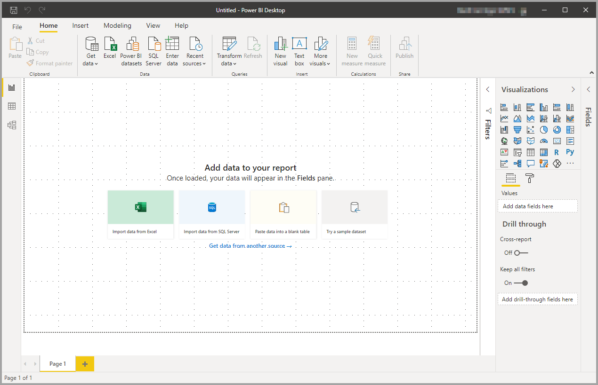
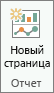
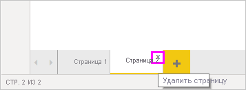
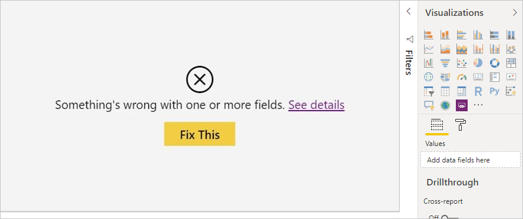
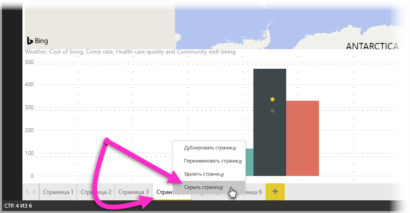
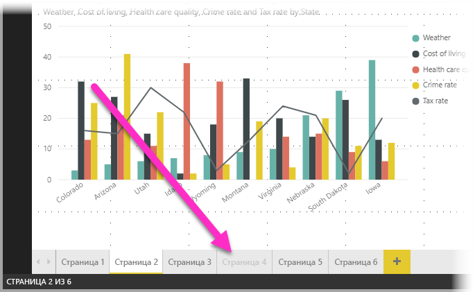

# Работа с представлением отчетов в Power BI Desktop

Если вы работали с Power BI, вы знаете, как просто можно создавать отчеты, предоставляющие динамические сведения о ваших данных. В Power BI Desktop также реализованы дополнительные возможности. С помощью Power BI Desktop можно создавать сложные запросы, объединять данные из нескольких источников, создавать связи между таблицами и многое другое.

Power BI Desktop содержит *представление "Отчет"* , где можно создать любое количество страниц отчета с визуализациями. Представление "Отчет" Power BI Desktop во многом похоже на режим редактирования отчета в *службе Power BI* . Вы можете перемещать визуализации, копировать, вставлять, объединять элементы и т. д.

Разница состоит в том, что при использовании Power BI Desktop вы можете работать с запросами и моделями данных, чтобы извлекать самые полезные сведения для отчетов. Затем вы можете сохранить файл Power BI Desktop где угодно — как на локальном диске, так и в облаке.

## Давайте посмотрим!

При первой загрузке данных в Power BI Desktop вы увидите представление "Отчет" с пустым холстом и ссылками для добавления данных в отчет.

Можно переключаться между представлениями **Отчет** , **Данные** и **Связи** , щелкая значки в левой области навигации:

После добавления данных можно добавить поля в новую визуализацию на холсте.

Чтобы изменить тип визуализации, щелкните его на холсте, а затем выберите новый тип в пункте **Визуализации** .

> [!TIP]
> Поэкспериментируйте с различными типами визуализаций. Визуализация должна четко представлять информации о данных.

В начале отчет содержит по крайней мере одну пустую страницу. Страницы отображаются в области навигатора слева от холста. Вы можете добавить различные виды визуализаций на страницу, но главное не переборщить. Слишком много визуализаций на странице усложняют работу с ней и затрудняют поиск нужной информации. Вы можете добавить новые страницы в отчет. Просто нажмите кнопку **Создать страницу** на ленте.

Чтобы удалить страницу, нажмите кнопку **X** на вкладке этой страницы в нижней части представления "Отчет".

> [!NOTE]
> Отчеты и визуализации нельзя закрепить на панели мониторинга из Power BI Desktop. Для этого вам необходимо выполнить публикацию на сайте Power BI. Дополнительные сведения см. [Публикация наборов данных и отчетов из Power BI Desktop](desktop-upload-desktop-files.md).

## Копирование и вставка в отчетах

Можно легко скопировать визуальный элемент из одного отчета Power BI Desktop и вставить его в другой. Чтобы скопировать визуальный элемент отчета, достаточно просто использовать сочетание клавиш Ctrl+C. В другом отчете Power BI Desktop используйте Ctrl+V для вставки визуального элемента в другой отчет. Для копирования и вставки в отчет Power BI Desktop можно выбрать один или все визуальные элементы на странице.

Возможность копировать и вставлять визуальные элементы полезна для пользователей, которые часто создают и обновляют несколько отчетов. При копировании между файлами параметры и форматирование, явно заданные на панели форматирования, будут перенесены. При этом визуальные элементы, которые используют тему или параметры по умолчанию, автоматически обновятся, чтобы соответствовать теме нового отчета. Таким образом, отформатированный и настроенный визуальный элемент можно скопировать и вставить в новые отчеты, сохранив все изменения.

Если поля модели не совпадают, для визуального элемента отобразится ошибка, а также предупреждение с перечнем отсутствующих полей. Ошибка похожа на ту, которая отображается при удалении поля в модели, используемой визуальным элементом.

Чтобы исправить эту ошибку, просто замените затронутые поля на те, которые вы хотите использовать из модели в отчете со вставленным визуальным элементом. Если вы используете пользовательский визуальный элемент, вам также нужно импортировать его в новый отчет.

## Скрытие страниц отчета

Кроме того, при создании отчета вы можете скрыть его страницы. Это полезный подход, когда вам нужно создать базовые данные или визуальные элементы в отчете, но не желательно, чтобы эти страницы видели другие пользователи. Например, при создании таблицы или вспомогательных визуальных элементов, которые используются на других страницах отчета. Есть много других индивидуальных причин, по которым вам, возможно, потребуется создать страницу отчета, а затем скрыть ее в отчете для публикации.

Скрыть страницу отчета очень просто. Достаточно щелкнуть правой кнопкой мыши вкладку для страницы отчета и в появившемся меню выбрать **Скрыть** .

При скрытии страницы отчета учитывайте следующее:

* В Power BI Desktop по-прежнему отображается скрытое представление отчета, даже если заголовок страницы неактивен. На следующем рисунке скрыта страница 4.

    

* Скрытая страница отчета *не отображается* при его просмотре в службе Power BI.

* Скрытие страницы отчета *не* является мерой безопасности. Пользователи по-прежнему могут получить доступ к странице и ее содержимому с помощью детализации и других методов.

* Если скрыть страницу и перейти в режим "Просмотр", стрелки навигации не будут отображаться.
