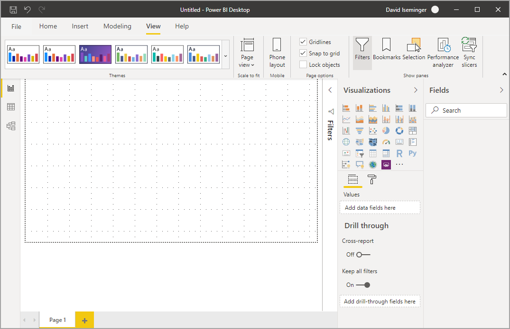
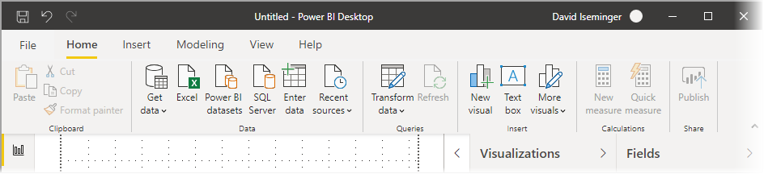
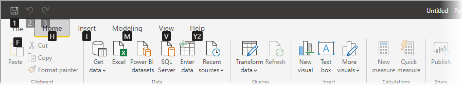
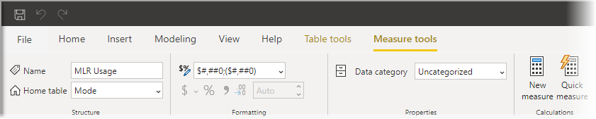

# Использование обновленной ленты в Power BI Desktop

В Power BI Desktop внесены изменения в ленту, чтобы лучше согласовать ее внешний вид и возможности с другими продуктами Microsoft, такими как Microsoft Office.

## Включение обновленной ленты

Обновленная лента общедоступна, начиная с выпуска Power BI Desktop за май 2020 г. Начиная с обновления за март 2020 г., обновленная лента включена по умолчанию. 

## Функции обновленной ленты

Преимущества обновления ленты призваны сделать работу с Power BI Desktop, а также с другими продуктами Майкрософт легкой и знакомой. 

Эти преимущества можно сгруппировать в следующие категории:

* **Усовершенствованный вид, удобство работы и организации** — значки и функции на обновленной ленте Power BI Desktop согласовываются с видом, оформлением и организацией элементов ленты приложений Office.

    

* **Галерея с интуитивно понятными темами** — коллекция тем, которая находится в ленте **Вид**, имеет привычный вид коллекции тем PowerPoint. Таким образом, изображения на ленте показывают, как будет выглядеть тема после изменения, например, цветовые комбинации и шрифты, если она будет применена к отчету. 

    

* **Динамическое содержимое ленты основывается на представлении** — на существующей ленте для Power BI Desktop иконки или команды, которые не были доступны, были просто затемнены, создавая не совсем хорошее впечатление. В обновленной ленте значки отображаются и упорядочиваются динамически, чтобы вы всегда знали, какие опции доступны в контексте.

* **Однолинейная лента при свертывании экономит место** — еще одним преимуществом обновленной ленты является возможность разбивать саму ленту на одну линию, динамически отображая элементы ленты в зависимости от вашего контекста. 

    

* **Подсказки клавиш для навигации и выбора кнопок** — чтобы активировать подсказки клавиш, упрощающие навигацию, можно нажать клавиши **ALT+WINDOWS**. После этого можно нажимать указанные клавиши на клавиатуре для навигации.

    

* **Пользовательские строки форматирования** — пользовательские строки форматирования можно задавать не только в области *Свойства*, но и на ленте. Выберите меру или столбец, которые нужно настроить. В зависимости от выбранного элемента появится контекстная вкладка **Средства работы с мерами** или **Средства работы со столбцами**. В разделе форматирования этой вкладки можно ввести пользовательскую строку форматирования непосредственно в поле с раскрывающимся списком.

    

* **Специальные возможности** — для заголовка окна, ленты и меню "Файл" реализован полный диапазон специальных возможностей. Чтобы перейти к ленте, нажмите клавиши CTRL+F6. Затем можно использовать клавишу **TAB** для перемещения между верхней и нижней панелями, а также клавиши со стрелками для перемещения между элементами.

Помимо видимых изменений, обновленная лента также позволяет вносить будущие обновления в Power BI Desktop и его ленту, например:

* Создание более гибких и интуитивно понятных элементов управления на ленте, например коллекции визуальных элементов
* Добавление *черной* и *темно-серой* тем Office в Power BI Desktop
* Улучшение специальных возможностей

## Дальнейшие действия
В Power BI Desktop можно подключаться к данным самых разных видов. Дополнительные сведения об источниках данных см. в перечисленных ниже статьях.

* [Что такое Power BI Desktop?](../fundamentals/desktop-what-is-desktop.md)
* [Источники данных в Power BI Desktop](../connect-data/desktop-data-sources.md)
* [Формирование и объединение данных в Power BI Desktop](../connect-data/desktop-shape-and-combine-data.md)
* [Подключение к данным Excel в Power BI Desktop](../connect-data/desktop-connect-excel.md)   
* [Ввод данных непосредственно в Power BI Desktop](../connect-data/desktop-enter-data-directly-into-desktop.md)   
