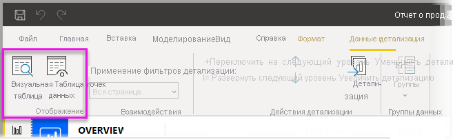
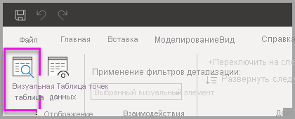
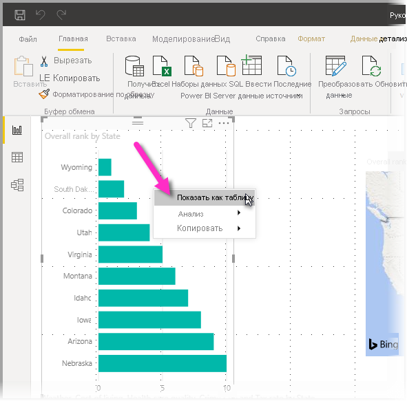
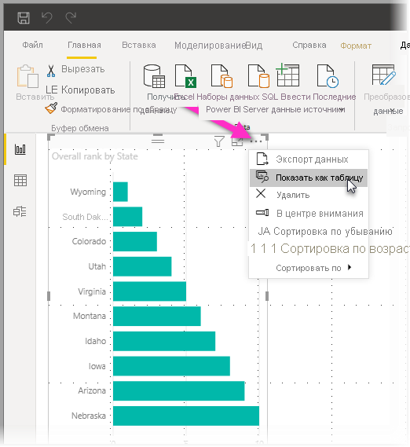
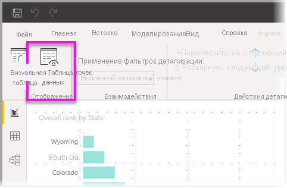

# Использование визуальной таблицы и таблицы точек данных в Power BI Desktop
В **Power BI Desktop** можно детализировать данные любого визуального элемента и отобразить текстовое представление данных или отдельных записей данных выбранного визуального элемента. Иногда эти возможности называют *переходами*, *детализацией* или *детализацией данных*.

**Визуальную таблицу** можно использовать для просмотра данных в визуальном элементе в виде таблицы, а **таблицу точек данных** — для просмотра таблицы данных, используемой для вычисления одной точки данных. 

>[!IMPORTANT]
>**Визуальная таблица** и **таблица точек данных** поддерживают только следующие типы визуализации:
>  - Линейчатая диаграмма
>  - Гистограмма
>  - Кольцевой график
>  - Картограмма
>  - Воронкообразная диаграмма
>  - Карта
>  - Круговая диаграмма
>  - Диаграмма-дерево

## Использование визуальной таблицы в Power BI Desktop

В **визуальной таблице** отображаются данные, лежащие в основе визуализации. Кнопка **Визуальная таблица** находится на вкладке **Данные и детализация** в разделе **Отображение** ленты, если выбран визуальный элемент.

Вы также можете просмотреть данные, щелкнув правой кнопкой мыши визуализацию, а затем выбрав **Показать данные** в появившемся меню, или выбрав **Дополнительные параметры** (...) в верхнем правом углу визуализации, а затем выбрав команду **Показать как таблицу**.

&nbsp;&nbsp;

> [!NOTE]
> Чтобы получить доступ к контекстному меню, необходимо навести указатель мыши на точку данных в визуальном элементе.

Когда вы выбираете **Визуальная таблица** или **Таблица точек данных**, на холсте Power BI Desktop отображается как визуальное, так и текстовое представление данных. В *горизонтальном представлении* визуальный элемент отображается в верхней половине холста, а данные — в нижней половине. 

Для перехода в *вертикальное представление* (или возврата в горизонтальное представление) щелкните значок в правом верхнем углу холста.

Чтобы вернуться к отчету, нажмите кнопку **< Назад к отчету** в левом верхнем углу холста.

## Использование таблицы точек данных в Power BI Desktop

Вы можете сконцентрироваться на одной записи данных в визуализации и подробно рассмотреть его данные. Чтобы использовать **таблицу точек данных**, выберите визуализацию, затем нажмите кнопку **Таблица точек данных** на вкладке **Данные и детализация** в разделе **Визуальные средства** ленты, а затем выберите точку или строку данных в визуализации. 

> [!NOTE]
> Если кнопка **Таблица точек данных** на ленте отключена и выделена серым цветом, это означает, что выбранная визуализация не поддерживает функцию **Таблица точек данных**.

Вы также можете щелкнуть правой кнопкой мыши элемент данных и выбрать **Таблица точек данных** в открывшемся меню.

Когда вы выбираете **Таблица точек данных** для элемента данных, на холсте Power BI Desktop отображаются все данные, связанные с выбранным элементом. 

Чтобы вернуться к отчету, нажмите кнопку **< Назад к отчету** в левом верхнем углу холста.

> [!NOTE]
>**Таблица точек данных** имеет такие ограничения:
> - Вы не можете изменить данные в представлении **таблицы точек данных** и сохранить внесенные изменения в отчете.
> - **Таблицу точек данных** нельзя использовать, если для визуализации применяется вычисляемый показатель в (многомерной) группе мер.
> - **Таблицу точек данных** нельзя использовать при подключении к динамической многомерной модели.

## Дальнейшие действия
В **Power BI Desktop** представлены все виды возможностей для форматирования отчетов и управления данными. Примеры см. в указанных ниже статьях.

* [Группирование данных и разделение их на ячейки в Power BI Desktop](desktop-grouping-and-binning.md)
* [Использование линий сетки, привязки к сетке, z-порядка, выравнивания и распределения в отчетах Power BI Desktop](desktop-gridlines-snap-to-grid.md)

