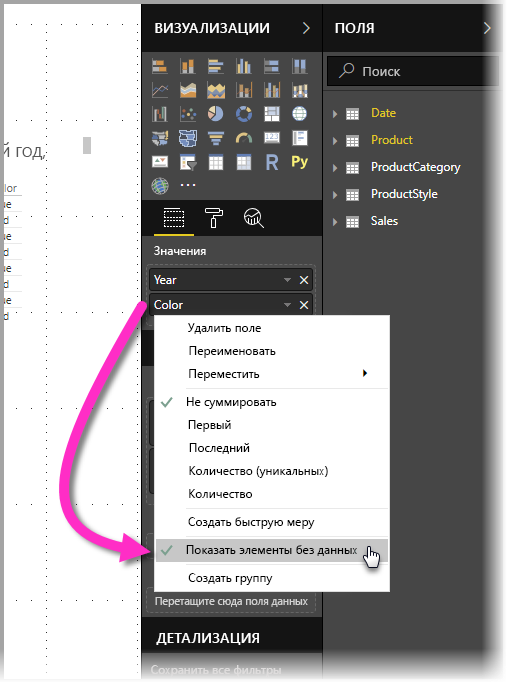
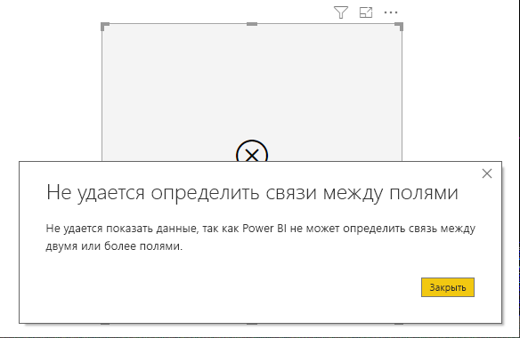
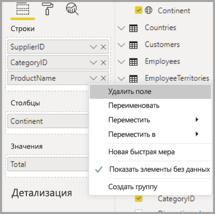

# Функция "Показать элементы без данных" в Power BI

Power BI позволяет визуализировать все виды данных из различных источников. При создании визуального элемента Power BI отображает только соответствующие данные, позволяя управлять способом их представления и отображения. Power BI определяет, какие данные являются соответствующими на основе конфигурации визуального элемента и базовой модели данных. В этой статье описано, как Power BI определяет соответствующие данные, а также приведены примеры, которые объясняют этот процесс.

## Определение соответствующих данных

Чтобы разобраться в том, как Power BI определяет соответствующие данные для отображения, в качестве простого примера мы рассмотрим таблицу. С помощью модели, представленной в разделе [Пример модели данных](#example-data-model) в конце этой статьи, мы создадим таблицу со следующими параметрами:

**1. Группы из одной таблицы:** *Product[Color] — Product[Size]*

|*Product[Color]*  |*Product[Size]*  |
|---------|---------|
|Синий     |Большой         |
|Синий     |Средний         |
|Синий     |Малый         |
|Красный     |Большой         |

В этом примере Power BI отображает сочетания групп *[Color-Size]* , представленные в таблице *[Product]* . 

Теперь давайте рассмотрим другое сочетание:

**2. Группы из разных, но непосредственно связанных таблиц, с мерой:** *ProductStyle[Finish] — Product[Color] — Sum(Sales[Quantity])*

|*ProductStyle[Finish]*  |*Product[Color]*  |*[SumQuantity]*  |
|---------|---------|---------|
|Gloss     |Синий         |10         |
|Matte     |Синий         |15         |

В этом примере Power BI отображает только существующие сочетания. Например, Power BI не будет отображать сочетания (None+Blue) или (Matte+Red), так как они не существуют в модели. Условие, которое определяет, существующие сочетания, является непустым значением для *Sum(Sales[Quantity])* .

Теперь давайте рассмотрим другой пример: 

**3. Группы из разных, но связанных таблиц, без меры:** *ProductStyle[Finish] — Product[Color]*

|*ProductStyle[Finish]*  |*Product[Color]*  |
|---------|---------|
|Gloss     |Синий         |
|Gloss     |Красный         |
|Matte     |Синий         |

Так как явной меры нет, и две таблицы связаны напрямую, Power BI пытается внедрить меру, чтобы ограничить результирующие сочетания. В этом случае Power BI внедряет меру *CALCULATE(COUNTROWS('Product'))* , которая не должна быть пустой, так как таблица *Product* является общей для обеих таблиц.

Таким образом, Power BI отображает сочетания, которые имеют записи в таблице Product, исключая сочетания *(None+Blue)* и *(Matte+Red)* .

**4. Группы из разных и несвязанных таблиц**

Пример модели не содержит такое сочетание, но при наличии групп из разных и несвязанных таблиц, Power BI не удалось бы связать два столбца. Результат представлял бы перекрестное соединение всех значений каждого столбца. В этом случае Power BI выдает ошибку *неограниченного соединения*, так как такие перекрестные соединения очень затратно вычислять в базе данных. Кроме того, они не являются для пользователя очень информативными. 

## Отображение элементов без данных

В предыдущем разделе описано, как Power BI определяет соответствующие данные для отображения. Но иногда вам *нужно* отобразить элементы без данных. 

Функция **Показать элементы без данных** позволяет сделать это, включая строки и столбцы с данными, которые не содержат данные меры (значения с пустой мерой).

Чтобы включить функцию **Показать элементы без данных**, выберите визуальный элемент, а затем в разделе **Поля** щелкните правой кнопкой мыши и выберите **Показать элементы без данных** в открывшемся меню, как показано на следующем изображении.

Функция **Показать элементы без данных***не* работает в следующих случаях:

* В визуальный элемент мера не включена, и сгруппированные столбцы принадлежат к одной таблице.
* Группы не связаны. Power BI не выполняет запросы для визуальных элементов, которые включают несвязанные группы.
* Мера не связана с группами. Это обусловлено тем, что мера никогда не будет пустой только для некоторых сочетаний групп.
* Есть определяемый пользователем фильтр мер, исключающий пустые меры, например: *SalesAmount > 0*.

### Использование функции "Показать элементы без данных"

Наиболее интересным случаем применения функции **Показать элементы без данных** является ситуация, когда присутствуют меры. Давайте рассмотрим ситуацию, когда группы принадлежат к одной таблице или могут быть связаны одним путем в модели. Например, группа *ProductStyle* непосредственно связана с группой *Product* и косвенно — с группами *Sales* и *ProductStyle*, а группа *ProductCategory* может быть связана через таблицу *Product* и т. д.

Давайте взглянем на ряд интересных случаев и сравним ситуации, когда можно включать и отключать функцию **Показать элементы без данных**. 

**1. Сгруппированные столбцы из одной таблицы:** *Product[Color] — Product[Size] — Sum(Sales[Quantity])*

Отображение с отключенной функцией **Показать элементы без данных**:

|*Product[Color]*  |*Product[Size]*  |*[SumQuantity]*  |
|---------|---------|---------|
|Синий     |Средний         |15         |
|Синий     |Малый         |10         |

Отображение со включенной функцией **Показать элементы без данных**:

|*Product[Color]*  |*Product[Size]*  |*[SumQuantity]*  |
|---------|---------|---------|
|Синий     |Большой         |         |
|Синий     |Средний         |15         |
|Синий     |Малый         |10         |
|Красный     |Большой         |         |

Обратите внимание на то, что два новых сочетания отображаются, когда функция включена: *Blue — Large* и *Red — Large*. Для обеих этих записей нет соответствующего элемента *Quantity* в таблице *Sales*. Тем не менее они отображаются в таблице *Product*.

**2. Сгруппированные столбцы из связанных таблиц:** *ProductStyle[Finish] — Product[Color] — Sum(Sales[Quantity])*

Отображение с отключенной функцией **Показать элементы без данных**:

|*ProductStyle[Finish]*  |*Product[Color]*  |*[SumQuantity]*  |
|---------|---------|---------|
|Gloss     |Синий         |10         |
|Matte     |Синий         |15         |

Отображение со включенной функцией **Показать элементы без данных**:

|*ProductStyle[Finish]*  |*Product[Color]*  |*[SumQuantity]*  |
|---------|---------|---------|
|Gloss     |Синий         |10         |
|Gloss     |Красный         |         |
|Matte     |Синий         |15         |
|Нет     |         |         |

Обратите внимание на то, что элементы *(Gloss — Red)* и *(None — Blank)* представлены в виде сочетаний. Это происходит по следующей причине.
* Power BI сначала обрабатывает ProductStyle[Finish] и выбирает все значения для отображения: Gloss, Matte, None.
* Используя эти значения, Power BI выбирает соответствующие записи *Product[Color]* . 
* Так как *None* не соответствует записям *Product[Color]* , отображается пустое значение.

Важно отметить, что механизм выбора значений для столбцов учитывает их порядок. Его можно представить как операцию *Левое внешнее соединение* между таблицами. Если порядок столбцов изменяется, результаты также изменятся.

Давайте рассмотрим пример изменения порядка, и того, как это влияет на результаты. Это тот же элемент **2**, используемый в этом разделе, с измененным порядком.

**Product[Color] — ProductStyle[Finish] — Sum(Sales[Quantity])**

Отображение со включенной функцией **Показать элементы без данных**:

|*Product[Color]* |*ProductStyle[Finish]*  |*[SumQuantity]*  |
|---------|---------|---------|
|Синий     |Gloss         |10         |
|Синий     |Matte         |15         |
|Красный     |Gloss         |         |

В этом случае обратите внимание на то, что в таблице не отображается *ProductStyle[Finish]=None*. Это обусловлено тем, что Power BI сначала выбирает все значения *Color* в таблице *Product*. Затем для каждого цвета Power BI выбирает соответствующие значения *Finish*, содержащие данные. Так как значение *None* не отображается в сочетаниях *Color*, оно не выбрано.

## Поведение визуальных элементов в Power BI

Если функция **Показать элементы без данных** включена для одного поля в визуальном элементе, она автоматически включается для всех остальных полей в том же *визуальном контейнере* или иерархии. Визуальным контейнером или иерархией могут быть **Ось**, **Условные обозначения**, **Категория**, **Строки** или **Столбцы**.

Например, если функция **Показать элементы без данных** включена для одного поля в визуальном элементе "Матрица" с четырьмя полями в контейнере **Строки**, она будет также включена для всех элементов матрицы. На приведенном ниже рисунке функция **Показать элементы без данных** включена для первого поля в контейнере **Строки**, то есть поля *SupplierID* (Код поставщика). Для других полей в контейнере **Строки** она также включена автоматически.

В отличие от этого для поля *Continent* (Континент) в контейнере **Столбцы** функция **Показать элементы без данных***не* включена автоматически. 

Такое часто наблюдается, когда визуальный элемент преобразуется в другой тип, например матрица преобразуется в таблицу. При таких преобразованиях функция **Показать элементы без данных** автоматически включается для любого поля, перемещаемого в контейнер с полем, для которого эта функция уже включена. Если в предыдущем примере функция **Показать элементы без данных** включена для поля *SupplierID* и визуальный элемент преобразуется в таблицу, поле *Continent* из контейнера **Столбцы** перемещается (вместе с полями в контейнере **Строки**) в единственный контейнер, используемый в таблице, — **Значения**. Таким образом, функция **Показать элементы без данных** будет включена для всех полей в контейнере **Значения**.

### Экспорт данных

При использовании функции **Экспорт сводных данных** функция **Показать элементы без данных** работает так же, как если бы экспортируемые данные преобразовывались в визуальный элемент "Таблица". Таким образом, при экспорте визуального элемента, например матрицы диаграмм, экспортируемые данные могут отличаться от отображаемого визуального элемента. Это связано с тем, что при преобразовании в визуальный элемент "Таблица" в процессе экспорта функция **Показать элементы без данных** включается для всех экспортируемых полей. 

## Пример модели данных

В этом разделе показан пример модели данных, используемый в этой статье.

**Модель**: 

**Данные**:

|Product[ProductId]|    Product[ProductName]|   Product[Color]| Product[Size]|  Product[CategoryId]|    Product[StyleId]|
|---------|---------|---------|---------|---------|---------|
|1  |Prod1  |Синий   |Малый  |1  |1 |
|2  |Prod2  |Синий   |Средний |2  |2 |
|3  |Prod3  |Красный    |Большой  |1  |1 |
|4  |Prod4  |Синий   |Большой  |2  |2 |

|ProductCategory[CategoryId]|   ProductCategory[CategoryName]|
|---------|---------|
|1  |Телефон   |
|2  |Камера |
|3  |TV |

|ProductStyle[StyleId]| ProductStyle[Finish]|   ProductStyle[Polished]|
|---------|---------|---------|
|1  |Gloss  |Да |
|2  |Matte  |Нет |
|3  |Нет   |Нет |

|Sales[SaleId]| Sales[ProductId]|   Sales[Date]|    Sales[Quantity]|
|---------|---------|---------|---------|
|1  |1  |1/1/2012 0:00| 10 |
|2  |2  |1/1/2013 0:00| 15 |

## Дальнейшие действия

В этой статье описано, как включить функцию **Показать элементы без данных** в Power BI. Рекомендуем также ознакомиться со следующими материалами: 

* [Элемент по умолчанию в многомерных моделях в Power BI](../connect-data/desktop-default-member-multidimensional-models.md)
