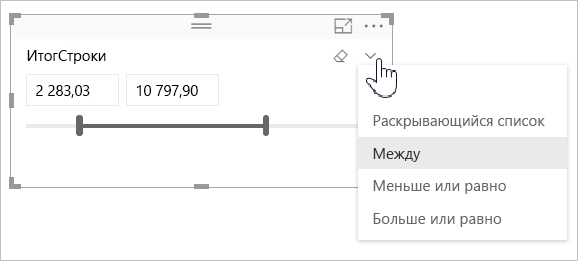

# Использование среза числового диапазона в Power BI

[!INCLUDE [applies-to](../includes/applies-to.md)] [!INCLUDE [yes-desktop](../includes/yes-desktop.md)] [!INCLUDE [yes-service](../includes/yes-service.md)]

С помощью среза числового диапазона можно применять все виды фильтров к любому числовому столбцу в модели данных. Доступно три варианта фильтрации числовых данных: по диапазону чисел, а также по значению не больше или не меньше числа. Эта простая методика является эффективным способом фильтрации данных.

## видеотехника

В этом видео Уилл покажет, как создать срез числового диапазона.

> [!NOTE]
> В этом видео используется более старая версия Power BI Desktop.

<iframe width="560" height="315" src="https://www.youtube.com/embed/zIZPA0UrJyA" frameborder="0" allowfullscreen></iframe> 

## Добавление среза числового диапазона

Вы можете использовать срез числового диапазона так же, как и любой другой срез. Просто создайте визуальный элемент **Срез** для отчета, а затем выберите числовое значение для значения **Поле**. На следующем изображении выбрано поле **LineTotal**.

В правом верхнем углу среза числового диапазона выберите ссылку со стрелкой вниз, чтобы отобразить меню.

Для числового диапазона можно выбрать один из следующих трех вариантов:

* **Между**
* **Меньше или равно**
* **Больше или равно**

При выборе в меню пункта **Между** отображается ползунок. С его помощью можно отфильтровать числовые значения, которые находятся в диапазоне чисел. Иногда из-за степени детализации при перемещении указателя среза достаточно сложно выбрать точное числовое значение. Можно также использовать ползунок и выбрать подходящее поле для ввода нужных значений. Этот вариант удобен, если нужно выполнить срез по конкретным числам.

На следующем рисунке фильтруется страница отчета для значений **LineTotal** в диапазоне от 2500,00 до 6000,00.

При выборе варианта **Меньше или равно** исчезает левый маркер ползунка (меньшее значение). При этом можно настроить только верхнюю границу ползунка. На следующем рисунке мы устанавливаем ползунок на числовое значение 5928,19.

Наконец, при выборе варианта **Больше или равно** исчезает правый маркер ползунка (большее значение). При этом можно настроить меньшее значение, как показано на следующем рисунке. Теперь в визуальных элементах на странице отчета отображаются только элементы, значение которых для **LineTotal** больше или равно 4902,99.

## Привязка к целым числам для среза числового диапазона

Срез числового диапазона обрезается до целых чисел, если базовое поле имеет тип данных *Целое число*. Это обеспечивает точное выравнивание среза по целым числам. В полях с типом *Десятичное число* можно вводить или выбирать дробные числа. Форматирование, заданное в текстовом поле, соответствует параметру форматирования поля, даже если вы можете вводить или выбирать более точные числа.

## Отображение форматирования с использованием среза диапазона дат

При использовании среза для отображения или задания диапазона дат они отображаются в формате *краткой даты*. Этот формат даты определяется языковым стандартом браузера или операционной системы пользователя. Поэтому такой формат отображения используется независимо от параметров типов данных, заданных для базовых данных или модели.

Например, для базовых данных можно настроить формат полной даты. В этом случае при таком формате даты, как *дддд, ММММ гггг*, в других визуальных элементах дата будет отображаться так: *Среда, 14 марта 2001 г*. Однако в срезе диапазона дат она будет отображаться в следующей форме: *14.03.2001*.

Благодаря использованию формата краткой даты в срезе длина строки всегда достаточно мала и одинакова.

## Рекомендации и ограничения

К срезу числового диапазона применяются следующие рекомендации и ограничения.

* Срез числового диапазона позволяет фильтровать каждую базовую строку данных и не позволяет отфильтровать агрегированные значения. Например, предположим, что используется поле *Sales Amount* (Сумма продаж). Тогда срез фильтрует каждую транзакцию на основе суммы продаж, а не общей суммы продаж для каждой точки данных визуального элемента.
* Сейчас это не работает с мерами.
* Вы можете вводить любые числа в числовой срез, даже если они выходят за пределы диапазона значений базового столбца. Это позволяет настраивать фильтры, если известно, что в будущем данные могут измениться.
