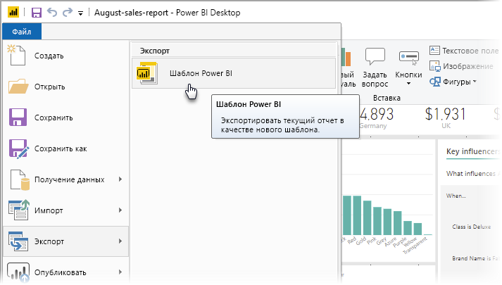
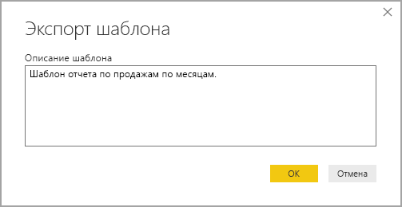
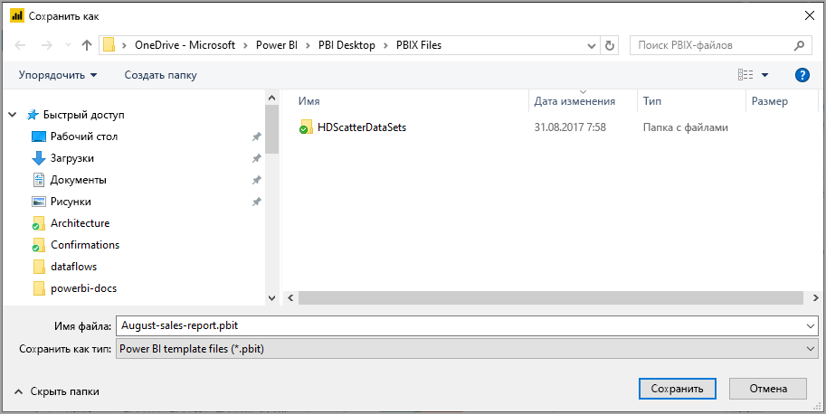
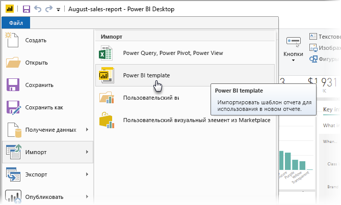
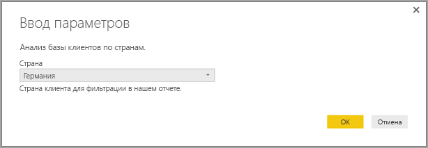
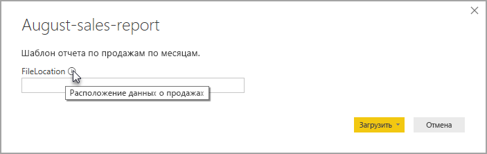

# Создание шаблонов отчетов для Power BI Desktop

С помощью **Power BI Desktop** можно создавать привлекательные отчеты для обмена аналитическими сведениями между сотрудниками организации. **Шаблоны** в Power BI Desktop позволяют упростить работу. Вы можете создать шаблон отчета на основе существующего шаблона, после чего вы или другие пользователи в организации сможете использовать его в качестве отправной точки для разработки макета нового отчета, модели данных и запросов. Шаблоны в **Power BI Desktop** дают возможность быстро приступить к работе и стандартизировать создание отчетов.

## Создание шаблонов

Шаблоны отчетов Power BI содержат следующие сведения из отчетов, на основе которых они создаются:

* **страницы** отчетов, визуализации и другие визуальные элементы;
* **определение модели данных**, включая схему, связи, меры и другие артефакты определения модели;
* все **определения запросов**, включая запросы, параметры запросов и другие элементы запросов.

Данные отчета в шаблон *не* включаются. 

Шаблоны отчетов имеют расширение файла PBIT (а отчеты Power BI Desktop имеют расширение PBIX). 

Чтобы создать шаблон отчета, последовательно выберите **Файл > Экспорт > Шаблон Power BI**. Откроется представленное ниже окно с предложением ввести описание шаблона. В этом примере описание шаблона — *Шаблон отчета по месячным продажам*.

Нажмите кнопку **ОК**. Вам будет предложено указать расположение для сохранения PBIT-файла шаблона.

Вот и все! Шаблон отчета Power BI будет создан в указанном расположении с расширением PBIT.

> [!NOTE]
> Файлы шаблонов отчетов Power BI обычно намного меньше, чем файлы отчетов Power BI Desktop, так как шаблоны не содержат никаких данных, а только определения. 

## Использование шаблонов

Чтобы использовать шаблон отчета Power BI, просто откройте его в Power BI Desktop и начните работу с ним. Открывать шаблоны отчетов Power BI можно двумя способами.

* Дважды щелкните любой PBIT-файл, чтобы автоматически запустить Power BI Desktop и загрузить шаблон.
* В Power BI Desktop выберите **Файл > Импорт > Шаблон Power BI**.

При открытии шаблона отчета появляется диалоговое окно со значениями всех параметров, определенных в отчете, на котором основан шаблон. Например, если в отчете анализируются клиенты по странам или регионам и имеется параметр *Страна*, выводится запрос на выбор *страны* из списка значений, которые были заданы при определении параметра. 

После того как все необходимые параметры будут предоставлены, вам будет предложено указать расположение базовых данных, связанных с отчетом. Затем текущий создатель отчета может подключиться к данным с использованием своих учетных данных.

После указания параметров и данных создается отчет, содержащий все страницы, визуальные элементы, артефакты модели данных и запросы, которые имелись в базовом отчете. 

Вот и все. Создавать и использовать шаблоны отчетов в Power BI Desktop несложно. Вы можете легко воспроизводить понравившиеся макеты и другие аспекты отчетов, а затем предоставлять к ним общий доступ другим пользователям.

## Дальнейшие действия
Возможно, вас также интересует изучение **параметров запроса**:
* [Использование параметров запроса в Power BI Desktop](https://docs.microsoft.com/power-query/power-query-query-parameters)

Кроме того, Power BI Desktop предоставляет широкие возможности. Дополнительные сведения об этих возможностях см. в следующих ресурсах.

* [Что такое Power BI Desktop?](../fundamentals/desktop-what-is-desktop.md)
* [Обзор запросов в Power BI Desktop](../transform-model/desktop-query-overview.md)
* [Типы данных в Power BI Desktop](../connect-data/desktop-data-types.md)
* [Формирование и объединение данных с Power BI Desktop](../connect-data/desktop-shape-and-combine-data.md)
* [Общие задачи с запросами в Power BI Desktop](../transform-model/desktop-common-query-tasks.md)    
