# Создание подсказок на основе страниц отчетов в Power BI Desktop
Вы можете создать визуально насыщенные **подсказки отчетов**, отображаемые при наведении указателя на визуальные элементы, основываясь на создаваемых в **Power BI Desktop** страницах отчетов. Благодаря этому настраиваемые подсказки могут включать визуальные элементы, изображения и любую другую коллекцию элементов, созданные на странице отчета. 

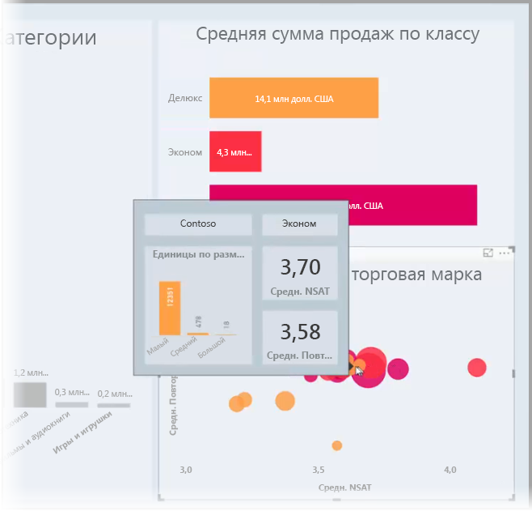

Вы можете создать любое количество страниц подсказок. Каждую страницу подсказки можно связать с одним или несколькими полями в отчете. Так при наведении указателя на визуальный элемент, включающий в себя выбранное поле, созданная на странице подсказка будет отображаться с фильтрацией по точке данных, на которую наведен указатель мыши. 

С помощью подсказок отчетов можно выполнять много разных действий. Давайте рассмотрим способы создания и настройки подсказок.

## Создание страницы с подсказками отчетов
Чтобы приступить к работе, создайте страницу отчета, нажав кнопку **+** в нижней части холста **Power BI Desktop** в области вкладок страницы. Эта кнопка находится рядом с последней страницей в отчете. 

Подсказка может иметь любой размер, но следует помнить, что подсказки перекрывают холст отчета, поэтому их следует делать относительно небольшими. В области **Формат** на карте **Размер страницы** отображается шаблон размера страницы *Подсказка*. Он предоставляет готовый размер холста страницы отчета для подсказки.

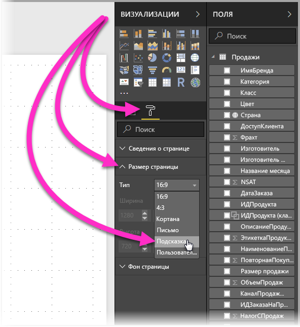

По умолчанию **Power BI Desktop** умещает холст отчета на доступном пространстве страницы. Часто этот вариант подходит, но не в случае с подсказками. Чтобы получить более четкое представление о том, как будет выглядеть подсказка после завершения работы, можно изменить **Просмотр страницы** до фактического размера. 

Для этого выберите вкладку **Вид** на ленте. Потом выберите **Просмотр страницы > Фактический размер**, как показано на следующем рисунке.

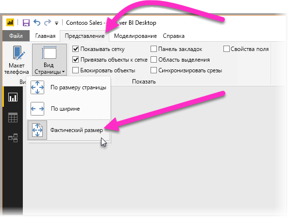

Вы также можете присвоить странице отчета имя, описывающее ее назначение. Просто выберите карту **Сведения о странице** в области **Формат** и введите имя в поле **Имя**. На приведенном ниже рисунке отчет подсказки имеет имя *Tooltip 1* (Подсказка 1), но вы можете задать более подходящее имя.

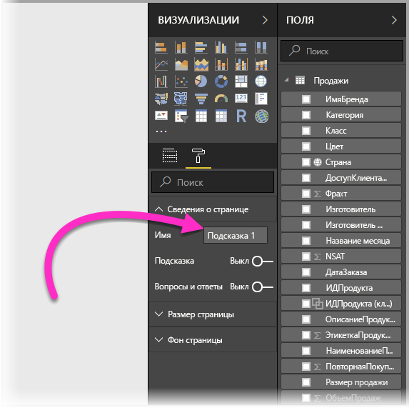

После этого можно создать все визуальные элементы, которые нужно отобразить в подсказке. Приведенный ниже рисунок показывает две карты и одну линейчатую диаграмму с группировкой на странице подсказки, а также цвет фона для страницы и цвет фона для каждого из визуальных элементов, что позволяет придать требуемый нам вид.

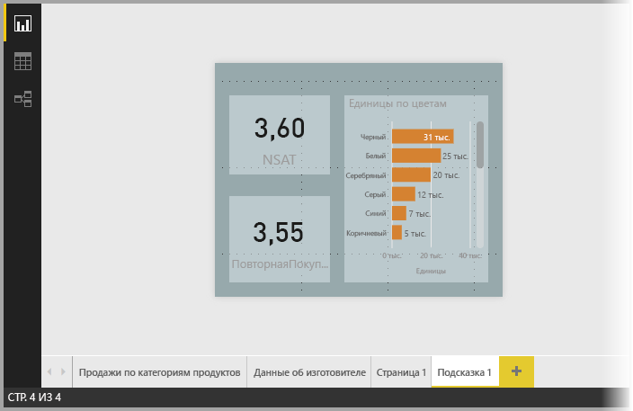

Прежде чем страницу отчета можно будет использовать в качестве подсказки, потребуется выполнить дополнительные действия. Нужно настроить страницу подсказки несколькими способами, описанными в следующем разделе. 

## Настройка страницы отчета подсказки

Страницу отчета подсказки нужно настроить после создания, чтобы **Power BI Desktop** зарегистрировал ее в качестве подсказки, а сама подсказка отображалась для правильных визуальных элементов.

Сначала нужно переместить ползунок **Подсказка** в положение **Включено** на карте **Сведения о странице**, чтобы сделать страницу подсказкой. 

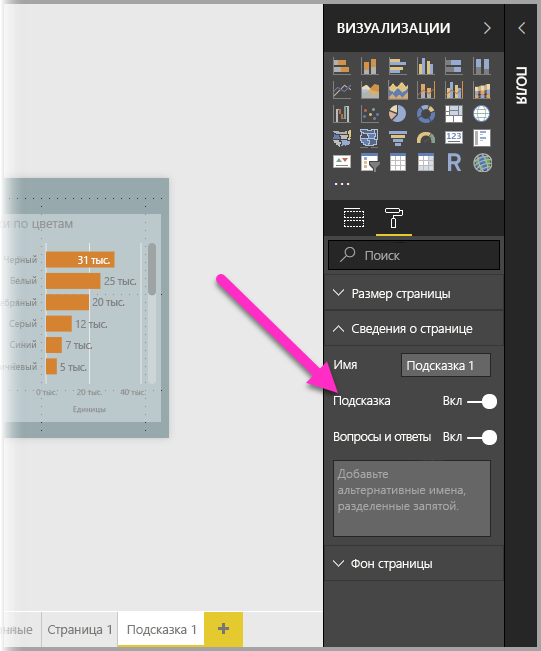

После установки ползунка нужно указать поля, для которых должна отображаться эта подсказка отчета. Подсказка будет отображаться для визуальных элементов в отчете, включающих указанное вами поле. Укажите применимые поля, перетащив их в контейнер **Поля с подсказками**, расположенный в разделе **Поля** области **Визуализации**. На следующем рисунке поле *SalesAmount* было перемещено в контейнер **Поля с подсказками**.

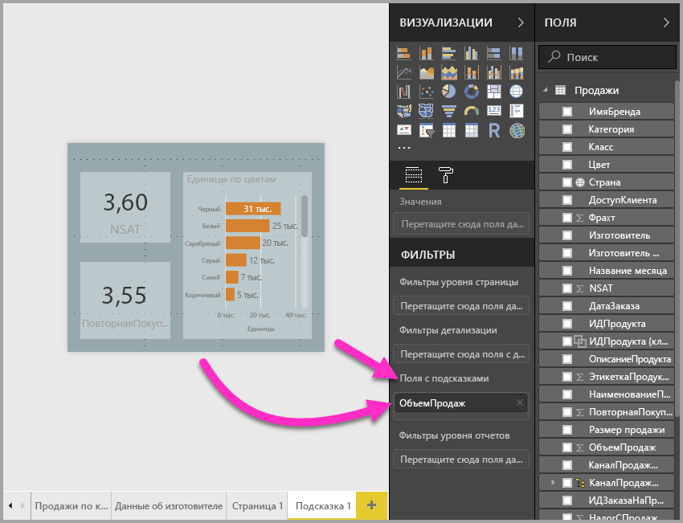
 
В контейнер **Поля с подсказками** можно добавить как поля категорий, так и числовые поля, включая меры.

По завершении работы созданная страница отчета подсказки будет использоваться в качестве подсказки в визуальных элементах в отчете, использующих поля, которые вы поместили в контейнер **Поля с подсказками**, заменив собой подсказку по умолчанию Power BI.

## Настройка подсказки отчета вручную

В дополнение к созданию подсказки, которая автоматически отображается при наведении указателя мыши на визуальный элемент, содержащий указанное поле, подсказку можно задать вручную. 

Любой визуальный элемент, который поддерживает подсказки отчетов, теперь имеет карту **Подсказка** в области **Форматирование**. 

Чтобы задать подсказку вручную, выберите визуальный элемент, для которого нужно указать подсказку, а затем в области **Визуализации** выберите раздел **Формат** и разверните карту **Подсказка**.

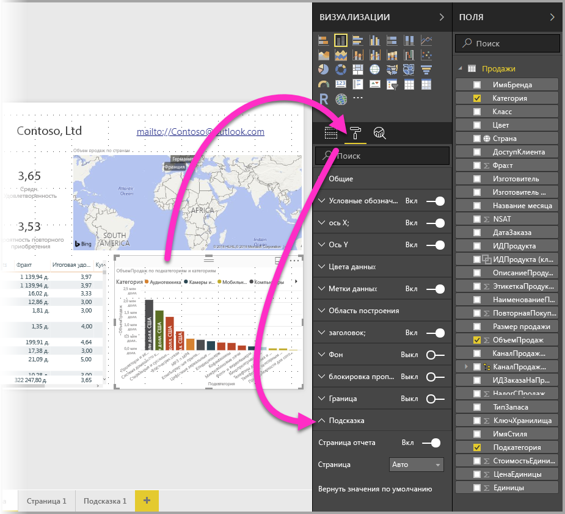

Затем в раскрывающемся списке **Страница** выберите страницу подсказки, которую хотите использовать для выбранного визуального элемента. Обратите внимание, что в этом диалоговом окне отображаются только страницы отчета, указанные в качестве страниц **Подсказка**.

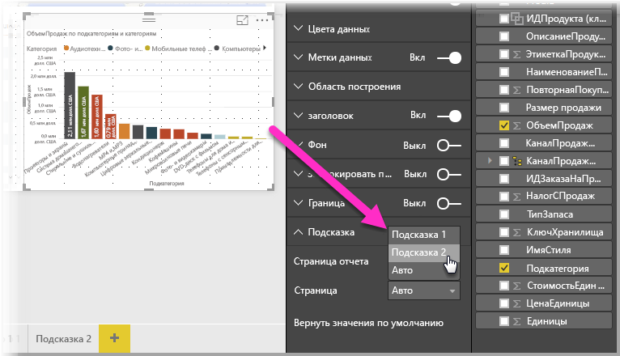

Ручная настройка подсказки открывает много возможностей. Вы можете задать для подсказки пустую страницу, тем самым переопределив выбранную в Power BI подсказку по умолчанию. Другим вариантом применения является ситуация, когда нужно отобразить не ту подсказку, которую Power BI выбирает по умолчанию. Например, если у вас есть визуальный элемент, включающий два поля, с обоими из которых связана подсказка, Power BI отображает только одну из них. При этом вам может потребоваться возможность вручную выбрать отображаемую подсказку.

## Возврат к подсказкам по умолчанию

Если вы создали ручную подсказку для визуального элемента, но решили использовать подсказку по умолчанию, вы всегда можете вернуться к предоставляемой Power BI подсказке по умолчанию. Для этого просто выберите значение **Автоматически** в раскрывающемся списке *Страница*, когда выбран визуальный элемент и развернута карта **Подсказка**.

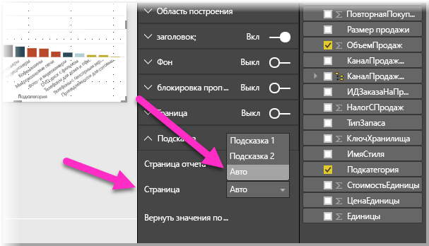

## Настраиваемые подсказки отчета и графики

Следует помнить о некоторых особенностях взаимодействия подсказок отчета с визуальными элементами графиков, а также с визуальными элементами при перекрестном выделении.

### Подсказки отчета и графики

При отображении подсказки отчета для графика отображается только одна подсказка для всех строк на графике. Это похоже на поведение подсказки по умолчанию для графиков, когда тоже отображается всего одна подсказка. 

Это вызвано тем, что поле в условных обозначениях не передается через фильтр в качестве подсказки. На приведенном ниже рисунке отображаемая подсказка показывает все единицы товаров, проданных в этот день по всем трем представленным классам (в данном примере это Deluxe, Economy и Regular). 

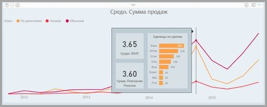

### Подсказки отчета и перекрестное выделение

При перекрестном выделении визуального элемента в отчете подсказки отчета всегда показывают данные перекрестного выделения, даже при наведении указателя на затененную область точки данных. На приведенном ниже рисунке указатель мыши наведен на затененный (не выделенный) раздел линейчатой диаграммы, но подсказка отчета по-прежнему показывает данные для выделенной части этой точки данных (выделенные данные).

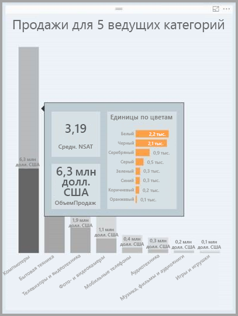

## Рекомендации и ограничения
Обратите внимание на ряд ограничений и рекомендаций для функции **Подсказки**.

* Начиная с выпуска **Power BI Desktop** за декабрь 2018 года, кнопки с визуальными элементами также поддерживают подсказки.
* Подсказки отчета не поддерживаются для визуальных элементов Power BI. 
* Сейчас кластеры не поддерживаются в качестве полей, которые можно отобразить в подсказках отчета. 
* При выборе поля, отображаемого для подсказок отчета (когда поле используется с учетом категории), визуальные элементы, содержащие поле, будут показывать заданную подсказку только при совпадении сводных данных с выбранным полем. 

## Дальнейшие действия
Дополнительные сведения о похожих функциях или функциях, которые взаимодействуют с подсказками отчета, см. в следующих статьях:

* [Использование детализации в Power BI Desktop](desktop-drillthrough.md)
* [Отображение плитки панели мониторинга или визуального элемента отчета в режиме фокусировки](../consumer/end-user-focus.md)
