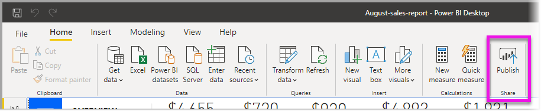
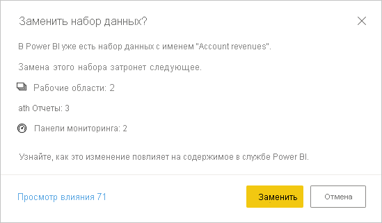

# Публикация наборов данных и отчетов из Power BI Desktop
При публикации файла Power BI Desktop в службе Power BI вы публикуете данные в модели в рабочей области Power BI. Это относится и ко всем отчетам, созданным в представлении **Отчеты**. Новый набор данных с тем же именем и все отчеты появятся в навигаторе рабочей области.

Публикация из Power BI Desktop аналогична использованию функции **получения данных** в Power BI для подключения к файлу Power BI Desktop и его отправки.

> [!NOTE]
> Любые изменения, вносимые в отчет в Power BI, не будут сохранены в исходном файле Power BI Desktop. Это относится к добавлению, удалению или изменению визуализаций в отчетах.

## Публикация набора данных и отчетов Power BI Desktop
1. В Power BI Desktop последовательно выберите **Файл** \> **Опубликовать** \> **Опубликовать в Power BI** или щелкните **Опубликовать** на ленте.  

   

2. Войдите в Power BI.
3. Выберите место назначения.

   

По завершении публикации вы получите ссылку на отчет. Щелкните ссылку, чтобы открыть отчет на сайте Power BI.

## Повторная публикация или замена набора данных, опубликованного из Power BI Desktop
Набор данных и все отчеты, созданные в Power BI Desktop, отправляются на сайт Power BI, когда вы публикуете файл Power BI Desktop. При повторной публикации файла Power BI Desktop набор данных на сайте Power BI будет заменен обновленным набором данных из файла Power BI Desktop.

Этот процесс очевиден, однако существуют некоторые моменты, которые следует знать.

* При наличии нескольких наборов данных в Power BI с названием, совпадающим с именем файла Power BI Desktop, публикация может завершиться ошибкой. Убедитесь, что в Power BI имеется только один набор данных с тем же именем. Можно также переименовать файл и опубликовать его, создав новый набор данных с тем же именем, что и у файла.
* При переименовании или удалении столбца или меры все визуализации, уже существующие в Power BI с этим полем, могут быть повреждены. 
* Power BI не учитывает некоторые изменения формата существующих столбцов. Например, если формат столбца меняется с 0,25 на 25 %.
* Предположим, что у вас есть расписание обновления, настроенное для существующего набора данных в Power BI. При добавлении новых источников данных в файл и последующей повторной публикации необходимо войти в них до следующего запланированного обновления.
* Если вы повторно публикуете набор данных, опубликованный из Power BI Desktop, и настроили расписание обновления, обновление набора данных инициируется сразу после повторной публикации.
* При внесении изменений в набор данных и его повторной публикации вы увидите сообщение о том, на сколько рабочих областей, отчетов и панелей мониторинга может повлиять это изменение. Вы должны будете подтвердить замену текущего опубликованного набора данных измененной версией. В этом сообщении также содержится ссылка на полный анализ влияния набора данных в службе Power BI, где можно просмотреть дополнительные сведения и принять меры по устранению рисков, связанных с изменениями.

   

   [Дополнительные сведения об анализе влияния наборов данных](../collaborate-share/service-dataset-impact-analysis.md).

> [!NOTE]
> Некоторые подключения к данным в отчетах Power BI могут включать ссылки на данные, а не данные из набора данных, импортированного в службу Power BI. Например, подключения DirectQuery при обновлениях или взаимодействиях ссылаются на данные, а не импортируют сами данные. Если связанные источники данных в отчете находятся в локальной среде, для доступа к этим данным из Power BI может потребоваться шлюз. Дополнительную информацию см. в разделе [Что такое локальный шлюз данных?](../connect-data/service-gateway-onprem.md)
> 