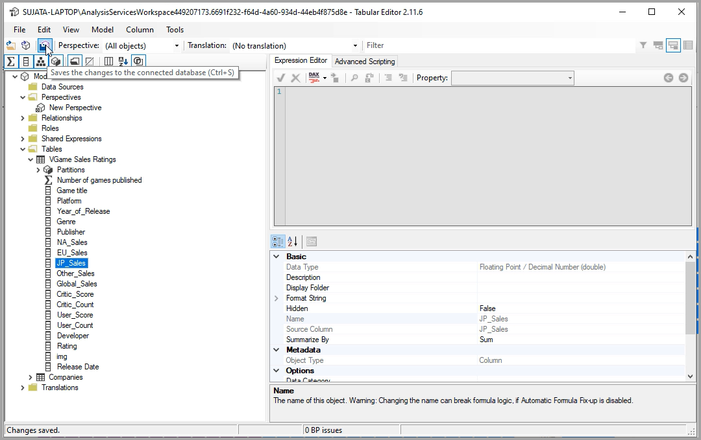

# Разрешите пользователям персонализировать визуальные элементы в отчете

[!INCLUDE [applies-to](../includes/applies-to.md)] [!INCLUDE [yes-desktop](../includes/yes-desktop.md)] [!INCLUDE [yes-service](../includes/yes-service.md)]

Когда отчет опубликован для широкой аудитории, некоторые пользователи могут захотеть увидеть немного отличающиеся представления определенных визуальных элементов. Возможно, им нужно поменять значение на оси, изменить тип визуального элемента или добавить что-либо в подсказку. Трудно создать один визуальный элемент, который удовлетворяет всем требованиям. Благодаря этой новой возможности пользователям можно предоставить возможность просматривать и персонализировать визуальные элементы в режиме чтения отчета. Они могут скорректировать визуальный элемент так, как они хотят, и сохранить его как закладку, чтобы вернуться к нему. Им не нужно иметь разрешение на изменение отчета или обращаться к автору отчета за изменением.

:::image type="content" source="media/power-bi-personalize-visuals/power-bi-personalize-visual.png" alt-text="Персонализация представления":::
 
## Какие отчеты пользователи могут изменить

Эта функция позволяет потребителям получать новые представления данных за счет возможности изменения визуальных элементов в отчете Power BI по запросу. Сведения об использовании этой функции в качестве потребителя см. в разделе [Персонализация визуальных элементов в отчетах](../consumer/end-user-personalize-visuals.md). Эта функция идеально подходит для создателей отчетов, которые хотят включить базовые сценарии просмотра для читателей отчетов. Ниже приведены изменения, которые могут быть внесены читателями отчетов.

- Изменение типа визуализации
- Замена единицы меры или измерения
- Добавление или удаление подписи
- Сравнение двух и более единиц измерения
- Изменение агрегаций и т. д.

Эта функция позволяет использовать не только новые возможности исследования данных. Кроме того, она предоставляет пользователям возможность фиксировать свои изменения и делиться ими.

- Фиксация своих изменений
- Публикация своих изменений
- Сброс всех изменений для отчета
- Сброс всех изменений для визуального элемента
- Очистка последних изменений

## Использование перспектив для более узкого представления

Для персонализации визуальных элементов можно использовать **Перспективы**, чтобы выбрать подмножество модели, предоставляющее более узкое представление. Выбор подмножества может быть удобен при работе с большой моделью данных, позволяя сосредоточиться на комфортном подмножестве полей и не перегружать читателей отчетов полным набором полей в этой большой модели. 

При работе с перспективами учитывайте следующее:

* Перспективы предназначены для использования не в качестве механизма обеспечения безопасности, а как средство повышения эффективности работы пользователя. Все параметры безопасности перспективы наследуются из базовой модели.

* Поддерживаются перспективы как в табличных, так и в многомерных моделях. Однако для перспектив в многомерных моделях можно задать только перспективу, совпадающую с базовым кубом для отчета.

* Перед удалением перспективы из модели убедитесь, что эта перспектива не используется для персонализации визуальных элементов. 

Чтобы использовать перспективы, необходимо включить персонализацию визуальных элементов для отчета. Кроме того, необходимо создать по меньшей мере одну перспективу, включающую измерения и меры, с которыми пользователи должны взаимодействовать в рамках персонализации визуальных элементов.

Чтобы создать перспективу, используйте [табличный редактор](https://tabulareditor.com/), который можно скачать по следующему адресу: Скачивание табличного редактора

После установки **табличного редактора** откройте отчет в **Power BI Desktop** и запустите **Tabular Editor** (Табличный редактор) с вкладки **Внешние инструменты** на ленте, как показано на следующем рисунке.

В табличном редакторе щелкните правой кнопкой мыши папку **Перспективы**, чтобы создать перспективу.

Можно дважды щелкнуть текст, чтобы переименовать перспективу.

Затем добавьте в перспективу поля, открыв папку **Таблицы** в табличном редакторе и щелкнув правой кнопкой мыши поля, которые нужно отобразить в перспективе.

Повторите эту процедуру для каждого поля, которое хотите добавить в перспективу. В перспективу запрещено добавлять дублирующиеся поля, поэтому для всех полей, которые вы уже добавили в перспективу, параметр добавления будет недоступен.

После добавления всех нужных полей обязательно сохраните параметры как в табличном редакторе, так и в Power BI Desktop.

После сохранения новой перспективы в модели и сохранения отчета Power BI Desktop перейдите на панель **Формат** для этой страницы, где вы увидите новый раздел **Personalize visual** (Персонализация визуального элемента).

Для параметра *Перспектива читателя отчета* изначально установлено значение *Поля по умолчанию*. После выбора стрелки раскрывающегося списка вы увидите другие созданные вами перспективы.

После настройки перспективы для страницы отчета интерфейс персонализации визуальных элементов для этой страницы отфильтровывается по выбранной перспективе. Параметр **Применить ко всем страницам** позволяет применить настройку перспективы ко всем существующим страницам в отчете.

## Включение предварительной версии функции

Так как эта функция находится на этапе предварительной версии, сначала необходимо включить параметр функции. Последовательно выберите пункты **Файл**  >  **Параметры и настройки**  >  **Параметры**. В разделе **Глобальные** параметры > **Предварительная версия функции** выбран параметр **Персонализировать визуальные элементы**.

:::image type="content" source="media/power-bi-personalize-visuals/power-bi-preview-personalize-visual.png" alt-text="Включение персонализации визуальных элементов":::

Возможно, потребуется перезапустить Power BI Desktop, чтобы увидеть его в параметрах для текущего файла.

## Включение персонализации в отчете

После включения предварительной версии необходимо явно включить ее для отчетов, в которых пользователи должны иметь возможность персонализировать визуальные элементы.

Такую возможность можно включить в приложении Power BI Desktop и службе Power BI.

### Power BI Desktop

Чтобы включить эту функцию в Power BI Desktop, последовательно выберите **Файл** > **Параметры и настройки** > **Параметры** > **Текущий файл** > **Параметры отчета**. Убедитесь, что **Персонализация визуальных элементов (предварительная версия)** включена.

:::image type="content" source="media/power-bi-personalize-visuals/power-bi-report-settings-personalize-visual.png" alt-text="Включение персонализации в отчете":::

### В службе Power BI

Чтобы включить эту функцию в службе Power BI, перейдите в раздел **Параметры** для отчета.

:::image type="content" source="media/power-bi-personalize-visuals/power-bi-report-service-settings-personalize-visual.png" alt-text="Параметры отчета в службе Power BI":::

Включите **Персонализация визуальных элементов (предварительная версия)**  > **Сохранить**.

:::image type="content" source="media/power-bi-personalize-visuals/power-bi-report-service-personalize-visual.png" alt-text="Включение персонализации визуальных элементов в службе":::

## Выберите визуальные элементы, которые могут быть персонализированы

При включении этого параметра для данного отчета по умолчанию все визуальные элементы в этом отчете могут быть персонализированы. Если вы не хотите, чтобы все визуальные элементы были персонализированы, можно включить или отключить этот параметр для каждого визуального элемента.

Выберите визуальный элемент > выберите **Формат** в области **Визуализации**> раскройте **Заголовок визуального элемента**.

:::image type="content" source="media/power-bi-personalize-visuals/power-bi-format-visual-header-personalize.png" alt-text="Выберите заголовок визуального элемента":::
 
Переключите ползунок **Персонализировать визуальный элемент** >   в положение **Вкл.** или **Выкл.** .

:::image type="content" source="media/power-bi-personalize-visuals/power-bi-format-visual-personalize-on-off.png" alt-text="Ползунок Персонализировать визуальный элемент в положении вкл. или выкл.":::

## Ограничения и известные проблемы

В настоящее время функция имеет несколько ограничений, о которых следует помнить.

- Эта функция не поддерживается для сценариев внедрения, включая публикацию в Интернете.
- Исследования пользователей не сохраняются автоматически. Чтобы записать изменения, необходимо сохранить представление в виде личной закладки.
- Эта функция поддерживается в мобильных приложениях Power BI для планшетов iOS и Android и в приложении Power BI для Windows. Она не поддерживается в мобильных приложениях Power BI для телефонов. Однако любые изменения визуального элемента, сохраняемые в личной закладке в службе Power BI, учитываются во всех мобильных приложениях Power BI.

Существуют также некоторые известные проблемы, с которыми мы работаем.

- Добавление иерархии не поддерживается; необходимо добавлять отдельные дочерние элементы.
- Нельзя изменить иерархию дат на дату или наоборот. 
- С помощью личных закладок можно получить результаты, которые немного отличаются в зависимости от выбранного порядка. Расхождения возможны, поскольку мы не фиксируем полное состояние отчета, а только внесенные изменения. Чтобы решить эту проблему, выберите **Восстановить по умолчанию**, а затем выберите закладку, которую нужно просмотреть. 

## Дальнейшие действия

[Персонализация визуальных элементов в отчетах](../consumer/end-user-personalize-visuals.md).     

Попробуйте новые возможности визуальной персонализации. Оставьте нам свой отзыв об этой возможности, а также идеи относительно того, как мы можем оптимизировать ее на [веб-сайте "Идеи по улучшению Power BI"](https://ideas.powerbi.com/forums/265200-power-bi). 

Появились дополнительные вопросы? [Ответы на них см. в сообществе Power BI.](https://community.powerbi.com/)
