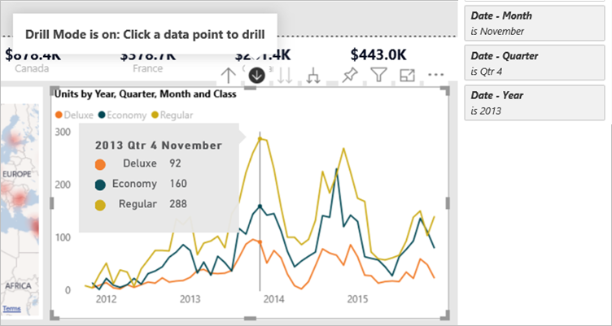

# Типы фильтров в отчетах Power BI

Не все фильтры ведут себя одинаково, ведь они не созданы одинаковым образом. Способ их создания влияет на их поведение в новой области фильтра в режиме редактирования. В этой статье описаны различные виды фильтров: разные способы их создания и разные цели их применения. Узнайте больше о том, как [добавить в отчеты фильтры](power-bi-report-add-filter.md). 

Начнем с двух самых распространенных типов фильтров: ручного и автоматического.

## Ручные фильтры 

Ручные фильтры — это фильтры, которые авторы отчетов могут перетаскивать и удалять в любом месте новой области фильтров. Пользователи с разрешением на редактирование отчета могут редактировать, удалять, очищать, скрывать, блокировать, переименовывать или сортировать этот фильтр в новой области.

## Автоматические фильтры 

Автоматические фильтры — это фильтры, которые автоматически добавляются на уровень визуальных элементов области фильтров при сборке визуального элемента. Эти фильтры основаны на полях, что формируют ваш визуальный элемент. Пользователи с разрешением на редактирование отчета могут редактировать, очищать, скрывать, блокировать, переименовывать или сортировать этот фильтр в новой области. Они не могут удалять автоматические фильтры, поскольку визуальный элемент ссылается на эти поля.

## Более расширенные фильтры

Следующие типы фильтров менее распространены, но все же важно уметь распознавать их, если они отображаются в вашем отчете. Кроме того, они могут быть полезными при создании соответствующего фильтра для вашего отчета.

## Фильтры исключения и включения

Фильтры включения и исключения автоматически добавляются в область фильтров при использовании функциональности включения или исключения для визуального элемента. Пользователи с разрешением на редактирование отчета могут удалять, блокировать, скрывать или сортировать этот фильтр в новой области. Они не могут редактировать, очищать или переименовывать фильтр включения или исключения, поскольку он связан с функциональностью исключения и включения визуальных элементов.

## Фильтры детализации

Фильтры детализации автоматически добавляются в область фильтров при использовании функциональности детализации для визуального элемента в отчете. Пользователи с разрешением на редактирование отчета могут редактировать или очищать этот фильтр в новой области. Они не могут удалять, скрывать, блокировать, переименовывать или сортировать этот фильтр, поскольку он связан с функциональностью детализации визуальных элементов. Чтобы удалить фильтр детализации, нажмите кнопку детализации для визуального элемента.

## Фильтр перекрестной детализации

Фильтры перекрестной детализации автоматически добавляются в новую область, когда фильтр детализации передается другому визуальному элементу на странице отчета с помощью возможности перекрестной фильтрации или перекрестного выделения. Пользователи с разрешением на редактирование отчета не могут удалять, очищать, скрывать, блокировать, переименовывать или сортировать этот фильтр, поскольку он связан с функциональностью детализации визуальных элементов. Они также не могут редактировать этот фильтр через детализацию в другом визуальном элементе. Чтобы удалить фильтр детализации, нажмите клавишу детализации, переданную фильтру.

## Фильтры детализации

Фильтры детализации передаются с одной страницы на другую с помощью возможности детализации. Они отображаются в области детализации. Существует два типа фильтров детализации. Первый тип вызывает детализацию. Авторы отчетов могут редактировать, очищать, скрывать или блокировать эти типы фильтров. Второй тип — это фильтр детализации, который передается в целевой объект на основе фильтров уровня страницы исходной страницы. Авторы отчетов могут изменять, удалять или очищать этот временный тип фильтра детализации. Они не могут заблокировать или скрыть этот фильтр для пользователей.

## Фильтры URL-адресов

Фильтры URL-адресов добавляются в новую область путем добавления параметра URL-адреса запроса. Пользователи с разрешением на редактирование отчета могут редактировать, удалять или очищать этот фильтр в новой области. Они не могут скрывать, блокировать, переименовывать или сортировать этот фильтр, поскольку он связан с параметром URL-адреса. Чтобы удалить фильтр, удалите параметр из URL-адреса. Ниже приведен пример URL-адреса с параметром:

app.powerbi.com/groups/me/apps/*app-id*/reports/*report-id*/ReportSection?filter=Stores~2FStatus%20eq%20'Off'

Дополнительные сведения о [фильтрах URL-адресов](../collaborate-share/service-url-filters.md).

## Сквозные фильтры

Сквозные фильтры — это фильтры уровня визуальных элементов, созданные с помощью вопросов и ответов. Авторы могут удалять, скрывать или сортировать эти фильтры в новой области. Однако они не могут переименовывать, редактировать, очищать или блокировать эти фильтры.

## Сравнение типов фильтров

Эта таблица сравнивает возможности авторов во время работы с различными типами фильтров.

| Тип фильтра | Изменить | Clear | Удалить | Скрыть | Блокировка | Сортировка | Переименовать |
|----|----|----|----|----|----|----|----|
| Ручные фильтры | Да | Да | Да | Да | Да | Да | Да |
| Автоматические фильтры | Да | Да | N | Да | Да | Да | Да |
| Фильтры включения и исключения | N | N | Да | Да | Да | Да | N |
| Фильтры детализации | Да | Да | N | N | N | N | N |
| Фильтры перекрестной детализации | N | N | N | N | N | N | N |
| Фильтры детализации (вызова детализации) | Да | Да | Да | Да | Да | N | N |
| Фильтры детализации (временные) | Да | Да | Да | N | N | N | N |
| Фильтры URL-адресов — временные | Да | Да | Да | N | N | N | N |
| Сквозные фильтры | N | N | Да | Да | N | Да | N |

## Дальнейшие действия

[Добавления фильтров в отчет](power-bi-report-add-filter.md)

[Ознакомление с панелью "Фильтры" отчета](../consumer/end-user-report-filter.md)

[Фильтры и выделение в отчетах](power-bi-reports-filters-and-highlighting.md)

У вас имеются и другие вопросы? [Ответы на них см. в сообществе Power BI.](https://community.powerbi.com/)
