# <a name="design-filters-in-power-bi-reports"></a>Разработка фильтров в отчетах Power BI

[!INCLUDE [applies-to](../includes/applies-to.md)] [!INCLUDE [yes-desktop](../includes/yes-desktop.md)] [!INCLUDE [yes-service](../includes/yes-service.md)]

Благодаря новой функции фильтрации вы получаете множество возможностей для настройки проектирования и функциональности фильтра отчетов. Вы можете отформатировать область "Фильтры", чтобы она выглядела как остальная часть отчета. А также сможете блокировать и даже скрывать фильтры. При разработке отчета вы больше не увидите старую область фильтров в области зрительных образов. Вы настроите все фильтры редактирования и форматирования в отдельной области фильтров. 

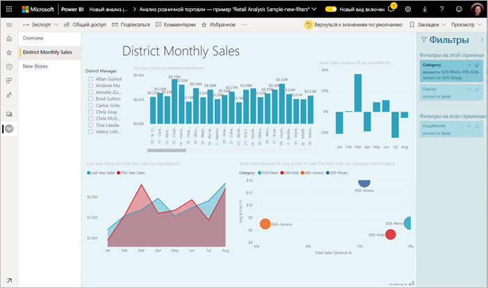

В новой области фильтров авторы отчетов смогут выполнять следующие задачи:

- Добавлять и удалять поля, чтобы включить фильтр. 
- Изменять состояние фильтра.
- Форматировать и настраивать область фильтров так, чтобы она отображалась как часть отчета.
- Определять, является ли область фильтров развернутой или свернутой по умолчанию, когда пользователь открывает отчет.
- Скрывать всю область фильтров или определенные фильтры, чтобы они не были видны пользователям отчетов.
- Управлять состоянием области фильтров (отображено, открыто и свернуто), а также создавать соответствующие закладки.
- Блокировать фильтры, чтобы пользователи не могли их изменять.

При чтении отчетов пользователи могут также наводить указатель на визуальный элемент, чтобы увидеть доступный только для чтения список всех влияющих на него фильтров или срезов.

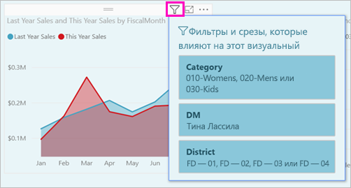

## <a name="turn-on-new-filters-in-existing-reports"></a>Включение новых фильтров для имеющихся отчетов 

Для новых отчетов новые функции фильтрации включены по умолчанию. Кроме того, их можно включить для существующих отчетов в Power BI Desktop или службе Power BI.

### <a name="turn-on-new-filters-for-an-existing-report-in-power-bi-desktop"></a>Включение новых функций фильтров для существующего отчета в Power BI Desktop

1. В существующем отчете в Power BI Desktop выберите **Файл** > **Параметры и настройки** > **Параметры**.
2. В области навигации слева в разделе **Текущий файл** выберите **Параметры отчета**.
3. В разделе **Возможности фильтрации** **включите обновленную область фильтров и отобразите фильтры в заголовке визуального элемента для этого отчета**.

### <a name="turn-on-new-filters-for-an-existing-report-in-the-service"></a>Включение новых функций фильтров для существующего отчета в службе

Если вы включили **новый вид** в службе Power BI , новый интерфейс фильтра будет включен автоматически. Изучите дополнительные сведения о [новом виде в службе Power BI](../consumer/service-new-look.md).

Если вы не включили новый вид, вы можете увидеть новый интерфейс фильтра, выполнив следующие действия.

1. В службе Power BI откройте список содержимого для рабочей области.
2. Найдите отчет, который необходимо включить, выберите **Дополнительные параметры (...)** , а затем выберите пункт **Параметры** для этого отчета.

    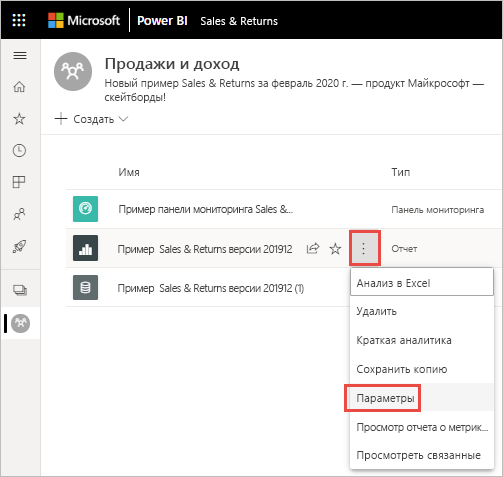

3. В разделе **Возможности фильтрации** **включите обновленную область фильтров и отобразите фильтры в заголовке визуального элемента для этого отчета**.

    

## <a name="view-filters-for-a-visual-in-reading-mode"></a>Просмотр фильтров для визуального элемента в режиме чтения

В режиме чтения можно навести указатель мыши на значок фильтра для визуального элемента, чтобы отобразить всплывающий список фильтров со всеми фильтрами, срезами и другими компонентами, которые влияют на этот визуальный элемент. Форматирование всплывающего списка фильтров соответствует форматированию области фильтров. 

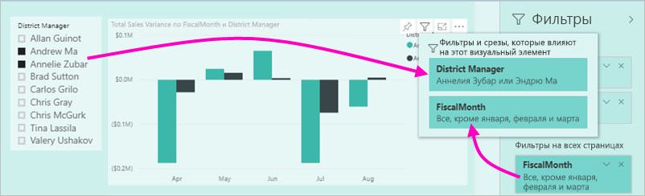

Ниже приведены типы фильтров, которые отображаются в этом представлении: 
- Базовые фильтры
- Срезы
- Перекрестное выделение 
- Перекрестная фильтрация
- Расширенные фильтры
- Фильтры первых N элементов
- Фильтрация относительных дат
- Синхронизация срезов
- Фильтры включения и исключения
- Фильтры, передаваемые по URL-адресу

## <a name="build-the-filters-pane"></a>Создание области фильтров

Новую включенную область фильтров можно просматривать в правой части страницы отчета в формате по умолчанию на основе текущих параметров отчета. В области фильтров можно указать включаемые фильтры и обновить существующие. После публикации отчета область фильтров будет выглядеть точно так же для его пользователей. 

1. Ваши пользователи отчетов могут видеть область фильтров по умолчанию. Если нет, выберите значок глаза рядом с областью **фильтров**.

    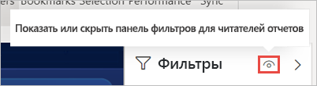

2. Чтобы создать свою область фильтров, перетащите нужные поля в область фильтров, чтобы использовать для фильтрации на уровне визуального элемента, страницы или отчета.

При добавлении визуального элемента на холст отчета Power BI автоматически добавляет фильтр в область фильтров для каждого поля в визуальном элементе. 

## <a name="hide-the-filters-pane-while-editing"></a>Скрытие панели "Фильтры" при редактировании

В предварительной версии Power BI Desktop есть новая лента. На вкладке **Вид** с помощью кнопки **Фильтры** можно отобразить или скрыть панель "Фильтры". Эта функция полезна, если вы не используете панель "Фильтры" и на экране требуется дополнительное пространство. Это дополнение выравнивает панель "Фильтры" в соответствии с другими панелями, которые можно открывать и закрывать, например в соответствии с областями закладок и выбора. 

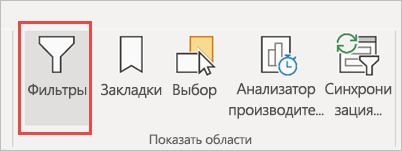

Этот параметр скрывает панель "Фильтры" только в Power BI Desktop. Чтобы скрыть панель "Фильтры" для конечных пользователей, выберите значок **глаза** рядом с элементом **Фильтры**.

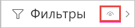 

## <a name="lock-or-hide-filters"></a>Блокировка или скрытие фильтров

Вы можете заблокировать или скрыть отдельные карточки фильтров. Если заблокировать фильтр, пользователи отчетов смогут его видеть, но не смогут изменять. Если фильтр скрыть, пользователи не будут его видеть. Скрывать карточки фильтров удобно, если нужно скрыть фильтры очистки данных, которые исключают пустые или непредвиденные значения. 

- В области фильтров выберите или удалите значки **Заблокировать фильтр** или **Скрыть фильтр** в карточке фильтра.

   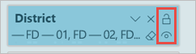

Включение или отключение этих параметров в области фильтров влияет на отображение отчета. Скрытые фильтры не будут отображаться во всплывающем списке фильтров для визуального элемента.

Управлять состоянием новой области фильтров можно также с помощью закладок отчета. Для всех состояний области (открыто, закрыто, отображается) можно использовать закладки.
 
## <a name="format-the-filters-pane"></a>Форматирование области фильтра

Важным компонентом новой функции фильтрации является то, что вы можете форматировать область фильтров в соответствии с внешним видом отчета. Вы можете также отформатировать область фильтра по-разному для каждой страницы в отчете. Ниже приведены компоненты, которые можно форматировать: 

- Цвет фона
- Прозрачность фона
- Включение или отключение границы
- Цвет границ
- Заголовок и шрифт, цвет и размер текста

Вы также можете форматировать эти элементы для карточек фильтров в зависимости от того, применяются ли они (значение указано) или являются доступными (флажок снят): 

- Цвет фона
- Прозрачность фона
- Граница: включение или отключение
- Цвет границ
- Шрифт, цвет и размер текста
- Цвет поля ввода

### <a name="format-the-filters-pane-and-cards"></a>Формат области и карточек фильтров

1. В отчете щелкните сам отчет или его фон (*фоновый рисунок*), а затем в области **визуализации** выберите **Формат**. 
    Вы увидите параметры форматирования страницы отчета, фоновый рисунок, а также область и карточки фильтров.

1. Разверните **панель фильтров**, чтобы настроить цвет фона, значок и дополнить страницу отчета.

    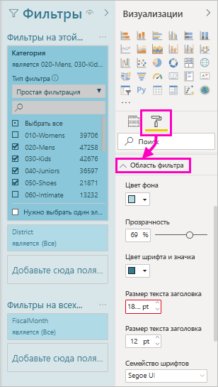

1. Разверните **карточки фильтров**, чтобы **сделать доступным** и **применить** цвет и границу. Если вы выберете для карточек разные цвета, вам будет видно, какие фильтры применяются. 
  
    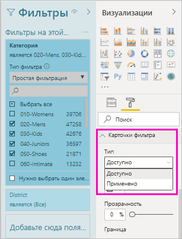

## <a name="theming-for-filters-pane"></a>Темы для панели "Фильтры"
Теперь вы можете по умолчанию изменять параметры панели "Фильтры" с помощью файла темы. Пример фрагмента темы, с которого можно начать.

 
```
"outspacePane": [{ 

"backgroundColor": {"solid": {"color": "#0000ff"}}, 

"foregroundColor": {"solid": {"color": "#00ff00"}}, 

"transparency": 50, 

"titleSize": 35, 

"headerSize": 8, 

"fontFamily": "Georgia", 

"border": true, 

"borderColor": {"solid": {"color": "#ff0000"}} 

}], 

"filterCard": [ 

{ 

"$id": "Applied", 

"transparency": 0, 

"backgroundColor": {"solid": {"color": "#ff0000"}}, 

"foregroundColor": {"solid": {"color": "#45f442"}}, 

"textSize": 30, 

"fontFamily": "Arial", 

"border": true, 

"borderColor": {"solid": {"color": "#ffffff"}}, 

"inputBoxColor": {"solid": {"color": "#C8C8C8"}} 

}, 

{ 

"$id": "Available", 

"transparency": 40, 

"backgroundColor": {"solid": {"color": "#00ff00"}}, 

"foregroundColor": {"solid": {"color": "#ffffff"}}, 

"textSize": 10, 

"fontFamily": "Times New Roman", 

"border": true, 

"borderColor": {"solid": {"color": "#123456"}}, 

"inputBoxColor": {"solid": {"color": "#777777"}} 

}] 
```

## <a name="sort-the-filters-pane"></a>Сортировка панели "Фильтры"

В области фильтров доступна также функция пользовательской сортировки. При создании отчета можно перетаскивать фильтры, чтобы разместить их в нужном порядке.


Порядок сортировки фильтров по умолчанию является по алфавиту. Чтобы запустить режим пользовательской сортировки, просто перетащите любой фильтр на новую позицию. Вы можете сортировать фильтры только на том уровне, к которому они применяются, например, на уровне визуальных элементов, страницы или отчета.

## <a name="improved-filters-pane-accessibility"></a>Улучшение специальных возможностей области фильтров

Мы улучшили в области фильтров навигацию с помощью клавиатуры. Вы можете перемещаться по каждой части области фильтров и использовать клавишу меню на клавиатуре или Shift+F10, чтобы открыть контекстное меню.

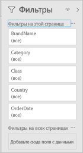

## <a name="rename-filters"></a>Переименование фильтров
Во время редактирования области фильтров вы можете дважды щелкнуть, чтобы изменить заголовок. Переименование полезно, если для большей целесообразности нужно обновить карточку фильтра для ваших пользователей. Учитывайте, что переименование карточки фильтра *не* переименовывает отображаемое имя поля в списке полей. Оно просто меняет отображаемое имя, используемое в карточке фильтра.

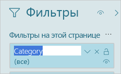

## <a name="filters-pane-search"></a>Поиск на панели "Фильтры"

Функция поиска на панели "Фильтры" позволяет выполнять поиск по заголовку в карточке фильтра. Эта функция полезна, если на панели "Фильтры" имеется несколько разных карточек фильтров и требуется помощь в поиске интересующих вас элементов.

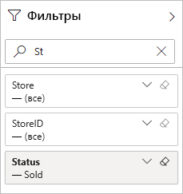

Можно также отформатировать поле поиска — так же, как и другие элементы панели "Фильтры".

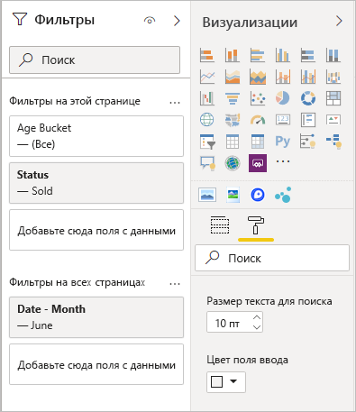

Функция поиска на панели "Фильтры" будет включена по умолчанию, однако ее можно включить или отключить, выбрав **Включить поиск для панели "Фильтры"** в параметрах отчета в диалоговом окне "Параметры".

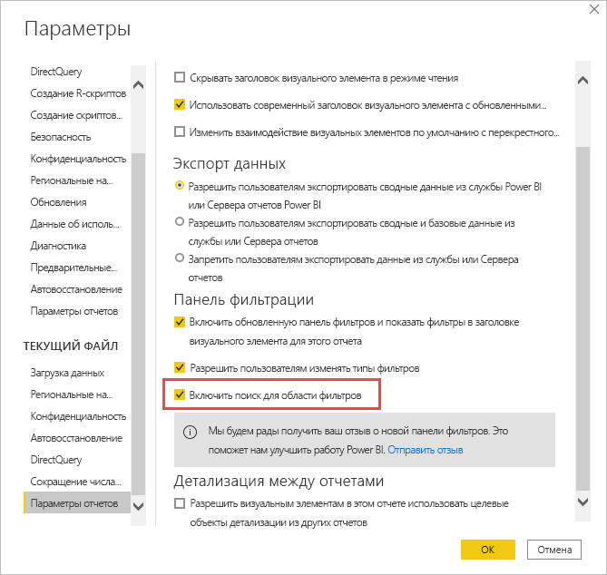

## <a name="restrict-changes-to-filter-type"></a>Ограничение изменений в типе фильтра

В разделе параметров отчета **Возможности фильтрации** вы можете указать, могут ли пользователи изменять тип фильтра.

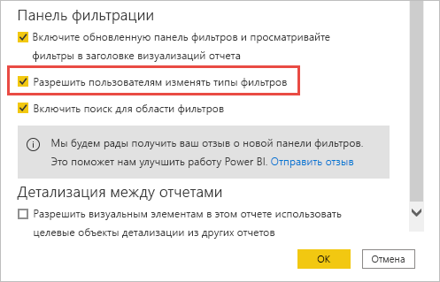

## <a name="apply-filters-button-preview"></a>Кнопка применения фильтров (предварительная версия)

Вы можете добавить одну кнопку **Применить** в область фильтрации, чтобы вы и ваши конечные пользователи могли применить все изменения в фильтрах одновременно. Эта кнопка может оказаться удобной, если вы хотите отложить применение изменений фильтра. Вам лишь нужно дождаться, когда все будет готово, а затем применить все изменения в фильтрах к отчету или визуальным элементам.

:::image type="content" source="media/power-bi-report-filter/apply-filter-button.png" alt-text="Кнопка применения фильтра":::

### <a name="turn-on-apply"></a>Включение функции применения

Эту функцию можно задать на уровне отчета. Однако по умолчанию она отключена.

1. Последовательно выберите пункты **Файл** > **Параметры и настройки** >  **Параметры** > **Сокращение числа запросов**.

1. Выберите **Добавление на панель фильтра одной кнопки "Применить" для применения всех изменений сразу**.

    :::image type="content" source="media/power-bi-report-filter/turn-on-apply-filter-button.png" alt-text="Включение кнопки применения фильтров":::

### <a name="format-the-apply-button"></a>Форматирование кнопки "Применить"

В настоящее время для кнопки **Применить** можно настроить ряд параметров форматирования текста. В **области фильтра** области **Формат** задайте следующие параметры.

- **Цвет шрифта и значков** определяет цвет текста.
- **Размер текста заголовка** определяет размер текста.
- **Семейство шрифтов** определяет шрифт элемента управления.

    :::image type="content" source="media/power-bi-report-filter/format-apply-filter.gif" alt-text="Форматирование текста кнопки применения фильтра":::

## <a name="considerations-and-limitations"></a>Рекомендации и ограничения

При публикации в Интернете панель "Фильтры" не отображается. Если вы планируете опубликовать отчет в Интернете, рассмотрите возможность добавления срезов для фильтрации.

## <a name="next-steps"></a>Дальнейшие действия

- [Использование фильтров отчетов](../consumer/end-user-report-filter.md)
- [Фильтры и выделение в отчетах](power-bi-reports-filters-and-highlighting.md)
- [Различные виды фильтров Power BI](power-bi-report-filter-types.md)

Появились дополнительные вопросы? [Ответы на них см. в сообществе Power BI.](https://community.powerbi.com/)
