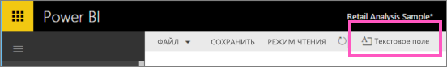
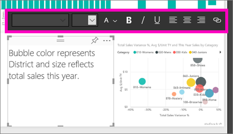
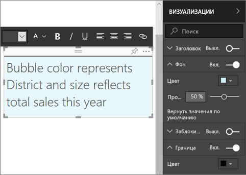
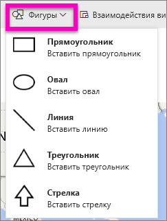
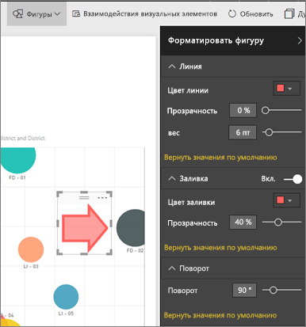

# Добавление текстовых полей и фигур в отчеты Power BI
Вы можете добавлять текстовые поля и фигуры в отчеты с помощью службы Power BI и Power BI Desktop. В обоих случаях требуются разрешения на изменение отчета. Если доступ к отчету в службе Power BI вам предоставил другой пользователь, у вас не будет прав на редактирование. 

Посмотрите видео о том, как с помощью Power BI Desktop [добавить статические изображения в отчет](/learn/modules/visuals-in-power-bi/12-formatting). Затем сделайте это самостоятельно, но уже в службе Power BI, следуя приведенным ниже инструкциям.
> 
> <iframe width="560" height="315" src="https://www.youtube.com/embed/_3q6VEBhGew" frameborder="0" allowfullscreen></iframe>
> 

## Добавление текстового поля в отчет
1. Откройте отчет в режиме редактирования.

2. Поместите курсор в любое пустое место холста отчетов и выберите **Текстовое поле** в верхнем меню.
   
   
3. Введите текст в текстовое поле и по желанию выберите шрифт, цвет и выравнивание текста. 
   
   
4. Чтобы изменить расположение текстового поля, выберите серую область вверху и перетащите поле. Чтобы изменить размер текстового поля, выберите и перетащите один из маркеров. 
   
   

5. Выбрав текстовое поле, добавьте параметры форматирования на панели **Визуализации**. В этом примере мы отформатировали фон и границы. Можно также создать точный размер и положение для текстового поля.  

   

6. Чтобы закрыть текстовое поле, выберите любое пустое место на холсте отчета. 

7. Нажмите значок закрепления,   для закрепления текстового поля на панели мониторинга. 

## Добавление фигуры в отчет
1. Поместите курсор в любом месте холста отчета и выберите **Фигуры**.
   
   
2. В раскрывающемся списке выберите фигуру, чтобы добавить ее на холст отчета. В этом примере добавьте стрелку, чтобы направить внимание на пузырек с наибольшим суммарным отклонением продаж. 
   
   В области **Формат фигуры** настройте фигуру. В этом примере мы создали красную стрелку с темной красной границей, повернутую на 90 градусов.
   
   
3. Чтобы изменить расположение фигуры, выберите серую область вверху и перетащите фигуру. Чтобы изменить размер фигуры, выберите и перетащите один из маркеров. Как и для текстового поля, для фигуры можно также создать точный размер и положение.

   > [!NOTE]
   > Фигуры невозможно закрепить на панели мониторинга, только если это не один из визуальных элементов на [закрепляемой динамической странице](service-dashboard-pin-live-tile-from-report.md). 
   > 
   > 

## Дальнейшие действия

Рекомендуем также ознакомиться со следующими материалами:

* [Добавление гиперссылки в текстовое поле](service-add-hyperlink-to-text-box.md)
* [Основные понятия для разработчиков в службе Power BI](../fundamentals/service-basic-concepts.md)
* [Советы по улучшению анализа с помощью фигур, изображений и значков в отчетах Power BI](../guidance/report-tips-shapes-images-icons.md)
* У вас имеются и другие вопросы? [Ответы на них см. в сообществе Power BI.](https://community.powerbi.com/)
