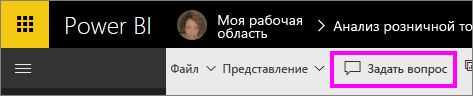

# Использование функции "Вопросы и ответы" Power BI для просмотра данных и создания визуальных элементов

Иногда самый быстрый способ получить ответ по данным — задать вопрос, используя естественный язык. Функция "Вопросы и ответы" в Power BI позволяет изучать данные, формулируя запросы своими словами.  В первой части этой статьи показано, как использовать функцию "Вопросы и ответы" в панелях мониторинга службы Power BI. Во второй части представлены возможности функции "Вопросы и ответы" при создании отчетов в службе Power BI или Power BI Desktop. Дополнительные сведения см. в статье [Функция "Вопросы и ответы" для потребителей Power BI](../consumer/end-user-q-and-a.md). 

Особенности применения функций ["Вопросы ответы" в Power BI Mobile](../consumer/mobile/mobile-apps-ios-qna.md) и ["Вопросы ответы" в Power BI Embedded](../developer/embedded/qanda.md) рассматриваются в отдельных статьях. 

Функция "Вопросы и ответы" является интерактивной и даже интересной. Часто один вопрос приводит к многим другим, так как визуализации раскрывают новые пути для поиска. В следующем видео Аманда показывает, как с помощью функции "Вопросы и ответы" создавать визуализации, анализировать их и закреплять на панели мониторинга.

<iframe width="560" height="315" src="https://www.youtube.com/embed/qMf7OLJfCz8?list=PL1N57mwBHtN0JFoKSR0n-tBkUJHeMP2cP" frameborder="0" allowfullscreen></iframe>

## Часть 1. Использование функции "Вопросы и ответы" на панели мониторинга в службе Power BI

В службе Power BI (app.powerbi.com), панель мониторинга содержит закрепленные плитки, связанные с одним или несколькими наборами данных, по содержимому которых вы можете задавать вопросы. Чтобы увидеть, какие отчеты и наборы данных использовались для создания панели мониторинга, выберите **Просмотреть похожие** в строке меню.

Поле функции "Вопросы и ответы" находится в левом верхнем углу панели мониторинга. Здесь вы можете ввести любой вопрос, используя естественный язык. Не видите поле "Вопросы и ответы"? См. [рекомендации и устранение неполадок](../consumer/end-user-q-and-a.md#considerations-and-troubleshooting) в статье **Функция "Вопросы и ответы" для потребителей Power BI**.  Функция "Вопросы и ответы" распознает слова при вводе и определяет, где (в каком наборе данных) можно найти ответ. Этот компонент также помогает сформулировать вопрос с помощью таких функций, как автоматическое завершение, изменение формулировки и другие текстовые и визуальные подсказки.

Ответ на вопрос отображается как интерактивная визуализация и обновляется по мере изменения вопроса.

1. Откройте панель мониторинга и поместите курсор в поле для вопроса. Выберите **Новый интерфейс вопросов и ответов**.

    

1. Еще до начала ввода компонент вопросов и ответов открывает новое окно с полезными предложениями. Вы видите фразы и полные вопросы, содержащие названия таблиц в базовых наборах данных, и можете даже увидеть полный список вопросов, если владелец набора данных создал [популярные вопросы](service-q-and-a-create-featured-questions.md).

   

   Вы можете выбрать один из этих вопросов в качестве отправной точки и уточнять вопрос, чтобы найти конкретный ответ. С другой стороны, имя таблицы поможет сформулировать новый вопрос.

2. Выберите один вопрос из списка или начните набирать собственный вопрос, а затем выберите подходящее предложение из раскрывающегося списка.

   

3. По мере ввода вопроса, модуль "Вопросы и ответы" выбирает наилучшую визуализацию для отображения ответа.

   

4. Визуализация динамически меняется по мере изменения вопроса.

   

1. При вводе вопроса Power BI пытается найти наилучший ответ, используя все наборы данных, плитки которых представлены на этой панели мониторинга.  Если все плитки из *набора данных А*, то ответ будет получен из *набора данных А*.  При наличии плиток из *набора данных А* и *набора данных Б*, функция "Вопросы и ответы" ищет лучший ответ в этих 2 наборах данных.

   > [!TIP]
   > Поэтому будьте внимательны: если имеется только одна плитка из *набора данных А*, и вы удалите ее из панели мониторинга, функция вопросов и ответов больше не будет иметь доступа к *набору данных А*.
   >

5. Если вы довольны результатом, закрепите визуализацию на панели мониторинга, выбрав значок булавки в правом верхнем углу. Если доступ к панели мониторинга вам предоставил другой пользователь или она является частью приложения, вы не сможете закрепить на ней визуализацию.

   

## Часть 2. Использование функции "Вопросы и ответы" в отчете службы Power BI или Power BI Desktop

Функция "Вопросы и ответы" позволяет изучать наборы данных и добавлять визуализации в отчеты и на панели мониторинга. Отчет основан на одном наборе данных. Он может оказаться пустым или содержать несколько страниц с разными визуализациями. Но пустой отчет не означает, что в наборе нет данных для изучения — базовый набор данных, связанный с этим отчетом, ожидает от вас запросов и новых визуализаций.  Чтобы узнать, на основе какого набора данных создан отчет, откройте отчет в режиме чтения в службе Power BI и выберите действие **Просмотреть похожие** в строке меню.

Чтобы использовать "Вопросы и ответы" в отчетах, вам нужны разрешения на редактирование отчета и базового набора данных. В статье [Функция "Вопросы и ответы" для потребителей Power BI](../consumer/end-user-q-and-a.md), мы будем называть это *создателем* сценария. Если же вы просто *потребитель* отчета, который вам предоставили другие лица, функция "Вопросы и ответы" недоступна.

1. Откройте отчет в режиме правки (служба Power BI) или просмотра отчетов (Power BI Desktop) и выберите **Задать вопрос** в строке меню.

    **Power BI Desktop**    
    

    **Служба**    
    

2. На холсте отчетов появится текстовое поле для функции "Вопросы и ответы". В следующем примере такое поле отображается поверх другой визуализации. С ним можно работать и так, но лучше добавить в отчет пустую страницу, прежде чем задавать вопрос.

    

3. Поместите курсор в поле для вопроса. По мере ввода текста подсистема "Вопросы и ответы" отображает некоторые предложения на основе вашего вопроса.

   

4. По мере ввода вопроса функция "Вопросы и ответы" выбирает для отображения ответа наиболее подходящую [визуализацию](../visuals/power-bi-visualization-types-for-reports-and-q-and-a.md), которая динамически меняется в зависимости от вопроса.

   

5. Когда предложенная визуализация будет вас устраивать, нажмите клавишу ВВОД. Чтобы сохранить визуализацию в отчете, выберите **Файл > Сохранить**.

6. Создав визуализацию, вы можете использовать с ее. При этом не имеет значения, как именно вы ее создали, — возможности взаимодействия и форматирования будут одинаковыми.

   

   Если вы создали визуализацию в службе Power BI, ее даже можно [закрепить на панели мониторинга](service-dashboard-pin-tile-from-q-and-a.md).

## Назначение используемой визуализации для вопросов и ответов
Функция "Вопросы и ответы" позволяет не только подобрать правильные данные, но и сообщить Power BI о том, как лучше всего их отобразить. Просто добавьте в конец своего вопроса текст "как <visualization type>".  Например, "показать объем запасов по заводу как карту" и "показать всего на складе как карточку".  Попробуйте сами.

## Рекомендации и устранение неполадок
- Если вы подключаетесь к набору данных с помощью активного подключения или шлюза, [для этого набора данных следует включить функцию "Вопросы и ответы"](service-q-and-a-direct-query.md).

- Иногда эта функция не отображается в открытом отчете. Если вы используете службу Power BI, нужно открывать отчет в режиме редактирования. Если режим редактирования открыть не удается, значит у вас нет разрешений на изменение этого отчета и вы сможете использовать в нем функцию "Вопросы и ответы".

## Дальнейшие действия

- [Вопросы и ответы для потребителей](../consumer/end-user-q-and-a.md)   
- [Советы по запросам в функцию "Вопросы и ответы" в Power BI](../consumer/end-user-q-and-a-tips.md)   
- [Настройка данных для работы с функцией "Вопросы и ответы" в Power BI](service-prepare-data-for-q-and-a.md)  
- [Подготовка локальных наборов данных для функции "Вопросы и ответы"](service-q-and-a-direct-query.md)   
- [Закрепление результатов работы подсистемы вопросов и ответов в качестве плитки на панели мониторинга Power BI](service-dashboard-pin-tile-from-q-and-a.md)
