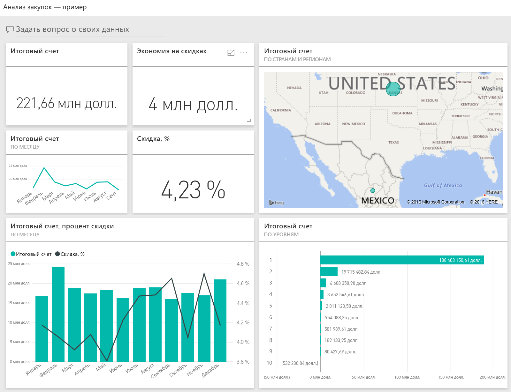
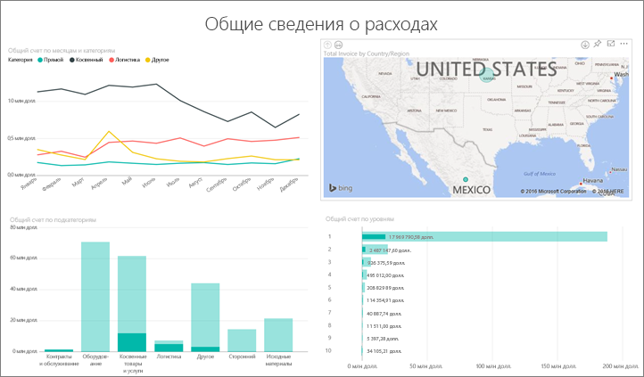
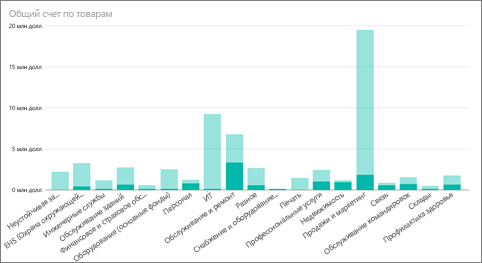
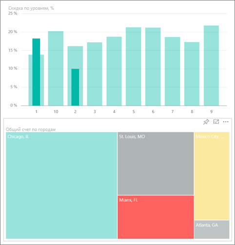

# Образец "Анализ закупок" для Power BI: обзор

Пример пакета содержимого "Анализ закупок" содержит панель мониторинга, отчет и набор данных с анализом расходов производителя на товары поставщиков с разбивкой по категориям и расположениям. В данном примере мы исследуем следующие области:

* самые популярные поставщики;
* категории с самыми большими расходами;
* поставщики, предоставляющие наибольшую скидку, а также время ее предоставления.

Этот пример входит в серию, демонстрирующую, как использовать Power BI с бизнес-данными, отчетами и панелями мониторинга. Он создан на основе реальных данных [obviEnce](http://www.obvience.com/), которые были анонимизированы. Данные доступны в нескольких форматах: пакет содержимого, PBIX-файл Power BI Desktop или книга Excel. См. раздел [Примеры для Power BI](sample-datasets.md). 

В этом руководстве описано, как использовать пример пакета содержимого "Анализ закупок" в службе Power BI. Так как в Power BI Desktop и службе возможности работы с отчетами практически не отличаются, этот же пример PBIX-файла можно использовать и в Power BI Desktop. 

Вам не требуется лицензия Power BI для просмотра примеров в Power BI Desktop. Если у вас нет лицензии Power BI Pro, можно сохранить пример в личную рабочую область в службе Power BI. 

## Получение примера

Прежде чем использовать пример, необходимо скачать его как [пакет содержимого](#get-the-content-pack-for-this-sample), [PBIX-файл](#get-the-pbix-file-for-this-sample) или [книгу Excel](#get-the-excel-workbook-for-this-sample).

### Получение пакета содержимого для этого примера

1. Откройте службу Power BI (app.powerbi.com), войдите в систему и откройте рабочую область, где хотите сохранить пример. 

    Если у вас нет лицензии Power BI Pro, можно сохранить пример в личной рабочей области.

2. В левом нижнем углу выберите **Получить данные**.

    
3. На странице **Получение данных** выберите **Примеры**.

4. Выберите **Анализ закупок — пример** и щелкните **Подключиться**.  
  
   
   
5. Power BI импортирует пакет содержимого и добавляет новую панель мониторинга, отчет и набор данных в текущую рабочую область.
   
   
  
### Получение PBIX-файла для этого примера

Кроме того, вы можете загрузить пример "Анализ закупок" в виде [PBIX-файла](https://download.microsoft.com/download/D/5/3/D5390069-F723-413B-8D27-5888500516EB/Procurement%20Analysis%20Sample%20PBIX.pbix), который предназначен для работы с Power BI Desktop. 

### Получение книги Excel для этого примера

Если вы хотите просмотреть источник данных для этого примера, он также доступен в виде [книги Excel](https://go.microsoft.com/fwlink/?LinkId=529784). Книга содержит листы Power View, которые можно просматривать и изменять. Чтобы просмотреть необработанные данные, включите надстройки анализа данных и выберите **Power Pivot > Управление**. Чтобы включить надстройки Power View и Power Pivot, перейдите к разделу [Просмотр примеров Excel непосредственно из Excel](sample-datasets.md#explore-excel-samples-inside-excel).

## Тенденции затрат
Давайте сначала рассмотрим тенденции затрат по категориям и расположениям.  

1. В рабочей области, где сохранен пример, найдите и выберите вкладку **Панель мониторинга**, затем найдите и выберите панель мониторинга **Анализ закупок — пример**. 
2. Щелкните плитку **Итоговый счет по стране/региону** панели мониторинга. Откроется страница **Обзор затрат** отчета **Анализ закупок — пример**.

    

Обратите внимание на следующие сведения:

* Обратите внимание, что на графике **Итоговый счет по месяцу и категории** категория **Прямые** имеет довольно стабильные затраты, категория **Логистика** имеет пиковое значение в декабре, а категория **Другие** имеет пиковое значение в феврале.
* На карте **Итоговый счет по стране/региону** видно, что основная часть затрат относится к США.
* Обратите внимание, что на гистограмме **Итоговый счет по подкатегории** к наиболее значительным категориям затрат относится **Оборудование** и **Косвенные товары и услуги**.
* На линейчатой диаграмме **Итоговый счет по уровню** видно, что основная часть нашего бизнеса ведется с нашими поставщиками уровня 1 (10 ведущих поставщиков). Это позволяет нам лучше управлять отношениями с поставщиками.

## Затраты в Мексике
Давайте рассмотрим области затрат в Мексике.

1. На карте **Итоговый счет по стране/региону** выберите пузырек **Мексика**. Обратите внимание, что на гистограмме **Итоговый счет по подкатегории** основная часть расходов относится к подкатегории **Косвенные товары и услуги**.

   
2. Рассмотрим столбец **Indirect Goods & Services** (Косвенные товары и услуги) более подробно.

   * На диаграмме **Итоговый счет по подкатегории** щелкните  в правом верхнем углу диаграммы.
   * Выберите столбец **Indirect Goods & Services** (Косвенные товары и услуги).

      Как видите, самые высокие затраты с большим отрывом приходятся на подкатегорию **Продажи и маркетинг**.
   * На карте еще раз выберите **Мексика**.

      Наибольшие затраты в этой категории в Мексике приходятся на подкатегорию **Обслуживание и ремонт**.

      
3. Щелкните стрелку вверх в левой верхней части диаграммы, чтобы вернуться на более высокий уровень детализации.
4. Щелкните стрелку детализации еще раз, чтобы полностью отключить детализацию.  
5. В области навигации сверху выберите **Анализ затрат — пример**, чтобы вернуться к панели мониторинга.

## Оценка разных городов
Мы можем использовать выделение для оценки разных городов.

1. Щелкните плитку **Итоговый счет, % скидки по месяцам** панели мониторинга. Откроется страница **Анализ скидок** из отчета **Анализ затрат — пример**.
2. Поочередно выберите каждый город на древовидной диаграмме **Итоговый счет по городу** для сравнения. Почти все счета в Майами относятся к поставщикам уровня 1.

   

## Скидки поставщиков
Давайте теперь рассмотрим скидки, предоставляемые поставщиками, и периоды времени, когда мы получаем наибольшие скидки.
* Отличаются ли скидки в разные месяцы или они остаются неизменными?
* Получают ли некоторые города дополнительные скидки?

### Скидка по месяцам
На комбинированной диаграмме **Итоговый счет и скидка по месяцу** видно, что февраль является максимально загруженным месяцем, а в сентябре загрузка минимальная. 

Обратите внимание на процент скидки в эти месяцы: скидка уменьшается при увеличении объема и увеличивается при низком объеме продаж. Чем больше нам нужна скидка, тем менее выгодную сделку мы получаем.

### Скидка по городам
Еще мы можем изучить распределение скидок по городам. Поочередно выберите каждый город на диаграмме-дереве и изучите, как изменяются другие диаграммы.

* Для города Сент-Луис наблюдается пиковое значение числа счетов в феврале и значительное сокращение экономии на скидках в апреле.
* Для города Мехико наблюдается наибольший процент скидки (11,05 %), а для города Атланта — наименьший (0,08 %).

### Редактирование отчета
В левом верхнем углу щелкните **Изменить отчет** и просмотрите отчет в представлении редактирования.

* Ознакомьтесь с созданием страниц.
* Добавьте страницы и диаграммы на основе тех же данных.
* Измените тип визуализации для диаграммы, например выберите кольцевую диаграмму вместо карты дерева.
* Закрепите диаграммы на панель мониторинга.

## Дальнейшие действия: подключение к данным
В этой среде можно свободно экспериментировать, так как сохранять изменения не требуется. Однако если изменения сохраняются, всегда можно выбрать функцию **Получить данные** для получения новой копии этого примера.

Мы надеемся, что из этого обзора вы узнали, как с помощью панелей мониторинга, вопросов и ответов, а также отчетов Power BI можно получить представление о данных из примера. Теперь ваша очередь — выполните подключение к собственным данным. С помощью Power BI можно подключаться ко многим типам источников данных. Дополнительные сведения см. в руководстве по [началу работы со службой Power BI](../fundamentals/service-get-started.md).
